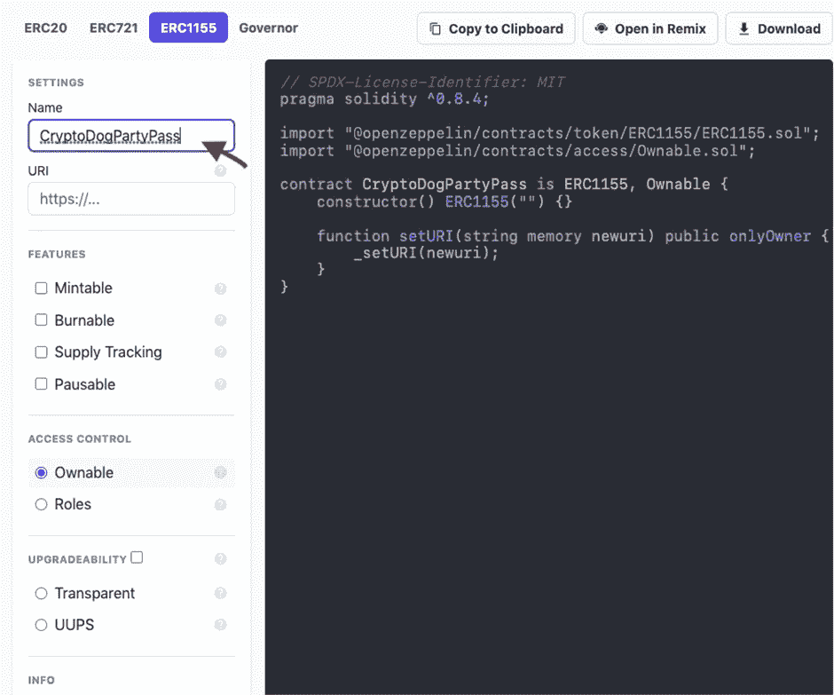
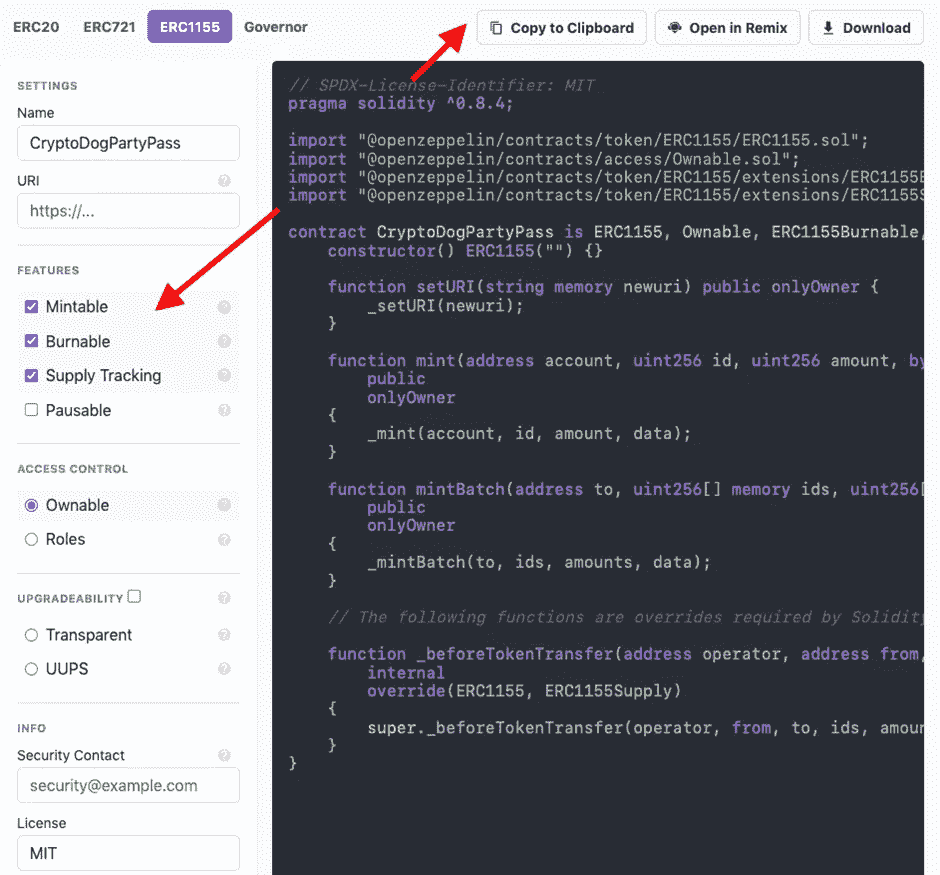
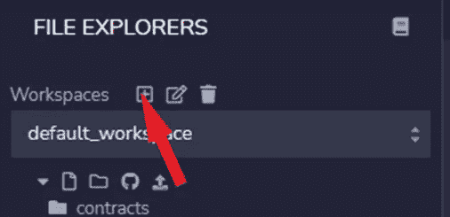
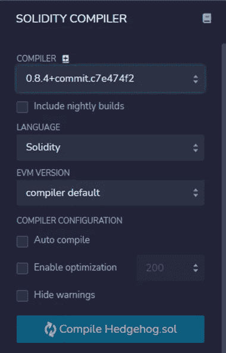
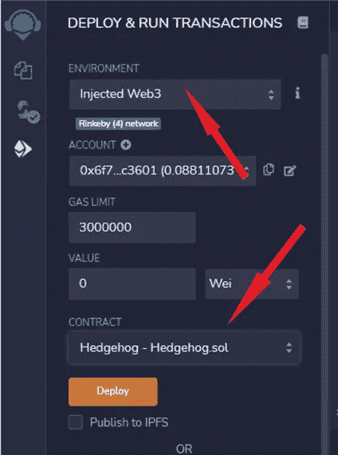
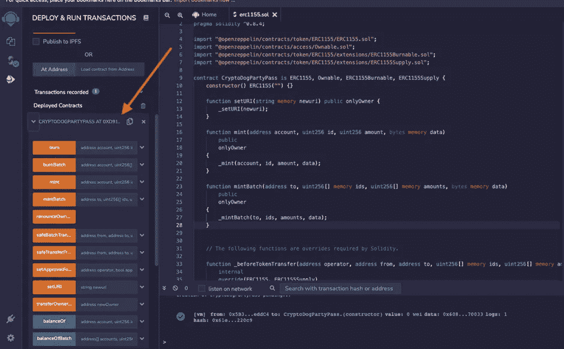
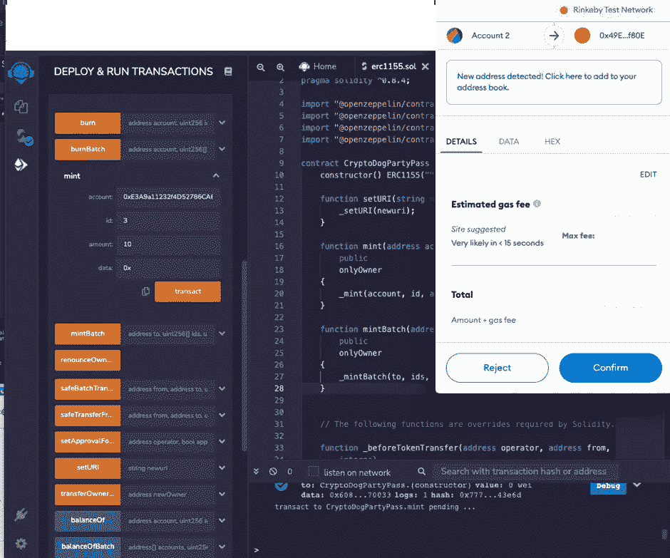
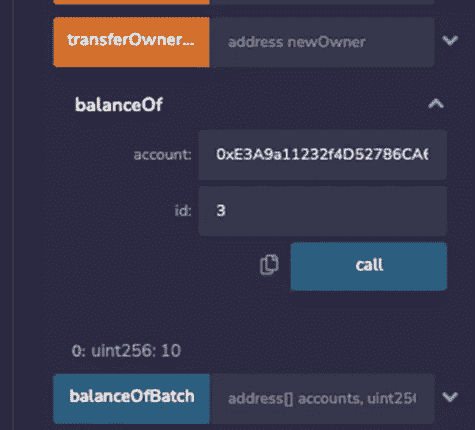
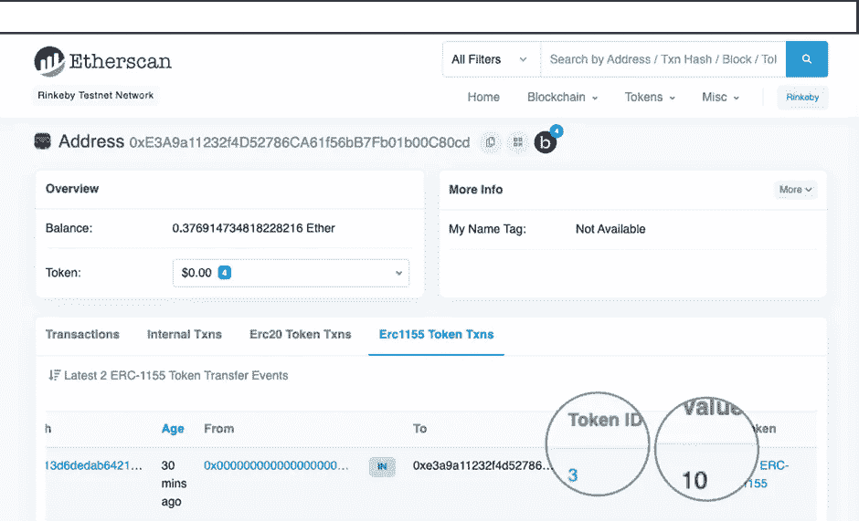
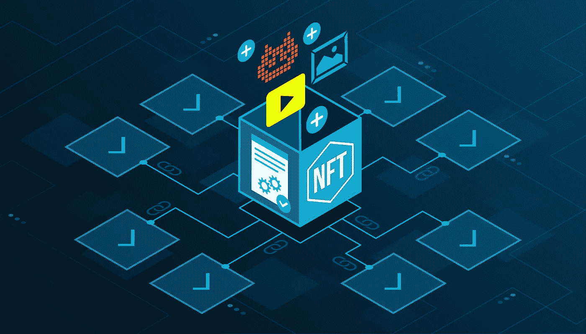

# 从 Openzeppelin 部署 ERC1155 合同

> 原文：<https://levelup.gitconnected.com/deploy-an-erc1155-contract-from-openzeppelin-96c71d741e2e>

[ERC1155](https://docs.openzeppelin.com/contracts/3.x/erc1155) 是一个 EVM-以太坊虚拟机-令牌标准，旨在从以前的标准中吸取精华，创建一个**和**节能** [令牌契约](https://docs.openzeppelin.com/contracts/3.x/tokens#but_first_coffee_a_primer_on_token_contracts)。**

**ERC1155 和 ERC721 之间的区别在于，ERC1155 允许您创建多个具有相同令牌 Id 的 NFT，这与 ERC721 不同，在 ERC 721 中，每个 NFT 具有不同的令牌 id。为一件艺术品制作几份拷贝可能是有用的——他卖的是限量版，而不是一件一件的。还有其他可能的用例，比如为令牌持有者创建一个通行证以访问某些东西，一张活动门票，甚至是一个游戏中物品的限量版。**

**您可以在下面的文章中了解有关 ERC20、ERC721 和 ERC1155 差异的更多信息:**

** [## 选哪个——ERC-20 vs ERC-721 vs ERC-1155 以太币智能合约红丸

### 如果你在这里，那是因为你想知道你应该选择哪种智能合约来创建你的 NFTs。

levelup.gitconnected.com](/which-one-to-choose-erc-20-vs-erc-721-vs-erc-1155-ethereum-token-smart-contract-red-pill-9bb827148671) 

## OpenZeppelin 是怎么工作的？

你可以看看我以前的文章，我解释了如何从 openzeppelin 部署 ERC721 契约。

为了能够遵循本教程并创建一个 ERC1155 令牌，您可能需要查看一些[以前的文章](/deploy-your-first-erc20-token-in-5-min-17c1333d8434):

🤖[**5 分钟内部署您的第一份智能合同**](/deploy-your-first-smart-contract-in-5-minutes-67361699ae03)

🚀 [**在 5 分钟内部署你的第一个 ERC20 令牌**](/deploy-your-first-erc20-token-in-5-min-17c1333d8434)

🐶今天就在以太坊上创建您自己的柴犬-伊努代币吧！

此外，请查看此智能合同主课程，了解如何创建 ERC20、ERC721 和 ERC1155:

**👾** [**创建 NFT、令牌和 DAOs 智能合约大师级**](https://www.udemy.com/course/create-nfts-tokens-and-daos-smart-contracts-masterclass/?referralCode=39A122B4B0FA4780826A)

好吧！开始吧！

前往 [openzeppelin](https://docs.openzeppelin.com/contracts/4.x/wizard) ，我们创建一个名为“CryptoDogPartyPass”的 ERC1155 令牌名称

然后，我们将为令牌添加可铸造、可燃烧和供应跟踪功能。让我们简单解释一下他们是做什么的:

**可铸造**:特权账户将能够铸造新的代币到指定的钱包。

可燃烧的**:代币持有者可以燃烧代币来减少供给。**

**供应跟踪**:检查代币的总供应量

**可暂停:**特权账户可以暂停标记为 whenNotPaused 的造币功能。

我们还可以检查访问控制特性，在这里我们可以分配角色，或者决定谁可以访问某个特定的方法，甚至是整个契约。

当所有这些都完成后，我们应该如下图所示，然后我们可以将我们的代码复制到 [remix](https://remix.ethereum.org/) 来测试和部署。如果你不知道如何使用 Remix，可以查看本文开头的链接。

继续复制你的代码，去我们的在线 IDE， [Remix](http://remix.ethereum.org/) 。创建新工作区如果您一直在关注本系列，并且只创建了 ERC20 令牌，那么新的 ERC1155 智能合约**在不同的工作区**中非常重要。我将我的工作空间命名为 **ERC1155。**点击创建新工作区的按钮，如下图所示。

为你的智能合约创建一个新的文件，最好用你命名的令牌来命名它。我的名字是**cryptodogpartypass . sol .**继续从 OpenZeppelin 向导中粘贴您的代码。

接下来，转到**编译器**并选择编译器 0.8.4(或显示在智能合约顶部的任何东西)并编译您的代码。确保编译器版本与智能合约的 pragma solidity 版本相同。

接下来转到 deploy 部分，选择 **Injected Web 3** 环境，并选择您想要部署的契约。

点击**部署**，它应该会提示你的元掩码。确保现在你已经在 Goerli testnet 上了。你需要做一些格利测试。如果你还没有，看下面的视频。

继续操作，单击浏览器扩展部分中的元掩码图标将其激活，然后再次部署。

**现在我们已经将代码部署到了 Goerli 测试网上…🚀**

您应该看到以下内容:

让我们调用我们需要的每个方法:

我们应该认识到， **mint()** 函数接收令牌所有者的地址、令牌 Id、同一令牌的供应量以及一些可选的附加数据。当我们为 mint 函数传递参数并将其部署在 Goerli 测试网络上时，请参见下图。

在下图中，我们调用 mint 函数将 10 个令牌 id 为“3”的令牌存入我们的地址。单击 transact 后，它会提示元掩码 wallet，您可以确认以便执行铸造:)

由于我们已经设置了令牌细节，现在我们可以使用令牌地址和令牌 Id 作为参数来检查余额。这就是我们称之为 **balanceOf** ()方法的地方。从下图可以看出，由于我们没有名为“1”的 tokenId，因此它返回“0”。

让我们看看我们是否输入 token id“3 ”,它会给出可用令牌的数量

*瞧*！我们得到了价值“10”的代币，如铸造电话中所述。

我们还可以通过调用 **exists()** 来检查令牌是否存在，并输入我们试图检查它是否存在的 tokenId，它返回一个 bool。我们还可以检查 **totalSupply()** ，它接受 tokenId 来计算它被铸造了多少。我们还可以调用 **owner()** 方法来了解谁拥有特定的令牌。

如果我们在以太网扫描的块浏览器上检查我们的钱包地址，我们可以在 ERC1155 选项卡中查看我们的交易的详细信息，如 tokenId、totalSupply。

现在去更新你的智能合同开发简历吧！(不是职业建议..lol)😂

**如果你对加密、元宇宙、NFTs 和 DeFi 感兴趣，别忘了看看这些:**

🤑 [**DeFi 金融大师班的未来**](https://www.udemy.com/course/def-i-decentralized-finance-future-of-finance-masterclass/?referralCode=AB3572DA1669084E47E4)

🚀 [**以太坊合并升级大师级**](https://www.udemy.com/course/the-ethereum-merge-upgrades-masterclass/?referralCode=732F453B5B228B789846) 😍 [**元宇宙对商家—如何从元宇宙获益**](https://www.udemy.com/course/metaverse-for-businesses-how-to-benefit-from-the-metaverse/?referralCode=4B3DF285FE8F0CDC8143) **👾** [**创建 NFT、令牌和 DAOs 智能合约主类**](https://www.udemy.com/course/create-nfts-tokens-and-daos-smart-contracts-masterclass/?referralCode=39A122B4B0FA4780826A) 🦄 [**元宇宙大师班——了解元宇宙**](https://www.udemy.com/course/metaverse-masterclass-learn-everything-about-the-metaverse/?referralCode=4795AA478A4B496F3BC5) ⭐ [**NFT 投资大师班——关于 NFT 投资的亲贴士**](https://www.udemy.com/course/nft-investing-masterclass-pro-tips-about-nft-investing/?referralCode=32FD108E41BB3959925F) 推特:@ [henriquecentiei](https://twitter.com/henriquecentiei?s=11) ，LinkedIn:[Henrique centieiro](https://www.linkedin.com/in/henriquecentieiro)，YouTube: [Crypto Henri](https://www.youtube.com/results?search_query=henrique+centieiro)

**

# **分级编码**

**感谢您成为我们社区的一员！在你离开之前:**

*   **👏为故事鼓掌，跟着作者走👉**
*   **📰查看[升级编码出版物](https://levelup.gitconnected.com/?utm_source=pub&utm_medium=post)中的更多内容**
*   **🔔关注我们:[Twitter](https://twitter.com/gitconnected)|[LinkedIn](https://www.linkedin.com/company/gitconnected)|[时事通讯](https://newsletter.levelup.dev)**

**🚀👉 [**将像你这样的开发人员安置在顶级初创公司和科技公司**](https://jobs.levelup.dev/talent/welcome?referral=true)**