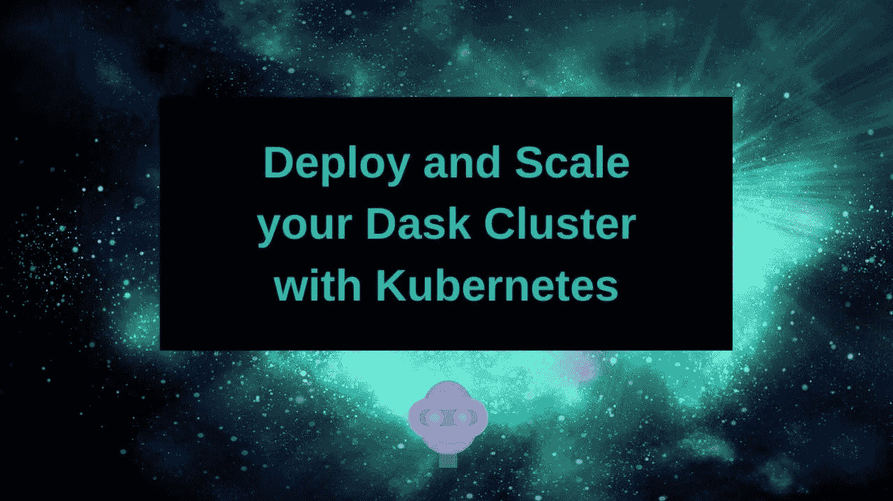
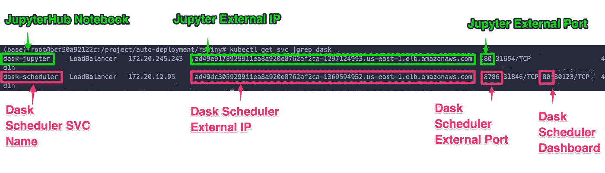
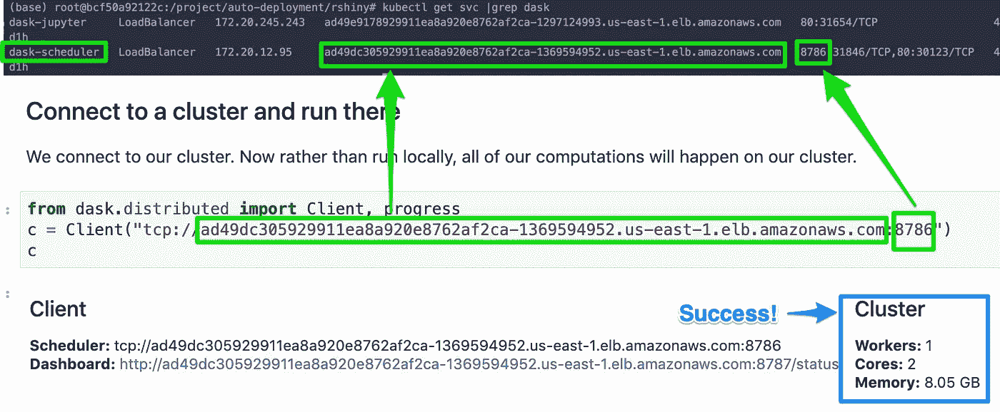
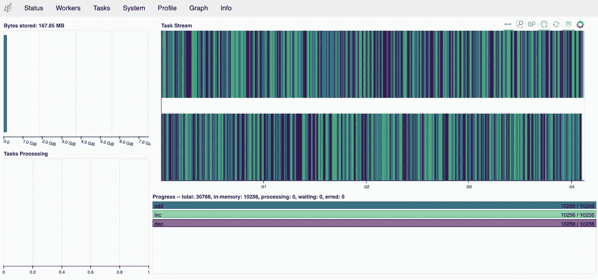
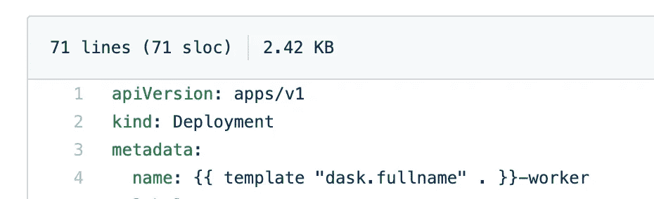
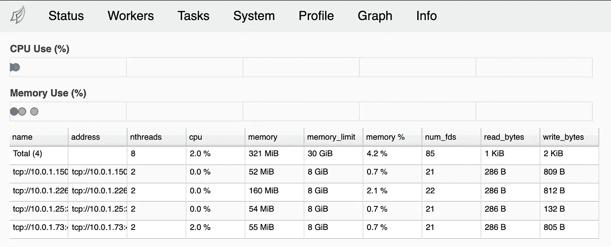
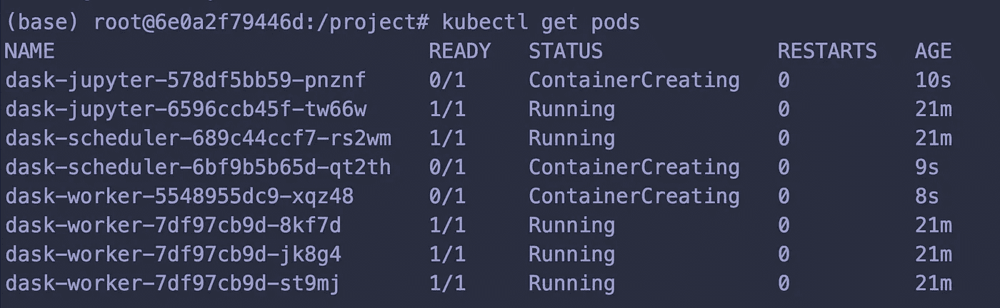
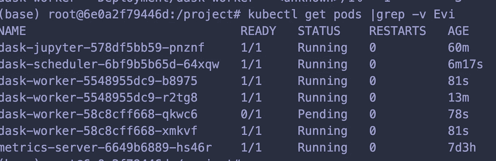
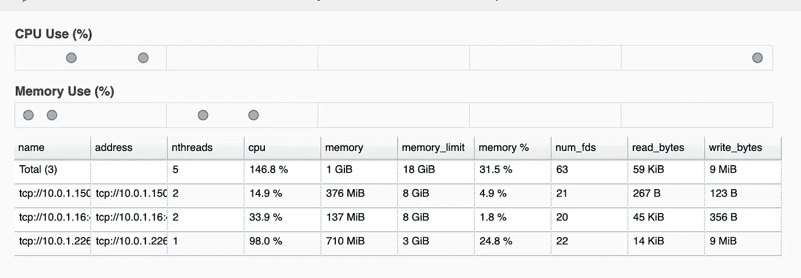

# 使用 Kubernetes 部署和扩展您的 Dask 集群

> 原文：<https://levelup.gitconnected.com/deploy-and-scale-your-dask-cluster-with-kubernetes-9e43f7e24b04>



Dask 是 Python 的并行计算库。我认为它就像 MPI 一样，不需要实际编写 MPI 代码，我非常欣赏这一点！

> *Dask 原生鳞片蟒蛇*
> 
> *Dask 为分析提供先进的并行技术，为您喜爱的工具提供规模化性能*
> 
> [*https://dask.org*](https://dask.org)

Dask 的一个更酷的方面是，您可以跨计算机/服务器/节点/pod/容器等进行扩展。这就是为什么我说它像 MPI。

我们今天要讨论的是:

*   使用 Kubernetes 的优势
*   使用 Kubernetes 的缺点
*   安装 Dask 舵图
*   使用`kubectl scale`扩大/缩小您的 Dask 工人
*   修改 Dask 头盔图来增加额外的套装
*   使用水平 Pod 自动缩放器自动缩放您的 Dask 工人

# 对 Kubernetes 上的 Dask 有利

先说一些(很多！)使用 Kubernetes 的好处！

# 可定制的配置

Dask 的另一个非常重要的方面，至少对我来说，是我可以设置它，使基础设施方面的事情对用户完全透明，他们永远不必接触它。这一点对我来说很重要，因为传统上，我一直站在技术问题等式的开发运维与基础设施这一边，与应用程序或模型开发这一边的数据科学家一起工作。

我喜欢这种灵活性，我可以在基础设施端获得一个很好的默认设置，然后关心定制的用户可以在应用程序端根据需要进行调整。

让我们举一个真实世界的例子。我和一个数据科学家团队一起工作，他正在创建一个 [Dash](https://plotly.com/dash/) web 应用程序，对一些数据集进行实时可视化。

这个想法是，用户点击一个按钮，在后台数字被处理，模型参数被评估，科学向前发展！

我们不想在浏览器中，甚至在一台服务器上处理它们，*因为你看过*生物信息学数据集吗？数据集不断变大，分辨率也越来越高。(好吧，现在咆哮结束。)

理想情况下，我们想要的是在一个完全独立于我们的 web 应用程序的分布式、自动扩展的计算环境中处理数字。这就是达斯克的用武之地。

# 整合能力

你很少只使用一种工具或系统。我看到的最常见的用例是这样的:

*   数据存储在网络文件系统或 S3 上
*   探索性分析是在 JupyterHub、RStudio 或仅使用 SSH 的 HPC 计算集群上完成的
*   最终分析被放入管道工具，如 [Apache Airflow](https://github.com/apache/airflow) ，任务在 Kubernetes 或作业队列系统(如 AWS Batch)上运行。

其中的每一个都可以被认为是一个独立的组件，使用类似 Terraform 的东西，您可以轻松地部署您的文件系统、应用程序和集群。

然后是与 Dask 包本身的集成。Dask 可以作为使用`dask_ml` [库](https://examples.dask.org/machine-learning.html)的许多 SKLearn 函数的替代品。

# 自动缩放的能力

当然，我们不想花钱让一堆服务器无所事事。这就是我们在云上的原因！如果您在 Kubernetes 上使用 Dask，您可以手动缩放，也可以通过在 Kubernetes 配置中创建自动缩放规则来按需缩放。

Dask 会注意到工程何时上升或下降，并利用这一切，除了将它指向调度程序之外，您无需做任何事情！

# Kubernetes 上 Dask 的缺点

您必须学习 Kubernetes，并且至少对 Docker 容器的工作原理有一个基本的了解。如果你没有这些，你的学习曲线会非常陡峭。

# 使用的技术

对于这个教程，你需要安装[库贝克](https://kubernetes.io/docs/tasks/tools/install-kubectl/)和[头盔](https://helm.sh/docs/intro/install/)。

你需要某种形式的 Kubernetes 或 [MiniKube](https://kubernetes.io/docs/tasks/tools/install-minikube/) cluster。Kubernetes 是平台不可知的，所以不管你是部署在 AWS、GCP 还是内部。

如果你对我如何部署我的 AWS EKS 集群感兴趣，你可以看看我写的这篇博文。

从那里我们将使用 [Helm V3](https://helm.sh/) ，这是一种 Kubernetes 上应用程序的包管理器，来部署我们的 [Dask 集群](https://github.com/dask/helm-chart/tree/master/dask)。

# 安装 Dask

此时，您应该已经启动并运行了 Kubernetes 或 MiniKube 集群。

我们关心的 Kubernetes/MiniKube 设置的唯一区别是公开服务。如果您使用 AWS 之类的云提供商，您会希望使用 LoadBalancer serviceType 进行部署。如果您使用的是 on site 或 MiniKube，您将需要使用 NodePort 进行部署，然后使用 kubectl 来转发地址。如果你正在使用 Minikube [,这是我发现的最好的公开服务的综合资源](https://kubernetes.io/docs/tasks/access-application-cluster/ingress-minikube/)。

对于这第一次通过，我们只是要安装 Dask，看看周围。然后我们会做一些很酷的自动缩放的事情！

我们将使用官方的 [Dask 头盔图](https://github.com/dask/helm-chart)。

```
helm repo add dask https://helm.dask.org/
helm repo update
# Kubernetes cluster on a cloud provider (AWS, GCP, Azure)
# The default serviceType is already set as LoadBalancer
# Make sure to remember your release names!
export RELEASE="dask"
helm install ${RELEASE} dask/dask
# Kubernetes cluster on an in house server/minikube
# helm install dask dask/dask --set serviceType=NodePort
```

你会注意到，当你用 Helm 安装图表时，会弹出一些非常方便的说明。如果您需要再次访问它们，并且不希望余生都在滚动中度过，那么使用您之前提供的发布名称运行命令`helm status $RELEASE`，在本例中是`dask`。

这些可能需要几分钟才能显示出来，但是让我们运行一些命令。

```
kubectl get pods |grep dask 
kubectl get svc |grep dask
```

你应该会看到一个或多个像`Init`或`Running`这样的状态。启动和运行需要几分钟，所以去喝点茶吧！



如果你使用云提供商，你会看到为你的 Jupyter 笔记本和 Dask 调度程序提供的负载平衡器服务。如果您使用 MiniKube，您必须运行 MiniKube 命令来获取服务 URL。

# 探索我们的木星中心环境

现在，我们有了 Jupyterhub，它非常方便，因为它为我们提供了一个 python 控制台和一个终端。

前往`dask-jupyter` svc 中显示的网址。

```
kubectl get svc dask-jupyter 
# Or if you can't remember the name of all the services just grep for your release name 
# kubectl get svc |grep dask
```

默认密码是`dask`。如果你想改变它，去看看 [dask 舵图文档](https://github.com/dask/helm-chart)。

在左手边你会看到`File Browser`。转到`examples/01-custom-delayed.ipynb`。开始运行代码单元，直到您点击 dask 客户端。

# 配置 Dask 客户端

现在，这是那些真正让人犯错的事情之一。我说的人也指我在学习 Docker 的时候。；-)

(通常)您可以通过两种方式之一访问服务。如果您是集群的内部成员，就像我们在 Jupyterhub 笔记本上一样，您可以使用服务名，在本例中是`dask-scheduler`，因为联网很神奇。我们还有一个外部 IP 地址，因此我们将使用它。你可以使用任何一个，它工作得很好。使用服务名可能更好，因为 IP 地址可以改变，但是我想在这里演示它也可以与外部 IP 一起工作。

别忘了 IP 地址前面的`tcp`。那件事一直困扰着我！



按下 run 按钮，您应该会看到一些关于 Dask 集群的信息！

运行其余的单元格，这样我们就可以在 Dask 状态仪表板上看到一些有趣的东西。

# 探索 Dask 仪表板

回到你的 svcs 去。

```
kubectl get svc dask-scheduler
```

并获取外部 IP。打开那个网址，有或没有端口 80(任何站点的默认端口都是端口 80，所以不需要放入)，查看 Dask 仪表板。

```
from dask.distributed import Client, progress
import dask
import distributed
dask.config.set({
"distributed.comm.timeouts.tcp": "50s",
"distributed.scheduler.allowed-failures": 999
})
c = Client("tcp://dask-scheduler:8786")
# c = Client("tcp://EXTERNAL_IP:8786")
c

# TRUST BUT VERIFY
dask.config.get('distributed.comm.timeouts')
dask.config.get('distributed.scheduler.allowed-failures')
```

# Dask 状态

这是仪表板的默认部分。如果你运行了其余的细胞，你应该看到这里的东西。

如果你想玩一会儿，看看 Dask 实际执行的函数，并改变它们的参数。

```
%%time
zs = []
# Change the range value to see how it affects tasks
for i in range(10000):
    x = inc(i)
    y = dec(x)
    z = add(x, y)
    zs.append(z)

zs = dask.persist(*zs)
total = dask.delayed(sum)(zs)
```



# 缩放 Dask 工人

现在我们已经完成了基线检查以确保一切正常，让我们改变一下 dask 工作人员的数量。我这样做有两个原因。我想确保这不会让 Dask 调度程序抓狂。然后，我想为自动伸缩或基于需求的伸缩奠定基础！

为了做到这一点，我们将使用`kubectl scale`命令。确切地说，我们的规模是基于 Kubernetes 类型，通常是`Deployment`、`StatefulSet`或`SVC`。有关更多信息，请查看 [kubectl cheatsheet](https://kubernetes.io/docs/reference/kubectl/cheatsheet/#scaling-resources) 和[scaling a deployment](https://kubernetes.io/docs/concepts/workloads/controllers/deployment/#scaling-a-deployment)。

我们的 Dask Worker 是一个部署，因此我们将使用部署伸缩策略。如果你不知道你在缩放什么，去舵图，然后去你想要缩放的东西的模板。

这里是 [dask-worker 模板](https://github.com/dask/helm-chart/blob/master/dask/templates/dask-worker-deployment.yaml#L1)。



让我们将我们的工作人员扩展到 4 个副本！

```
kubectl scale deployment.v1.apps/dask-worker --replicas=4
```

您应该会看到一条成功消息:

```
deployment.apps/dask-worker scaled
```

获取 pod，您应该会看到`dask-worker`pod 正在运行或正在初始化！

```
(base) root@6e0a2f79446d:~# kubectl get pods |grep dask
dask-jupyter-6596ccb45f-2cl64     1/1     Running   0          6d23h
dask-scheduler-689c44ccf7-c6j58   1/1     Running   0          6d23h
dask-worker-7df97cb9d-bvkhm       1/1     Running   0          6d23h
dask-worker-7df97cb9d-dwq45       1/1     Running   0          7m55s
dask-worker-7df97cb9d-k7xdb       1/1     Running   0          43s
dask-worker-7df97cb9d-qvkl6       1/1     Running   0          7m55s
```

您可以前往 Dask 仪表板-> Workers，您应该会看到 4 个工人！



为了准备下一部分，让我们将我们的工作人员缩减到 1 个副本。

```
kubectl scale deployment.v1.apps/dask-worker --replicas=1
```

# 自动缩放 Dask 工作线程

下一部分是完全可选的。它描述了如何自动扩展 Dask workers，以便根据需求动态地扩大或缩小规模。这是一个高级主题，确切的数字在很大程度上取决于您自己的 Kubernetes 集群和场景。

首先，您需要安装 [helm metrics 服务器](https://github.com/helm/charts/tree/master/stable/metrics-server)。

```
helm repo add stable https://kubernetes-charts.storage.googleapis.com
helm repo update
helm install metrics stable/metrics-server
```

*警告*在这样做的时候，攻击你的系统是非常容易的。不要在生产系统上玩自动缩放！

如果你破坏了你的安装，通常是以得到一个 pod`Evicted`的形式，最简单的方法就是用`helm delete dask`删除你的版本，然后用`helm install dask dask/dask`重新安装。

之前我们讨论了缩放。缩放很酷，但是对于我们想要的还不够。我们真正想要的是自动扩展，这意味着我们可以根据需求进行扩展！

```
kubectl scale deployment.v1.apps/dask-worker --replicas=1 
kubectl autoscale deployment.v1.apps/dask-worker --min=1 --max=3 --cpu-percent=1
```

这将添加一个水平 Pod 自动缩放器。

```
kubectl get hpa 
# To delete it run 
# kubectl delete hpa dask-worker
```

# 用 Dask-ML 更新我们的 Dask 部署

现在，为了让这个例子更有趣，让我们更新我们的部署来添加`dask-ml`库。

**在此之前，请确保您已经导出了您关心的任何作品！这将重新创建所有的容器！**

```
wget [https://raw.githubusercontent.com/dask/helm-chart/master/dask/values.yaml](https://raw.githubusercontent.com/dask/helm-chart/master/dask/values.yaml)
```

打开`values.yaml`，寻找 worker - > env 键。更改 EXTRA_CONDA_PACKAGES 环境变量，在 worker 和 jupyterhub 定义中包含`dask-ml`和`matplotlib`。

```
worker:
  name: worker
  image:
    repository: "daskdev/dask"
    tag: 2.14.0
    pullPolicy: IfNotPresent
    # dask_worker: "dask-cuda-worker"
    dask_worker: "dask-worker"
    pullSecrets:
    #  - name: regcred
  replicas: 3
  default_resources:  # overwritten by resource limits if they exist
    cpu: 1
    memory: "4GiB"
  env:
  #  - name: EXTRA_APT_PACKAGES
  #    value: build-essential openssl
  #  - name: EXTRA_CONDA_PACKAGES
  #    value: numba xarray -c conda-forge
  #  - name: EXTRA_PIP_PACKAGES
  #    value: s3fs dask-ml --upgrade
```

收件人:

```
worker:
  name: worker
  image:
    repository: "daskdev/dask"
    tag: 2.14.0
    pullPolicy: IfNotPresent
    # dask_worker: "dask-cuda-worker"
    dask_worker: "dask-worker"
    pullSecrets:
    #  - name: regcred
  replicas: 3
  default_resources:  # overwritten by resource limits if they exist
    cpu: 1
    memory: "4GiB"
  env:
  #  - name: EXTRA_APT_PACKAGES
  #    value: build-essential openssl
  ############## ADD IN EXTRA PACKAGES HERE!
    - name: EXTRA_CONDA_PACKAGES
      value: numba xarray dask-ml matplotlib -c conda-forge
  #  - name: EXTRA_PIP_PACKAGES
  #    value: s3fs dask-ml --upgrade
```

对 jupyterhub 变量做同样的事情！

现在用以下内容更新安装:

```
helm upgrade --install dask dask/dask --values values.yaml
```

去看看你的豆荚怎么样了:

```
kubectl get pods |grep dask
```

您可能会看到“容器创建”或“初始化”之类的内容，这是因为默认情况下，Kubernetes 会进行滚动更新，在下一个容器准备好之前，它不会更新您的容器。



刷新你的 Jupyterhub 页面，用密码`dask`重新登录。

打开`examples/ml/incremental.ipynb`笔记本。

请确保更改您的客户端配置！

```
from dask.distributed import Client, progress
import dask
import distributed
dask.config.set({
"distributed.comm.timeouts.tcp": "50s",
"distributed.scheduler.allowed-failures": 999
})
c = Client("tcp://dask-scheduler:8786")
```

遍历单元格，直到“创建一个随机数据集”。

您将看到一些看起来有点像这样的代码，除了`n_samples`和`n_features`的编号不同。

你要做的是把这些数字改成非常小的数字，只是为了测试一下，不要冒险破坏你的整个系统。

我从`n_samples=100`和`n_features=2`开始。随便玩玩吧！

```
n_samples = 100
n_features = 2

# These were my final numbers to get anything interesting with the autoscaling
# n_samples = 10000000
# n_features = 500
chunks = n_samples // 50

X, y = dask_ml.datasets.make_classification(
        n_samples=n_samples, n_features=n_features,
        chunks=chunks,
        random_state=0
)
```

现在，您可以运行代码，直到*创建 Scikit-Learn 模型、SGDClassifier* 和%时间块。

```
%time _ = inc.fit(X_train, y_train, classes=[0, 1])
```

这里，就是达斯克魔法发生的地方！用你的小数字运行整个代码。然后逐渐增加，看看它如何影响自动缩放。

您可以通过几种不同的方式来检查自动缩放器。一种是转到 Dask 仪表板的*工人*部分。另一个是刚刚运行的`watch kubectl get pods`。

您的 pods 何时扩展取决于 Kubernetes 集群和各个容器的可用 CPU/内存量。我试图把它放在一个非常低的量，这样每个人都可以看到自动缩放在起作用，但你将不得不与`n_samples`和`n_features`玩得相当多，以占用足够的 CPU 和内存来缩放你的豆荚。

以下是一些处于待定状态的窗格:



在这里，它们被 Dask 调度程序注册！



# 排除驱逐故障

如果您的 pod 一直显示为“被驱逐”,这意味着您正在尝试安排集群中没有资源的事情。你可以到`values.yaml`处，摆弄各种`resources`键来要求更小的容器。

这真的只是你需要摆弄的东西之一，直到你得到确切的设置。

# 解决纷争

```
# Get your dask-worker pod names 
kubectl get pods |grep dask-worker 
# Get various metrics and logs 
kubectl logs pod-name 
kubectl describe pod pod-name 
kubectl top pod pod-name
```

# 包裹

就是这样！我希望这篇文章对你有帮助！如果你有任何问题或者想要一个指导，请不要犹豫联系我在 jillian@dabbleofdevops.com 或者查看我的网站。

# 文档和资源

[Kubernetes 水平伸缩吊舱](https://kubernetes.io/docs/tasks/run-application/horizontal-pod-autoscale/)

[度量服务器掌舵图](https://github.com/helm/charts/tree/master/stable/metrics-server)

[达斯克掌舵图](https://github.com/dask/helm-chart/tree/master/dask)

[达斯克舵图—朱庇特密码](https://github.com/dask/helm-chart/tree/master/dask#jupyter-password)

[Dask 掌舵图—定制 Python 环境](https://github.com/dask/helm-chart/tree/master/dask#customizing-python-environment)

*最初发表于*[*【https://www.dabbleofdevops.com】*](https://www.dabbleofdevops.com/blog/deploy-and-scale-your-dask-cluster-with-kubernetes)*。*