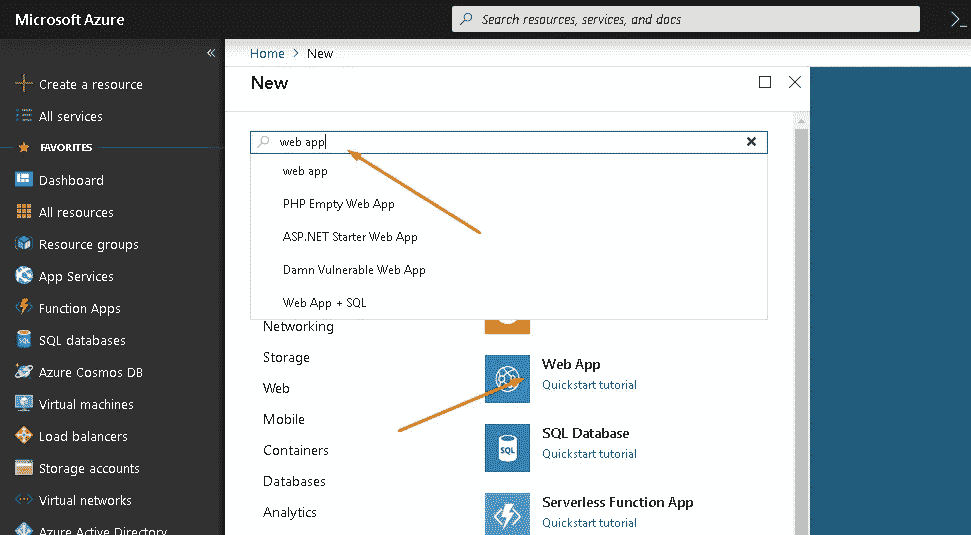

# 如何将 Angular 应用程序部署到 Azure Web 服务

> 原文：<https://levelup.gitconnected.com/deploy-angular-application-on-azure-web-service-960e441bb13d>

谷歌图片

如果你不知道从哪里开始，在 Azure Web 服务上部署 Angular 应用程序可能是一件痛苦的事情。

本教程将包括以下步骤:

1.  **创建 Azure Web 服务**
2.  **构建角度应用**
3.  **配置 Web 服务并部署它**

> 查看我在 [schadokar.dev](http://schadokar.dev/) 上的其他教程

让我们从创建 Azure Web 服务开始；

如果您没有任何帐户，您可以 [***注册免费帐户***](https://azure.microsoft.com/en-us/free/) ，200 美元将存入您的 azure 帐户中以供使用。

登录您的 Azure 帐户。

## **步骤:1.1** 创建 Web 应用程序

点击创建资源→搜索 Web 应用程序→创建

创建 Web 应用程序

## **步骤:1.2**

为您的应用程序指定一个唯一的名称，您可以将该字段的其余部分保留为默认值。服务计划是托管应用程序的主机。它有不同的计划，但对于我们的演示，让它成为默认设置。

创建 Web 应用程序

创建后，您可以在 App Service blade 中检查您的应用程序，或者在搜索栏中搜索您的应用程序。

## **步骤 2.1:** 构建角度应用程序

`ng build --prod`

一旦该命令成功运行，就会在您的应用程序目录中创建一个`dist`文件夹。

角度应用文件夹

现在我们已经准备好部署我们的应用程序了。

> `[ng build](https://stackoverflow.com/questions/49065635/inconsistency-in-ng-build-vs-ng-build-prod)``[ng build --prod](https://stackoverflow.com/questions/49065635/inconsistency-in-ng-build-vs-ng-build-prod)`的[区别值得一读。](https://stackoverflow.com/questions/49065635/inconsistency-in-ng-build-vs-ng-build-prod)

## **步骤 3.1** 在 Azure 中打开您的 Web 应用程序

有多种方法可以访问您的 web 应用程序，这里我们使用的是应用程序服务，单击它，然后选择您的 web 应用程序。

单击 URL —这是托管应用程序的 URL。默认情况下，azure 提供默认静态页面。

在 web 应用搜索栏中搜索高级工具，然后点击`Go`。

工藤高级工具

一个 Kudu 窗口将会打开。要检查 Web 应用程序支持的**节点版本，请单击运行时版本。在撰写本文时，它正在支持**节点 v8.11.1** 。**

要了解如何安装特定版本[的更多信息，请阅读此](https://blogs.msdn.microsoft.com/azureossds/2016/04/20/nodejs-and-npm-versions-on-azure-app-services/)。

**步骤 3.2:** 现在转到调试控制台下的 CMD 控制台，并遵循以下命令:

1.  点击网站> > wwwroot
2.  转到角度应用程序文件夹，打开分布文件夹> > angularDemoDeploy(在这种情况下)
3.  将此文件夹拖放到 wwwroot 文件夹(Kudo 的 CMD 控制台)
4.  删除 hostingstart.html

5.转到 Azure Web App 并打开应用程序设置

6.在**中，虚拟应用和目录**改变物理路径

从**站点\wwwroot** 到**站点\wwwroot\angularDemoDeploy** 和**保存。**

> 这里 angularDemoDeploy 是您上传的文件夹的名称。

更改物理路径

万岁！angular 应用程序已成功部署在 Azure Web App 上。请访问您的应用程序网址，开始享受吧！

感谢阅读！欢迎任何意见和建议。

 [## 学习角度-最佳角度教程(2019) | gitconnected

### 前 48 角教程-免费学习角。课程由开发人员提交和投票，使您能够…

gitconnected.com](https://gitconnected.com/learn/angular)