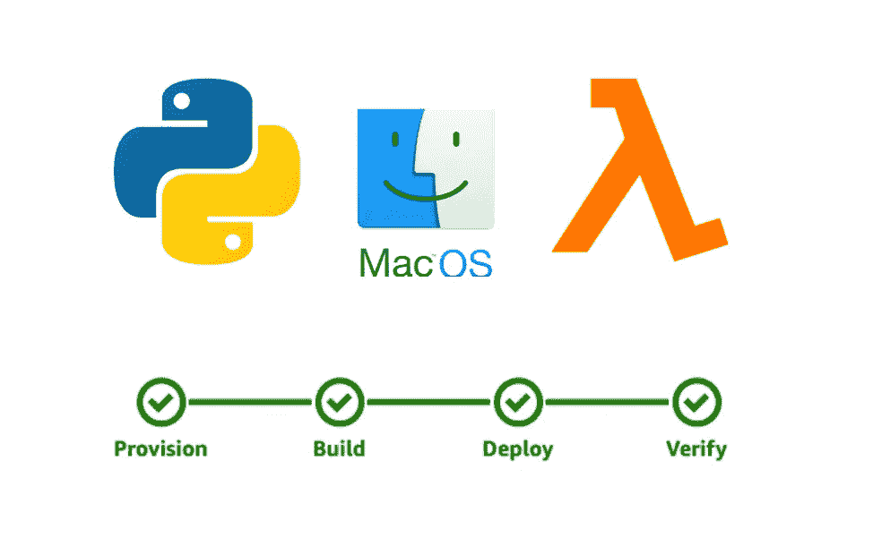

# 使用 Docker 从 MacOS 部署 AWS Amplify Python Lambda

> 原文：<https://levelup.gitconnected.com/deploy-aws-amplify-python-lambda-from-macos-with-docker-68212e889a38>



# TL；速度三角形定位法(dead reckoning)

本文介绍了如何使用 Docker 从 MacOS(或任何非 Linux 平台)构建和部署 AWS Python Lambda。

# 概观

AWS Amplify 是一款帮助开发者方便地设置和管理 AWS 资源的工具。AWS Amplify 提供了一个交互式 cli 调用`amplify-cli`来创建后端资源和前端网页。所有创建的资源都有 CloudFormation 配置文件，这使得开发团队可以轻松地将其迁移到自有的包或管道中。[【阅读更多】](https://docs.amplify.aws/)

回到本文的主题，在我最近使用 Amplify Python Lambda 期间，如果我从 MacOS 部署 Lambda，我会发现以下错误:

```
{
  "errorMessage": "Unable to import module 'index': No module named 'regex._regex'",
  "errorType": "Runtime.ImportModuleError",
  "stackTrace": []
}
```

问题的原因是我添加了对`Pipfile` : [【代码链接】](https://github.com/zijing07/aws-lambda-python-deploy/blob/master/amplify/backend/function/amplifypylambda7935db62/Pipfile#L10)的依赖

```
[packages]
nltk = "~=3.4"
```

从 Mac 部署时，`pipenv`自动获取 MacOS 平台的二进制文件。同时，AWS Lambda 运行在 Linux 平台上，因此需要依赖于 Linux。

# 解决问题

为了解决这个问题，我们必须让`pipenv`检索 Linux 依赖项，然后进行部署。有两种方法可以达到目标:

用 VirtualBox 安装 Linux 系统，并从那里部署代码

*   优点:简单明了
*   缺点:效率低，不支持 CI/CD

使用 docker 创建虚拟环境，并在 docker 中部署

*   优点:快速，可脚本化
*   缺点:与`amplify-cli`不兼容

我选择了 Docker 解决方案。虽然它不能与`amplify-cli`一起工作，但是解决方案很快，并且每一步都在代码中，这使得它具有可扩展性。

为了完成构建和部署工作流，我们需要执行以下步骤:

1.  设置 Linux 环境
    这个步骤可以通过正确配置的 done 文件来完成。
2.  下载 docker 容器中的依赖关系
    我们需要在 docker 容器中运行`pipenv install`。
3.  压缩 AWS Lambda 并使用`aws lambda update-function-code`将其部署到 AWS
    可以完成这一步。

# 设置 Linux 环境

为了强制`pipenv`下载 Linux 依赖项，我选择了下面的 Docker 映像，它与 AWS Lambda CI/CD 使用的是同一个映像:

> *lambci/lambda:build-python 3.8*

这种图像的好处是:

1.  该映像提供了一个 Linux 环境
2.  该图像包含`aws`命令，稍后会用到

`Dockerfile`是这样的:[【代码链接】](https://github.com/zijing07/aws-lambda-python-deploy/blob/master/amplify/backend/function/amplifypylambda7935db62/Dockerfile)

```
FROM lambci/lambda:build-python3.8ENV AWS_DEFAULT_REGION us-west-2
ENV AWS_ACCESS_KEY_ID [YOUR_AWS_ACCESS_KEY_ID]
ENV AWS_SECRET_ACCESS_KEY [YOUR_AWS_SECRET_ACCESS_KEY]# copy the code base into Docker container
COPY . . # this script will be shown below
CMD ./dockerCmd.sh
```

# 准备构建和部署脚本

如上所述，我们需要在 Docker 容器中执行以下步骤:

> 构建→压缩→部署

下面是一个将在 Docker 容器中执行的`dockerCmd.sh`的便捷脚本:[【代码链接】](https://github.com/zijing07/aws-lambda-python-deploy/blob/master/amplify/backend/function/amplifypylambda7935db62/dockerCmd.sh)

```
#!/bin/bash# 1\. build, fetch the dependencies
pipenv install# 2\. zip, prepare the AWS Lambda to upload
cd `pipenv --venv`/lib/python3.8/site-packages/
zip -r /var/task/my-deployment-package.zip .
cd -
zip -r -g my-deployment-package.zip src/# 3\. deploy, using `aws` command to update the remote AWS Lambda
aws lambda update-function-code --function-name amplifypylambda7935db62-dev --zip-file fileb://my-deployment-package.zip
```

# 部署和测试

作为最后一步，让我们点亮 Docker 容器并测试它。

启动 Docker 容器并构建和部署:

```
docker build -t tmp-awslambda . && docker run --rm tmp-awslambda
```

测试调用 lambda: [【代码链接】](https://github.com/zijing07/aws-lambda-python-deploy/blob/master/amplify/backend/function/amplifypylambda7935db62/src/index.py)

```
{
  "statusCode": 200,
  "body": "[\\"The\\", \\"Docker\\", \\"solution\\", \\"works\\", \\"!\\"]"
}
```

# 结论

通常，一旦代码被推送到 repos 中，部署就由 CI/CD 负责。但是有时开发人员需要在测试阶段进行临时部署，因此本文中的解决方案会有所帮助。

使用 Docker 很方便，欢迎在下面的评论中分享你的想法！

[【Github 回购】](https://github.com/zijing07/aws-lambda-python-deploy)

*如果你觉得这篇文章有用，请关注这个账号，以便将来更新。感谢支持！*