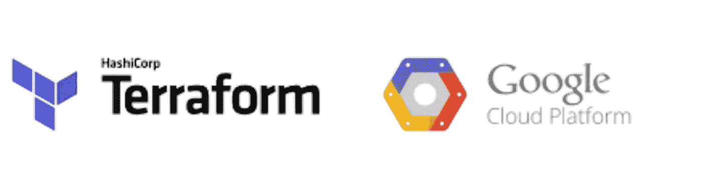
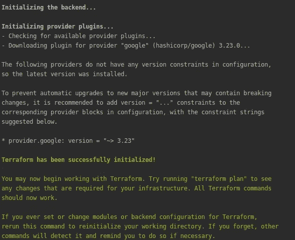
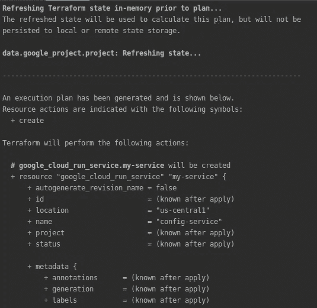
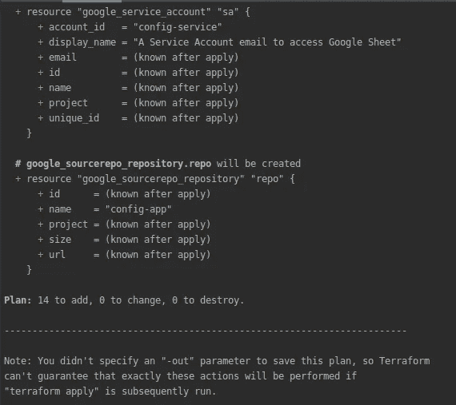
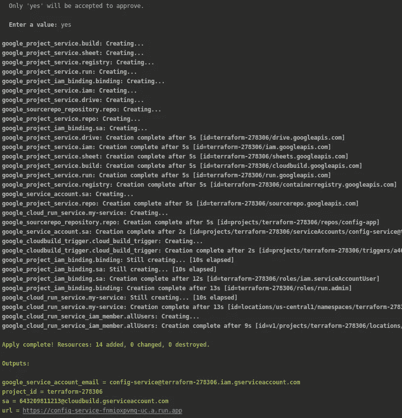
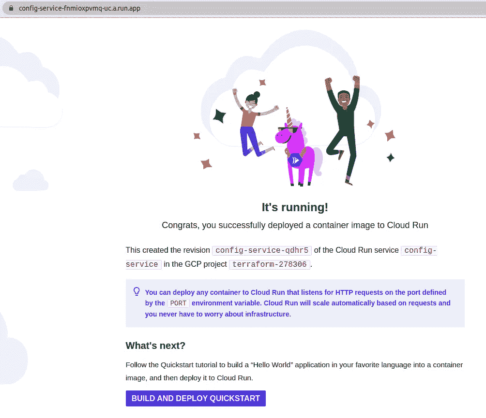
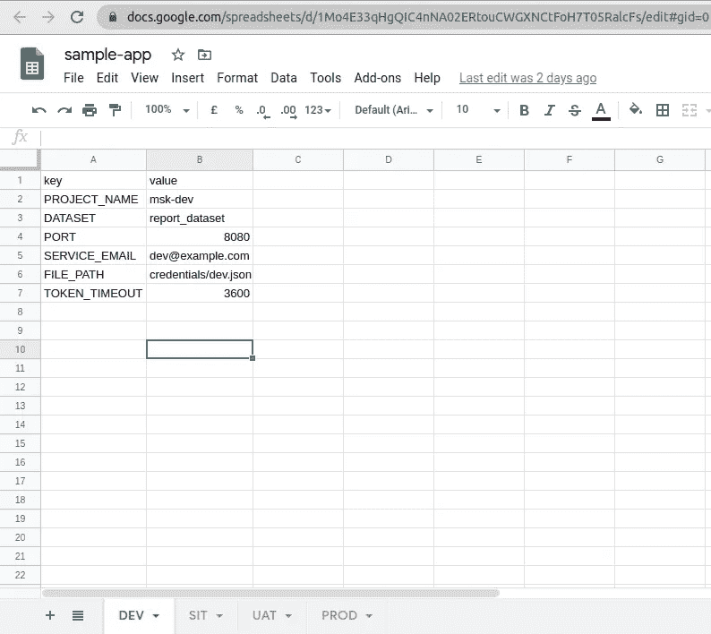
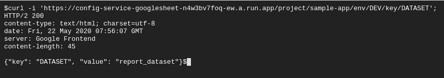
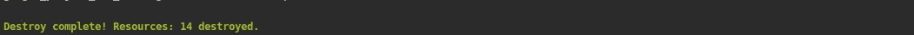

# 使用 Terraform 在 GCP 部署 CI/CD 管道

> 原文：<https://levelup.gitconnected.com/deploy-ci-cd-pipeline-on-gcp-using-terraform-364e533dd465>



# 介绍

最近，我创建了一个应用程序[配置服务](https://medium.com/@vikramshinde/config-service-using-google-sheet-6ac126b1c742)，它从 Google Sheet 获取配置数据。这个应用程序是使用 GCP 无服务器服务**云源库**、**云构建**、**容器注册表、**和**云运行**部署的。

在本文中，我们将看到如何使用 **Terraform** 来自动化这个 CI/CD 管道。

# 设置

为了完成本指南，您需要安装以下工具

*   [Terraform](https://www.terraform.io/) :本指南使用 Terraform 部署资源。
*   [Git](https://git-scm.com/) : Git 用于克隆示例代码并触发新的部署。
*   GCP :你需要一个启用计费的 GCP 账户。

## 创建 GCP 项目

为本教程创建一个 GCP 项目。

## 创建服务帐户

*   创建服务帐户。
*   分配角色:编辑、安全管理员、服务使用消费者和源存储库管理员。
*   下载密钥并将其重命名为 terraform-key.json

## 启用云资源管理器 API

*   转到链接[https://console . cloud . Google . com/APIs/library/cloudresourcemanager . Google APIs . com](https://console.cloud.google.com/apis/library/cloudresourcemanager.googleapis.com)
*   点击启用 API

一切都准备好了。让车轮转动起来！！

# 使用 Terraform 部署 GCP 无服务器资源

克隆包含示例代码的以下存储库，然后切换到`terraform`目录:

```
$ git clone  [https://github.com/vikramshinde12/config-service-googlesheet.git](https://github.com/vikramshinde12/config-service-googlesheet.git)$ cd  config-service-googlesheet/terraform
```

接下来，将`terrform.tfvars.example`文件复制到`terraform.tfvars`。您需要替换`project`变量的值。

然后，将服务帐户密钥 terraform-key.json 复制到该文件夹中。

执行以下命令来设置 Google 凭证。

```
$ export GOOGLE_CLOUD_KEYFILE_JSON=terraform-key.json
```

**执行地形脚本**

首先初始化地形。

```
$ terraform init
```



初始化地形

```
$ terraform plan
```



地形图

现在，将更改后的应用到 GCP 平台。

```
$ terraform apply
```

输出将向您显示进度，并最终显示 URL。



单击 URL，这将打开示例应用程序。

```
$ terraform output url
```



示例应用程序

到目前为止，我们已经推出了一个样本谷歌应用程序，但是，在下一步，我们将部署一个自定义应用程序。

# 部署自定义应用程序

如果您已经在上一步中克隆了 git 存储库，请转到根文件夹。

```
$ cd ..
```

然后运行以下命令，将我们的云源代码存储库添加为 Git remote:

```
$ git remote add google [https://source.developers.google.com/p/[PROJECT_ID]/r/[REPO_NAME]](https://source.developers.google.com/p/[PROJECT_ID]/r/[REPO_NAME])
```

**注意:**您必须用您的 GCP 项目 ID 替换`[PROJECT_ID]`，用您的云资源存储库 repo 名称替换`[REPO_NAME]`。您可以从上一步中 Terraform 的输出中获得 repo url。

现在，是时候把 app 源代码推送到我们的云源回购了。

Google Cloud Build 将触发新的构建，并在 Cloud Run 上自动部署结果 Docker 容器。这是作为资源库根目录中的 **cloudbuild.yaml** 文件自动处理的。

**按下代码**

```
git push --all google
```

# 访问示例应用程序

这个示例应用程序是 Google Sheet 上的配置服务。

要访问应用程序，您需要遵循以下步骤

*   使用任何谷歌帐户创建谷歌表。



*   与示例应用程序中创建的服务帐户共享该表

```
$ cd terraform
$ terraform output google_service_account_email
```

*   点击 GET API/project/<>/env/<>/key/<>



# 打扫

首先，永久删除 Terraform 创建的资源:

```
$ terraform destroy
```



接下来，删除 Terraform 管理项目及其所有资源:

```
$ gcloud projects delete [project_id]
```

# 结论

**Terraform** 之所以伟大，是因为它充满活力的开源社区、简单的模块范式以及它是云不可知的事实。

# 参考

[](https://www.terraform.io/docs/providers/google/guides/getting_started.html) [## HashiCorp 的 Google provider - Terraform 入门

### 在 Google Cloud 控制台中创建一个项目，并对该项目进行计费。本指南中的任何示例都将…

www.terraform.io](https://www.terraform.io/docs/providers/google/guides/getting_started.html) [](https://www.terraform-best-practices.com/) [## 欢迎

### 如果你对某些话题感兴趣，请竖起大拇指，或者对你最想了解的问题竖起大拇指。如果你觉得…

www.terraform-best-practices.com](https://www.terraform-best-practices.com/)