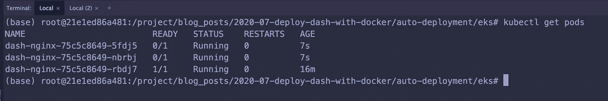

# 在带自动气象站 EKS 站的 Kubernetes 上部署带头盔的仪表板

> 原文：<https://levelup.gitconnected.com/deploy-dash-with-helm-on-kubernetes-with-aws-eks-cabe035c0565>


今天我们将讨论使用 AWS 管理的 Kubernetes 服务 [EKS](https://aws.amazon.com/eks/) 在 Kubernetes 上部署一个带有舵图的 Dash 应用程序。

在这篇文章中，我将假设您已经启动并运行了一个 EKS 集群，因为我想更多地关注实时数据可视化平台背后的策略。如果你没有，请检查我的[部署 RShiny 与 Kubernetes 使用 AWS EKS 和 Terraform](https://www.dabbleofdevops.com/blog/deploy-rshiny-with-kubernetes-using-aws-eks-and-terraform) 。

Dash 是一个用 Python 编写的数据可视化平台。

> *Dash 是下载量最大、最值得信赖的构建 ML &数据科学网络应用的框架。*
> 
> *Dash 使团队能够构建数据科学和 ML 应用程序，将 Python、R 和 Julia 的力量掌握在业务用户手中。通常需要前端、后端和开发运营团队完成的全堆栈应用，现在可以由数据科学家借助 Dash 在几个小时内完成构建和部署。*[*https://plotly.com/dash/*](https://plotly.com/dash/)

如果你想知道人们在 Kubernetes 上对 Dash 的评价，你可以在这里阅读所有相关内容。

不过，Dash 基本上是无状态的，这意味着您可以将它放在负载均衡器后面，并占据主导地位。然后，因为 Kubernetes 正在接管世界，可以负载平衡，可以自动扩展应用程序以及集群本身的弹性，Dash + Kubernetes 是一个非常完美的匹配！

# 数据可视化基础设施

# 历史观

我一直在研究 Dash，这是我对大规模基因组数据集的实时数据可视化着迷的一部分。我想其他数据集也是，但我喜欢生物学，所以我们在这里。

我认为，随着所有闪亮的新基础设施的出现，我们正在达到新的能力数据可视化能力。当我开始从事生物信息学时，所有最好的数据应用都是用 Java 编写的桌面应用。如果你想看一个例子，去看看[集成基因组浏览器——IGV](http://software.broadinstitute.org/software/igv/)。

桌面应用程序肯定有缺点。它们无法适应不断增长的数据量和分辨率。使用这种方法，您可以实时可视化的数据量是有限的。

还有一种方法是建立输出大量 jpegs 或 pdf 的管道，并可能将它们打包成一些 HTML 报告。假设您的管道如预期的那样工作，这已经足够好了，但是不允许您实时更新参数或浏览数据。

# 新奇的新数据即应用

我们不再局限于桌面应用程序来获得我们在与数据交互时都在寻求的交互性水平。像 [RShiny](https://shiny.rstudio.com/) 和 [Dash](https://plotly.com/dash/) 这样的框架，因为它们在整合服务器端计算和前端 widgetizing(这是一个词吗？)你真的可以考虑如何扩展你的应用。

# 计算基础架构和扩展

现在，有了各种各样的云计算，我们可以让**自动扩展集群**。你可以这样说“嘿，Kubernetes，当我的任何一个 pod 的 CPU 占用率超过 50%时，在那里放上一些其他的 pod”。

Python 和 R 都有非常好的数据科学生态系统。您可以使用 Dask 和/或 Spark 扩展您的 Python 应用程序，使用 Spark 扩展您的 R 应用程序，方法是使用 Dask/Spark 将您的 web 内容与您的重型计算完全分离。

如果你想了解更多关于我对 Dask 的看法，去看看我的博客文章[用 Kubernetes](https://www.dabbleofdevops.com/blog/deploy-and-scale-your-dask-cluster-with-kubernetes) 部署和扩展你的 Dask 集群。(顺便说一句，你可以在 Dash 应用程序旁边安装 Dask 图表，然后两者都可以使用！)

然后，当然，您可以在 Kubernetes 集群中增加一些网络文件存储，因为不管我的生活变得多么美好，我仍然在使用 bash、ssh 和网络文件存储！

# 我们来建吧！

我们正在使用这个[应用](https://github.com/plotly/dash-sample-apps/tree/master/apps/dash-cytoscape-lda)。我没有写这个应用程序，非常感谢 Plotly 样本应用程序！；-)

我已经将它构建到了一个 [docker 容器](https://hub.docker.com/repository/docker/jerowe/dash-sample-app-dash-cytoscape-lda)中，这篇文章将重点讨论掌舵图和 Kubernetes 部署。

# 自定义 Bitnami/NGINX 舵图

我的大部分头盔图都是基于 NGINX Bitnami 头盔图的。今天也不例外。不过我会改变一些事情！

然后，为了简洁起见，我将省去所有的度量——服务器和来自 git niceness 的负载。实际上，我很喜欢这些，并把它们包含在我的生产部署中，但是仅仅在 AWS EKS 上安装一个 Dash 应用程序有点矫枉过正。如果你正在开发一个生产实例，我建议你浏览一下 bitnami/nginx helm 图表，看看它们都有什么，特别是关于用 nginx 入口替换默认入口的指标。

我们今天不会修改任何文件。相反，我们将在 helm CLI 中滥用`--set`标志的力量。

# 关于 SSL 的简短说明

进入 SSL 有点超出了本教程的范围，但是这里有两个资源可以帮助您入门。

第一个是关于通过 NGINX 入口保护你的应用的[数字海洋教程](https://www.digitalocean.com/community/tutorials/how-to-set-up-an-nginx-ingress-with-cert-manager-on-digitalocean-kubernetes)。我建议通读这篇文章，因为这会让您对设置 https 有一个很好的概念性理解。为此，您需要用 NGINX 入口切换默认入口。

第二篇是比特纳米的一篇文章。这是一个非常清晰的教程，教你如何使用舵轮图来启动和运行 HTTPS，我认为它很好地指导你尽可能简单地完成步骤。

如果你不在乎用 Kubernetes 理解 https 的来龙去脉，就去读 Bitnami 教程吧。；-)

# 安装舵图

让我们安装舵图。首先，我们将从最简单的配置开始，以测试没有发生什么奇怪的事情。

```
# Install the bitnami/nginx helm chart with a RELEASE_NAME dash
helm repo add bitnami https://charts.bitnami.com/bitnami
helm repo update
helm upgrade --install dash bitnami/nginx \
    --set image.repository="jerowe/dash-sample-app-dash-cytoscape-lda" \
    --set image.tag="1.0"  \
    --set containerPort=8050
```

# 获得 Dash 服务

好吧。因此，您可以关注笔记内容，获取笔记，或者使用 Kubernetes CLI (kubectl)

# 使用头盔

这假设你需要的信息实际上在掌舵笔记中。

```
helm get notes dash
```

这个要吐槽一下:

```
export SERVICE_IP=$(kubectl get svc --namespace default dash-nginx --template "{{ range (index .status.loadBalancer.ingress 0) }}{{.}}{{ end }}")echo "NGINX URL: http://$SERVICE_IP/"
```

如果你在 AWS 上，你会看到类似这样的东西:

```
NAME         TYPE           CLUSTER-IP      EXTERNAL-IP                                                              PORT(S)                      AGE
dash-nginx   LoadBalancer   172.20.48.151   acf3379ed0fcb4790afc8036310259dc-994191965.us-east-1.elb.amazonaws.com   80:31019/TCP,443:32684/TCP   18m
kubernetes   ClusterIP      172.20.0.1      <none>
```

# 使用 kubectl 获取 SVC

你也可以直接跑

```
kubectl get svc | grep dash
```

或者可以使用 JSON 输出以编程方式获取 SVC。如果您想用 CI/CD 服务更新它，这是很方便的。

```
export EXPOSED_URL=$(kubectl get svc --namespace default dash-nginx-ingress-controller -o json | jq -r '.status.loadBalancer.ingress[]?.hostname')
```


# 查看 AWS 上的 Dash！

获取网址并查看我们的 Dash 应用程序！


# 规模

现在，这就是事情变得有趣的地方！我们可以动态或手动扩展应用程序。舵图已经被设置为负载平衡器，所以我们可以有 1 个 dash 应用程序或尽可能多的 dash 应用程序，因为我们有计算能力。负载平衡器将负责在一个 URL 下以对最终用户完全隐藏的方式提供所有这些服务。

# 手动调整运行的 Dash 应用数量

首先，我们将通过增加副本数量来手动扩展运行的 Dash 应用数量。这在网络世界中是相当标准的。

```
helm upgrade --install dash bitnami/nginx \
    --set image.repository="jerowe/dash-sample-app-dash-cytoscape-lda" \
    --set image.tag="1.0"  \
    --set containerPort=8050 \
    --set replicaCount=3
```

现在，当您运行`kubectl get pods`时，您应该会看到 3 个`dash-nginx-*`pod。



然后，当您运行`kubectl get svc`时，您会看到 Dash 应用程序仍然有一个负载平衡器服务。

这是静态扩展应用程序最直接的方式。让我们把它降下来，因为接下来我们将动态缩放它！

```
helm upgrade --install dash bitnami/nginx \
    --set image.repository="jerowe/dash-sample-app-dash-cytoscape-lda" \
    --set image.tag="1.0"  \
    --set containerPort=8050 \
    --set replicaCount=1
```

# 使用水平 Pod 自动缩放器动态缩放 Dask 应用程序

[Kubernetes 水平 pod 自动缩放器](https://kubernetes.io/docs/tasks/run-application/horizontal-pod-autoscale)允许您根据 Pod 上的 CPU 或内存负载动态缩放您的应用程序。你可以设置一个规则，比如说，一旦某个规则达到总 CPU 的某个百分比，就增加 pod 的数量。

这对人们来说有点棘手，所以我将展示 Nginx helm 图表中的代码。

这是在`values.yaml`里。

```
# https://github.com/bitnami/charts/blob/master/bitnami/nginx/values.yaml#L497
## Autoscaling parameters
##
autoscaling:
  enabled: false
  # minReplicas: 1
  # maxReplicas: 10
  # targetCPU: 50
  # targetMemory: 50
```

这里是在`templates/hpa.yaml`。

```
# https://github.com/bitnami/charts/blob/master/bitnami/nginx/templates/hpa.yaml
{{- if .Values.autoscaling.enabled }}
apiVersion: autoscaling/v2beta1
kind: HorizontalPodAutoscaler
metadata:
  name: {{ template "nginx.fullname" . }}
  labels: {{- include "nginx.labels" . | nindent 4 }}
spec:
  scaleTargetRef:
    apiVersion: apps/v1
    kind: Deployment
    name: {{ template "nginx.fullname" . }}
  minReplicas: {{ .Values.autoscaling.minReplicas }}
  maxReplicas: {{ .Values.autoscaling.maxReplicas }}
  metrics:
    {{- if .Values.autoscaling.targetCPU }}
    - type: Resource
      resource:
        name: cpu
        targetAverageUtilization: {{ .Values.autoscaling.targetCPU }}
    {{- end }}
    {{- if .Values.autoscaling.targetMemory }}
    - type: Resource
      resource:
        name: memory
        targetAverageUtilization: {{ .Values.autoscaling.targetMemory  }}
    {{- end }}
{{- end }}
```

您可以设置最小副本数量、最大副本数量以及目标内存/CPU 数量。

这是一篇博客文章，并不代表真实世界。我将向大家展示一些值，这很有趣，但实际上，当你自己进行自动缩放时，你必须摆弄这些值。

首先，我们必须安装度量服务器。

```
helm repo add stable https://kubernetes-charts.storage.googleapis.com
helm repo update
helm install metrics stable/metrics-server
```

如果您在这里得到一个关于已经采用的指标的错误，您可能已经安装了指标图表。它默认安装在许多平台上，或者可能是另一个图表所需要的。

为了实现这一点，您需要对部署本身的资源设置[限制](https://kubernetes.io/docs/concepts/configuration/manage-resources-containers/#meaning-of-memory)，这样 Kubernetes 就有了一个扩展的基线。

我为我的工作组使用了一个`t2.medium`实例，它有 2 个 CPU、24 个 CPU 积分/小时和 4GB 内存。如果您在一个较大的实例上，您应该没问题，但是如果您在一个较小的实例上，您可能需要处理资源值。

```
helm upgrade --install dash bitnami/nginx \
    --set image.repository="jerowe/dash-sample-app-dash-cytoscape-lda" \
    --set image.tag="1.0"  \
    --set autoscaling.enabled=true \
    --set autoscaling.minReplicas=2 \
    --set autoscaling.maxReplicas=3 \
    --set autoscaling.targetCPU=1 \
    --set resources.limits.cpu="200m" \
    --set resources.limits.memory="200m" \
    --set resources.requests.cpu="200m" \
    --set resources.requests.memory="200m" \
    --set containerPort=8050
```

我们应该至少看到 2 个 pod(或者 1 个 pod 向上扩展，1 个向上扩展)。

```
kubectl get pods
```


然后我们就可以描述我们的 HPA 了。

```
kubectl get hpa kubectl describe hpa dash-nginx
```

我将资源要求设置得很低，所以请使用您的 SVC 并不断刷新页面。你应该看到豆荚开始扩大。

```
kubectl get svc |grep dash
```

# 用 htop 算出你的自动缩放值

现在，您应该做的是安装 Prometheus/Grafana，并使用 metrics 服务器来跟踪集群上发生的情况。

但是，有时你只是不想被打扰，你总是可以执行到一个 Kubernetes pod 并运行 htop。

```
kubectl get pods |grep dash # grab the POD_NAME - something like this dash-nginx-75c5c8649-rbdj7 kubectl exec -it POD_NAME bash
```

然后，根据你阅读这篇文章的时间，你可能需要安装`htop`。

```
apt-get install -y htop
htop
```


# 包裹

就是这样！我希望您能看到如何逐步构建您的数据科学和可视化基础设施，一点一点地，以便对大型数据集进行实时数据可视化！

如果您有任何问题、评论或教程请求，请通过[jillian@dabbleofdevops.com、](mailto:jillian@dabbleofdevops.com,)联系我，或者在下面留下您的评论。；-)

# 有用的命令

下面是一些在 Kubernetes 上导航 Dash 部署的有用命令。

# 舵有用的命令

```
# List the helm releases
helm list
# Add the Bitnami Repo
helm repo add bitnami https://charts.bitnami.com/bitnami
helm repo update
# Install a helm release from a helm chart (the nice way to integrate with CI/CD)
helm upgrade --install RELEASE_NAME bitnami/nginx
# Install a helm chart from a local filesystem
helm upgrade --install RELEASE_NAME ./path/to/folder/with/values.yaml
# Get the notes
helm get notes RELEASE_NAME
```

# Kubectl 有用的命令

```
# Get a list of all running pods
kubectl get pods 
# Describe the pod. This is very useful for troubleshooting! 
kubectl describe pod PODNAME
# Drop into a shell in your pod. It's like docker run.
kubectl exec -it PODNAME bash
# Get the logs from stdout on your pod
kubectl logs PODNAME 
# Get all the services and urls
kubectl get svc
```

*最初发表于*[T5【https://www.dabbleofdevops.com】](https://www.dabbleofdevops.com/blog/deploy-dash-with-helm-on-kubernetes-with-aws-eks)*。*