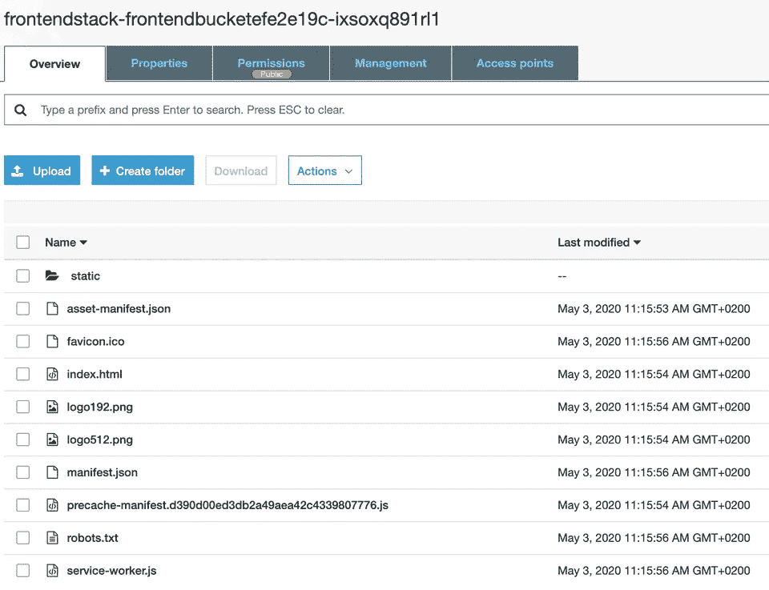
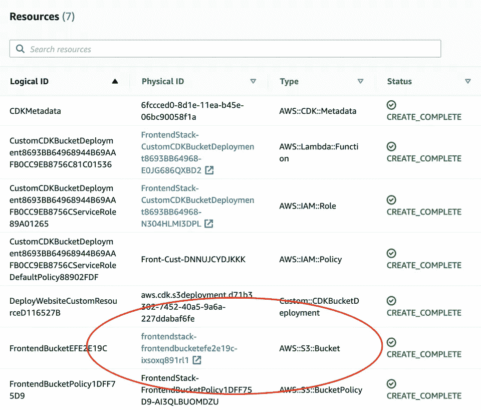

# 像专家一样将快速、静态的网站部署到 AWS

> 原文：<https://levelup.gitconnected.com/deploy-fast-static-website-to-aws-like-a-pro-c635c4e82d6>

在本帖中，我们将看到如何使用 IaC 使用以下技术创建和部署一个静态网站:

*   aws-cdk
*   自动气象站云形成
*   自动气象站λ
*   AWS S3

# 有一个静态网站

为了简单起见，我们将在名为`my-project`的目录中使用 [Create React App](https://create-react-app.dev/docs/adding-typescript/) :

```
cd my-project 
npx create-react-app frontend --template typescript
```

使用以下内容在`frontend/build`目录中创建静态网站内容:

# 将 aws-cdk 添加到项目中

使用 [aws-cdk](https://docs.aws.amazon.com/cdk/latest/guide/home.html) 创建基础设施项目:

```
mkdir infrastructure && cd infrastructure 
npx cdk init --language typescript
```

请注意，为了进行部署，您需要配置 AWS API 凭证。我更喜欢使用 AWS 配置文件，您可以使用 AWS CLI 设置它:

```
aws configure --profile my-profile-name
```

该命令将询问您几个问题。请在 [AWS Web 控制台 IAM 部分](https://console.aws.amazon.com/iam/home?region=eu-central-1)中找到您的 AWS 帐户的 AWS 访问密钥 Id 和 AWS 秘密访问密钥。AWS CLI 将配置存储在`~/.aws` (Linux 或 Mac)或`%USERPROFILE%\.aws` (Windows)下。

请遵循 aws-cdk [入门](https://docs.aws.amazon.com/cdk/latest/guide/getting_started.html)获取更多详细信息。

# 将静态内容部署部署到 S3 网站

我们将使用`@aws-cdk/aws-s3-deployment`包将静态内容部署到 AWS。我们需要将它添加到我们的项目中:

```
cd infrastructure 
npm i --save @aws-cdk/aws-s3-deployment
```

接下来，让我们告诉 aws-cdk 将`frontend/build`目录的内容部署到 aws。在我们的模板中,`lib/infrastructure-stack.ts`下有`InfrastructureStack`。因为更集中的 CloudFormation 堆栈更有意义，所以我们将其重命名为`FrontendStackStack`。

我们的静态内容包含的所有文件都将存储在 S3 上，因此我们需要在那里创建一个 bucket:

接下来，我们需要告诉`@aws-cdk/aws-s3-deployment`将`frontent/build`的内容推送到上面创建的桶中:

由于我们的 aws-cdk 堆栈使用资产，因此我们需要在第一次**部署之前引导我们的 aws 帐户:**

```
cd infrastructure 
AWS_PROFILE=my-profile-name npx cdk bootstrap
```

一旦上述命令完成，我们现在可以最终部署我们的网站:

```
cd infrastructure 
AWS_PROFILE =my-profile-name npm run cdk deploy
```

该命令将在创建必要的安全规则之前提示确认。您将看到在命令运行时创建或修改了哪些资源。之后，所有创建的资源都是 AWS CloudFormation `FrontendStack`堆栈的一部分。最重要的是，该命令将所有文件复制到 S3 桶，从而可以托管网站。



你会发现在自动气象站云形成堆栈中创建的 S3 桶:



您的网站现在可以在类似如下的 URL 下访问:

`[http://frontendstack-frontendbucketefe2e19c-ixsoxq891rl1.s3-website.eu-central-1.amazonaws.com/](http://frontendstack-frontendbucketefe2e19c-ixsoxq891rl1.s3-website.eu-central-1.amazonaws.com/)`

# 用 CloudFront 提高静态网站的性能

该网站直接从 S3 水桶加载文件。默认情况下，S3 存储桶位于一个 AWS 区域内，这意味着来自远方的访问者可能会遭受低于标准的加载速度。

对于生产设置，我们可以使用 AWS CloudFront CDN，它将我们的内容分布在全球 100 多个地方。用`@aws-cdk/aws-s3-deployment`解决这个问题易如反掌:

用`AWS_PROFILE=my-profile-name npm run cdk deploy`更新堆栈后，您会发现创建了一个新的 CloudFront 发行版。请注意，这可能需要几分钟才能完成。我们添加了`CfnOutput`,以便更容易找到 CloudFront 发行版自动生成的域名。

```
Outputs: FrontendStack.DistributionDomainName = d3a9wcc4fxw2d.cloudfront.net
```

现在静态网站使用全球内容交付网络！

你可以在 Github 库中找到这篇文章[中使用的完整例子](https://github.com/miensol/miensol.github.io/tree/develop/content/posts/fast-static-website-with-aws-cdk)

*原发布于*[*https://mien sol . pl*](https://miensol.pl/fast-static-website-with-aws-cdk/)*。*