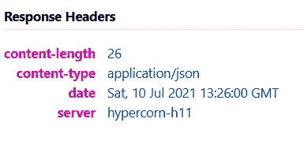

# 使用 Hypercorn HTTP/2 ASGI 部署 FastAPI

> 原文：<https://levelup.gitconnected.com/deploy-fastapi-with-hypercorn-http-2-asgi-8cfc304e9e7a>

## 另一个支持 HTTP/2 和 HTTP/3 规范的 ASGI web 服务器


作者图片

我已经介绍了相当多的关于 FastAPI 的教程，在这些教程中，服务器是用 Uvicorn 部署的，Uvicorn 是一种快速的 ASGI web 服务器。在撰写本文时，Uvicorn 目前只支持 HTTP/1.1 和 WebSockets。根据官方文档，对 HTTP/2 的支持是计划中的，但是没有估计完成的时间。

HTTP/2 是旧 HTTP/1 的继承者，它减少了延迟，同时保持了相同的高级语义(方法、头字段、状态代码等)。基于维基百科，它通过以下方式改善网页加载:

*   [数据压缩](https://en.wikipedia.org/wiki/Data_compression)的 [HTTP 头](https://en.wikipedia.org/wiki/HTTP_header)
*   [HTTP/2 服务器推送](https://en.wikipedia.org/wiki/HTTP/2_Server_Push)
*   [请求的流水线](https://en.wikipedia.org/wiki/HTTP_pipelining)
*   修复 HTTP 1.x 中的[行首阻塞](https://en.wikipedia.org/wiki/Head-of-line_blocking)问题
*   [在单个](https://en.wikipedia.org/wiki/Multiplexing) [TCP](https://en.wikipedia.org/wiki/Transmission_Control_Protocol) 连接上复用多个请求

本文介绍了使用另一个名为 Hypercorn 的 ASGI web 服务器为 HTTP/2 部署 FastAPI 服务器。告诉你吧，超级角是

> …一个基于 sans-io hyper、 [h11](https://github.com/python-hyper/h11) 、 [h2](https://github.com/python-hyper/hyper-h2) 和 [wsproto](https://github.com/python-hyper/wsproto) 库并受 Gunicorn 启发的 [ASGI](https://github.com/django/asgiref/blob/master/specs/asgi.rst) web 服务器。Hypercorn 支持 HTTP/1、HTTP/2、WebSockets(通过 HTTP/1 和 HTTP/2)、ASGI/2 和 ASGI/3 规范。Hypercorn 可以使用 asyncio、uvloop 或 trio 工人类型。

让我们继续下一部分，开始安装必要的模块。

# 设置

强烈建议您在继续安装之前创建一个虚拟环境。激活虚拟环境，并通过`pip install`继续安装必要的软件包。

## FastAPI

运行以下命令安装 FastAPI:

```
pip install fastapi
```

## 超角

按照以下步骤安装 Hypercorn:

```
pip install hypercorn
```

# 履行

在本节中，您将学习编写一个简单的 FastAPI 脚本，并使用 Hypercorn 运行它。

## FastAPI 服务器

让我们用下面的代码在同一个工作目录中创建一个名为`myapp.py`的新 Python 文件:

```
from fastapi import FastAPIapp = FastAPI()@app.get("/")
async def root():
    return {"message": "Hello world!"}
```

## 使用 Hypercorn 部署

接下来，在终端运行以下命令来启动您的服务器。默认情况下，它将作为端口`8000`上的`localhost`运行。

```
hypercorn myapp:app
```

与 Uvicorn 类似，Hypercorn 使用以下语法

```
hypercorn <module_name>:<variable_name>
```

*   `module_name` —模块的名称(文件名)
*   `variable_name` —为 FastAPI 定义的变量的名称

## 绑定到特定地址

然而，配置或可用选项与 Uvicorn 相比有很大不同。例如，您必须使用`bind`选项来指定主机和端口，如下所示:

```
# Hypercorn
hypercorn myapp:app --bind 0.0.0.0:8080# Uvicorn
uvicorn myapp:app --host 0.0.0.0 --port 8080
```

## 绑定到多个地址

事实上，您可以将它绑定到多个服务器，并同时为它们提供服务。当您需要同时在 IPv4 和 IPv6 上为服务器提供服务时，这非常有用。例如:

```
hypercorn myapp:app --bind "0.0.0.0:5000" --bind "[::]:5000"
```

## 其他配置选项

此外，在命令行中运行 Hypercorn 时，也可以使用以下选项。

*   `--access-logformat` —访问日志的日志格式，参见[日志](https://pgjones.gitlab.io/hypercorn/how_to_guides/logging.html#how-to-log)。
*   `--access-logfile` —用于访问日志的目标记录器，使用`-`用于标准输出。
*   `--backlog`—挂起连接的最大数量。
*   `--ca-certs`—SSL CA 证书文件的路径。
*   `--certfile`—SSL 证书文件的路径。
*   `--cipher` —用于 SSL 设置的密码。
*   `--debug` —启用调试模式，即额外记录和检查。
*   `--error-logfile --log-file` —错误日志的目标位置，用于 stderr。
*   `--graceful-timeout` —在 SIGTERM 或 Ctrl-C 之后等待任何剩余请求(任务)完成的时间。
*   `--keep-alive` —关闭前保持非活动连接活动的秒数。
*   `--keyfile`—SSL 密钥文件的路径。
*   `--log-config` —一个 Python 日志记录配置文件。
*   `--log-level` —(错误)日志级别。
*   `--pid` —写入 PID(程序 ID)的位置。
*   `--reload`—启用代码更改时的自动重新加载。
*   `--worker-class` —要使用的工人类型。选项包括 asyncio、uvloop(需要`pip install hypercorn[uvloop]`)和 trio(需要`pip install hypercorn[trio]`)。
*   `--workers`—要繁殖和使用的工蜂数量。

## 结果

假设您已经运行了以下命令:

```
hypercorn myapp:app
```

当您运行它时，应该会在控制台得到以下输出:

```
[2021-07-10 21:24:19 +0800] [5464] [INFO] Running on [http://127.0.0.1:8000](http://127.0.0.1:8000) (CTRL + C to quit)
```

打开浏览器，在控制台中转到以下 URL 提示:

```
[http://localhost:8000/](http://localhost:8000/)
```

输出应该如下所示:

```
{"message":"Hello world!"}
```

但是，响应头中指示的服务器是 hypercorn-h11，它引用 HTTP/1.1



作者图片

这主要是因为 HTTP/2 需要强制加密。即使你是以`localhost`的名义经营，你也必须提供证书。

## 生成自签名证书

让我们使用 rsa 创建一个为期 365 天的临时自签名证书。在命令行中运行以下命令:

```
openssl req -x509 -newkey rsa:4096 -keyout key.pem -out cert.pem -days 365 -nodes
```

如果您在读取`openssl.cnf`文件时遇到如下问题:

```
Can't open .../openssl.cnf for reading. No such file or directory
```

这仅仅意味着它很难找到配置文件。如果您已经安装了 openssl 附带的 Git，只需使用`-config`选项将它指向`openssl.cnf`位置。例如:

```
openssl req -x509 -newkey rsa:4096 -keyout key.pem -out cert.pem -days 365 -nodes -config "C:\Program Files\Git\usr\ssl\openssl.cfg"
```

它将生成两个新文件:

*   key.pem
*   cert.pem

接下来，将这两个文件放在与 myapp.py 相同的目录中，并使用`--keyfile`和`--certfile`命令运行它:

```
hypercorn --keyfile key.pem --certfile cert.pem myapp:app
```

在您的浏览器上，重新加载页面，但这次使用 https:

```
[https://localhost:8000/](https://localhost:8000/)
```

它应该提示一个警告页面指出(如果您使用自签名证书，这是正常的):

```
localhost:8000 uses an invalid security certificate.

The certificate is not trusted because it is self-signed.
```

接受风险并转到请求的 URL。您应该得到以下响应头:


作者图片

`hypercorn-h2`表示服务器正在运行 HTTP/2。对于生产服务器，建议使用有效的证书。您可以使用[让我们加密](https://letsencrypt.org/)为您的网站获取免费证书。

# 结论

让我们回顾一下你今天所学的内容。

本文首先简要解释了 HTTP/2。它还介绍了对 Uvicorn 和 Hypercorn ASGI 服务器的 HTTP/2 支持。

然后，通过`pip install`进入安装过程。

接着是 FastAPI 服务器的标准样板文件，并在本地主机上运行。除此之外，还介绍了使用 Hypercorn 部署 FastAPI 服务器时可用的配置。

本教程还包括一个关于生成自签名证书的简单部分，因为 HTTP/2 在部署期间需要强制证书。

感谢你阅读这篇文章。请随意查看我的其他文章。祝你有美好的一天！

# 参考

1.  [FastAPI —手动部署](https://fastapi.tiangolo.com/deployment/manually/)
2.  [Hypercorn — Gitlab](https://gitlab.com/pgjones/hypercorn)
3.  [Hypercorn —文档](https://pgjones.gitlab.io/hypercorn/)
4.  [HTTP2 —维基百科](https://en.wikipedia.org/wiki/HTTP/2)