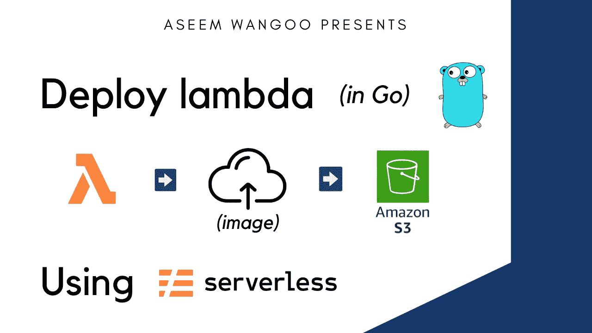
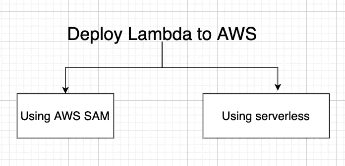
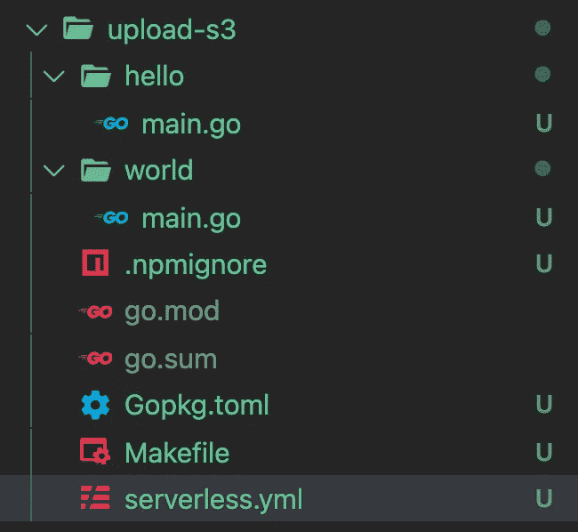
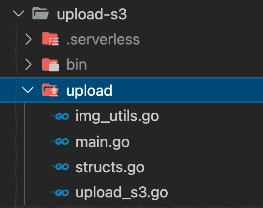
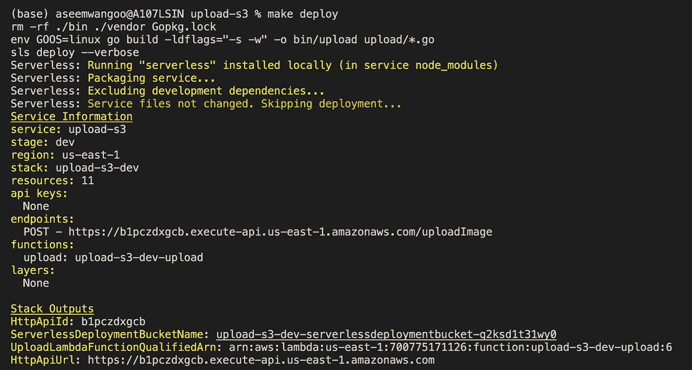
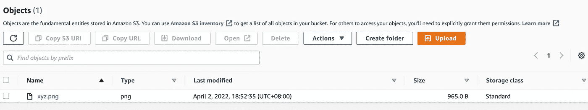

# 使用无服务器部署 lambda

> 原文：<https://levelup.gitconnected.com/deploy-lambda-using-serverless-a44a66f3d603>

*使用无服务器部署 lambda*

*文章在此:*[*https://flatteredwithfutter . com/deploy-lambda-using-server less/*](https://flatteredwithflutter.com/deploy-lambda-using-serverless/)

使用无服务器部署 lambda

我们将简要介绍:

1.  部署 lambda 的选项
2.  设置无服务器
3.  使用无服务器创建 lambda(将映像上传到 s3 存储桶)
4.  使用无服务器部署 lambda

> 注意:本文假设读者已经设置了 [AWS cli](https://docs.aws.amazon.com/cli/latest/userguide/install-cliv2-mac.html) 并且了解 golang



使用无服务器部署 lambda

# 部署 lambda 的选项

在撰写本文时，有两种方式将 lambdas 部署到 AWS 上



使用无服务器部署 lambda

*   [**使用 AWS SAM**](https://docs.aws.amazon.com/serverless-application-model/latest/developerguide/what-is-sam.html)

AWS 无服务器应用程序模型(AWS SAM)是一个开源框架，可以用来在 AWS 上构建无服务器应用程序

**SAM** 的主要好处之一是**本地调试和测试**

它允许您在本地构建、测试和调试由 AWS SAM 模板定义的无服务器应用程序。它通过提供与实际 Lambda 执行环境的对等性来帮助您提前发现问题

*   [**使用无服务器**](https://www.serverless.com/)

通过使用无服务器框架，以极低的开销和成本开发、部署、故障排除和保护您的无服务器应用程序。无服务器框架由一个开源 CLI 组成。

无服务器允许我们专注于代码，而它负责设置策略，并在 AWS 上提供所需的基础设施。

# 设置无服务器

要安装`serverless`，请按此处的[安装](https://www.serverless.com/framework/docs/getting-started)。就个人而言，我使用下面的配置

```
npm install -g serverless
```

*   安装完成后，您可以在终端上输入`sls`来访问它
*   我们现在可以通过这个命令访问多个模板

```
sls create --help
```

我们将把重点放在 Go 特有的一个上，也就是`aws-go-dep`让我们使用这个模板来创建一个简单的 lambda。最后的命令是

```
sls create --template aws-go-dep --path upload-s3
```

`--template`用于指定模板名称

`--path` **(可选)**用于指定放置代码的目录

*   我们应该会看到这样的文件夹结构



Golang 无服务器文件夹结构

*   默认情况下，`aws-go-dep` a 模板为我们提供了两个基于`http (GET)`的端点，这可以在`serverless.yml`中看到

```
functions:
  hello:
    handler: bin/hello
    events:
      - httpApi:
          path: /hello
          method: get
  world:
    handler: bin/world
    events:
      - httpApi:
          path: /world
          method: get
```

等效文件对应于`hello/main.go`和`world/main.go`

*   如果您看到错误，请尝试运行以下命令

```
go mod init <SOME NAME HERE>go mod tidy
```

这将有助于设置任何 go 程序所需的`go.mod`。

# 使用无服务器创建 lambda(将映像上传到 s3 存储桶)

我们将修改我们的 lambda 来上传图像到 S3 桶。

*   我们从`serverless.yml`中删除不必要的端点，以及不需要的文件夹，如`hello/main.go`和`world/main.go`
*   创建一个名为`upload`的新文件夹，并在其中创建一个文件`main.go`



我们最终上传的 lambda 结构

*   我们将定义一个请求体结构，它将接受`filename`和`body`作为输入。(注意:主体将是图像的 base64 编码器)

> 要获取任何图像的 base64，[查看此处](https://base64.guru/converter/encode/image)

```
type ImageRequestBody struct {
 FileName string `json:"filename"`
 Body     string `json:"body"`
}
```

*   我们将从输入中解析主体，并使用返回由 base64 字符串表示的字节的`DecodeString`对其进行解码

```
decoded, err := base64.StdEncoding.DecodeString(bodyRequest.Body)
```

*   我们所有与图像相关的函数都在 [img_utils.go](https://github.com/AseemWangoo/golang-programs/blob/master/upload-s3/upload/structs.go) 里面。在前一步将图像解码成字节后，我们现在获取这些字节并形成一个临时文件。

```
func imageUpload(data []byte) { tmpFileName := fmt.Sprintf(`/tmp/%s`, bodyRequest.FileName) fileErr := ioutil.WriteFile(tmpFileName, []byte(data), 0644)

  // CALL THE UPLOAD FUNCTION
  UploadImage(tmpFileName)
}
```

在第一行，我们在位置`tmp`指定文件。根据 AWS 文档，这是一个重要的步骤

> Lambda 执行环境为您的代码在/ **tmp** 提供了一个文件系统。该空间的固定大小为 512 MB。每次创建新的执行环境时，都会删除这个区域。

接下来，我们使用`WriteFile`用字节写文件

> **WriteFile** 将数据写入文件名命名的文件。如果文件不存在，WriteFile 用 perm 权限创建它(在 umask 之前)；否则，WriteFile 会在写入前截断它，而不更改权限。

现在我们已经创建了临时文件！

*   现在，我们将上传文件，到自动气象站 S3 桶。为此，我们将使用 [AWS GO SDK](https://github.com/aws/aws-sdk-go) ，如果您没有安装它，请遵循以下步骤

```
go get github.com/aws/aws-sdk-go
```

我们将把我们的文件传递给[上传函数](https://github.com/AseemWangoo/golang-programs/blob/master/upload-s3/upload/upload_s3.go)

```
func uploadToS3Bucket(file io.Reader, fileName string) { bucketName := os.Getenv("bucket_name")
 region := "us-east-2" conf := aws.Config{Region: &region}
 sess, _ := session.NewSession(&conf)
 uploader := s3manager.NewUploader(sess) upParams := &s3manager.UploadInput{
   Bucket: &bucketName,
   Key:    &fileName,
   Body:   file,
 } result, err := uploader.Upload(upParams)
}
```

*   我们需要使用`aws.Config`来指定区域。在我们的情况下，它是美国东部 2。

`session.Newsession`返回从 SDK 默认值、配置文件、环境和用户提供的配置文件创建的新会话。

`aws-sdk-go`给了我们`s3Manager`，这有助于上传文件。它吸收了

`Bucket`:你的 AWS 桶名，在我的例子中我从`serverless.yml` 环境变量中得到

`Key`:PUT 动作启动的对象键。在我们的例子中，它是文件名。

`Body`:要发送到 S3 的主体有效载荷是什么。在我们的例子中，它是文件本身

*   最后，使用上面的参数，我们调用`Uploader.Upload`
*   我们将来自`main.go`的响应返回给调用者。

# 使用无服务器部署 lambda

到目前为止，我们一直在创建我们的 lambda，但现在是时候将它部署到 AWS 上了。

*   让我们重温一下我们的`serverless.yml`并做一些改变

```
functions:
  upload:
    handler: bin/upload
    events:
      - httpApi:
          path: /uploadImage
          method: post
```

我们为 lambda 添加了后端点`uploadImage`

*   接下来，因为我们在 lambda 内部使用 S3 桶，所以我们将添加一些 IAMRoleStatements

```
custom:
  s3Bucket: test-bucket--aseem

iamRoleStatements:
    - Effect: Allow
      Action:
        - s3:*
      Resource: "arn:aws:s3:::${self:custom.s3Bucket}/*"
```

这使用`s3Bucket`指定了存储桶名称，并允许在该存储桶上执行操作

*   最后，为了指定环境变量，我们利用

```
environment:
    bucket_name: test-bucket--aseem
```

*   我们将创建一个`[Makefile](https://github.com/AseemWangoo/golang-programs/blob/master/upload-s3/Makefile)`并放置以下内容

```
.PHONY: build clean deploydeploy: clean build
 sls deploy --verboseremove:
 sls remove
```

这将有助于简化 lambda 部署，只需调用

```
make deploy
```

如果一切都很成功，您应该会看到类似这样的内容



使用无服务器部署 lambda

为了删除 lambda，我们可以调用

```
make remove
```

要测试 lambda，请使用

```
curl -X POST -H "Content-Type: application/json" \
-d '{"filename": "xyz.png", "body": "BASE_64_ENCODING_OF_AN_IMAGE"}' \
<YOUR_LAMBDA_URL>
```



图片上传到 S3

其他文章:

[](/using-kafka-in-2022-f22602830e09) [## 在 2022 年使用卡夫卡

### 在 2022 年使用卡夫卡

在 2022levelup.gitconnected.com 使用卡夫卡](/using-kafka-in-2022-f22602830e09) [](https://medium.com/flutter-community/dart-on-aws-lambda-3a46aad38335) [## AWS Lambda 上的 Dart

### AWS Lambda 上的 Dart

AWS Lambdamedium.com 上的 Dart](https://medium.com/flutter-community/dart-on-aws-lambda-3a46aad38335) [](/deploy-react-and-aws-amplify-1db36c625d73) [## 部署 React 和 AWS Amplify

### 部署 React 和 AWS Amplify

部署 React 和 AWS Amplifylevelup.gitconnected.com](/deploy-react-and-aws-amplify-1db36c625d73) 

```
[Source Code](https://github.com/AseemWangoo/golang-programs/tree/master/upload-s3)
```