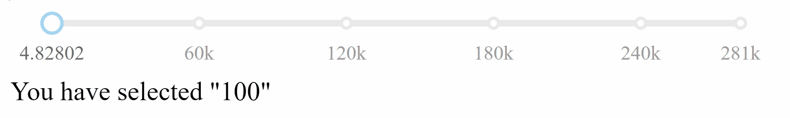
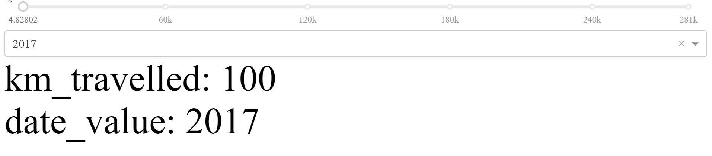
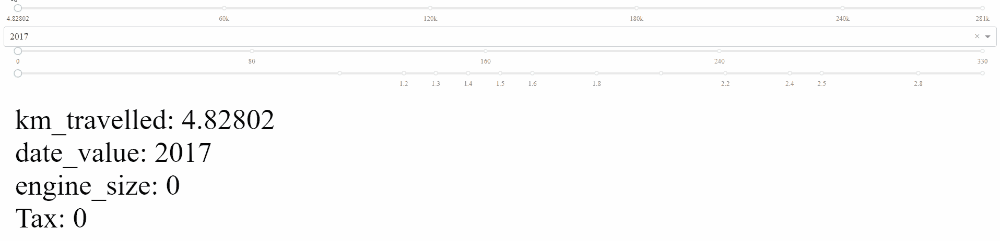
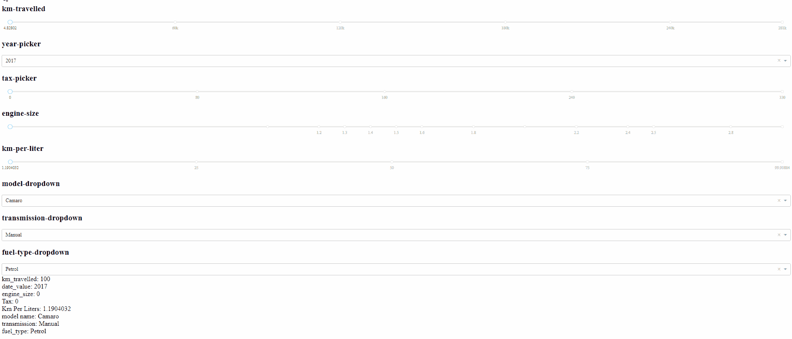
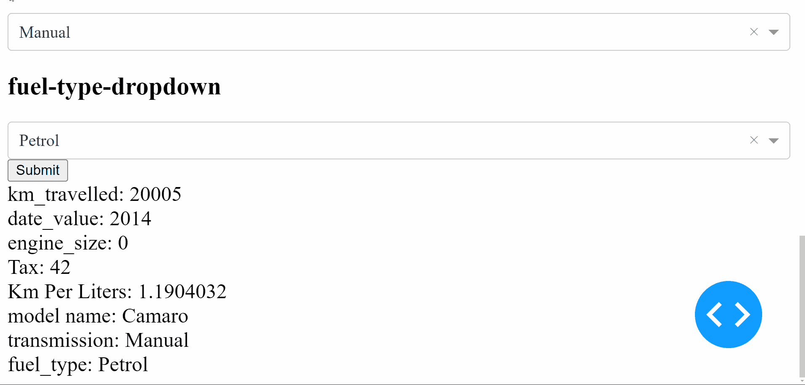
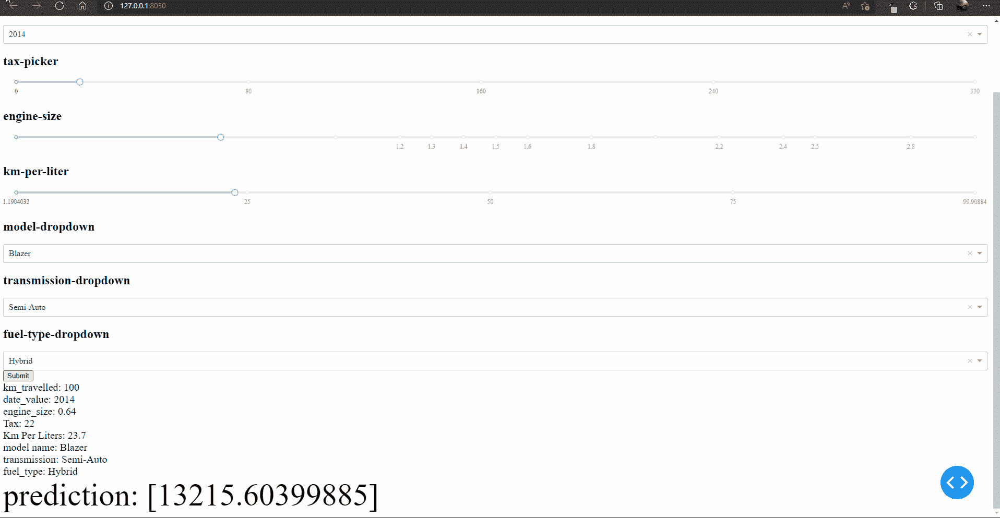
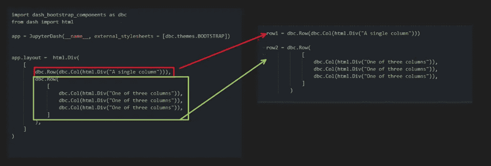
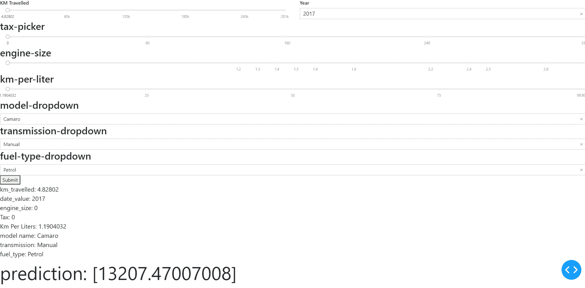
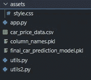

# 部署一个 ML 项目作为带有 Google 认证的仪表板

> 原文：<https://levelup.gitconnected.com/deploy-ml-project-as-dashboard-with-google-authentication-14fee8c6988c>

## 将机器学习算法作为一个应用程序部署在互联网上，增加了 google 身份验证的安全性。


杰里米·贝赞格在 [Unsplash](https://unsplash.com?utm_source=medium&utm_medium=referral) 上的照片

这个项目是整个项目的第二部分，第一部分在

[https://siddharth 1 . medium . com/loading-and-extraction-83 fedad 258 f 0](https://siddharth1.medium.com/loading-and-extraction-83fedad258f0)

本文的代码可以在

[kshiragarsiddharth/plotly _ dash _ dashboard _ for _ car _ prediction(github.com)](https://github.com/kshirsagarsiddharth/plotly_dash_dashboard_for_car_prediction/tree/master)

## 我们需要为所有 8 个输入列创建核心组件

让我们从 km _ travelled 开始。我将为每一列创建一个核心组件，并逐步展示所采取的步骤。最后，我将把这个应用程序部署为 python 脚本

该应用程序最终将如何工作

## 应用程序最终会是什么样子


## 1.km _ travelled 的核心组件



## 2.模型年份的核心组件



## 3.发动机尺寸和税收的核心部件



## 将剩余的柱作为构件添加



## 现在所有的核心组件都准备好了，在添加模型来执行预测之前，我们在这个方法中遇到了一个问题。

1.  在上面的代码中，只要输入描述的任何属性发生变化，就会触发回调函数。
2.  通过在上面的输入中输入数据，自己尝试一下。为了解决这个问题，我们将使用 State，它允许您传递额外的值，而不触发回调。
3.  这里有一个与上面相同的例子，但是使用了 dcc。作为状态的输入组件和作为输入的新按钮组件。换句话说，我们希望只有在单击提交按钮时才调用机器学习算法。

仔细看 gif，只有当我们点击提交键时，组件才会更新



## 既然我们已经获得了所有的输入，让我们加载模型并实时预测价格



## 最后，该应用程序正在工作，让我们使用 dash 引导组件使这个应用程序真正美丽

注意:这标志着仪表板框架的结束，从现在开始我们将只改进仪表板的外观

## Dash 引导组件最小示例

## 现在我们运行与上面相同的代码，不同的是我们将输入存储到一个变量中，让我们将 div 的元素替换到变量中。

让我用下图来说明这一点



## 让我们将上述应用程序转换为引导组件的行和列，并使用变量替换这些行，

1.  为此，我创建了两个文件，一个是 utils.py，另一个是 app.py。在 utils 中，我定义了 row1，在 app.py 中，我导入了该行。
2.  在下面的代码中，只有一个组件被转换成 dbc 行。

注意:请通过 python 脚本创建 2 个文件来运行代码，并取消对`utils import row1,row2`代码的注释

```
```
# utils.py 

import pandas as pd
from dash import dcc, html
import dash_bootstrap_components as dbc
import numpy as np

df = pd.read_csv('car_price_data.csv').drop('Unnamed: 0', axis=1)

row1 = dbc.Row([
    dbc.Col(html.H5('KM Travelled')),
    dbc.Col(dcc.Slider(
        min=df['km_traveled'].min(),
        max=df['km_traveled'].max(),
        value=100.0,
        id='km-travelled-slider',
        tooltip={"placement": "bottom"}
    )),
    dbc.Col(html.H5('Pick Car Year')),
    dbc.Col(dcc.Dropdown(
        id='year-picker',
        options=np.sort(df['year'].unique()),
        value=2017
    ))
])# app.py
from datetime import date
import joblib
from jupyter_dash import JupyterDash
from utils import row1
loaded_model = joblib.load('final_car_prediction_model.pkl')
app = JupyterDash(__name__, external_stylesheets = [dbc.themes.BOOTSTRAP])
app.layout = html.Div([
   row1,

    html.H2('tax-picker'),
    dcc.Slider(
        min=df['tax'].min(),
        max=df['tax'].max(),
        value=df['tax'].min(),
        id='tax-slider',
        tooltip={"placement": "bottom"}
    ),
    html.H2('engine-size'),
    dcc.Slider(
        min=df['engineSize'].min(),
        max=df['engineSize'].max(),
        value=df['engineSize'].min(),
        id='engine-size-slider',
        marks={i: str(i) for i in np.sort(df['engineSize'].unique())},
        tooltip={"placement": "bottom"}
    ),

    html.H2('km-per-liter'),
    dcc.Slider(
        min=df['km_per_liters'].min(),
        max=df['km_per_liters'].max(),
        value=df['km_per_liters'].min(),
        id='km-per-liters-slider',
        tooltip={"placement": "bottom"}
    ),

    html.H2('model-dropdown'),
    dcc.Dropdown(
        id='model-dropdown',
        options=np.sort(df['model'].unique()),
        value=df['model'][0]
    ),
    html.H2('transmission-dropdown'),
    dcc.Dropdown(
        id='transmission-dropdown',
        options=np.sort(df['transmission'].unique()),
        value=df['transmission'][0]
    ),

    html.H2('fuel-type-dropdown'),
    dcc.Dropdown(
        id='fuel-type-dropdown',
        options=np.sort(df['fuel_type'].unique()),
        value=df['fuel_type'][0]
    ),
    html.Button(id='submit-button-state', n_clicks=0, children='Submit'),

    html.Div([
        html.Div(id='km-travelled-slider-output',
                 children=[html.P('km-travelled-slider-output'), ]),
        html.Div(id='year-picker-output'),
        html.Div(id='engine-size-slider-output'),
        html.Div(id='tax-slider-output'),
        html.Div(id='km-per-liters-slider-output'),
        html.Div(id='model-dropdown-output'),
        html.Div(id='transmission-dropdown-output'),
        html.Div(id='fuel-type-dropdown-output'),
        html.Div(id='prediction', style={'font-size':'60px'})
    ], style={'font-size': '20px'})

])

@app.callback(
    Output('km-travelled-slider-output', 'children'),
    Output('year-picker-output', 'children'),
    Output('engine-size-slider-output', 'children'),
    Output('tax-slider-output', 'children'),
    Output('km-per-liters-slider-output', 'children'),
    Output('model-dropdown-output', 'children'),
    Output('transmission-dropdown-output', 'children'),
    Output('fuel-type-dropdown-output', 'children'),
    Output('prediction', 'children'),

    Input('submit-button-state', 'n_clicks'),
    State('km-travelled-slider', 'value'),
    State('year-picker', 'value'),
    State('engine-size-slider', 'value'),
    State('tax-slider', 'value'),
    State('km-per-liters-slider', 'value'),
    State('model-dropdown', 'value'),
    State('transmission-dropdown', 'value'),
    State('fuel-type-dropdown', 'value')
)
def update_output(n_clicks, km_travelled, date_value, engine_size, tax_value, km_per_liters, model_name, transmission, fuel_type):
    prediction = loaded_model.predict(pd.DataFrame(
        data=[[str(date_value), km_travelled, tax_value, engine_size,
               km_per_liters, model_name, transmission, fuel_type]],
        columns=joblib.load('column_names.pkl')))

    return (f"km_travelled: {km_travelled}",
            f"date_value: {date_value}",
            f"engine_size: {engine_size}",
            f"Tax: {tax_value}",
            f"Km Per Liters: {km_per_liters}",
            f"model name: {model_name}",
            f"transmission: {transmission}",
            f"fuel_type: {fuel_type}",
            f"prediction: {prediction}"
            )

# app.run_server(mode="inline")
app.run_server()Dash app running on [http://127.0.0.1:8050/](http://127.0.0.1:8050/)
```



**接下来，我想要一些关于用户实时输入什么值的视觉反馈，所以我对不同的输入使用不同的功能。并且通过输出组件捕捉每个输入的视觉反馈。**

1.  我使用 dash daq 作为输入组件的可视化输出
2.  Dash DAQ 包括一套强大的控制装置，使数据采集和控制集成到您的 Dash 应用程序变得更加简单。

在下面的代码中，我定义了将直接从输入核心组件读取并显示实时输出的组件，这就是为什么我需要为每个组件创建单独的回调。

## 每个组件输出的各自回调

## app 的最终结构

在 GitHub 找到最终实现的代码这是该应用程序的外观



## 添加 Google 和 github Oauth

(文章来了，但代码在)

[kshiragarsiddharth/prediction _ with _ security(github.com)](https://github.com/kshirsagarsiddharth/prediction_with_security/tree/master)

## Heroku 的部署

未完待续……