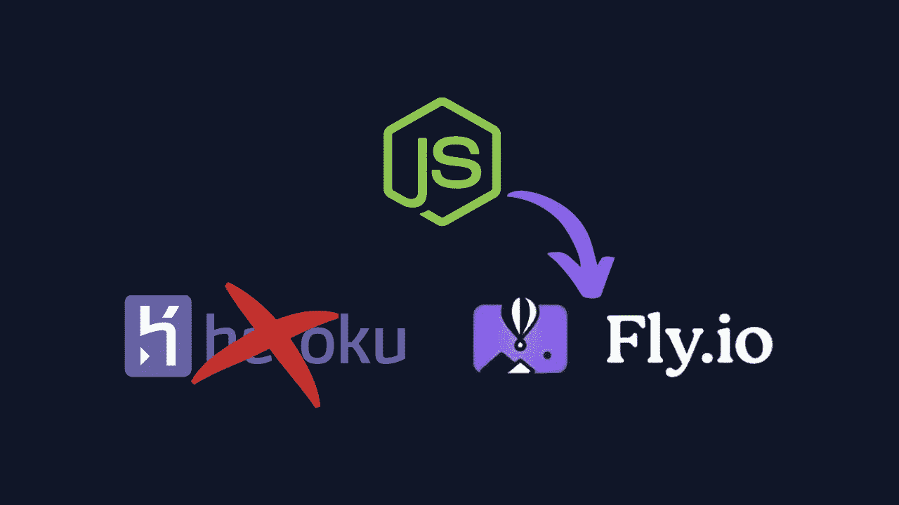
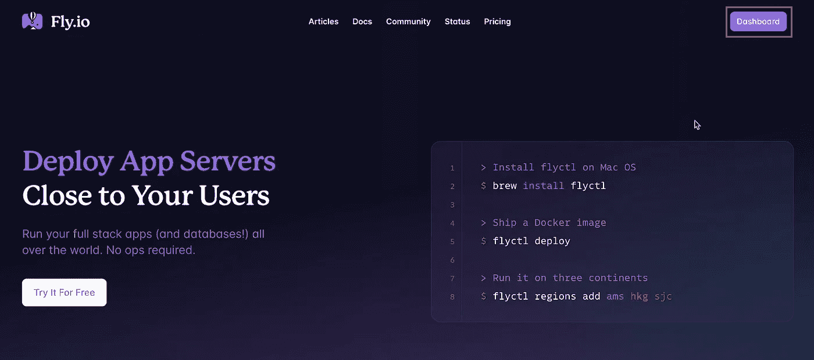
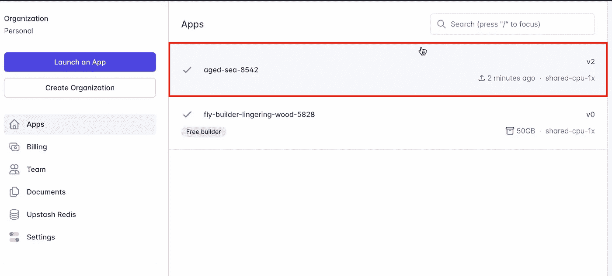
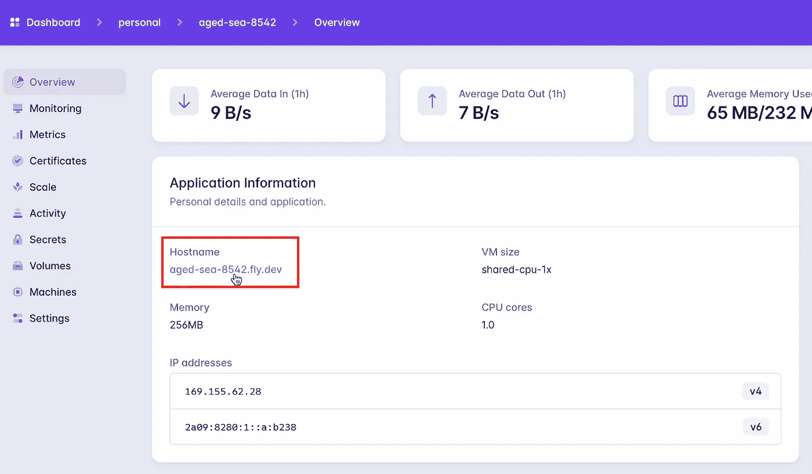
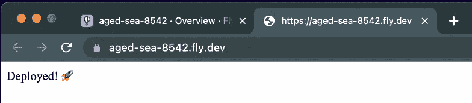

# 将 Node.js 应用程序部署到 Fly.io

> 原文：<https://levelup.gitconnected.com/deploy-node-js-app-to-fly-io-fb0f7ea9c13a>



# 介绍

在本文中，我们将通过 3 个简单的步骤将 Node.js 应用程序部署到 [Fly.io](https://fly.io/) 中。Fly.io 是一个与 Heroku 非常相似的托管平台，使用他们的 CLI 部署应用程序非常容易。

他们有免费限额，如果你的应用程序没有超过你在这里看到的这些限制，你可以免费使用他们的服务。

## 免费津贴

所有计划中免费包含的资源:

*   多达 3 个共享 cpu-1x 256mb 虚拟机
*   3GB 永久卷存储(总计)
*   160GB 出站数据传输

# 步骤 1:安装 flyctl

打开您想要部署的应用程序，如果您只是想跟进，这里有我的 [simple Node.js 应用程序](https://github.com/hayk-simonyan/basic-express-api)用于演示部署。

要部署我们的应用程序，我们需要做的第一件事是[安装 flyctl](https://fly.io/docs/hands-on/install-flyctl/) ，这是一个用于在 Fly.io 上管理应用程序的 CLI

*   **Mac OS:** 如果你在 Mac OS 上并且安装了 brew，你可以使用这个命令来安装 flyctl
    `brew install flyctl`
    否则，你需要运行一个脚本来安装它
    `curl -L [https://fly.io/install.sh](https://fly.io/install.sh) | sh`
*   **Linux:** 对于 Linux 用户，需要运行这个脚本
    
*   **Windows:** 在 Windows 上运行 Powershell 安装脚本
    

# 步骤 2:注册/登录飞行

下一步是注册或登录 Fly.io。如果您已经有一个帐户，请使用此命令从终端登录

```
flyctl auth login
```

否则，使用注册命令注册并登录

```
flyctl auth signup
```

我还没有帐户，所以我将使用注册命令来创建一个。在你的终端中输入`flyctl auth signup`，使用 GitHub 进行注册。


注册后，它会询问您卡的详细信息，尽管您可以选择免费试用而无需提供信用卡，但部署您的应用程序时需要提供信用卡，因此最好在此处提供信用卡。如果你没有超过他们的免费限额，它根本不会向你收费。

# 步骤 3:部署

注册并提供卡信息或登录后，如果你已经有一个帐户，最后一步是使用 flyctl CLI 部署您的应用程序。

在此之前，[您必须将您的内部端口设置为 8080](https://community.fly.io/t/failed-due-to-unhealthy-allocations/199) ，因为它在 CLI 生成的`fly.toml`文件中被设置为 8080

因此，将端口更新为 8080 并运行 deploy 命令。

```
flyctl launchScanning source code
Detected a Dockerfile app
? Choose an app name (leave blank to generate one):
? Choose a region for deployment: > Miami, Florida (US) (mia)
? Would you like to set up a Postgresql database now? No
? Would you like to set up an Upstash Redis database now? No
? Would you like to deploy now? YesDeploying
...
```

*   如果您有 docker 文件，它将自动检测它，如果您没有，它将检测 Node.js 应用程序并开始部署
*   接下来，它会询问一个应用程序名称，留空它会生成一个名称
*   选择您想要部署的区域，无论哪个离您的用户最近
*   它询问您是否想要设置 Postgresql 或 Redis 数据库—我将选择否
*   您想现在部署吗？是

```
1 desired, 1 placed, 1 healthy, 0 unhealthy [health checks: 1 total, 1 passing]
--> v1 deployed successfully
```

# 验证部署

要验证它是否有效，请转到您的仪表板。选择您刚刚部署的应用程序，并打开主机名下提供的链接。



我们的应用程序已经成功启动并运行

此外，您的代码中可能有环境变量，这些变量可以添加到仪表板中的 secrets 选项卡下。


# 摘要

这就是将您的应用部署到 Fly.io 的全部步骤，对于更复杂的应用，可能需要一些额外的步骤，但过程是相同的，您已经可以使用本指南开始部署了。

## 资源

[部署节点 App](https://fly.io/docs/languages-and-frameworks/node/)
[登录 Fly](https://fly.io/docs/getting-started/log-in-to-fly/)
[安装 flyctl](https://fly.io/docs/hands-on/install-flyctl/)
[Fly.io 定价](https://fly.io/docs/about/pricing/)
[Fly . io 常见问题](https://community.fly.io/t/failed-due-to-unhealthy-allocations/199)
[解决您的部署问题](https://fly.io/docs/getting-started/troubleshooting/)

🔔感谢您阅读并关注更多部署指南