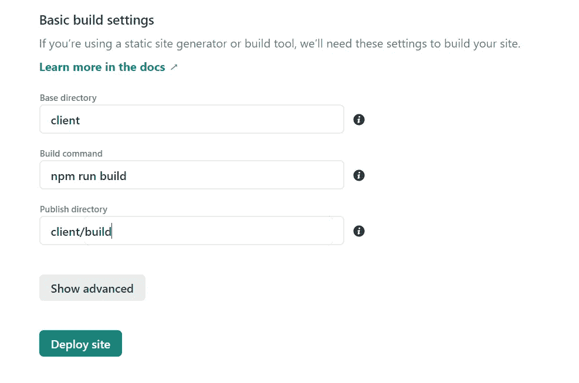

# 在 Heroku 和 Netlify 上部署 Postgres、Express、React 和 Nodejs Fullstack 应用程序

> 原文：<https://levelup.gitconnected.com/deploy-pern-fullstack-app-on-heroku-and-netlify-automatic-deploy-9b61ac6a254e>


丹尼尔·麦金尼斯在 [Unsplash](https://unsplash.com?utm_source=medium&utm_medium=referral) 上的照片

本文将带您了解如何部署具有自动部署功能的 PERN 全栈应用。

# 先决条件

*   [Heroku](https://www.heroku.com/) 账号
*   Heroku CLI
*   净收益账户
*   [PostgreSQL](https://www.postgresql.org/) 数据库

# PERN 是什么？

PERN 堆栈由 **P** ostgreSQL、 **E** xpress、 **R** eact 和 **N** ode 组成。借助 Express.js 框架，PostgreSQL 被用作后端数据库。React.js 作为前端，Node.js 作为后端服务器。

# 部署流程

叉此[库](https://github.com/dhatGuy/yelp-clone-PERN)上手。

看一看提供的代码。有两个文件夹:

*   客户端—包含用 React.js 构建的前端代码，以及
*   服务器——使用 Express.js 开发后端

让我们确保应用程序在本地运行良好。

将目录更改到服务器并安装依赖项

```
cd servernpm install
```

打开新的终端。将目录更改为客户端并安装依赖项

```
cd clientnpm install 
```

## 创建数据库

由于我们使用 PostgreSQL 作为数据库，请确保您已经安装了。

打开您的终端并登录 Postgres

```
psql -U postgres
```

输入`postgres`作为密码。

创建一个名为`yelp`的数据库并连接到它。

```
create database yelp;\c yelp
```

我们只需要两个应用程序表。

创建`restaurants`表

```
CREATE TABLE restaurants ( id BIGSERIAL NOT NULL PRIMARY KEY, name VARCHAR(50) NOT NULL, location VARCHAR(50) NOT NULL, price_range INT NOT NULL check( price_range >= 1 AND price_range <= 5 ));
```

创建第二个表，`reviews`

```
CREATE TABLE reviews ( id BIGSERIAL NOT NULL PRIMARY KEY, restaurant_id BIGINT REFERENCES restaurants(id) ON DELETE CASCADE, name VARCHAR(50) NOT NULL, review TEXT NOT NULL, rating INT NOT NULL check( rating >= 1 AND rating <= 5 ));
```

在`restaurants`表中填充一行。

```
INSERT INTO restaurants(name, location, price_range)VALUES ('Iya Toyosi Canteen', 'Sagamu', 3);
```

## 设置环境变量

将目录切换到服务器文件夹并创建一个`.env`文件。增加以下内容。

```
PG_USER=postgresPG_PASSWORD=postgresPG_HOST=localhostPG_PORT=5432PG_DATABASE=yelpPORT=7000
```

## 启动应用程序

打开您的终端并导航到客户端文件夹。启动客户端。

```
npm start
```

打开一个新终端，导航到服务器文件夹并启动服务器。

```
npm start
```

打开你的浏览器，进入 [http://localhost:3000](http://localhost:3000) 查看应用程序运行情况，如下图所示。你可以拿着它到处玩。


应用程序正在运行

# 服务器部署流程

让我们从在 Heroku 上部署服务器开始。

1.  如果您没有帐户，请访问 Heroku 并创建一个帐户。
2.  安装 [Heroku CLI](https://cli.heroku.com/) 。
3.  安装 CLI 后，打开您的终端并运行`heroku login`命令。要完成登录，系统会提示您输入任意键来导航您的 web 浏览器。然后，CLI 会自动让您登录。
4.  创建新的 Heroku 应用程序

```
heroku create
```

Heroku 将为您的应用程序生成一个随机名称，或者传递一个参数来指定您自己的应用程序名称。

```
heroku create your-app-name
```

输出


应用名称为**诱惑-布莱斯-峡谷-75245，**，查看应用的网址为[**https://alluring-bryce-canyon-75245.herokuapp.com/**](https://alluring-bryce-canyon-75245.herokuapp.com/)**。**放松，还不行。

## 设置 Heroku Postgres 数据库

要创建 Postgres 数据库，请在终端中运行以下命令

```
heroku addons:create heroku-postgresql:hobby-dev --app your-app-name
```

这将创建一个数据库并设置一个`DATABASE_URL`环境变量。


创建数据库后的输出

运行命令`heroku addons`来检查你刚刚创建的新插件。您将看到创建的 Postgres 数据库带有自动生成的名称，例如`postgresql-pointy-04867`

```
nameless-journey-88760  postgresql-pointy-04867  heroku-postgresql:hobby-dev  free   created
```

要在 Postgres 数据库中创建表，请登录 Heroku 数据库

```
heroku pg:psql database-name  --app your-app-name
```

复制并粘贴`server/config/db.sql`中的内容，创建两个表格并插入一行。


> 不要忘记用你自己的 Heroku 信息替换数据库名称和应用程序名称。

## 在本地测试应用程序。

奔跑

```
heroku local web
```

运行这个将向您展示它将如何在 Heroku 上运行。打开[http://localhost:7000/API/v1/restaurants](http://localhost:7000/api/v1/restaurants)查看本地运行的 app。

## 部署服务器

最后，是时候在 Heroku 上部署服务器了。

打开你的终端。从项目的根文件夹中，运行以下命令

```
heroku git:remote -a alluring-bryce-canyon-75245
```

你可以用任何东西代替`alluring-bryce-canyon-75245`，最好是你的 Heroku 应用名称。

要推送代码，特别是服务器文件夹，运行

```
git subtree push --prefix server heroku main
```

服务器现在应该已经启动并运行了。访问[https://your-heroku-app-name/API/v1/restaurants](https://alluring-bryce-canyon-75245.herokuapp.com/api/v1/restaurants)

## 从子文件夹自动部署服务器

由于我们的项目有两个文件夹，服务器和客户端，我们可以让 Heroku 知道通向服务器文件夹的路径。我们不必每次想要部署服务器时都运行上面的命令。

*   进入 Heroku 仪表盘并选择你正在使用的应用程序
*   单击设置选项卡。您将看到配置变量部分。点击显示变量。


*   用`PROJECT_PATH`设置带有占位符键的输入，用`server`设置带有占位符值的输入，并点击添加。
*   仍然在 Settings 选项卡上，您必须添加一个 Buildpack 来指示 Heroku 定位您的文件夹。
*   在 Config Vars 部分下，您将看到 Buildpack 部分。点击 add Buildpack 并输入[https://github.com/timanovsky/subdir-heroku-buildpack.git](https://github.com/timanovsky/subdir-heroku-buildpack.git)作为 URL。保存更改。

确保它位于构建包链的顶部(拖动左边的线，将其移动到您添加的任何其他构建包之上)。


接下来，我们将启用自动部署。要启用它，您必须连接项目的 GitHub 存储库。

1.  转到部署选项卡。从部署方法中，选择 GitHub。
2.  搜索并连接 Github repo。
3.  最后，启用自动部署。

只要你运行`git push`，服务器就会自动部署。您不必再运行下面的命令。

```
git subtree push --prefix server heroku main
```


# 客户端部署流程

在部署之前，打开项目文件夹并导航到`client/src/apis.`打开`RestaurantFinder.js`文件。

将“https://alluringbrycecanyon 75245 . heroku app . com/API/v1/restaurants”替换为“https://your-heroku-app-URL/API/v1/restaurants”

提交更改并推动。

## 我们开始吧

*   进入[网络生活](https://netlify.com)并登录您的账户。如果没有，请创建。
*   登录后，点击按钮`new site from git`
*   选择您的 git 提供商。
*   选择要部署的存储库。
*   在基本构建设置下，填写如下输入。



*   单击部署站点。
*   部署成功后，您将看到一个预览应用程序的链接。

Netlify 还支持自动部署。默认情况下，它是启用的。

无论何时运行`git push`，Heroku 和 Netlify 都将开始自动部署。

仅此而已！您刚刚成功部署了一个全栈 PERN web 应用。

# 参考

[](https://stackoverflow.com/a/53221996/11885780) [## 从子文件夹自动部署 heroku

### 2018 更新！要使用 heroku 实现自动化部署，您需要对您想要的 github repo 拥有管理员权限…

stackoverflow.com](https://stackoverflow.com/a/53221996/11885780) 

[如何使用 Heroku/Netlify 开发社区部署全栈 MERN 应用👩‍💻👨‍💻](https://dev.to/stlnick/how-to-deploy-a-full-stack-mern-app-with-heroku-netlify-ncb)