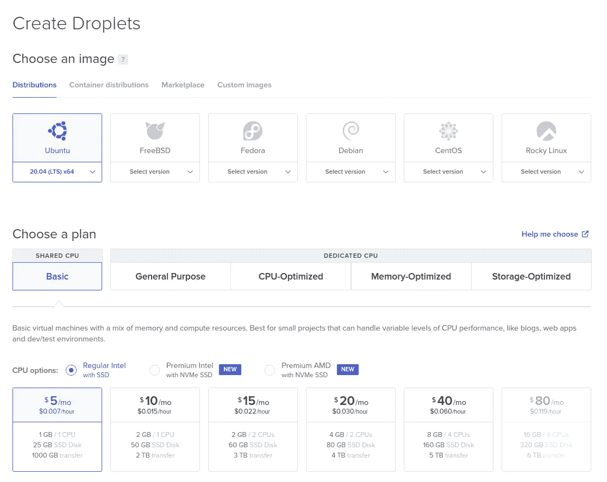
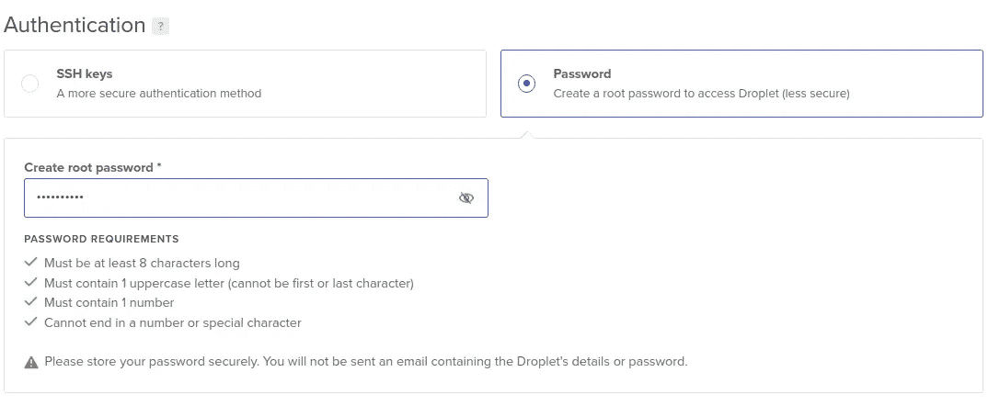
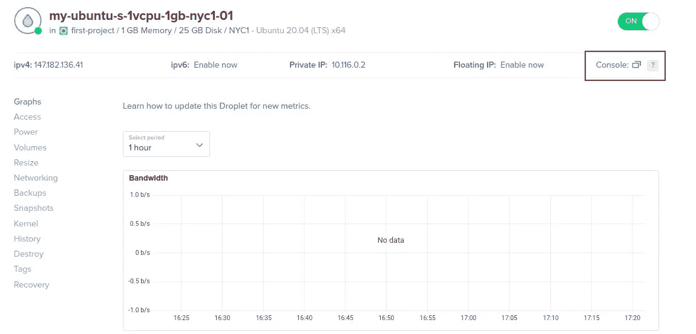
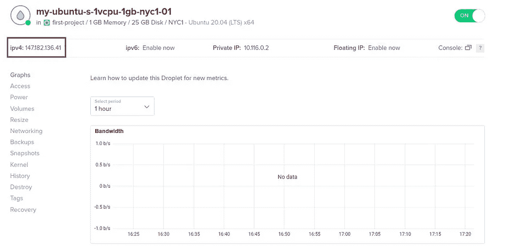
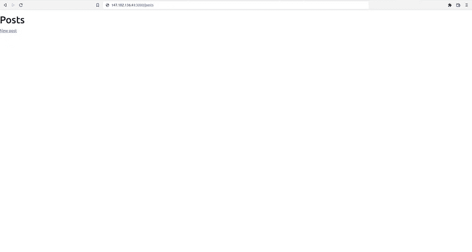

# 在 DigitalOcean Droplet 上部署 Rails 应用程序

> 原文：<https://levelup.gitconnected.com/deploy-rails-app-on-digitalocean-droplet-ca60cd3b84c0>


*数字海洋*提供了一个易于使用、以开发者为中心的平台，成本更低，并且有更多的数据中心可用。*digital ocean Droplets**是简单、可扩展的虚拟机。您创建的每个 Droplet 都是一个新的服务器，可以单独使用，也可以作为更大的基于云的基础架构的一部分。*

*首先，我们创建一个简单的 Ruby on Rails 应用程序，然后创建一个 droplet，安装必要的包和 gem，设置 Postgres 并托管应用程序。*

# *创建 Rails 应用程序*

```
*rails new app -d postgresql
cd app*
```

*配置 *database.yml* 文件*

**database.yml**

*如你所见，我使用了环境变量，使用它你需要安装 *dotenv-rails* gem*

```
*gem 'dotenv-rails', groups: [:development, :test]
bundle*
```

*并在根目录下创建一个. env 文件，然后粘贴您的数据*

```
*DATABASE_USERNAME=<username>
DATABASE_PASSWORD=<password>
DATABASE_HOST=localhost*
```

*为了获得更多的可见性，让我们生成一个支架并迁移数据库*

```
*rails g scaffold posts title:string content:text
rails db:setup
rails s*
```

*我将把我的应用程序放在 [GitHub](https://github.com/) 中。为此，我创建了一个新的存储库，将它与我的项目链接起来，向*添加秘密信息。gitignore* 并推送提交。*

```
*git remote add origin <your_repo_link>
git branch -M main
echo ".env" >> .gitignore
git add .
git commit -m "Init commit"
git push -u origin main*
```

# *设置数字海洋水滴*

*我猜你在[数字海洋](https://www.digitalocean.com/)注册了账户，准备创建一个小滴。所以，我选择了 Ubuntu 20.04 镜像和最基础的方案。*

**

*为了加快创建过程，我设置了一个密码，而不是 SSH 密钥，但这是不推荐的。*

**

*几分钟后，droplet 将完成安装，我们可以打开控制台。*

**

*当控制台打开时，让我们开始设置环境。请注意，您已经选择了所需的 Ruby 和 Rails 版本。您可以使用项目中的`ruby -v`和`rails -v`命令进行检查。*

## *使用 RVM 安装 Ruby*

*在 droplet 的控制台中输入以下命令。*

```
*sudo apt update
sudo apt-get install software-properties-common
sudo apt-add-repository -y ppa:rael-gc/rvm
sudo apt-get update
sudo apt-get install rvm*
```

*⚠️重启控制台。*

```
*rvm install <ruby_version>
rvm --default use <ruby_version>*
```

## *安装 Rails 和依赖项*

```
*sudo apt install nodejs npm
npm install --global yarn
gem install bundler
gem install rails -v <rails_version>*
```

## *安装 Postgres*

*请注意，您选择了与中相同的数据库用户名。环境文件*

```
*sudo apt install postgresql postgresql-contrib libpq-dev
sudo -u postgres createuser --interactive# Enter name of role to add: <database_username>
# Shall the new role be a superuser? (y/n)ysudo -u postgres psql -c "ALTER USER <username> PASSWORD '<database_password>';"# ALTER ROLE*
```

## *克隆和启动项目*

*克隆项目并在根目录下创建一个. env 文件*

```
*git clone <your_repo_link>
cd <your_repo_name>
nano .env*
```

*并再次粘贴您的数据*

```
*DATABASE_USERNAME=<username>
DATABASE_PASSWORD=<password>
DATABASE_HOST=localhost*
```

*最后一步是创建一个数据库，预编译资源(可选)，并启动绑定到 droplet IP 的服务器。*

```
*bundle
rails db:setup
rails assets:precompile
rails s -b 0.0.0.0*
```

*检查您的 ipv4 并将其粘贴到您的 3000 端口的浏览器中。我的情况是:*147.182.136.41:3000**

****

*万岁！🎉这并不容易，但我希望你提取了一些有用的东西。*