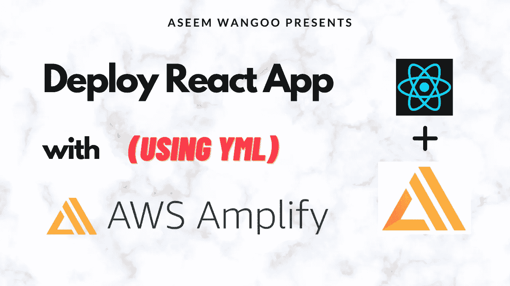
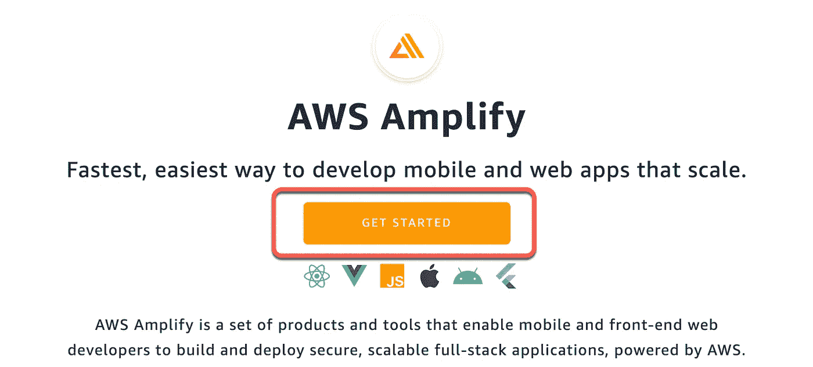
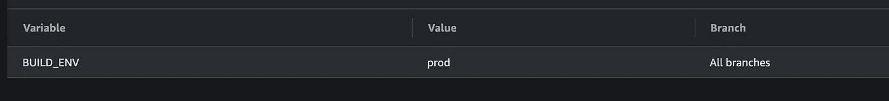

# 部署 React 和 AWS Amplify

> 原文：<https://levelup.gitconnected.com/deploy-react-and-aws-amplify-1db36c625d73>

部署 React 和 AWS Amplify

*文章在此:*[*https://flattered with flutter . com/deploy-react-and-AWS-amplify/*](https://flatteredwithflutter.com/deploy-react-and-aws-amplify/)

部署 React 和 AWS Amplify

我们将简要介绍:

1.  使用 AWS Amplify 控制台配置 React 应用程序
2.  用 yml 文件配置 React 应用程序
3.  管理多种环境

> 注意:本文假设读者了解 React 和 AWS



部署 React 和 AWS Amplify

点击此处观看演示

***网址:***[***https://master.d19tgz4vpyd5.amplifyapp.com/***](https://master.d19tgz4vpyd5.amplifyapp.com/)

# 使用 AWS Amplify 控制台配置 React 应用程序

根据[文档](https://docs.aws.amazon.com/amplify/latest/userguide/getting-started.html)，AWS Amplify 是**构建可扩展的移动和网络应用的最快和最简单的方法**

**

*AWS Amplify 简介*

> *从这里开始[吧](https://console.aws.amazon.com/amplify/home)*

*   *如果您是从**所有应用**页面开始，选择右上角的**新建应用**、**主机 web 应用**。*
*   *连接您的 GitHub、Bitbucket、GitLab 或 AWS CodeCommit 存储库。我们选择 Github。*
*   *连接存储库服务提供者后，选择一个存储库。*

> *注意:如果您的存储库属于某个组织，您将看不到这些存储库，除非该组织的所有者批准了来自 AWS Amplify 的电子邮件请求*

*   *现在，您应该能够看到您的存储库，单击您想要的存储库，选择相应的分支来构建和部署。*
*   *选择**保存并部署**以部署您的 web 应用程序*
*   *通过选择分支标题上的进度指示器来访问构建日志屏幕。构建有以下几个阶段:*

> ***供应- >构建- >部署- >验证***

**

*AWS 放大器构建步骤*

# *使用 AWS 和 yml 文件配置 React 应用程序*

*作为一名程序员，您希望控制部署，但不是通过某个控制台(在这种情况下是 AWS Amplify 控制台)。*

*我们将通过 yml 文件配置 React 部署，该文件由 AWS Amplify 内部使用。*

*   *前往 AWS Amplify 控制台并选择您的应用程序。*
*   *在左侧，点击**构建设置***
*   *在应用构建规范中，点击**下载。**这应该会下载默认的 **amplify.yml** 文件*

**

*放大 yml 文件*

*   *将这个[文件](https://github.com/AseemWangoo/expriments_with_react/blob/master/amplify.yml)添加到您的库的根目录*

```
*version: 1
frontend:
  phases:
    preBuild:
      commands:
        - yarn install
    build:
      commands:
        - yarn run build
  artifacts:
    baseDirectory: build
    files:
      - '**/*'
  cache:
    paths:
      - node_modules/**/**
```

# *管理多种环境*

*几乎每个 react 应用程序都有不同的环境，您希望以编程方式部署或管理多个环境。*

*我们将配置 React 应用程序，在 AWS Amplify 中部署基于环境的配置。*

*   *为了配置不同的环境，我们使用了 [env-cmd](https://www.npmjs.com/package/env-cmd)*
*   *使用以下命令安装 env-cmd*

```
*npm i env-cmd*
```

*   *我们有一个单独的生产环境文件`[.env.production](https://github.com/AseemWangoo/expriments_with_react/blob/master/.env.production)`(可以是任何名称)*
*   *转到您的 [package.json](https://github.com/AseemWangoo/expriments_with_react/blob/master/package.json) 并添加一个新脚本*

```
*"build:prod": "env-cmd -f .env.production react-scripts build"*
```

*因此，当您运行命令`npm run build:prod`时，这将从文件`.env.production`中获取配置*

*   *通过运行`npm run build:prod`进行本地验证，然后使用`serve -s build`在本地运行生产版本。*

*如果一切正常，我们**继续放大部署***

*   *进入 AWS Amplify 控制台内的应用程序，在左侧点击**环境变量***
*   *输入一个名为 **BUILD_ENV** 的变量，并给出值 **prod***

**

*构建环境*

*   *在你的`amplify.yml`中编辑`preBuild`阶段来安装`env-cmd`*
*   *现在，编辑构建阶段并将命令改为`npm run build:$BUILD_ENV`*

```
*version: 1
frontend:
  phases:
    preBuild:
      commands:
        - npm install env-cmd
        - npm ci
    build:
      commands:
        - echo "I am running 🏃 on $BUILD_ENV" 
        - npm run build:$BUILD_ENV
  artifacts:
    baseDirectory: build
    files:
      - '**/*'
  cache:
    paths:
      - node_modules/**/**
```

> *基本上，它从应用程序的环境变量(BUILD_ENV)中获取变量，并用值(prod)替换命令。*

*因此，在构建的时候，您的命令变成了`npm run build:prod`,这与您在本地构建时使用的命令相同。*

*   *您可以更进一步，根据每个分支创建不同的应用程序，并根据您的需求使用 BUILD_ENV 变量。*

```
*# Examples
Create app with qa branch and set the BUILD_ENV as qa*
```

*其他文章:*

*[](/show-push-notifications-in-react-449949e98e01) [## 在 React 中显示推送通知

### 在 React 中显示推送通知

在 Reactlevelup.gitconnected.com 显示推送通知](/show-push-notifications-in-react-449949e98e01) [](/fade-in-out-text-in-react-fa8fc7a2a0b1) [## React 中的淡入淡出文本

### 如何在 react 中淡入淡出文本

levelup.gitconnected.com](/fade-in-out-text-in-react-fa8fc7a2a0b1) [](/deploy-lambda-using-serverless-a44a66f3d603) [## 使用无服务器部署 lambda

### 使用无服务器部署 lambda

使用 serverlesslevelup.gitconnected.com 部署 lambda](/deploy-lambda-using-serverless-a44a66f3d603) 

```
[Source Code](https://github.com/AseemWangoo/expriments_with_react)
```