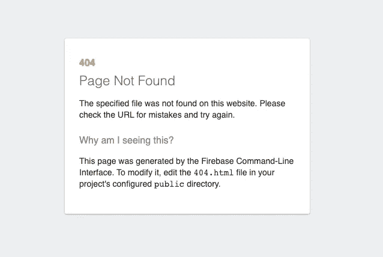

# 使用 Firebase 免费部署 React 应用程序

> 原文：<https://levelup.gitconnected.com/deploy-react-apps-for-free-using-firebase-3b7126070f6a>

了解如何免费使用 Firebase 部署 React 应用程序


React.js + Firebase

# 重火力点

Firebase 是谷歌开发的一个平台，用于创建移动和网络应用。除了托管功能之外，Firebase 还提供其他出色的服务，如身份验证、实时数据库和云功能。

在本文中，我们将学习如何设置 React 应用程序，并使用 Firebase 主机部署它。

设置相对简单，没有麻烦。如果你没有谷歌账户，那就先注册一个。你不需要为此提供任何信用卡信息，如上所述，这是完全免费的。

# 步骤 1:创建新项目


Firebase 仪表板

一旦你注册/登录了你的账户，在仪表盘上点击**创建项目**。如果您已经创建了一个项目，那么您的仪表板看起来会稍有不同。

之后，您需要提供一个项目名称，并为您的应用程序启用或禁用谷歌分析。

# 步骤 2:安装 Firebase CLI

接下来，我们需要安装 Firebase CLI，您可以在 React 项目中全局或本地安装。大多数人建议在全球范围内进行。

```
npm install -g firebase-tools
```

完成后，运行:

```
firebase login
```

这将打开浏览器并提示您登录，记住使用您之前创建项目时使用的相同帐户。

# 步骤 3:初始化 Firebase 配置

登录后，回到 React 应用程序的根目录并运行:

```
firebase init
```

*   您将被要求确认继续，回答**是**
*   接下来，您将被要求选择一个 Firebase 特性，我们想要的选项是:

```
(✅) Hosting: Configure files for Firebase Hosting and (optionally) set up GitHub Action deploys
```

*   然后会要求您选择一个 Firebase 项目，假设您已经完成并创建了一个项目，请选择:

```
(✅) Use an existing project
```

*   接下来是选择公共目录，它会默认为“**public”**但这不是我们想要的，改为回复“**build”**就像这样:

```
? What do you want to use as your public directory? **build**
```

*   以下两个问题将询问您是否要覆盖您的 index.html 并设置 GitHub 操作，回答**否**两个问题。

# 步骤 4:构建和部署！

完成前面的步骤后，您的 Firebase 配置就完成了，现在我们只需要构建我们的项目并部署它。

*   假设您坚持使用 **create-react-app** 默认脚本，您可以运行:

```
npm run build
```

*   React 应用程序构建完成后，再运行一个命令来部署它:

```
firebase deploy
```

这样，您的 React 应用程序就应该能够成功构建和部署，并向全世界展示。

# 常见问题

我在使用 firebase 部署 React 应用程序时经常遇到的一个问题是，当使用 react-router 并刷新路由页面(如 **/contact** )时，您会遇到 404 not found 页面，如:



Firebase 404 页面

幸运的是，修复非常简单，只需打开我们运行 **firebase init** 时生成的 **firebase.json** 文件，并添加以下“重写”部分:

```
"hosting": {
  ...(Any existing data),
  "rewrites": [ {
    "source": "**",
    "destination": "/index.html"
  } ]
}{firebase.json}
```

之后，重复第 4 步，你就成功了！发生这种情况的原因是，当你重新加载页面时，Firebase 会搜索一个名为 **/contact.html** 的文件/目录，因为我们使用的 react-router 并不存在。因此，添加上面的代码可以防止 404 页面显示并呈现 index.html。

# 有用的链接

*   https://firebase.google.com
*   Firebase 托管文档—[https://firebase.google.com/docs/hosting](https://firebase.google.com/docs/hosting)

# 结论

这样，你就可以使用 Firebase 免费托管你的 React 应用程序，而且这并不太困难。您可以通过添加 GitHub 操作来改进这个工作流，这样当您将代码推送到某些分支时，您可以设置自动构建并部署到 Firebase。

如果你遇到任何问题，请随时联系我，我很乐意帮助你！

考虑通过此链接注册来支持我和其他作者:

 [## 阅读 JrPotatoDev(以及媒体上成千上万的其他作家)的每一个故事

### 作为一个媒体会员，你的会员费的一部分会给你阅读的作家，你可以完全接触到每一个故事…

jrpotatodev.medium.com](https://jrpotatodev.medium.com/membership) 

其他一些内容如下:

[](/react-js-the-confusing-parts-4e9aea20c94c) [## React JS —令人困惑的部分

### 了解初学者容易遇到的 React 的常见混淆部分。

levelup.gitconnected.com](/react-js-the-confusing-parts-4e9aea20c94c) [](/7-repos-to-help-you-master-javascript-c7d61792f59c) [## 7 个 Repos 帮助你掌握 JavaScript

### 帮助成为更好的 JavaScript 开发人员的资源列表。

levelup.gitconnected.com](/7-repos-to-help-you-master-javascript-c7d61792f59c) [](https://medium.com/codex/13-useful-javascript-array-tips-and-tricks-you-should-know-85185e805d4d) [## 您应该知道的 13 个有用的 JavaScript 数组技巧和窍门

### 数组是 Javascript 最常见的概念之一，它给了我们很多处理数据的可能性…

medium.com](https://medium.com/codex/13-useful-javascript-array-tips-and-tricks-you-should-know-85185e805d4d)