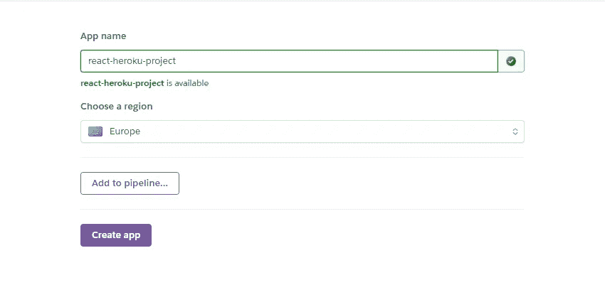
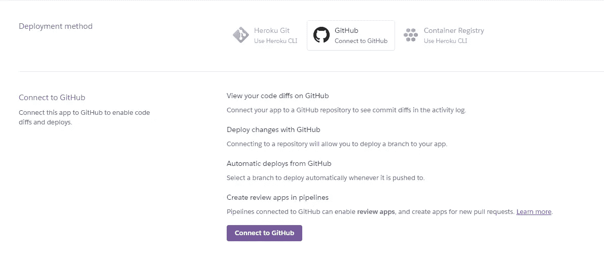
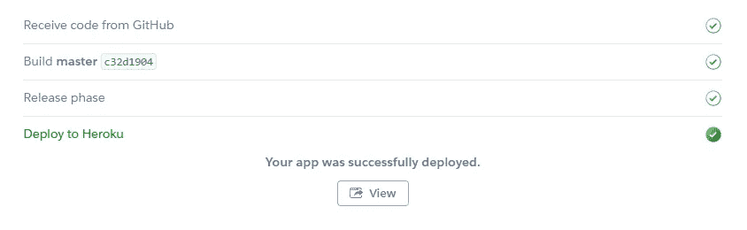

# 使用 Heroku 免费部署 React 应用程序

> 原文：<https://levelup.gitconnected.com/deploy-react-apps-for-free-using-heroku-523e232a07c1>

了解如何使用 Heroku 免费部署 React 应用程序


赫罗库

# 赫罗库

Heroku 是一个基于容器的云平台即服务(PaaS)。开发人员使用 Heroku 来部署、管理和扩展现代应用。我们的平台优雅、灵活且易于使用，为开发人员将应用推向市场提供了最简单的途径。

在免费计划中，您最多可以向您的帐户添加 5 个项目。如果你正在构建一个 React 应用程序，并且需要一个简单免费的方法来演示你的应用程序，Heroku 是一个不错的选择。

你可能已经猜到了，在我们开始之前，你需要[创建一个账户](https://www.heroku.com)。

# 多种部署方法

有几种方法可以做到这一点，我会尽可能多的尝试。

*   通过 GitHub 部署
*   使用 Heroku CLI 部署

在本文中，我们将使用方法 1，通过 GitHub 进行部署。这两种方法没有孰优孰劣，它们都能完成工作。

# 第一步:推送至 GitHub

如果你已经体验过 GitHub，那就跳过这一部分。如果你是新来的，那就跟着来。同样，如果你还没有一个 [GitHub](https://github.com/) 账户，那就去创建一个吧。

之后，创建一个新的存储库，并将您的代码放入其中。我不会深入研究 Git，因为这不是 Git 指南，但它大概是这样的。确保您位于 React 应用程序的根目录中。

```
# Add your files to be commited
git add .# Commit these changes
git commit -m 'Initial commit'# Add the origin of your repository
git remote add origin '[https://github.com/YOUR-USERNAME/YOUR-APP-NAME.git](https://github.com/Asher-JH/react-heroku-app.git)# Push all the changes
git push origin master
```

完成后，转到存储库页面，应该会用 React 应用程序源代码进行更新。

# 步骤 2:创建一个新的 Heroku 项目


Heroku 仪表板

一旦您登录，前往您的仪表板，您应该看到类似于上面的东西。继续点击**创建新应用**。



heroku——创建新应用程序

给它一个应用程序名称，并选择最适合您的地区。这个名字不一定要和你的 react 应用一样，但是为了保持一致和不那么混乱，最好这样做。

# 第三步:部署



Heroku —应用部署方法

一旦你的应用程序被创建，你应该被重定向，你可以看到上面的部分。继续并选择 GitHub。

如果您还没有，请连接您的 GitHub 帐户。绝对安全，别担心。

连接后，搜索您刚刚创建的 repo。然后点击**连接即可。**


Heroku —使用 GitHub 手动部署应用程序

除非您更改了分支，否则请坚持使用默认的主分支，并单击 **Deploy Branch。**你应该开始看到 React 应用构建的日志。

不久之后，您应该会看到以下内容，请继续查看您新部署的 React 应用程序。🚀



Heroku —应用程序已成功构建和部署

# 有用的链接

*   heroku—[http://www.heroku.com/](http://www.heroku.com/)
*   GitHub—【https://github.com/ 
*   https://git-scm.com/downloads
*   创建-反应-应用—[https://create-react-app.dev/](https://create-react-app.dev/)

# 结论

只需 3 个步骤，您就成功创建了一个存储库来存储您的源 React 应用程序源代码，并将其部署到 Heroku。很好，又快又简单。如果您计划频繁更新您的代码，您也可以设置自动部署。它就在手动部署部分的上面，您只需要启用它。

如果你遇到任何问题，请随时联系我，我很乐意帮忙。

考虑通过此链接注册来支持我和其他作者:

 [## 阅读 JrPotatoDev(以及媒体上成千上万的其他作家)的每一个故事

### 作为一个媒体会员，你的会员费的一部分会给你阅读的作家，你可以完全接触到每一个故事…

jrpotatodev.medium.com](https://jrpotatodev.medium.com/membership) 

其他一些内容如下:

[](/react-js-the-confusing-parts-4e9aea20c94c) [## React JS —令人困惑的部分

### 了解初学者容易遇到的 React 的常见混淆部分。

levelup.gitconnected.com](/react-js-the-confusing-parts-4e9aea20c94c) [](/deploy-react-apps-for-free-using-firebase-3b7126070f6a) [## 使用 Firebase 免费部署 React 应用程序

### 了解如何免费使用 Firebase 部署 React 应用程序

levelup.gitconnected.com](/deploy-react-apps-for-free-using-firebase-3b7126070f6a) [](https://medium.com/codex/13-useful-javascript-array-tips-and-tricks-you-should-know-85185e805d4d) [## 您应该知道的 13 个有用的 JavaScript 数组技巧和窍门

### 数组是 Javascript 最常见的概念之一，它给了我们很多处理数据的可能性…

medium.com](https://medium.com/codex/13-useful-javascript-array-tips-and-tricks-you-should-know-85185e805d4d)