# 在 Azure Cloud 上使用 Python 和 Flask 将 ML 模型部署为 REST API

> 原文：<https://levelup.gitconnected.com/deploy-the-ml-model-as-a-rest-api-with-python-and-flask-on-azure-cloud-70eb45e6d138>

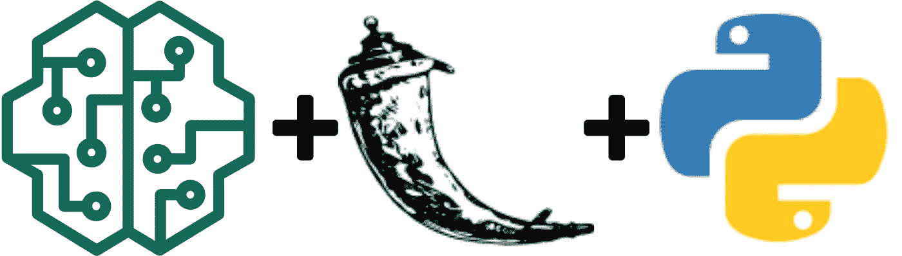

> 部署机器学习模型对于初学者，甚至一些有经验的人来说可能是怪异的。这就是为什么我决定花些时间来写它。

在本文中，我将向您展示如何使用 Python 和 [Flask](https://en.wikipedia.org/wiki/Flask_(web_framework)) 创建 Restful API 服务

# 先决条件

*   [Python 3.5](https://www.python.org/) +
*   [烧瓶](http://pip install Flask)
*   [Azure 账户](https://azure.microsoft.com/en-us/)
*   [NLTK](https://www.nltk.org/)
*   [Scikit-learn](https://scikit-learn.org/stable/)

由于我已经在之前的帖子中创建了 [TFID 模型](https://medium.com/@zayedrais/build-your-semantic-document-search-engine-with-tf-idf-and-google-use-c836bf5f27fb):

[用 Tfid](https://medium.com/@zayedrais/build-your-semantic-document-search-engine-with-tf-idf-and-google-use-c836bf5f27fb) 构建你的语义文档搜索引擎

# 1.创建烧瓶 API

首先，我们已经在你的机器上安装了 flask 库。

```
$ pip install flask
```

安装完成后，为 flask API 创建一个新目录，并创建一个 python 文件 **app.py**

**简易烧瓶 hello world 代码:-**

```
from flask import Flask
app = Flask(__name__)@app.route('/')
def hello_world():
    return 'Hello, World!'
```

要么你可以用 **git 克隆**获得完整的代码。

```
$ git clone [https://github.com/zayedrais/DocumentSearchEngine.git](https://github.com/zayedrais/DocumentSearchEngine.git)
```

将目录从 git 克隆项目更改为 **Flask API**

现在你可以运行 flask 了

```
$ flask run
```

成功运行 flask 后，可以看到 flask 服务器正在 [http://127.0.0.1:5000/](http://127.0.0.1:500/) 上运行

去浏览器打网址[**http://127 . 0 . 0 . 1:5000/Search？**查询=计算机科学](http://127.0.0.1:5000/Search?query=computer%20science)

**请求的结果看起来像:**

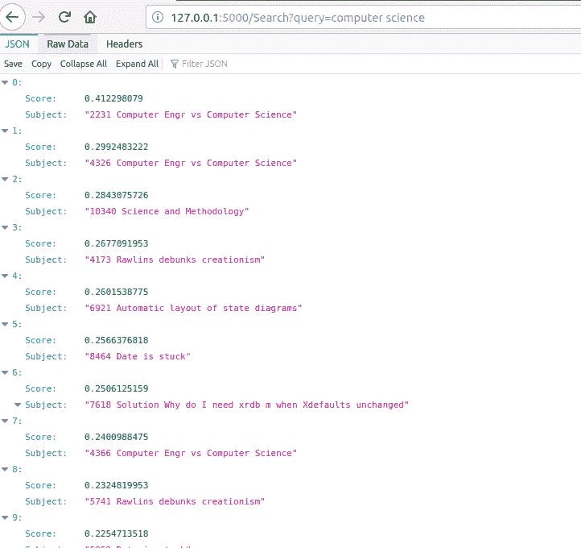

## 烧瓶 API 解释:

Flask 分为 3 个部分分别是导入库，模型，路线

**首先导入库:-**

在本节中，我们已经添加了您的项目所使用的必需库。

**您的 API 的模型部件:**

在这里，我们可以加载所需的文件或模型和方法声明，我们将在 API 的下一部分中使用它们。

**路段:-**

在本节中，我们必须根据您的 API 需求定义路由映射。

**app . py 文件的完整代码:**

# 2.为 Azure 部署做好准备

在 azure 上进行部署之前，我们必须创建一个 python 需求文件，它将在生产环境中安装所需的库。文件名必须为" **requirements.txt** "

对于我们的项目需要下面的库，它会根据您的项目要求的变化。

```
Flask==1.1.1
nltk==3.4.5
scikit-learn==0.22.1
pandas
```

现在必须用一个 **Azure 订阅账户**登录。

为了在应用程序服务上创建 web 应用程序，您已经通过**资源组选择了您的**订阅**计划。**在**名称**部分，给出您想要的 API 名称。

这里我们使用的是 python 3.7 Linux 服务器的代码文件，所以选择 **publish** 列上的**代码**和**运行时堆栈**是 python 3.7 的 **OS** **Linux** 。最后，点击**审核+创建**按钮。创建它需要几分钟时间。

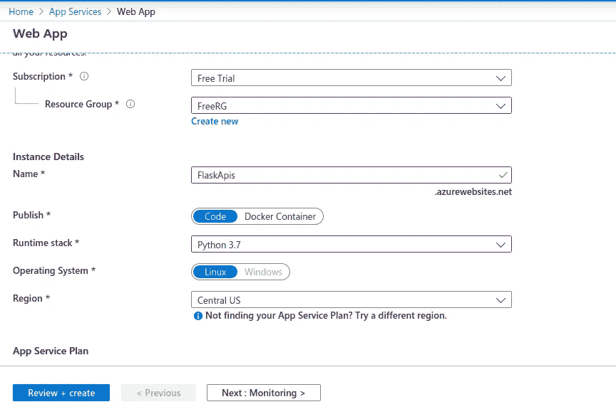

成功完成后，您可以检查网址将显示如下图片进行确认。

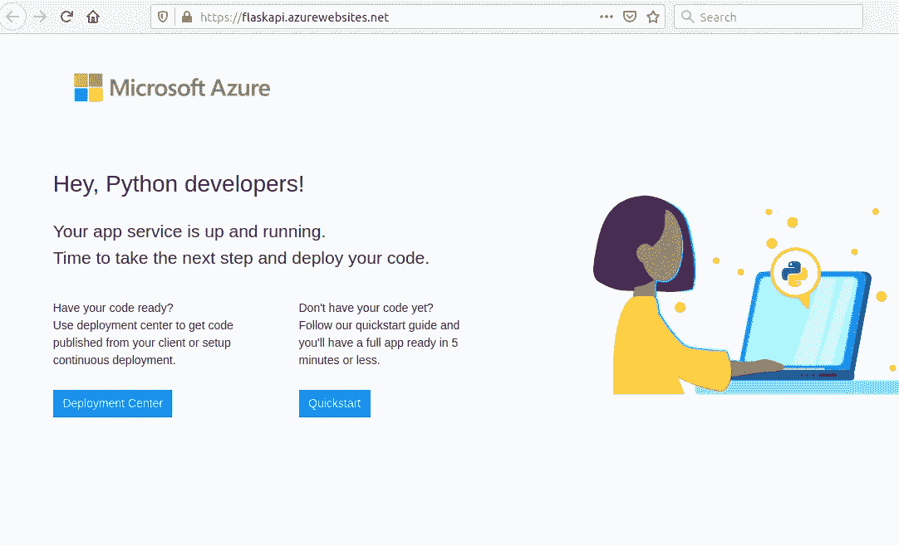

现在，我们必须打开您的 azure 帐户并找到我们已经为部署创建的应用服务。然后转到**部署中心**选项卡，继续选择**本地 Git。**

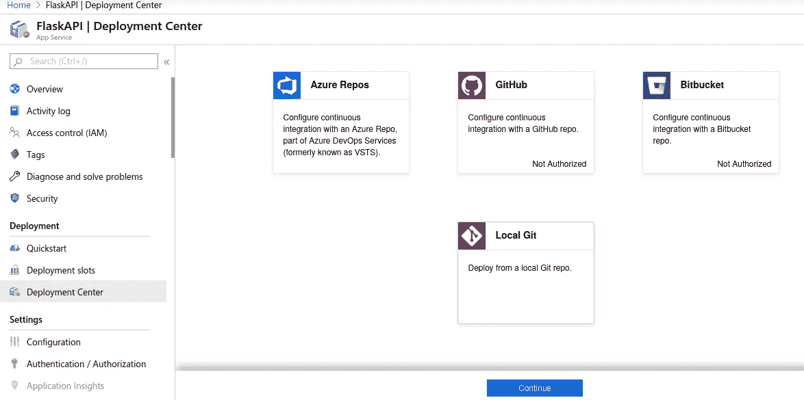

在下一个屏幕上，继续选择**应用服务构建服务**部分。

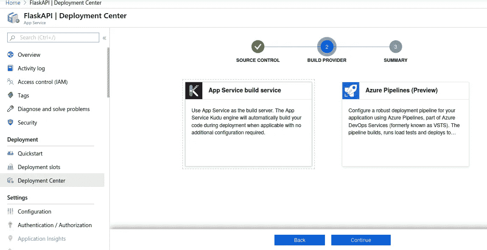

最后，点击**部署凭证**标签获取本地 Git 的**用户名**和**密码**。并保存在文本文件中，我们将在部署时用于身份验证。

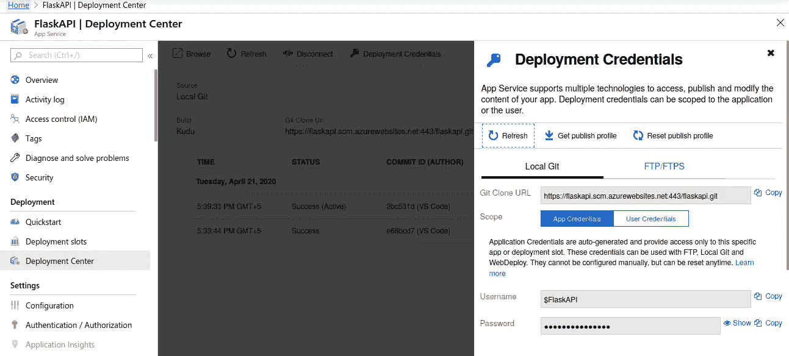

# 3.在 Azure 应用服务上部署

转到终端上的项目目录，运行下面的命令将本地项目部署到 azure 中。运行最后一个命令( *$ git push azure master* )后，它会询问用户名&密码，请提供用户名&密码，我们已经保存在文本文件中了。

```
$ git init
$ git add .
$ git commit -m 'Initial commit'
$ git remote add azure [https://flaskapi.scm.azurewebsites.net:443/flaskapi.git](https://flaskapi.scm.azurewebsites.net:443/flaskapi.git)$ git push azure master
```

在下面的截图中，我们可以验证代码部署成功。

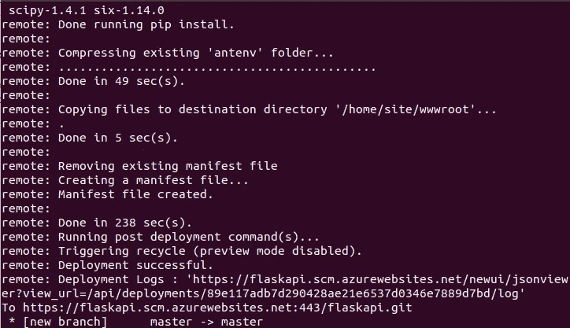

**启动命令:**

请在**配置**选项卡的**启动命令**部分添加以下命令。

```
gunicorn — bind=0.0.0.0 — timeout 600 app:app
```

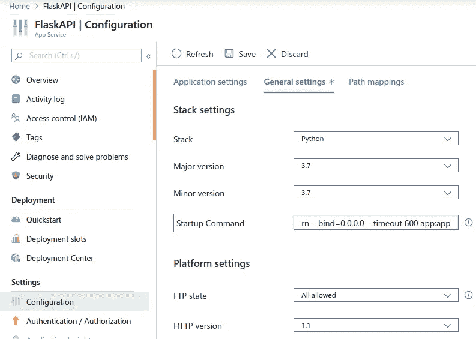

# 4.通过 SSH shell 的 Azure web 服务的环境就绪

打开 azure 上的 **SSH** 选项卡，更改根目录(cd..)

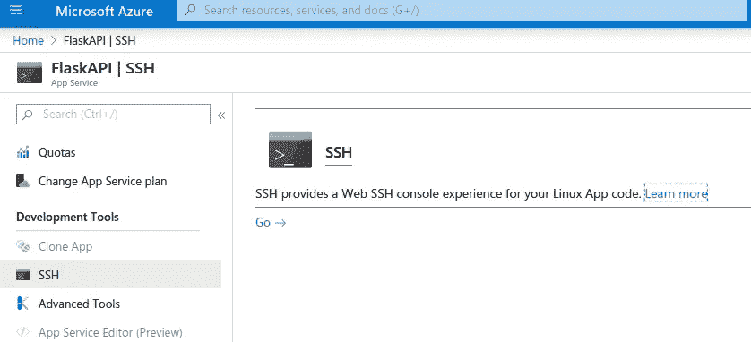

```
$ cd ..
$ source antenv/bin/activate
$ pip install nltk
$ python -m nltk.downloader all
```

最后，我们在 azure 上部署了 flask API。点击下面的网址进行确认。在您的情况下，url 是不同的

```
[https://flaskapi.azurewebsites.net/search?query=computer](https://flaskapi.azurewebsites.net/search?query=computer) science
```

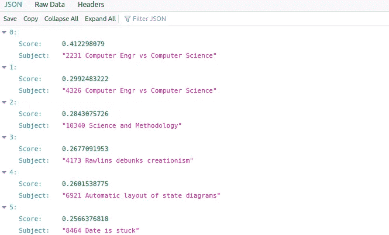

# 关闭

这只是为 TFID 模型构建 Flask REST API 的一个非常简单的例子。同样的过程可以应用于其他机器学习或深度学习模型，只要你训练并保存了它们。

[Flask API github 知识库](https://github.com/zayedrais/DocumentSearchEngine/tree/master/Flask%20API)

[建立 tfid 模型](https://github.com/zayedrais/DocumentSearchEngine)

# 别忘了把你的给我们👏！