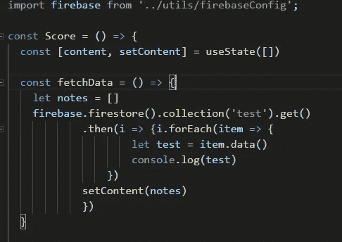

# 在 Firebase 上部署 web 应用程序

> 原文：<https://levelup.gitconnected.com/deploy-web-app-on-the-firebase-4d7295649c53>

我正在为麻省理工学院的 React 最终交付成果开发 React.js 应用程序，并在考虑我应该在哪里部署它。通常对于宠物项目，我用 Heroku 部署后端，用 Netlify 托管前端。但这一次，我决定抓住机会用其他工具进行实践，并在 Firebase 上托管一个 web 应用程序。


**先决条件**

首先，您需要在您的环境中安装 Firebase CLI。这些将允许你通过控制台与 firebase 交互。为此，请运行以下命令:

```
npm install -g firebase-tools
```

接下来，您需要使用您的 google 帐户进行身份验证。运行此命令并遵循说明:

```
firebase login
```

而你需要的，惊喜，你的应用。现在我将使用 React.js 作为我的前端，但是你可以使用任何你喜欢的前端库。要将 Firebase 库添加到应用程序依赖项，请在应用程序的根目录中运行以下命令:

```
yarn add firebase
```

如果到目前为止您没有收到任何错误消息，并且一切都已成功安装，那么您就可以部署您的应用程序了。

**主机 react app**

首先，让我们转到 [Firebase 控制台](https://console.firebase.google.com)并创建一个新项目。


Firebase 项目已经准备好了。


接下来，让我们转到控制台，用一个特定的 Firebase 项目部署我们的应用程序。因为我们已经登录，当需要做的是在控制台中初始化项目:

```
firebase init
```


选择托管:*为 Firebase 托管配置文件…*

选择正确的构建目录非常重要。在 React 的情况下，它的目录名是“Build ”,但是你可以选择你的构建所在的任何位置。这里是控制台配置:


如果您想在不同的项目中部署您的应用程序，您可以运行此命令并选择项目:

```
firebase use — add
```

让我们想象这样一个神话般的场景:你完成了你的应用程序，所有的错误都被修复了，所有的东西都闪闪发光，可以展示给全世界了。首先，我们需要做的是创建应用程序的构建。为此，请在应用程序的根目录下运行以下命令:

```
yarn build
```

最后，让我们部署应用程序:

```
firebase deploy
```

如果一切正常，现在你可以在部署后的控制台或 firebase 控制台中找到 url，你应该可以看到你的应用程序正在运行。

**数据库**

Firebase 的美妙之处在于，你可以用 Firestore 创建一个完整的 CRUD 应用程序。要完整地描述如何使用数据库，需要一个单独的博客帖子。但是我想在这里至少介绍一下基本情况。

首先让我们创建数据库:


然后创建应用程序并生成 API 密钥:


使用这些 API 键，我们可以在应用程序中与 Firestore 进行交互。

首先，让我们将 api 键保存为 JavaScript 文件:


然后，您可以将这个配置导入 React 应用程序来访问数据库。这里是从集合“测试”中获取所有记录的函数:



不要忘记将配置文件添加到**中。gitignore** 向世界隐藏你的秘密。

如果观众有兴趣，我会写如何用 Firestore 建立一个完整的 CRUD 应用程序。

**结论**

现在，如果您需要在 Firebase 上部署精彩的应用程序，您知道该怎么做了。知道如何使用不同的架构工具总是很有帮助的。顺便说一下，[看看我部署的](https://react-72e22.web.app)。