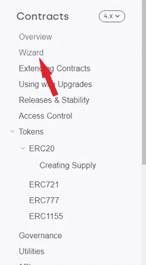
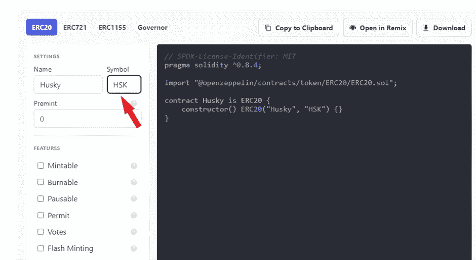
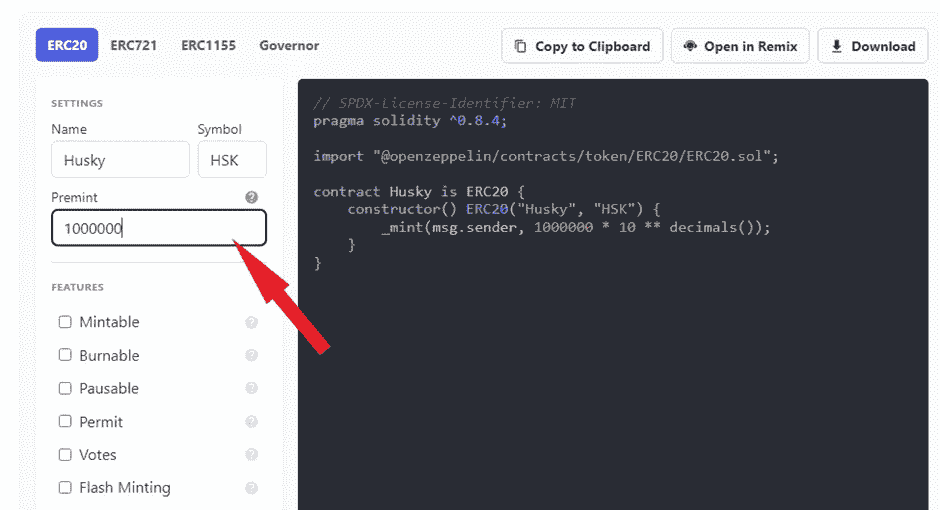
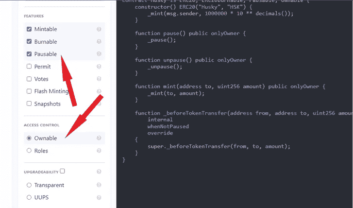
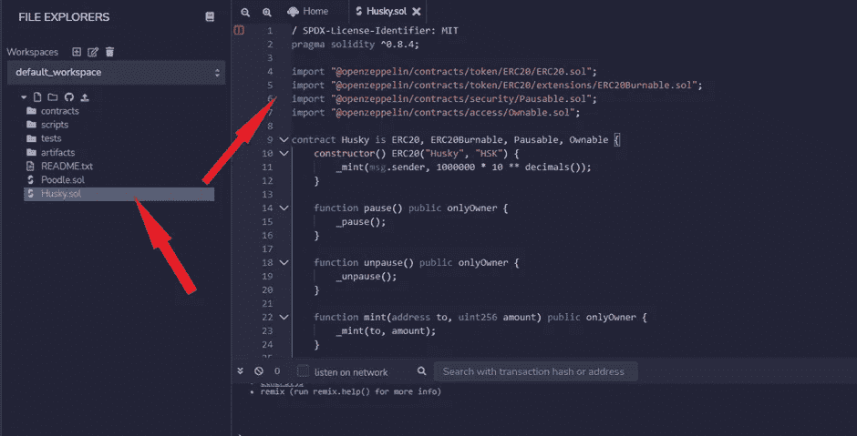
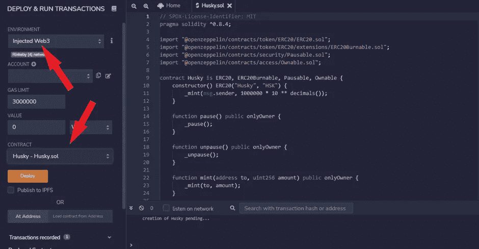
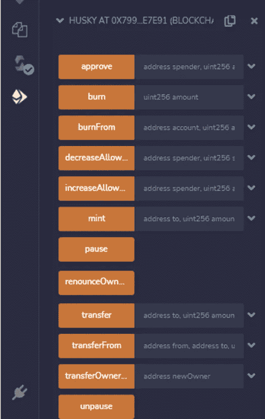
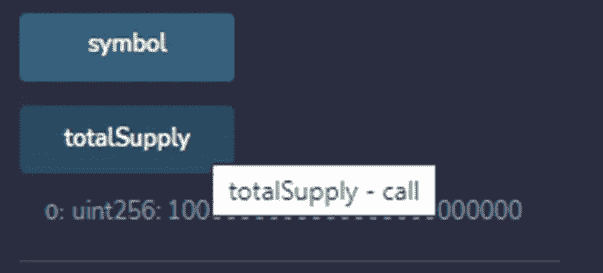
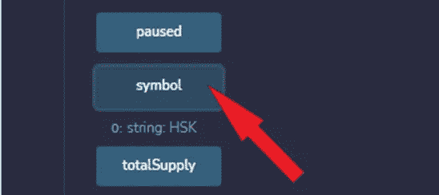
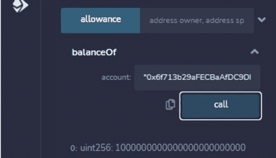

# 使用 Openzepellin 部署您的 ERC20 令牌—简单！

> 原文：<https://levelup.gitconnected.com/deploy-your-erc20-token-using-openzepellin-easy-f15a751de4b5>

又是一个学习新事物的美好日子，不是吗？作为一名聪明的合同开发人员，您将要学习的是您在旅途中经常(或不经常)要做的事情，而这篇文章的目的是让您的经历变得简单而难忘。

如果你是初学者，不熟悉 Metamask wallet、Remix 以及如何获得 test Ether 等工具，也可以看看下面的文章，在那里你可以找到部署 ERC20 令牌所需的一切**。**

顺便说一下，为了能够创建一个 ERC20 令牌，您可能需要查看一些[以前的文章](/deploy-your-first-erc20-token-in-5-min-17c1333d8434):

🤖 [**在 5 分钟内部署您的第一份智能合同**](/deploy-your-first-smart-contract-in-5-minutes-67361699ae03)

🚀 [**在 5 分钟内部署您的第一个 ERC20 令牌**](/deploy-your-first-erc20-token-in-5-min-17c1333d8434)

**👾** [**创建 NFT、令牌和 DAOs 智能合约主类**](https://www.udemy.com/course/create-nfts-tokens-and-daos-smart-contracts-masterclass/?referralCode=39A122B4B0FA4780826A)

🐶 [**今天就在以太坊上创建你自己的柴犬-伊努代币吧！**](https://medium.com/datadriveninvestor/create-your-own-shiba-inu-token-on-ethereum-today-7e0c28d4f682)

此外，[如果您想确切了解什么是 ERC20 令牌以及可能的使用情形，请查看此处](/which-one-to-choose-erc-20-vs-erc-721-vs-erc-1155-ethereum-token-smart-contract-red-pill-9bb827148671)，但简单地说，我可以告诉您，ERC20 令牌是可替换的令牌。

例如，Floki 是一份 ERC20 合约。你可以在[以太扫描](https://etherscan.io/token/0xcf0c122c6b73ff809c693db761e7baebe62b6a2e)上查看。

## 好吧！什么是 OpenZeppelin？

Openzeppelin 只是一个框架或标准，用于构建安全的 dApps(分散式应用程序),并执行一些安全审计以确保应用程序的安全性。你可以在他们的网站上阅读更多关于它的信息[这里](https://openzeppelin.com/)，你也可以在他们的文档中获得关于它的不同用例的综合指南[这里](https://docs.openzeppelin.com/)。还有其他标准，尽管大多数开发人员广泛使用 openzeppelin 库来创建令牌。

许多大型加密项目使用 Openzeppelin 作为其令牌标准和规范，因此至少您知道 Openzeppelin 是经过实战测试的。

**现在，让我们开始**

为了这个练习，我们将使用 [**向导**](https://docs.openzeppelin.com/contracts/4.x/wizard) **，**open zeppelin 的特性之一。你应该在 [**文档中找到，如下图**](https://docs.openzeppelin.com/contracts/4.x/wizard) :

Opezeppelin 向导是一个工具，它允许我们创建在 **ERC20** 、 **ERC721** 、 **ERC1121、**和 **Governor** 中部署智能合约所需的代码。

1.  首先，给它一个名字和符号。您可以为您的令牌起任何您选择的名称，但是在本教程中，我将把我的令牌命名为“Husky”:

您会注意到契约的名称和符号会自动插入到代码中(查看右边的编码环境)。

2.接下来，在 **Premint** 中指定您想要供应的代币数量。在我的情况下，它是 100 万(一百万)代币。向导会为我们完成剩下的工作，即:为我们的令牌提供所需的小数位数。

3.接下来的事情就是添加几个方法:

*   通过检查这个特性，你可以指定你希望你的令牌的供应量在将来增加；也就是说，最初的 100 万个令牌将随着时间的推移而增加。
*   **可燃**暗示我们希望未来能够销毁代币；也就是说，供应可以在某个点减少。
*   **Pausable** 表示您希望能够在某些时段暂停令牌供应，无论是出于安全原因还是周末休息。
*   **许可证**将允许用户发送令牌而无需支付油费。
*   **投票**将允许用户能够参与分散投票。

您可以在此阅读更多[，但是，在本次演示中，我们将只使用前三个选项。确保勾选了**可拥有的**选项。](https://ethereum.org/en/developers/docs/standards/tokens/erc-20/#body)

4.现在是时候复制我们的智能合约代码，并前往 [Remix IDE](http://remix.ethereum.org/) 部署我们的合约了。以您的令牌的名称创建一个新文件，并以“.”结尾。sol”如下所示，然后粘贴您的代码。

5.让我们继续编译。选择**编译器 0.8.2(或任何与您的智能合约上的版本相匹配的版本)**并点击编译。

6.接下来进入**部署和运行事务**并选择**注入的 Web** 和文件以部署 Husky 令牌或您命名的任何东西

7.在元掩码中，确保选择了 Rinkeby 测试网络(或任何其他有测试加密或测试以太网的网络),然后继续进行部署！点击 Metamask 钱包上的批准，几秒钟后，您的 ERC20 智能合同将部署到区块链！呜哇！！🚀

如果你不知道 MetaMask 或 Rinkeby yo，你可能会回到我之前的教程[如何部署你的第一个 ERC20 令牌](/deploy-your-first-smart-contract-in-5-minutes-67361699ae03)。

8.完成后，你会在侧边栏上看到几个函数，你会看到我们的令牌的所有选项以及我们可以用它执行的操作。

9.您会注意到，与 ERC20 令牌的自定义部署不同，我们的合同具有基于我们之前在向导中选择的选项的 Mint、Burn 和 Pause 功能。

**⚠️crypto Henri**[**YouTube**](https://www.youtube.com/channel/UCRXmxbm5pAGLPMdJXxzGKuQ)**⚠️**

**一些演示:**

1.  这个函数指定了在 **premint** 中指定的总供应量加上指定令牌的零的数量，就像我们设置的那样。

2.上面显示了我们的令牌的符号。

3.**所有者**函数指定你的地址。

4.“的“ **balance”函数显示分配给特定地址的令牌数，继续使用元掩码并复制您的地址以粘贴到槽中，您应该会得到相同的结果。如果您得到了所有这些结果，那么您的合同肯定运行良好，而且您猜怎么着，您刚刚为您的区块链开发者宝库增添了宝贵的知识！**

黑客快乐！

如果你对元宇宙和 NFTs 感兴趣，别忘了看看这些:

🚀 [**以太坊合并升级大师级**](https://www.udemy.com/course/the-ethereum-merge-upgrades-masterclass/?referralCode=732F453B5B228B789846)

😍[T5【元宇宙】对于商家来说——如何从元宇宙 中获益](https://www.udemy.com/course/metaverse-for-businesses-how-to-benefit-from-the-metaverse/?referralCode=4B3DF285FE8F0CDC8143)

**👾** [**创建 NFT、令牌和 DAOs 智能合约主类**](https://www.udemy.com/course/create-nfts-tokens-and-daos-smart-contracts-masterclass/?referralCode=39A122B4B0FA4780826A)

🦄 [**元宇宙大师班——了解元宇宙的一切**](https://www.udemy.com/course/metaverse-masterclass-learn-everything-about-the-metaverse/?referralCode=4795AA478A4B496F3BC5)

⭐ [**NFT 投资大师班——关于 NFT 投资的亲招**](https://www.udemy.com/course/nft-investing-masterclass-pro-tips-about-nft-investing/?referralCode=32FD108E41BB3959925F)

Twitter:@[henriquecentiei](https://twitter.com/henriquecentiei?s=11)，LinkedIn:[Henrique Centieiro](https://www.linkedin.com/in/henriquecentieiro)

# 分级编码

感谢您成为我们社区的一员！在你离开之前:

*   👏为故事鼓掌，跟着作者走👉
*   📰查看[升级编码出版物](https://levelup.gitconnected.com/?utm_source=pub&utm_medium=post)中的更多内容
*   🔔关注我们:[Twitter](https://twitter.com/gitconnected)|[LinkedIn](https://www.linkedin.com/company/gitconnected)|[时事通讯](https://newsletter.levelup.dev)

🚀👉 [**加入升级人才集体，找到一份惊艳的工作**](https://jobs.levelup.dev/talent/welcome?referral=true)