# 在 5 分钟内部署您的第一个 ERC20 令牌

> 原文：<https://levelup.gitconnected.com/deploy-your-first-erc20-token-in-5-min-17c1333d8434>

你心里有一个加密项目吗？您想创建自己的 ERC20 令牌吗？从来没有这么容易过。在这里，你会发现所有的细节，以轻松建立自己的令牌！

ico、ido 以及您在 Coinmarketcap 上看到的至少 80%的令牌都是 ERC20 令牌。柴犬、小 Doge(事实上，除 Dogecoin 外，大多数名称中带有“Doge”的硬币)、USDT 和大多数 Dao 都是 ERC20 代币。

在本文中，我将逐步向您展示如何部署 ERC20 令牌。这篇文章的目的是帮助每个人能够部署这个令牌，不管你有没有编码知识。然而，在我们深入讨论之前，我想给阅读这篇文章的新手们介绍一下术语“ERC20 ”,记住这是给**每个人**的🐵

如果您想要了解如何创建和部署 ERC20、ERC721 (NFTs)和 ERC1155 的完整课程，请查看此 [**智能合同课程**](https://www.udemy.com/course/create-nfts-tokens-and-daos-smart-contracts-masterclass/?referralCode=39A122B4B0FA4780826A) 。


冠军，我们开始吧！

# **什么是 ERC20 令牌？**

它基本上是一个 [**可替代令牌**](/which-one-to-choose-erc-20-vs-erc-721-vs-erc-1155-ethereum-token-smart-contract-red-pill-9bb827148671) ，意味着它可以代表任何*可替代资产*。我知道有很多术语，但可替代资产只是一种可以与其他相同价值的资产进行交换的资产。例如，一张 100 美元的钞票可以换成另一张 100 美元的钞票、10 张 10 美元的钞票或 20 张 5 美元的钞票；就这么简单！像比特币、以太币、Dogecoin 等数字资产都是可替代资产，因为它们可以相互兑换成相应的价值。需要注意的是，代币不是加密货币。加密货币有自己的本土区块链，而代币是在另一个区块链上建立和生存的。

现在，ERC20 令牌被设计来促进经济，它可以是一个 [DAO](https://medium.datadriveninvestor.com/how-to-create-a-dao-in-5-minutes-24a6562a875c) 中的治理令牌，也可以代表任何种类的资产。它是基于 ERC20 标准构建的令牌，ERC 20 标准是以太坊网络的一个脚本指南，用于让令牌在不同的 dApps 上工作。

顺便说一下，有许多区块链是 EVM-以太坊虚拟机-兼容的。这基本上意味着您可以将相同的 ERC20 令牌部署到这些 EVM 兼容的区块链中的任何一个:以太坊、雪崩、多边形、月亮河、Tron、BSC 等等！如果你想将你的令牌部署到这些网络中的一个，你只需要在 Metamask 上启用它，并在你的钱包中放一点他们的加密货币来支付汽油费。

[](https://medium.datadriveninvestor.com/goodbye-ethereum-1-0-hello-ethereum-2-0-f9b088bf4c2e) [## 再见，以太坊 1.0…你好，以太坊 2.0！

### 你是否受够了疯狂高昂的以太坊燃气费、高度拥堵的网络和失败的交易，当你…

medium.datadriveninvestor.com](https://medium.datadriveninvestor.com/goodbye-ethereum-1-0-hello-ethereum-2-0-f9b088bf4c2e) 

顺便说一下，如果你想在以太坊窑测试网上部署一个 ERC20(模拟合并),查看上面的文章。

哦，还有一件事:如果你需要设置你的 Metamask 钱包并获得一些测试乙醚，请查看下面的文章:

[](/deploy-your-first-smart-contract-in-5-minutes-67361699ae03) [## 在 5 分钟内部署您的首个智能合同

### 麦克风检查，1，2…🎤

levelup.gitconnected.com](/deploy-your-first-smart-contract-in-5-minutes-67361699ae03) 

## **现在，让我们部署您的 ERC20 令牌吧，万岁！**

首先，前往我的 github 链接复制代码[就在这里](https://github.com/Bitatlas/NewERC20coin/blob/main/ERC20demo.sol)，我们将使用它作为这个练习的脚手架，我们将创建狮子狗令牌(是的，我厌倦了柴犬)。不要担心，我们稍后将查看方法。

接下来，前往我们的开发 IDE[Remix](http://remix.ethereum.org/)，在这里开始编码[。然后转到文件资源管理器部分，点击下面突出显示的图标，创建一个新文件并命名。在本文中，我将其命名为 **Poodle.sol** (请注意使用的案例)。](http://remix.ethereum.org/)

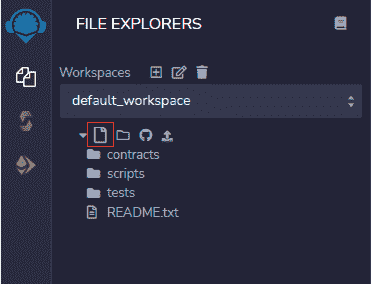

接下来，转到 [GitHub 链接](https://github.com/Bitatlas/NewERC20coin/blob/main/ERC20demo.sol)并复制代码，如下所示:

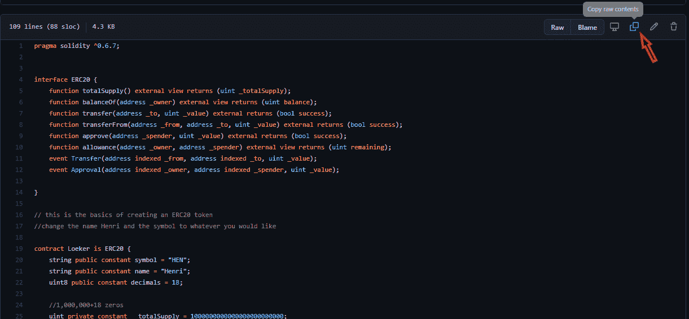

然后转到创建的文件并粘贴代码。

接下来，转到默认文件 **contracts** ，打开 **Storage.sol** ，如下图所示:

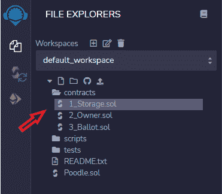

在文件内部，将许可证代码复制到第 1 行，然后返回到 **Poodle.sol** 将代码粘贴到第 1 行，您的代码应该如下所示

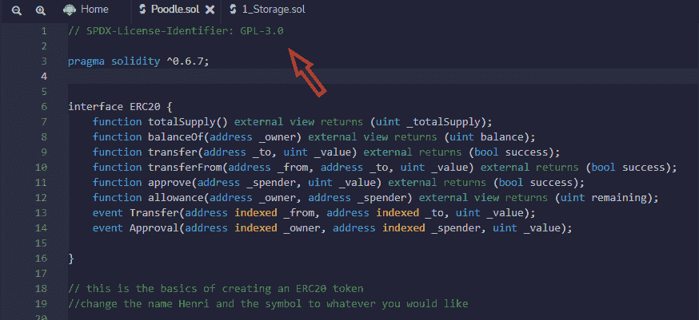

现在我们准备开始创建我们的令牌。所以，转到第 21 行，我们需要做一些修改。如下所示更改这些值:

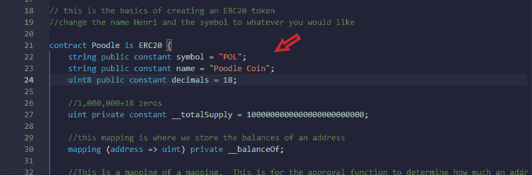

其他的事情都已经为我们设定好了，你需要注意绿色的文字(评论)才能理解，不过我也会在下面加以解释:


首先，线条 **24** 和 **27** 是相关的。

Line **24** 指定代表令牌的小数位数；这种情况下是 **18。**所以，1 个单位的 toke token 基本上是这样表示的: **1 + 00000000000000000。**

Line **27** 是我们希望智能合约生成的令牌的总供应量。在这种情况下，1，000，000(供应一百万个这种代币)，因此我们添加 18 位小数来表示一个代币，如下所示:

**1+000 000+000 000 000 000 000 000**

```
uint private constant __totalSupply = 1000000000000000000000000;
```

这就给我们带来了第 **27** 行上的 0 的总数。

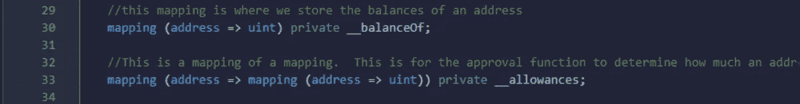

简单解释一下上面的代码，我们只是将任何交易的任何批准映射到一个指定的地址。在授权交易之前，我们需要根据余额来确定一个地址可能要花多少钱。

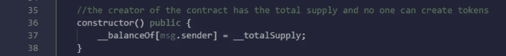

上面的构造函数只是将令牌的总量分配给智能契约的创建者，也就是您当前正在运行的程序。

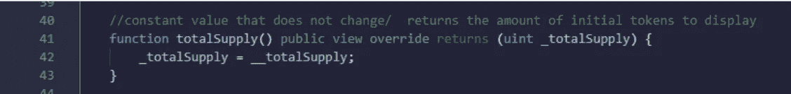

上面的代码简单地允许任何人检查提供的令牌总数。在我们的情况下，应该有一百万个代币。

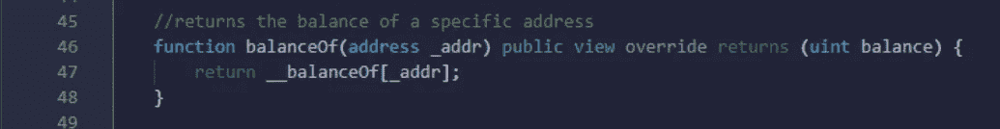

如上所述，上面这段代码允许任何人查看特定地址的余额。

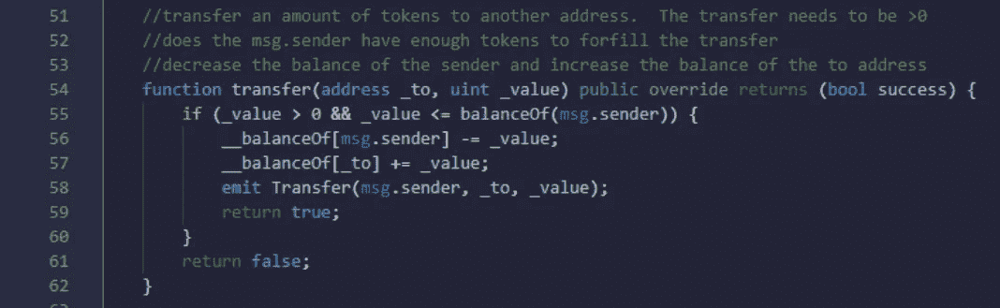

上面的截图是转移功能，它让我们能够将一些令牌从一个钱包转移到另一个钱包。根据帐户的余额，您可以通过首先检查发送者的钱包值是否大于零以及发送者是否有要转移的金额来进行转移。接下来，您将从发送者的钱包中扣除转账金额— **第 56 行—**并将其添加到**第 57 行**的接收者的钱包中。然后我们在第 58 行发出函数。

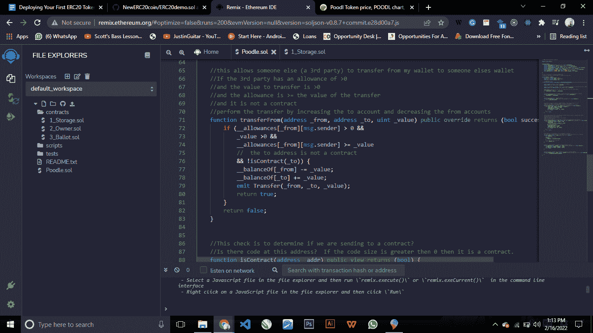

上述代码允许第三方在对前一个函数进行类似的检查后，将一些令牌从您的钱包转移到另一个钱包。如果第三方具有基于以下代码的容差，则启用该功能:

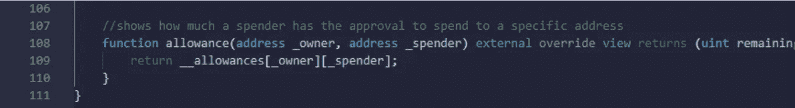

如果允许第三方的地址，则调用/启用/激活第三方从您的钱包转账的功能。

我希望这足够简单，🥂😉

**🎞️** [**Crypto 亨利 Youtube**](https://www.youtube.com/@cryptohenri)

## **下一站，在本地部署您的 ERC20 令牌**

要部署您的令牌，您需要:

1.  点击**实体编译器**，如下图所示:


2.通过进入编译器并选择如下所示的**编译器 6.7** ，将你的程序转换成一种可靠可读的语言(或者你的代码版本):

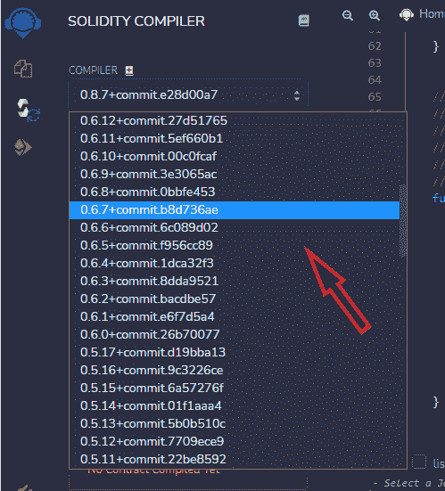

3.点击**编译。**如果你从一开始就完全按照我给你展示的去做，应该不会有任何错误信息。

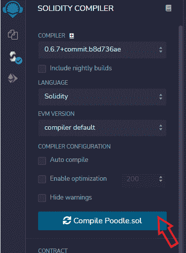

4.点击**部署并运行事务。**确保选择的环境是相同的， **Javascript VM(伦敦)。它用于在本地部署合同(在您计算机上的 JavaScrupt 虚拟机中),而不是在区块链级别。**

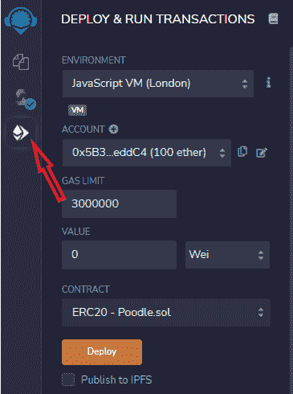

5.接下来，单击部署，如上面的屏幕截图所示。确保检查**合同**并选择您的合同，如下所示:

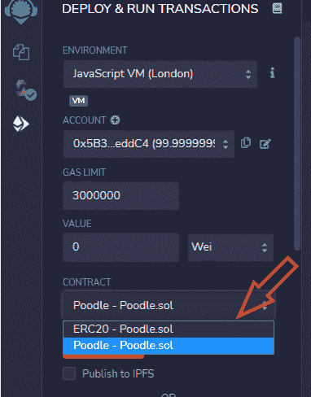

6.您应该确认您具有如下所示的选项，因为您现在可以在本地执行操作(在您的计算机上，但不能在区块链上)。您现在可以测试您的智能合约功能了！🦾

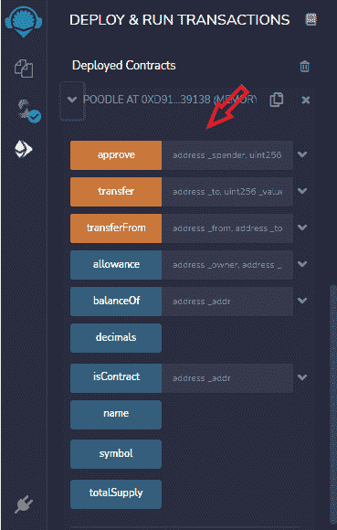

7.部署之后，您将看到一个要调用的[函数](https://ethereum.org/en/developers/docs/standards/tokens/erc-20/#body)的列表。让我们一个接一个地看它们，如上图所示。这些功能是使 ERC20 标准成为标准的功能。所有 ERC20 令牌都具有以下功能

*   [Approve](https://ethereum.org/en/developers/tutorials/erc20-annotated-code/#approve) ():这个方法在被调用时给一个花费者一笔钱的访问权。它需要消费者的地址和金额。
*   [转账](https://ethereum.org/en/developers/tutorials/erc20-annotated-code/#transfer-tokens)():代币审批完成后，消费方可以对代币进行转账/提现。
*   [TransferFrom](https://ethereum.org/en/developers/tutorials/erc20-annotated-code/#transferFrom) ():代表令牌所有者授权使用令牌。
*   [津贴](https://ethereum.org/en/developers/tutorials/erc20-annotated-code/#allowance-functions)():津贴函数返回剩余的代币金额。允许支出者从所有者的账户中提款。
*   balanceOf():该方法通过将令牌地址作为参数来获取令牌的当前余额。
*   Decimals():令牌所有者设置的单位
*   isContract():确认合同的地址
*   name():令牌的名称。
*   Symbol():显示代码中设置的令牌符号。
*   TotalSupply():代码中设置的令牌的总供应量。

# 终于来真的了！让我们在区块链上部署 ERC20 令牌！

首先，你需要安装一个**非保管钱包**，例如[元掩码](http://metamask.io)。Metamask 是保存用户帐户的网关，也允许我们在几秒钟内探索区块链应用程序。安装元掩码后，进入设置- >高级- >显示测试网络。在这里，你可以在其他人中间找到 Rinkeby 网络。现在，让我们用一些测试乙醚为我们的 Rinkeby 帐户提供资金。这是支付部署智能合同的燃气费所必需的。如果您的 Rinkeby 帐户中还没有水龙头资金，复制您的以太坊地址，您可以在此处获得水龙头资金[。](https://faucets.chain.link/rinkeby)

当这些都设置好后，进入你的程序，将你的选择从 **JavaScript VM(伦敦)**更改为 **Injected Web3** ，如下所示:

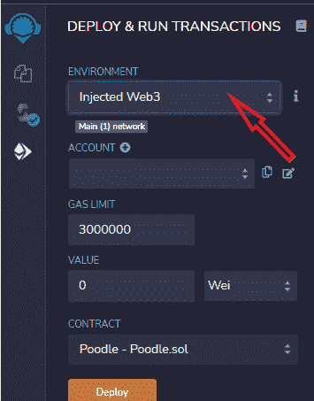

然后在 MetaMask 中确保选择了 **Rinkeby 测试网络**，您现在可以开始部署了；当提示符出现时，确保将 Remix 连接到 Metamask。此外，当提示出现时，请确保**确认交易**和支付汽油费。

嘣！搞定了。菲尼托！

您应该会看到如下所示的页面，就是这样，**您是一名正在成长中的区块链开发人员！**

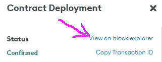

您可以在 Metamask 上检查交易，并点击“在 block explorer 上查看”,以便在 Etherscan 上查看交易。

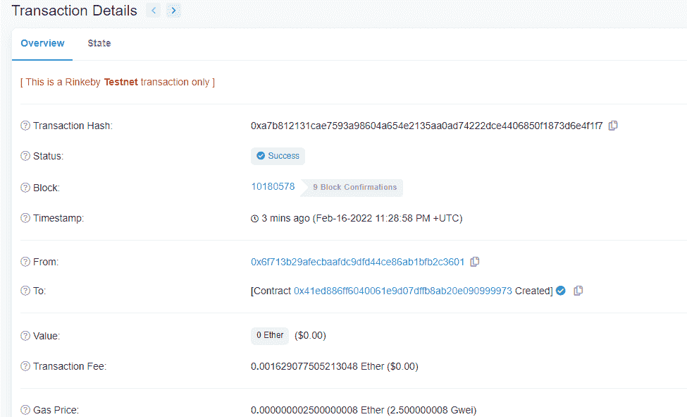

现在，您应该能够看到新令牌，并通过在 Etherscan 上检查它来查看契约部署。

现在，您还可以使用 Remix 与智能合约进行交互，还可以通过单击“导入令牌”将新令牌添加到元掩码，然后将新合约地址复制/粘贴到元掩码中。🚀

如果你想学习这个和更多类型的智能合约，看看这个[智能合约大师班](https://www.udemy.com/course/create-nfts-tokens-and-daos-smart-contracts-masterclass/?referralCode=39A122B4B0FA4780826A)，在我的下一篇文章中，我们将部署另一种类型的 ERC20 令牌！

如果你认为这篇博文值得你花费每一点时间，请和一个也会从中受益的朋友分享，🥂

**👾** [**创建 NFT、令牌和 DAOs 智能合约主类**](https://www.udemy.com/course/create-nfts-tokens-and-daos-smart-contracts-masterclass/?referralCode=39A122B4B0FA4780826A)

🦄 [**元宇宙大师班——了解元宇宙的一切**](https://www.udemy.com/course/metaverse-masterclass-learn-everything-about-the-metaverse/?referralCode=4795AA478A4B496F3BC5)

⭐ [**NFT 投资大师班——关于 NFT 投资的亲招**](https://www.udemy.com/course/nft-investing-masterclass-pro-tips-about-nft-investing/?referralCode=32FD108E41BB3959925F)

**📖** [](https://www.amazon.com/dp/B091CYTX37/ref=sr_1_1?dchild=1&keywords=unblockchain&qid=1617186443&s=digital-text&sr=1-1)[**完整的 NFTs 课程**](https://www.udemy.com/course/the-complete-nft-course-learn-everything-about-nfts/?referralCode=AAEE908D13D0E2276B19)**——**[**了解 NFTs 的一切**](https://medium.com/r?url=https%3A%2F%2Fwww.udemy.com%2Fcourse%2Fthe-complete-nft-course-learn-everything-about-nfts%2F%3FreferralCode%3DAAEE908D13D0E2276B19)

**🎞️** [**Crypto 亨利**](https://www.youtube.com/@cryptohenri)