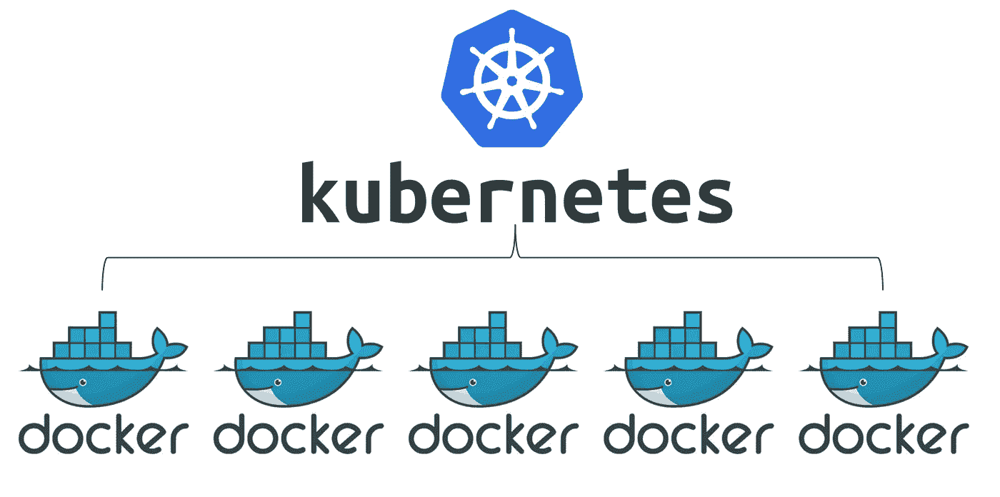
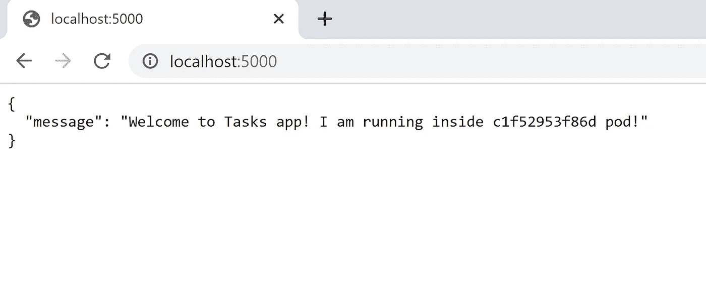

# 在 Kubernetes 上部署您的第一个 Flask+MongoDB 应用程序

> 原文：<https://levelup.gitconnected.com/deploy-your-first-flask-mongodb-app-on-kubernetes-8f5a33fa43b4>



在本文中，我们将开发一个 Python Flask 应用程序，它可以与 MongoDB 数据库对话，使用 Docker 将其容器化，并将其部署在 Kubernetes 集群上。上一句话中的许多术语可能听起来目标很复杂，但是让我们把它分解成简单的步骤，然后一个一个地征服它们。点击查看完整代码[。](https://github.com/varunkumar032/tasksapp-python)

# 第 1 部分:创建您的应用程序

**先决条件:**如果您希望在本地运行一次应用程序，请在您的机器上安装 Flask、Flask-PyMongo 和 MongoDB 服务器实例。你可以跳过这一步，因为我们将应用程序和数据库容器化。

我们将在这里构建的应用程序是一个简单的任务应用程序，您可以在其中创建、更新和删除简单的任务。这些数据将存储在 MongoDB 数据库中，这是一个存储灵活的类似 JSON 的文档的开源数据库。默认情况下，当 MongoDB 服务器实例在机器上启动时，它开始监听端口`27017`。Flask-PyMongo 模块帮助我们架起了 Flask 和 MongoDB 的桥梁，并提供了一些便利的帮手。ObjectId 模块是一个使用 MongoDB ObjectId 的工具，ObjectId 是每个文档的`_id`字段的默认值，在任何文档的创建过程中生成。我们将使用`curl`命令与我们的应用程序对话，这将在我们将应用程序部署到集群后讨论。

目前，我们的工作目录`tasksapp-python`包括:

1.`requirements.txt` -由 Flask 和 Flask-PyMongo 条目组成，这些条目将在我们构建 Docker 映像时安装。

```
Flask
Flask-PyMongo
```

2.`app.py` -当运行在任何主机(`python app.py`)上时，可以在其中的`http://localhost:5000/`处访问。

```
from flask import Flask, request, jsonify
from flask_pymongo import PyMongo
from bson.objectid import ObjectId
import socketapp = Flask(__name__)
app.config["MONGO_URI"] = "mongodb://mongo:27017/dev"
mongo = PyMongo(app)
db = mongo.db@app.route("/")
def index():
    hostname = socket.gethostname()
    return jsonify(
        message="Welcome to Tasks app! I am running inside {} pod!".format(hostname)
    )@app.route("/tasks")
def get_all_tasks():
    tasks = db.task.find()
    data = []
    for task in tasks:
        item = {
            "id": str(task["_id"]),
            "task": task["task"]
        }
        data.append(item)
    return jsonify(
        data=data
    )@app.route("/task", methods=["POST"])
def create_task():
    data = request.get_json(force=True)
    db.task.insert_one({"task": data["task"]})
    return jsonify(
        message="Task saved successfully!"
    )@app.route("/task/<id>", methods=["PUT"])
def update_task(id):
    data = request.get_json(force=True)["task"]
    response = db.task.update_one({"_id": ObjectId(id)}, {"$set": {"task": data}})
    if response.matched_count:
        message = "Task updated successfully!"
    else:
        message = "No Task found!"
    return jsonify(
        message=message
    )@app.route("/task/<id>", methods=["DELETE"])
def delete_task(id):
    response = db.task.delete_one({"_id": ObjectId(id)})
    if response.deleted_count:
        message = "Task deleted successfully!"
    else:
        message = "No Task found!"
    return jsonify(
        message=message
    )@app.route("/tasks/delete", methods=["POST"])
def delete_all_tasks():
    db.task.remove()
    return jsonify(
        message="All Tasks deleted!"
    )if __name__ == "__main__":
    app.run(host="0.0.0.0", port=5000)
```

在`app.py`文件中，我们首先导入所有需要的模块，并创建 Flask 类(我们的应用程序)和 PyMongo 类(我们的数据库)的实例。请注意，`MONGO_URI` Flask 配置变量中的主机名被定义为‘mongo’而不是‘localhost’。这是因为‘mongo’将是我们的数据库容器的名称，同一个 Docker 网络中的容器可以通过它们的名称相互对话。

如果您希望在本地运行应用程序，请使用`app.config[“MONGO_URI”] = “mongodb://localhost:27017/dev”`。

我们的应用由六个函数组成，它们由`@app.route()` Python decorator 分配 URL。乍一看，很容易理解装饰者告诉我们的应用程序，无论何时用户在给定的`route()`访问我们的`@app`域，执行底层功能。

1.  `index()` -每当点击应用程序时显示欢迎信息。还显示运行我们应用程序的机器的主机名。这有助于理解我们每次尝试访问应用程序时都会碰到随机的 pod。
2.  `get_all_tasks()` -以字典列表的形式显示数据库中所有可用的任务。
3.  `create_task()` -创建一个新任务，该任务以唯一的 ID 存储在数据库中。
4.  `update_task(id)` -修改任何现有任务。如果没有找到具有查询 ID 的任务，则返回适当的消息。
5.  `delete_task(id)` -从数据库中删除具有查询 ID 的任务条目。如果找不到具有指定 ID 的任务，则返回适当的消息。
6.  `delete_all_tasks()` -删除所有任务。返回一个空列表。

在运行应用程序的最后一部分，我们将`host`参数定义为‘0 . 0 . 0 . 0 ’,使服务器可以公开使用，运行在机器的 IP 地址上。这里我说的机器是一个吊舱，我们以后再讨论。

# 第 2 部分:容器化应用程序

**先决条件:**在你的机器上安装 Docker 并创建一个 Docker Hub 帐户，如果你没有的话。使用`docker login`命令授权 Docker 连接到 Docker Hub 帐户。

现在，让我们为我们的应用程序构建一个 Docker 映像，它可以被推送到 Docker Hub 注册中心。在我们的工作目录`tasksapp-python`中，将创建一个包含以下内容的`Dockerfile`:

```
FROM python:alpine3.7
COPY . /app
WORKDIR /app
RUN pip install -r requirements.txt
ENV PORT 5000
EXPOSE 5000
ENTRYPOINT [ "python" ]
CMD [ "app.py" ]
```

我们使用基于 Alpine Linux 项目的官方 Python 映像作为基础映像，并将工作目录的内容复制到映像上的一个新目录中。我们指示图像在作为容器运行时公开端口`5000`，在该端口上我们可以访问我们的应用程序。最后，我们的应用程序容器被配置为在创建时自动运行`python app.py`。

这里，我们使用下面的命令构建标签为`<username>/<image-name>:<version>`格式的图像:

```
>docker build -t varunkumarg/tasksapp-python:1.0.0 .
```

并将其推送到 Docker Hub 注册表:

```
>docker push varunkumarg/tasksapp-python:1.0.0
```

*注意:确保用您的 Docker Hub 用户名替换< varunkumarg >。*

我们的图像在 Docker Hub 上公开，世界上任何人都可以下载并运行它。

现在我们的 app 容器化了，那我们的数据库呢？我们如何将它集装箱化？我们不必担心它，因为我们可以轻松地使用官方的`mongo` Docker 映像，并在与应用程序容器相同的网络上运行它。

运行以下命令在本地测试我们的映像:

```
>docker network create tasksapp-net
>docker run --name=mongo --rm -d --network=tasksapp-net mongo
>docker run –-name=tasksapp-python --rm -p 5000:5000 -d –-network=tasksapp-net varunkumarg/tasksapp-python:1.0.0
```



“c1f52953f86d”是 tasksapp-python 容器的容器 ID

下一步是在容器编排器上运行这个容器化的应用程序。

# 第 3 部分:部署应用程序

**先决条件:**使用 Minikube(单节点集群)或 kubeadm(多节点集群)等安装工具或 GKE、EKS 或 AKS 等托管 Kubernetes 服务创建的 Kubernetes 集群。在这里，我使用一个由 1 个主服务器和 3 个工作服务器组成的集群，使用 kubeadm 部署在 Ubuntu 18.04 虚拟机上。

```
myuser@master1:~$ kubectl get nodes
NAME      STATUS   ROLES    AGE   VERSION
master1   Ready    master   25h   v1.18.5
worker1   Ready    <none>   25h   v1.18.5
worker2   Ready    <none>   25h   v1.18.5
worker3   Ready    <none>   25h   v1.18.5
```

为了在 Kubernetes 集群上部署我们的应用程序，我们将为每个 Kubernetes 资源创建`.yaml`文件，并运行一组`kubectl`命令。这些资源将按如下方式部署:

1.`tasksapp`部署:

`tasksapp.yaml`文件定义了在任何工作节点上的 pod 中运行的应用程序的部署。`spec`部分定义了我们指定要提取和运行的图像的窗格。Pod 的端口`5000`暴露在外。

```
apiVersion: apps/v1
kind: Deployment
metadata:
  name: tasksapp
  labels:
    app: tasksapp
spec:
  replicas: 1
  selector:
    matchLabels:
      app: tasksapp
  template:
    metadata:
      labels:
        app: tasksapp
    spec:
      containers:
        - name: tasksapp
          image: varunkumarg/tasksapp-python:1.0.0
          ports:
            - containerPort: 5000
          imagePullPolicy: Always
```

使用`kubectl create`创建`tasksapp`部署。

```
myuser@master1:~$ kubectl create -f tasksapp.yaml
deployment.apps/tasksapp created
myuser@master1:~$ kubectl get deployments
NAME       READY   UP-TO-DATE   AVAILABLE   AGE
tasksapp   1/1     1            1           61s
```

我们可以使用`kubectl scale`和`--replicas`选项来扩展部署。

```
myuser@master1:~$ kubectl scale deployment tasksapp --replicas=3
deployment.apps/tasksapp scaled
myuser@master1:~$ kubectl get pods -o wide
NAME                        READY   STATUS    RESTARTS   AGE   IP          NODE      NOMINATED NODE   READINESS GATES
tasksapp-645b67dfbc-2kqp5   1/1     Running   0          37m   10.38.0.1   worker2   <none>           <none>
tasksapp-645b67dfbc-mqh97   1/1     Running   0          32s   10.44.0.2   worker3   <none>           <none>
tasksapp-645b67dfbc-ncrt7   1/1     Running   0          32s   10.40.0.2   worker1   <none>           <none>
```

2.`tasksapp-svc`负载平衡器服务:

LoadBalancer 服务使部署中的 pod 可以从集群外部进行访问。在这里，由于我们使用定制的 Kubernetes 集群，我们将在`<service-ip>:<service-port>`从主节点访问应用程序。服务由`tasksapp-svc.yaml`定义。使用服务的优势是，它为我们提供了一个一致的 IP 来访问我们的应用程序，因为在我们的部署中可能会有许多 pod 来来去去。

```
apiVersion: v1
kind: Service
metadata:
  name: tasksapp-svc
spec:
  selector:
    app: tasksapp
  ports:
    - port: 8080
      targetPort: 5000
  type: LoadBalancer
```

这里，服务`tasksapp-svc`的端口`8080`被绑定到与其相连的 pod 的端口`5000`。

```
myuser@master1:~$ kubectl create -f tasksapp-svc.yaml
service/tasksapp-svc created
myuser@master1:~$ kubectl get svc tasksapp-svc
NAME           TYPE           CLUSTER-IP      EXTERNAL-IP   PORT(S)          AGE
tasksapp-svc   LoadBalancer   10.103.82.106   <pending>     8080:32156/TCP   13s
```

现在，我们应该能够在`10.103.82.106:8080`访问我们的应用程序。

```
myuser@master1:~$ curl 10.103.82.106:8080
{
  "message": "Welcome to Tasks app! I am running inside tasksapp-645b67dfbc-2kqp5 pod!"
}
myuser@master1:~$ curl 10.103.82.106:8080
{
  "message": "Welcome to Tasks app! I am running inside tasksapp-645b67dfbc-2kqp5 pod!"
}
myuser@master1:~$ curl 10.103.82.106:8080
{
  "message": "Welcome to Tasks app! I am running inside tasksapp-645b67dfbc-mqh97 pod!"
}
myuser@master1:~$ curl 10.103.82.106:8080
{
  "message": "Welcome to Tasks app! I am running inside tasksapp-645b67dfbc-ncrt7 pod!"
}
```

我们可以清楚地看到，每次我们试图点击我们的应用程序时，`LoadBalancer`都会将流量发送到任意一个随机的 pod。此时，我们应用程序的其他功能无法使用，因为我们的数据库 pod 还没有准备好。

3.`mongo-pv`持续音量:

这创建了一个 256 MB 的存储卷，可供 mongo 容器使用。即使 MongoDB pod 被删除或移动到不同的节点，该卷的内容仍然存在。这是在`mongo-pv.yaml`中定义的。

```
apiVersion: v1
kind: PersistentVolume
metadata:
  name: mongo-pv
spec:
  capacity:
    storage: 256Mi
  accessModes:
    - ReadWriteOnce
  hostPath:
    path: /tmp/db
```

为了简单起见，我使用主机上的本地路径`/tmp/db`作为磁盘路径。如果我们使用像`gcePersistentDisk`这样的持久磁盘就更好了。

```
myuser@master1:~$ kubectl create -f mongo-pv.yaml
persistentvolume/mongo-pv created
myuser@master1:~$ kubectl get pv
NAME       CAPACITY   ACCESS MODES   RECLAIM POLICY   STATUS      CLAIM   STORAGECLASS   REASON   AGE
mongo-pv   256Mi      RWO            Retain           Available                                   65s
```

您可以注意到，该卷的状态是`Available`用于索赔。

4.`mongo-pvc`持续量声明:

这用于要求/获得上面创建的存储，并且可以安装在`mongo`容器上。它在`mongo-pvc.yaml`中定义。

```
apiVersion: v1
kind: PersistentVolumeClaim
metadata:
  name: mongo-pvc
spec:
  accessModes:
    - ReadWriteOnce
  resources:
    requests:
      storage: 256Mi
```

创建 PersistentVolumeClaim，您可以看到卷的状态现在更改为`Bound`。

```
myuser@master1:~$ kubectl create -f mongo-pvc.yaml
persistentvolumeclaim/mongo-pvc created
myuser@master1:~$ kubectl get pvc
NAME        STATUS   VOLUME     CAPACITY   ACCESS MODES   STORAGECLASS   AGE
mongo-pvc   Bound    mongo-pv   256Mi      RWO                           20s
myuser@master1:~$ kubectl get pv
NAME       CAPACITY   ACCESS MODES   RECLAIM POLICY   STATUS   CLAIM               STORAGECLASS   REASON   AGE
mongo-pv   256Mi      RWO            Retain           Bound    default/mongo-pvc                           6m57s
```

5.`mongo`部署:

类似于`tasksapp.yaml`，在`mongo.yaml`中我们定义了`mongo`部署，它创建了 MongoDB 服务器的一个实例。在这里，我们公开了其他 pod 可以访问的端口`27017`。所要求的持久卷可以被安装到容器上的目录中。

```
apiVersion: apps/v1
kind: Deployment
metadata:
  name: mongo
spec:
  selector:
    matchLabels:
      app: mongo
  template:
    metadata:
      labels:
        app: mongo
    spec:
      containers:
        - name: mongo
          image: mongo
          ports:
            - containerPort: 27017
          volumeMounts:
            - name: storage
              mountPath: /data/db
      volumes:
        - name: storage
          persistentVolumeClaim:
            claimName: mongo-pvc
```

使用`kubectl create`创建`mongo`部署。

```
myuser@master1:~$ kubectl create -f mongo.yaml
deployment.apps/mongo created
myuser@master1:~$ kubectl get deployments
NAME       READY   UP-TO-DATE   AVAILABLE   AGE
mongo      1/1     1            1           59s
tasksapp   3/3     3            3           44m
```

6.`mongo`服务:

这个由`mongo-svc.yaml`定义的服务类似于为我们的应用程序创建的服务，除了它属于类型`ClusterIP`(Kubernetes 中的默认服务类型)。该服务使`mongo` pod 可以从集群内部访问，但不能从外部访问。唯一可以访问 MongoDB 数据库的资源是我们的应用程序。

```
apiVersion: v1
kind: Service
metadata:
  name: mongo
spec:
  selector:
    app: mongo
  ports:
    - port: 27017
      targetPort: 27017
```

这里，服务`mongo-svc`的端口`27017`被绑定到与之相连的`mongo` pod 的端口`27017`。

```
myuser@master1:~$ kubectl create -f mongo-svc.yaml
service/mongo created
myuser@master1:~$ kubectl get svc mongo
NAME    TYPE        CLUSTER-IP     EXTERNAL-IP   PORT(S)     AGE
mongo   ClusterIP   10.100.83.25   <none>        27017/TCP   8s
```

我们可以使用以下命令测试`mongo` pod 是否启动并运行。

```
myuser@master1:~$ curl 10.100.83.25:27017
It looks like you are trying to access MongoDB over HTTP on the native driver port.
```

# 第 4 部分:测试您的应用程序

**前提:** `curl`要安装在`master`节点上。

现在我们可以在`10.103.82.106:8080`访问我们的应用程序，让我们试着测试我们的应用程序提供的所有功能。

```
myuser@master1:~$ curl 10.103.82.106:8080
{
  "message": "Welcome to Tasks app! I am running inside tasksapp-645b67dfbc-ncrt7 pod!"
}myuser@master1:~$ curl 10.103.82.106:8080/tasks
{
  "data": []
}myuser@master1:~$ curl -X POST -d "{\"task\": \"Task 1\"}" http://10.103.82.106:8080/task
{
  "message": "Task saved successfully!"
}
myuser@master1:~$ curl -X POST -d "{\"task\": \"Task 2\"}" http://10.103.82.106:8080/task
{
  "message": "Task saved successfully!"
}
myuser@master1:~$ curl -X POST -d "{\"task\": \"Task 3\"}" http://10.103.82.106:8080/task
{
  "message": "Task saved successfully!"
}myuser@master1:~$ curl 10.103.82.106:8080/tasks
{
  "data": [
    {
      "id": "5ef8bce7df44b8194ee30c9a",
      "task": "Task 1"
    },
    {
      "id": "5ef8bcef7bc5ec979ae73a43",
      "task": "Task 2"
    },
    {
      "id": "5ef8bcf742b0630f70328296",
      "task": "Task 3"
    }
  ]
}myuser@master1:~$ curl -X PUT -d "{\"task\": \"Task 1 Updated\"}" http://10.103.82.106:8080/task/5ef8bce7df44b8194ee30c9a
{
  "message": "Task updated successfully!"
}myuser@master1:~$ curl 10.103.82.106:8080/tasks
{
  "data": [
    {
      "id": "5ef8bce7df44b8194ee30c9a",
      "task": "Task 1 Updated"
    },
    {
      "id": "5ef8bcef7bc5ec979ae73a43",
      "task": "Task 2"
    },
    {
      "id": "5ef8bcf742b0630f70328296",
      "task": "Task 3"
    }
  ]
}myuser@master1:~$ curl -X DELETE http://10.103.82.106:8080/task/5ef8bce7df44b8194ee30c9a
{
  "message": "Task deleted successfully!"
}myuser@master1:~$ curl 10.103.82.106:8080/tasks
{
  "data": [
    {
      "id": "5ef8bcef7bc5ec979ae73a43",
      "task": "Task 2"
    },
    {
      "id": "5ef8bcf742b0630f70328296",
      "task": "Task 3"
    }
  ]
}myuser@master1:~$ curl -X POST http://10.103.82.106:8080/tasks/delete
{
  "message": "All Tasks deleted!"
}myuser@master1:~$ curl 10.103.82.106:8080/tasks
{
  "data": []
}
```

咻！那真是一段旅程。我们实现了我们一开始对自己的承诺:

1.  创建一个与 MongoDB 数据库对话的 Flask 应用程序
2.  使用 Docker 将应用容器化
3.  在 Kubernetes 集群上部署应用程序

而且成功了！！恭喜你！！给自己一个鼓励！！

快乐学习！！