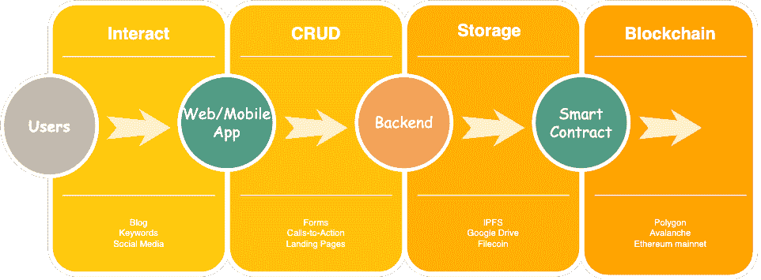
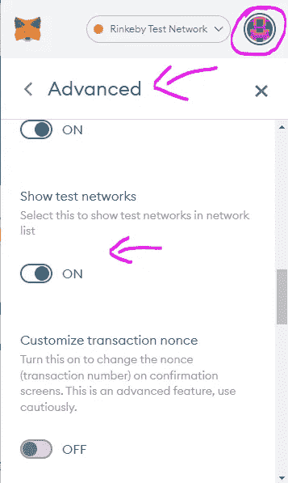
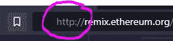
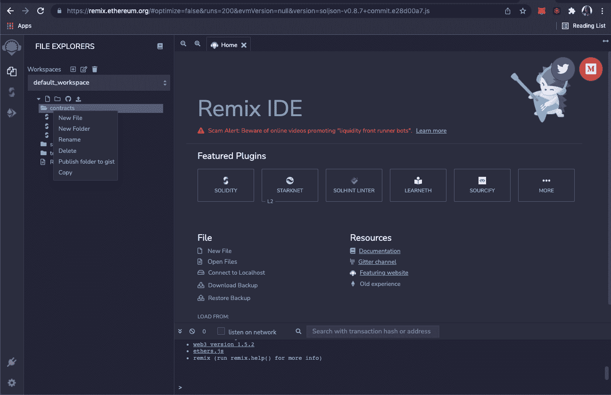
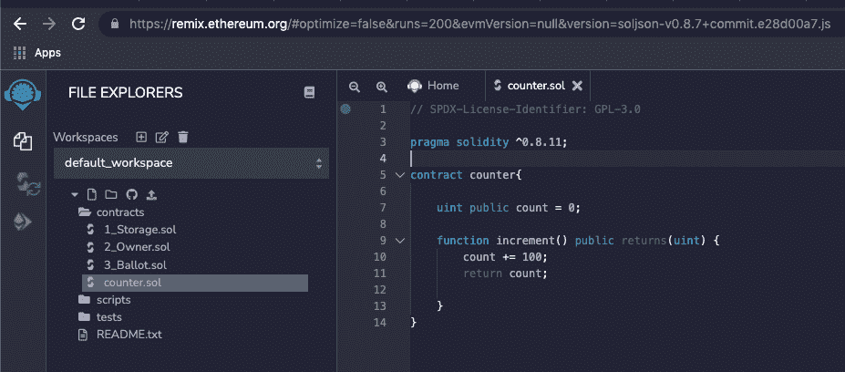
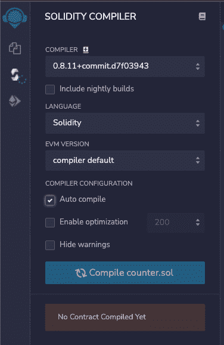
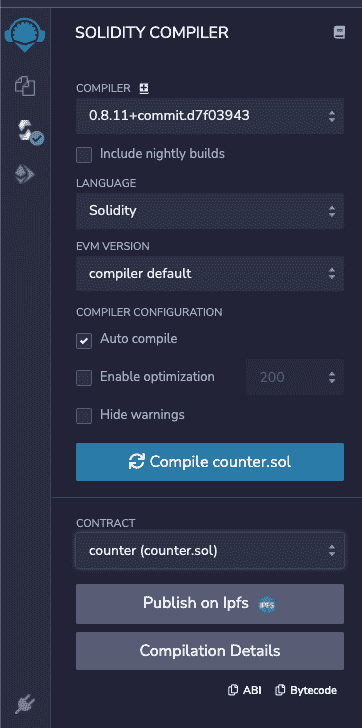
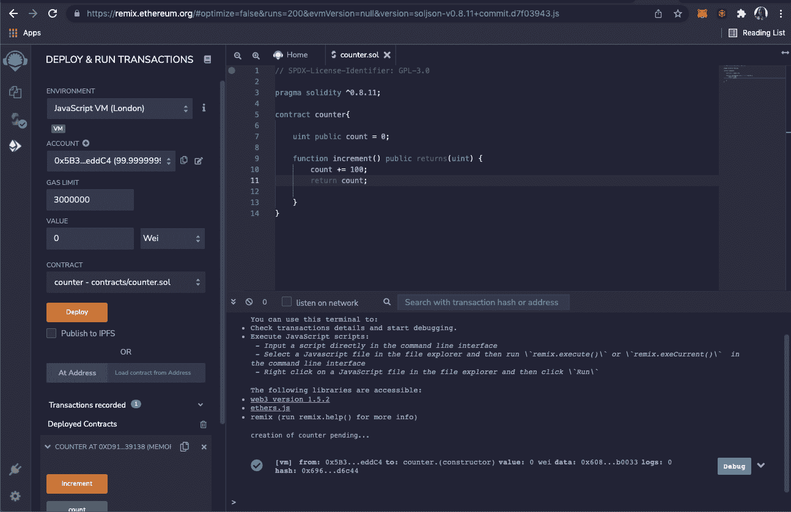

# 在 5 分钟内部署您的首个智能合同

> 原文：<https://levelup.gitconnected.com/deploy-your-first-smart-contract-in-5-minutes-67361699ae03>

麦克风检查，1，2…🎤

在本文中，我将带您完成部署您的第一个或第二个智能合同的过程。

没有任何编码经验也不用担心。请跟我来…

好了，我们开门见山吧！本文是讨论智能合约的系列文章。如果您对创建智能合约和令牌感兴趣，您也应该查看这个[智能合约主类](https://www.udemy.com/course/create-nfts-tokens-and-daos-smart-contracts-masterclass/?referralCode=39A122B4B0FA4780826A)。

你是 web2 出身的吗？还是你连一点编码经验都没有，想在 5 分钟内成为一名智能合约开发者？(我们都知道那是个寓言..lol)

放心吧，我已经 *gat* 你了！

**🎞️** [**Crypto 亨利 Youtube**](https://www.youtube.com/@cryptohenri)

# 你可能会问，“什么是智能合同？”

在部署智能合约之前，我们需要理解智能合约的基本概念和概述。

智能合约是一组自动执行其程序的计算操作。

*   它可以执行双方之间的合同协议
*   它们是图灵完全的
*   它们是自动执行的
*   它们在一个虚拟机中执行，比如 EVM[(以太坊虚拟机)](https://ethereum.org/en/developers/docs/evm/)
*   它们部署在区块链网络上

web3 的架构与 web2 非常相似，但有一个微小的重要区别。参见下图:

换句话说，前端和后端大部分存储在云提供商 IPFS，或者像 Filecoin 或 Storj 这样的分散服务中。您希望应用程序的逻辑不可改变，它可以存储在区块链上。

# 部署您的首个智能合同所需的东西

*   你需要有你的 IDE(集成开发环境)。我们将使用 [Remix](https://remix.ethereum.org/) (在线以太坊 Ide)
*   你需要配置你的钱包，我们需要资金的天然气和交易费。我们将使用[元掩码](https://metamask.io/)。它是一个基于浏览器的钱包，可以作为一个扩展安装在你的浏览器上(比如 chrome，brave)。

安装 Metamask 后，您可能需要转到“选项”、“高级”,然后打开“如何测试网络”选项。:然后，您将看到以太坊测试网络，并能够切换到 Rinkeby。

*   你需要一些测试乙醚。从[水龙头](https://faucets.chain.link/)(测试)索取或者给我发信息，我会给你发测试乙醚。

# 你的第一份智能合同。我们想让它做什么？

基本上，我们将创建一个**计数器** **合同**。每次调用**增量**函数时，这个计数器契约都会增加我们计数器的值。如果我们计数的初始值是 0，那么每次调用 increment 函数时，它都会执行将它增加 100 的操作。当 increment()被调用 5 次时，我们的计数增加 500。因此我们的计数值为 500。

简单，却又有趣。对吗？

## 在 Remix 上编写代码

我们将编写一个简单的智能合同，并通过 [Remix](https://remix.ethereum.org/) 将其部署到区块链。

*注意:您可能需要从“https”中删除“s”，否则，它可能会抛出一个错误。*

当您在浏览器上打开 remix 时，您将能够在 contracts 文件夹中创建一个新文件…

创建一个文件，命名为“counter.sol”。".sol”是 solidity 文件扩展名。

**遍历每一行代码:**

第 1 行:每个 solidity 文件都以一个[许可证](https://docs.soliditylang.org/en/v0.6.8/layout-of-source-files.html)声明开始。

第 3 行:在此之后声明 solidity 版本。代码中的版本显示我们的代码可以与上面的 0.8.11 版本一起工作。

第 5 行:就像我们在其他编程语言中声明一个类一样，我们通常使用“契约计数器”来声明契约的名称

第 7 行:我们声明了一个名为 count 的状态变量，并使它可以公开访问。我们还将其赋值为 0

第 9 行:我们声明了 increment 函数，它将增加并返回我们的计数值。

一旦你键入的代码完全一样，你在屏幕截图上看到的，我们就完成了我们的编码🥂🦾

现在来编译和测试我们的智能合约…

点击第三个图标，勾选“自动编译”框，然后**点击“编译 counter . sol”**。代码编译成功后，编译器图标上会出现一个绿色的勾号，如下图所示。**确保编译器具有与智能合约相同的版本(在本例中为 0.8.11)。**

现在，让我们通过单击第四个图标在本地部署我们的智能合同。在这种情况下，选择的环境是“JavaScriptVM”，这意味着智能合约将部署在您的计算机上的虚拟环境中(不是真正的区块链)。

点击**部署，**会有如下结果。

这表明它已经部署成功。

一旦契约被部署，现在让我们测试以确认它正在做我们想要它做的事情。您将在“您的智能合同地址”处的“部署”选项卡下看到您的合同名称

*   点击左侧的**下拉箭头**查看您的功能，如上图所示。
*   **点击计数功能**(初始值将为 0)
*   **点击增量功能**。然后，一旦你点击**“count**”你就会看到计数器已经增加了！

🥂🚀祝贺您成为智能合同开发人员！🚀🥂

他们说第一步通常是最难的，对吗？…嗯，还有更多的问题需要解决。

请关注我的下一篇文章，我将向您展示如何创建您的第一个令牌并将其部署到测试网络而不是本地。如果你想学习这个和更多类型的智能合同，看看这个[智能合同大师班](https://www.udemy.com/course/create-nfts-tokens-and-daos-smart-contracts-masterclass/?referralCode=39A122B4B0FA4780826A)。

如果你认为这篇博文值得你花费每一点时间，请和一个也会从中受益的朋友分享，🥂

**👾** [**创建 NFT、令牌和 DAOs 智能合约主类**](https://www.udemy.com/course/create-nfts-tokens-and-daos-smart-contracts-masterclass/?referralCode=39A122B4B0FA4780826A)

🦄 [**元宇宙大师班——了解元宇宙的一切**](https://www.udemy.com/course/metaverse-masterclass-learn-everything-about-the-metaverse/?referralCode=4795AA478A4B496F3BC5)

⭐ [**NFT 投资大师班——关于 NFT 投资的亲招**](https://www.udemy.com/course/nft-investing-masterclass-pro-tips-about-nft-investing/?referralCode=32FD108E41BB3959925F)

**📖****[**完整的 NFTs 课程**](https://www.udemy.com/course/the-complete-nft-course-learn-everything-about-nfts/?referralCode=AAEE908D13D0E2276B19)**——**[**了解 NFTs 的一切**](https://medium.com/r?url=https%3A%2F%2Fwww.udemy.com%2Fcourse%2Fthe-complete-nft-course-learn-everything-about-nfts%2F%3FreferralCode%3DAAEE908D13D0E2276B19)**

****🎞️** [**Crypto 亨利**](https://www.youtube.com/@cryptohenri)**