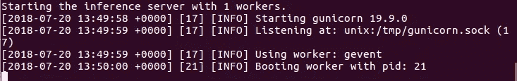
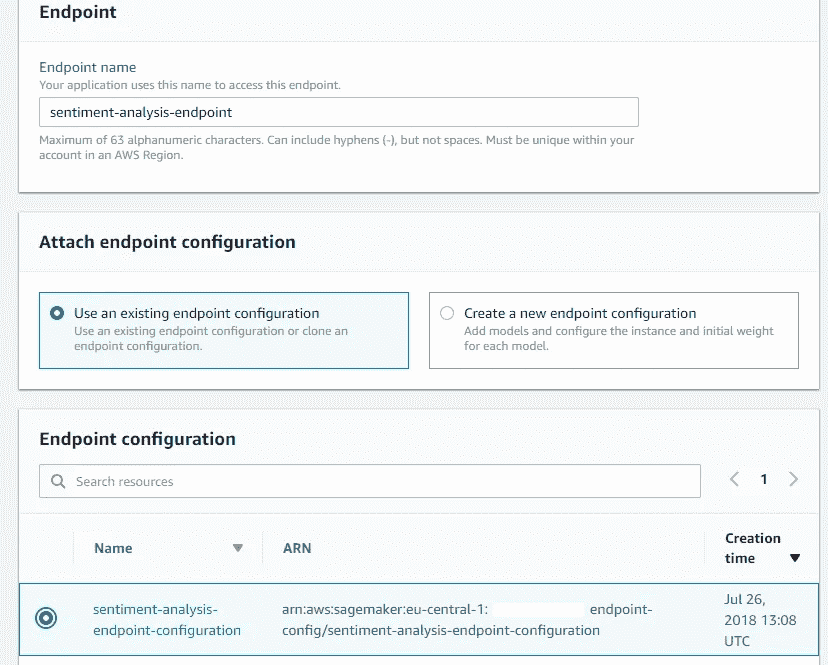

# 在 AWS 上将您的机器学习模型部署为 REST API

> 原文：<https://levelup.gitconnected.com/deploy-your-machine-learning-model-as-a-rest-api-on-aws-english-dcb1a0db3110>

所以你已经花了几天、几周甚至几个月的时间研究你的尖端机器学习模型；清理数据、工程特性、调整模型参数和无休止的测试。现在它终于可以生产了，您希望以一种简单可靠的方式提供它。实现这一点的一种方法是将其部署为 REST API。

在机器学习公司，我们依靠亚马逊网络服务来托管我们的机器学习模型。例如，我们的自动产品分类模型就托管在他们的平台上。与几年前相比，亚马逊提供的服务和功能使部署大规模机器学习模型变得相对容易。但是对于没有 AWS 平台或模型部署经验的人来说，这仍然是一项艰巨的任务。

在这篇文章中，我将向您展示如何使用 Docker 和 AWS 服务(如 ECR、Sagemaker 和 Lambda)将您的机器学习模型部署为 REST API。我们将从保存经过训练的机器学习模型的状态开始，创建推理代码和可以在 Docker 容器中运行的轻量级服务器。然后，我们将把容器化的模型部署到 ECR，并在 Sagemaker 中创建一个机器学习端点。然后，我们将通过创建 REST API 端点来结束。本文中使用的模型是使用 Scikit Learn 制作的，但这里详细介绍的方法将适用于任何 ML 框架，其中可以序列化、冻结或保存估计器或转换器的状态。

本文中使用的所有代码都可以在下面的资源库中找到:【https://github.com/leongn/model_to_api


# 模型

对于这篇文章，我们将使用一个情绪分析模型，该模型对 100000 条带标签的推文进行了训练(积极或消极情绪)。该模型将一个句子或一系列句子作为输入，并输出相应文本的预测情感。它由两部分组成，第一部分是 Scikit Learn 的 TFIDF 矢量器，用于处理文本，第二部分是逻辑回归分类器(也来自 Sklearn)，负责预测句子的情感。

# 保存模型

部署过程的第一步是准备和存储您的模型，以便可以在其他地方轻松地重新打开它。这可以通过序列化来实现，序列化会冻结经过训练的分类器的状态并保存它。为此，我们将使用 Scikit Learn 的 *Joblib* ，这是一个专门为存储大型 numpy 数组而优化的序列化库，因此特别适合 Scikit Learn 模型。如果您的模型中有不止一个 Scikit Learn 估计器或转换器(例如，像我们这样的 TFIDF 预处理器)，您也可以使用 *Joblib* 保存它们。情感分析模型包括两个我们必须保存/冻结的组件:文本预处理器*和分类器。下面的代码将分类器和 tfidf 矢量器转储到文件夹 *Model_Artifacts* 中。*

```
from sklearn.externals import joblib joblib.dump(classifier, 'Model_Artifacts/classifier.pkl') joblib.dump(tfidf_vectorizer, 'Model_Artifacts/tfidf_vectorizer.pkl')
```

模型组件的大小和数量没有限制。如果模型比通常的内存占用量更大，或者需要更多的处理能力，那么您可以选择一个更强大的 AWS 实例。

# 创建 Dockerfile 文件

一旦估算器和转换器被序列化，我们就可以创建一个 Docker 映像来保存我们的推理和服务器环境。Docker 使得打包您的本地环境并在任何其他服务器/环境/计算机上使用它成为可能，而不必担心技术细节。你可以在这里了解更多关于 Docker 图像和容器以及如何定义它们:[https://docs.docker.com/get-started/](https://docs.docker.com/get-started/)。Docker 映像将包含所有必要的组件，这些组件将使您的模型能够执行预测并与外界通信。我们可以用指定环境内容的 Docker 文件定义一个 Docker 映像:我们希望为 webserver 安装 Python 3、Nginx 和各种 Python 包，如 Scikit-Learn、Flask 和 Pandas。

dockerfile 可以在*容器*文件夹中找到: [*Dockerfile*](https://github.com/leongn/model_to_api/blob/master/container/Dockerfile)

docker 文件的第一部分将安装运行服务器和执行我们的 Python 代码所需的一组 Linux 包，第二部分定义我们需要使用的一组 Python 包(如 Pandas 和 Flask ),第三部分定义环境变量。文件的最后一部分告诉 Docker 哪个文件夹( [*)包含我们的推理和必须添加到图像中的服务器代码。*](https://github.com/leongn/model_to_api/tree/master/container/sentiment_analysis)

# 定义服务和推理代码

我们现在可以开始从 Docker 容器内部创建服务于您的机器学习模型的代码。我们将使用 Flask 微框架来处理来自外部的请求，并返回您的模型所做的预测。这是位于文件夹 [*容器/人气 _ 分析*](https://github.com/leongn/model_to_api/tree/master/container/sentiment_analysis) 中的 [*predictor.py*](https://github.com/leongn/model_to_api/blob/master/container/sentiment_analysis/predictor.py) *文件。*

文件的第一部分导入所有必需的依赖项(这里使用的任何依赖项也应该添加到 Dockerfile 文件的第二部分)。我们用 Joblib 加载序列化的模型组件。然后我们创建 Flask 应用程序来服务我们的预测。第一个路由(Ping)通过检查分类器变量是否存在来检查容器的健康状况。如果没有，它将返回一个错误。Sagemaker 随后使用这个“ping”来检查服务器是否正在运行和健康。

接下来是预测部分:服务器接受带有 JSON 数据的 POST 请求，格式如下: `{"input":
[{"text" : "Input text 1"},
{"text" : "Input text 2"},
{"text": "Input text 3"}]}`

首先，我们将 JSON 数据转换为 Pandas 数据帧，然后我们使用 TFIDF 矢量器转换 DF 中的句子，并使用我们的分类器进行预测。分类器输出 0(负面情绪)和 1(正面情绪)。为了可读性，我们将把 0 和 1 分别改为负数和正数。最后，我们将结果转换回 JSON，JSON 可以作为请求的应答发送回来。

# 配置 web 服务器

大多数人可以跳过这一部分，因为他们不必修改服务器使用的工作线程数量。但是如果您的模型很大(比如至少 2GB)，您可能需要修改文件中的 model_server_workers 参数。该参数决定并行启动多少个 Gunicorn 服务器实例。默认值将使用系统中 CPU 的总数作为工作线程的数量。每一个都将保存模型和推理代码的副本，所以如果您有一个大型模型，那么您的机器/实例/服务器上的内存可能会很快填满。因此，您可能希望手动设置工作线程的数量。对于大型模型，将其设置为 1 并执行一些测试，看看您可以达到多高，该参数可以通过环境变量来定义。

# 建立码头工人形象

现在我们已经完成了环境、推理代码和服务器的定义，我们可以开始构建 Docker 映像进行测试了。

将您的终端移动到 docker 文件所在的文件夹中。然后执行下面的命令来构建名为 prediction _ docker _ image*:*的映像

*docker build -t 预测 _docker_image。*

请注意命令末尾的点，它告诉 Docker 在当前目录中查找 Docker 文件。如果出现权限错误，请在命令前面添加 sudo。Docker 现在将开始构建映像，并将它添加到您系统上的当前映像库中。

# 启动 docker 容器

现在 docker 映像已经构建好了，我们将运行并测试它。但是首先，我们必须将所有序列化的模型元素和您可能使用的其他额外文件移动到该文件夹中。该文件夹与 Sagemaker 将在 AWS 实例上使用的文件夹设置相同。

然后，我们将使用 [serve_local.sh](https://github.com/leongn/model_to_api/blob/master/local_test/serve_local.sh) 脚本启动映像和服务器，该脚本告诉 docker 映像测试数据位于何处()，在哪些端口上运行(8080)以及包含推理代码的 Docker 映像的名称是什么。移动到您的终端所在的文件夹，执行以下命令来启动 Docker 容器和服务器:

*。/serve _ local . sh prediction _ docker _ image*

容器将被启动，服务器启动，您将看到以下消息(工作进程的数量取决于 model_server_workers 参数):



如果您想检查 Docker 容器的内存和 CPU 使用情况，打开一个新的终端并执行命令: *docker stats*

# 执行测试推理

现在服务器正在运行，我们可以给它发送一些数据来测试它。这可以通过 [predict.sh](https://github.com/leongn/model_to_api/blob/master/local_test/predict.sh) 脚本来完成。这个脚本向服务器发送一个 JSON 文件。

在终端所在的文件夹中，键入以下命令:

*。/predict.sh input.json*

如果一切顺利，你应该会收到一些预测。恭喜，您的 Docker 映像已经可以部署了！

# 部署 Docker 映像

docker 图像和机器学习模型工件在 Sagemaker 中保持分离。这样，您可以用您的推理代码创建一个 Docker 图像文件，但是插入您的模型的不同版本。我们首先将刚刚创建的 Docker 图像推送到 Amazon Elastic Container Registry(ECR ),它将存储我们的图像。为此，您必须安装 AWS CLI，并在系统上配置一个现有的 AWS 帐户。如果要检查 AWS 配置，请在终端中执行以下命令:

*aws 配置列表*

如果还没有配置，您可以使用 *aws configure* 命令创建一个，并输入您的 aws 凭证。需要注意的是，您应该仔细选择您的区域，所有的模型组件都必须位于同一个区域，以便能够进行通信。

可以使用*容器*文件夹中的 [build_and_push.sh](https://github.com/leongn/model_to_api/blob/master/container/build_and_push.sh) 脚本来执行推送过程。这个脚本将自动创建一个新的 ECR 存储库(如果它还不存在的话),并将您的映像推送到这个存储库中。将您的终端移动到文件夹并执行:

*。/build _ and _ push . sh prediction _ docker _ image*

一旦图像上传，打开位于[https://console.aws.amazon.com](https://console.aws.amazon.com/ecs/)的 AWS 控制台，进入 ECR 并点击左侧窗格中的*存储库*。然后选择您刚刚上传的图像，并复制页面顶部的存储库 URI(创建一个临时文本文件来保存这些信息可能会很有用，因为我们稍后会用到它)。


# 上传模型工件到 S3

如前所述，Docker 映像只包含推理环境和代码，不包含经过训练的序列化模型。序列化的训练模型文件，在 Sagemaker 上称为模型工件，将被存储在一个单独的 S3 存储桶中。我们首先将所有必要的(序列化的)模型组件放在一个 start 压缩文件中(在存储库中找到[)。然后，您可以将它们上传到一个现有的 S3 存储桶(与 ECR 映像位于同一区域)，或者创建一个新的存储桶。这些步骤可以使用 AWS CLI 或通过在线界面来执行。](https://github.com/leongn/model_to_api/tree/master/local_test/test_dir/model)

要使用 AWS 在线界面创建一个新的铲斗，转到 [AWS 控制台](https://console.aws.amazon.com)并选择 S3。接下来，点击 Create bucket，为 Bucket 选择一个名称(例如:perspective-analysis-artifacts)和您希望 Bucket 所在的区域。


该地区应该与您用于 ECR 的地区相同。在下一个*配置选项*页面，您可以更改与您的铲斗相关的不同设置，我建议您选择自动加密。第三个屏幕与设置访问权限相关。缺省值应该适合大多数用户。最后，最后一页允许您查看所有设置。

创建存储桶后，通过单击打开存储桶，然后选择 Upload。继续选择包含您的模型工件的压缩文件。对于接下来的步骤，默认设置是合适的。等待上传完成，点击新上传的文件，复制页面底部的网址以备后用。


# 在 Sagemaker 中设置图像

## 模型创建

现在，映像已部署到 ECR，机器学习模型工件已上传到 S3，我们可以开始配置 Sagemaker 预测端点。我们必须从创建 Sagemaker 模型资源开始。通过您的 AWS 控制台转到 Sagemaker，然后在左侧面板中的“推理”下，单击“模型”，然后单击屏幕右侧的“创建模型”(确保您仍然在正确的区域中)。首先，我们必须给我们的模型起一个名字，并给它分配一个 IAM 角色。如果您已经有了 Sagemaker 的 IAM 角色，请选择该角色。否则，从下拉菜单中选择创建角色。我们想授予我们的 Sagemaker 模型访问我们的 S3 存储桶的权限，或者在特定的 S3 存储桶下给出您的 S3 存储桶的名称(情感-分析-工件),或者选择任何 S3 存储桶。


我们必须告诉 Sagemaker Docker 图像和模型工件的位置。现在，您可以将我们在前面的步骤中获得的 ECR URI 和 S3 URL 粘贴到相应的字段中。在您的图像 URI(例如:* * * * * * * * * . ecr . eu-central-1 . amazonaws . com/perspective _ analysis _ image:latest)的末尾添加标签 *latest* 以确保 Sagemaker 始终从 ECR 中选择您的模型的最新版本。容器主机名是可选的，添加像 Version-1.0 这样的标记可能对版本控制有用。单击 create model 结束。


## 端点配置

下一步是在 Sagemaker 中创建端点配置(左窗格->端点配置->创建端点配置)。这让我们可以指定将哪个模型添加到端点，以及在哪个 AWS 实例上运行它。首先给它起一个名字(例如:情感分析端点配置)。然后单击 Add model 并选择之前创建的模型。


然后我们可以通过点击模型旁边的*编辑*按钮来编辑模型，选择在哪个 AWS 实例上运行它。默认的 ml.m4.large 对于大多数负载应该足够了，但是如果您的模型相对较小或较大，计算密集型或轻量级，您可以选择另一个(参见可用实例的类型:【https://aws.amazon.com/sagemaker/pricing/instance-types/】的和每个地区的价格:[的 https://aws.amazon.com/sagemaker/pricing/](https://aws.amazon.com/sagemaker/pricing/))。点击*创建端点配置*完成此步骤。

## 端点创建

最后一步是创建 Sagemaker 端点(左窗格->端点->创建端点)。首先给端点一个名称，这个名称将在以后被 API 网关用来调用端点。然后选择在上一步中创建的端点配置，并单击选择端点配置。



通过单击创建端点完成该过程。Sagemaker 将开始部署您的模型，这可能需要一点时间。

如果一切按计划进行，您将会在状态栏中看到 InService。

# 创建 REST API

一旦创建了 Sagemaker 端点，您就可以使用 AWS CLI 或 AWS Python SDK (Boto3)从您的 AWS 帐户中访问该模型。如果您想执行一些内部测试，这是没问题的，但是我们想让它对外部世界可用，所以我们必须创建一个 API。

这可以通过亚马逊的圣杯图书馆([https://github.com/aws/chalice](https://github.com/aws/chalice))轻松实现。这是一个微框架，允许在 AWS lambda 上快速创建和部署应用程序，并简化 API 的创建。

首先，您需要使用以下命令安装 Chalice 和用于 Python 的 AWS SDK

*sudo pip 安装圣杯 boto3*

API 网关需要部署在与模型端点相同的区域中。为了确保它是正确的，您可以通过在终端中输入以下命令再次检查您的区域配置: *aws 配置列表*

如果区域不正确，使用 *aws configure* 进行正确配置

这部分的代码可以在 [*api_creation*](https://github.com/leongn/model_to_api/tree/master/api_creation) 文件夹中找到。

主文件夹中的 [app.py](https://github.com/leongn/model_to_api/blob/master/api_creation/app.py) 文件包含了 API 的路由逻辑:当接收到某些请求(比如 POST)时会执行什么动作。在这里，您最终可以更改传入数据的格式，或者进行一些额外的检查，如果 Docker 容器中的推理代码没有执行这些检查的话。这段代码的主要功能是当一个带有数据的 POST 请求被发送到您的 API 时调用您的 Sagemaker 端点，并返回响应。

当一切都配置好了，您可以通过移动到您的终端的 [api_creation](https://github.com/leongn/model_to_api/tree/master/api_creation) 文件夹并执行下面的命令来部署 API 网关: *chalice deploy*

然后，Chalice 将返回 REST API URL。复制并保存它。


现在，您可以使用该端点 URL 来执行请求。您可以使用以下 Python 代码来测试它:

```
import requests # Define test JSON input_sentiment = {'input': [{'text' : 'Today was a great day!'}, {'text' : 'Happy with the end result!'}, {'text': 'Terrible service and crowded. Would not ]} input_json = json.dumps(input_sentiment) # Define your api URL here api_url = 'https://*******.execute-api.eu-central-1.amazonaws.com/api/' res = requests.post(api_url, json=input_json) output_api = res.text print(output_api)
```

上面的代码产生了以下输出:

{ "输出":
[{"label ":"正" }，
{"label ":"正" }，
{"label ":"负" }]}

看起来与输入一致，您的机器学习 API 现在完全可以运行了！

# 关闭端点

一旦完成并且不再需要 API，不要忘记删除 Sagemaker 中的端点，因为实例成本会不断增加。

# 结论

在这篇文章中，你看到了如何:

*   序列化您的机器学习模型组件以进行部署
*   使用推理和服务器代码创建您自己的 Docker 映像
*   将您的 Docker 图像推送到 ECR
*   将您的模型工件保存到 S3
*   配置并创建一个 Sagemaker 端点
*   用 Chalice 创建 API 端点

*原发布于*[*https://machine-learning-company . nl*](https://machine-learning-company.nl/deploy-machine-learning-model-rest-api-using-aws/)*。
作者:* [*莱昂*](https://www.linkedin.com/in/leon-gerritsen/)