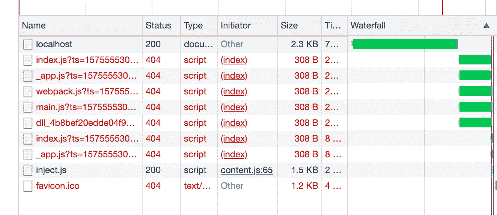
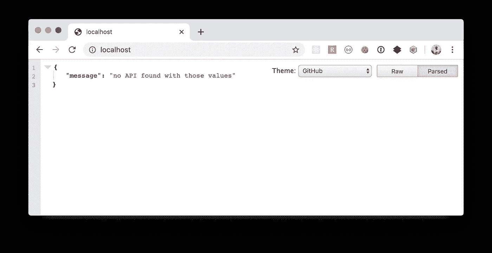
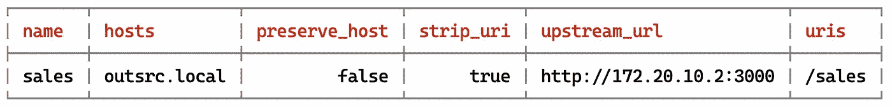
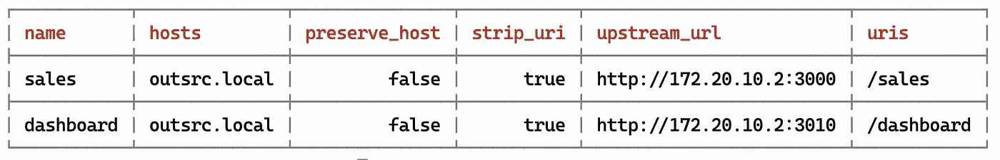
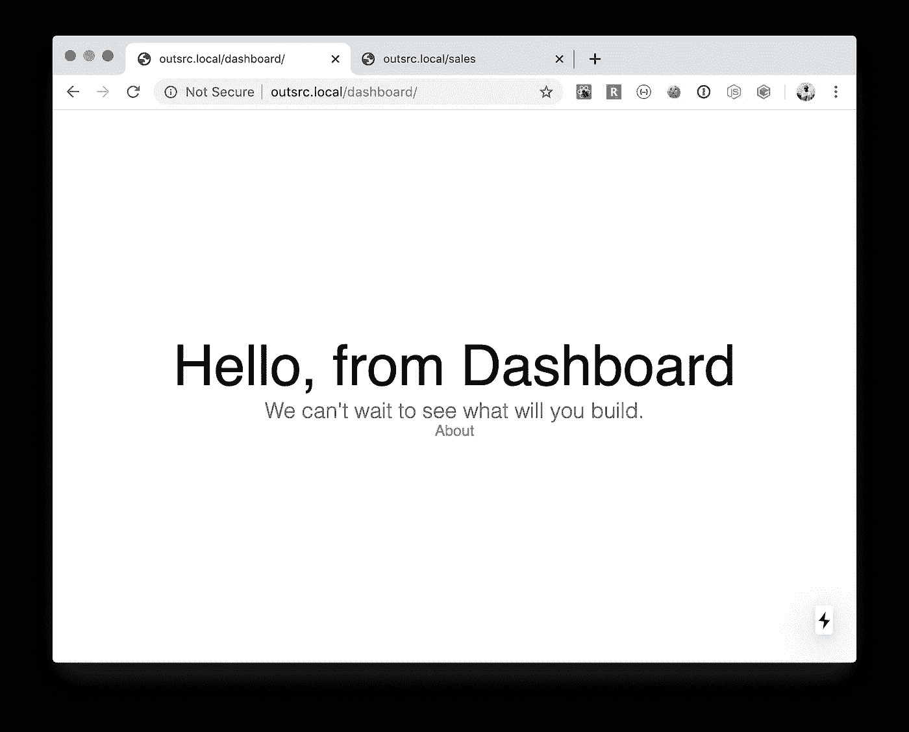
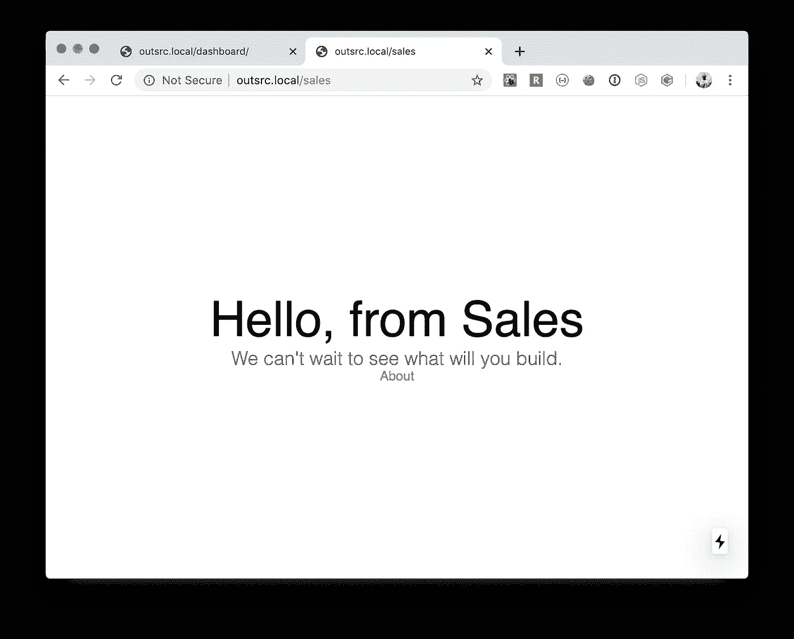
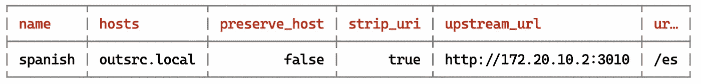
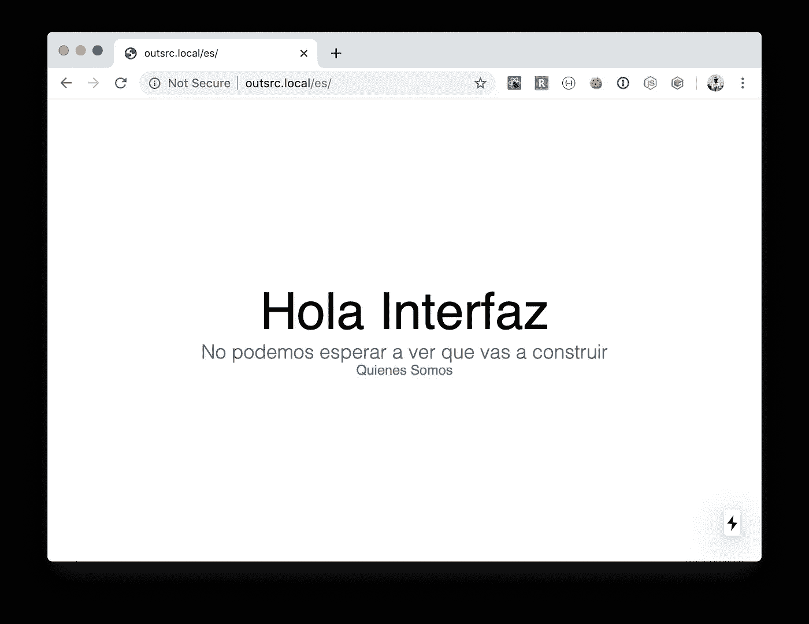

# 将 NextJS 应用程序部署在不同的基路径上(即非根目录)

> 原文：<https://levelup.gitconnected.com/deploy-your-nextjs-application-on-a-different-base-path-i-e-not-root-1c4d210cce8a>


照片由[摄影师](https://www.pexels.com/@skitterphoto?utm_content=attributionCopyText&utm_medium=referral&utm_source=pexels)从[像素](https://www.pexels.com/photo/architectural-design-architecture-brick-wall-bricks-422844/?utm_content=attributionCopyText&utm_medium=referral&utm_source=pexels)拍摄

NextJS 的一个默认假设是，我们将在域的根路径上部署我们的应用程序——这是`/`。NextJS 路由将`pages`文件夹中的每个文件转换成匹配的路径。因此，如果我们有一个名为`./pages/index.js`的文件，它与`/`匹配，对于一个名为`./pages/about.js`的文件，它将在`/about`被访问。这是一个非常简单的方案，基本上就是超链接访问资源的方式。要链接两个页面，您只需:

```
import Link from 'next/link' const Index = () => (
  <div>
    ...
    <Link href='/about'><a>About Us</a></Link>
    ...
  </div>
)export default Index
```

对于大多数应用程序，这是开箱即用的。然而，一些应用程序需要在不同于`/`的基础路径下提供服务。通常:

*   应用程序分段:几个团队可能负责应用程序的不同部分。例如，一个团队负责仪表板(在`/dashboard`提供服务)，而另一个团队负责销售流程(在`/sales`提供服务)
*   国际化:应用程序的默认语言是英语，但是在进入新市场时，团队决定增加对西班牙语的支持。添加了翻译，西班牙语版本部署在`/es`基础路径下，所以现在说西班牙语的用户被重定向到`/es/dashboard`和`/es/sales`

下一个官方文档包括一个多区域([https://nextjs.org/docs#multi-zones](https://nextjs.org/docs#multi-zones))部分。这是一个允许在不同的基本路径下服务下一个应用程序的特性。该功能最重要的部分是使用`next.config.js`文件中的`assetPrefix`设置。

文档中列出的多区域示例都使用了 Zeit 的 Now cloud([https://zeit.co/home](https://zeit.co/home))。但这并不是 Now cloud 独有的功能。(也许这在文档中并不清楚)

为了在不同的基本路径下部署下一个应用程序，我们需要一个反向代理来创建从我们决定为应用程序提供服务的路径到正确 URL 的映射。当然，拥有一个本地发展的反向代理并不是最佳选择。尽管出于学术目的，我们将使用 NGINX 来实现我们上面描述的两个用例。

根据文档和示例，要在不同的基本路径上运行我们的应用程序，我们需要在链接的`as`参数上设置`assetPrefix`设置**和**使用相同的基本路径。因为我们不想为每个链接都重写相同的代码，所以让我们将该行为抽象为一个定制的`Link` 组件:

我们的自定义链接组件(用 Typescript 编写)

在应用程序的`next.config.js`文件中，添加以下内容:

```
module.**exports** = {
  **assetPrefix**: ***process***.**env**.**BASE_PATH** || **''**,
  **...**
  **publicRuntimeConfig**: {
    ...
    **basePath**: ***process***.**env**.**BASE_PATH || ''**,
    ...
  },
}
```

要在不同的基本路径上运行我们的应用程序，我们需要:

```
$ BASE_PATH=/sales yarn dev
[ wait ]  starting the development server ...
[ info ]  waiting on http://localhost:3000 ...
...
```

这也适用于静态导出或生产构建:

```
$ yarn build# Production build (SSR)
$ BASE_PATH=/sales yarn start# Static export
$ BASE_PATH=/sales yarn export
$ cd out
$ ws -p 3000
```

如果我们在开发中这样做，并试图访问 [http://localhost:3000](http://localhost:3000) ，我们的应用程序将不会完全工作。



访问 [http://localhost:3000](http://localhost:3000) 时所有资源解析失败

所有应用程序的资源(JS，CSS，Images)都将以`/sales`为前缀。如果没有一个反向代理来进行正确的映射，它就不会工作。

## 安装和配置本地 NGINX 反向代理

有几种方法可以在本地安装和配置 NGINX 反向代理。我的首选方式是通过我放在一起的一个 NPM 包使用孔()来从 CLI 管理它。[https://www.npmjs.com/package/dev-kong](https://www.npmjs.com/package/dev-kong)(唯一的依赖是在本地安装 docker，因为这个包依赖它来运行 docker 化的 kong 实例)

```
$ npm install -g dev-kong
$ kong --version
0.8.2$ kong start
Starting Kong
Creating network "t_default" with the default driverCreating t_kong-database_1 ...
Creating t_kong-database_1 ... doneCreating t_kong_1          ...
Creating t_kong_1          ... done
```

一旦启动，我们就有了一个可以用 CLI 控制的本地 NGINX 反向代理。

在浏览器上访问`localhost`，您将看到:



尚未配置任何内容。

我们还需要一个假的或本地域来解析到**环回 IP** 地址(通常是 127.0。0.1).最简单的方法是将域(我为测试选择的域:`outsrc.local`)添加到`/etc/hosts`文件中。

```
$ sudo sh -c 'echo "127.0.0.1 outsrc.local" >> /etc/hosts'# Check it
$ cat /etc/hosts
...
...
...
127.0.0.1 outsrc.local
```

最后是 NGINX 上的映射:

```
# First get local network IP address (Mac OS only)
$ ipconfig getifaddr en0
172.20.10.2$ kong add --stripuri sales outsrc.local http://172.20.10.2:3000 /sales
┌──────────────────────────┬──────────────────────────────────────┐
│ http_if_terminated       │ true                                 │
├──────────────────────────┼──────────────────────────────────────┤
│ id                       │ 775a9dc2-4b86-4258-82c8-4f2913f5a219 │
├──────────────────────────┼──────────────────────────────────────┤
│ retries                  │ 5                                    │
├──────────────────────────┼──────────────────────────────────────┤
│ preserve_host            │ false                                │
├──────────────────────────┼──────────────────────────────────────┤
│ created_at               │ 1575559214000                        │
├──────────────────────────┼──────────────────────────────────────┤
│ upstream_connect_timeout │ 60000                                │
├──────────────────────────┼──────────────────────────────────────┤
│ upstream_url             │ http://172.20.10.2:3000              │
├──────────────────────────┼──────────────────────────────────────┤
│ upstream_read_timeout    │ 60000                                │
├──────────────────────────┼──────────────────────────────────────┤
│ upstream_send_timeout    │ 60000                                │
├──────────────────────────┼──────────────────────────────────────┤
│ https_only               │ false                                │
├──────────────────────────┼──────────────────────────────────────┤
│ strip_uri                │ true                                 │
├──────────────────────────┼──────────────────────────────────────┤
│ uris                     │ /sales                               │
├──────────────────────────┼──────────────────────────────────────┤
│ name                     │ sales                                │
├──────────────────────────┼──────────────────────────────────────┤
│ hosts                    │ outsrc.local                         │
└──────────────────────────┴──────────────────────────────────────┘
```

显示映射路径:

```
$ kong list
```



孔列表输出

上表显示:当访问`outsrc.local/sales`时，一个名为`sales`的端点将其路由到`[http://172.20.10.2:3000](http://172.20.10.2:3000)`，并且对于所有请求，移除前缀`/sales`。

*(我们需要使用本地网络 IP，因为我们的 NGINX 实例运行在 docker 容器中，我们的前端应用程序运行在主机上)*

可以添加任意数量的路径映射。让我们为将在不同端口上运行的仪表板应用程序添加一个:

```
$ BASE_PATH=/dashboard yarn dev --port 3010
[ wait ]  starting the development server ...
[ info ]  waiting on http://localhost:3010 ...
...
```

和映射:

```
$ kong add --stripuri dashboard outsrc.local http://172.20.10.2:3010 /dashboard
...
```

再次奔跑`kong list`我们得到:



在不同端口和不同基本路径上运行的销售和仪表板应用程序。

## 演示时间:具有不同基本路径的多个应用程序

如果您按照前面的步骤操作，您已经有了一个指向 127.0.0.1 的本地域，并且安装并运行了 NGINX。我们需要一份申请。

让我们用一个(已经准备好的)应用程序克隆一个 repo 两次:

```
$ git clone --branch efg/custom-name git@github.com:outsrc/template-frontend.git dashboard-app$ git clone --branch efg/custom-name git@github.com:outsrc/template-frontend.git sales-app
```

安装依赖项`yarn install`并运行指定`APP_NAME`和`BASE_PATH`的每个应用程序

```
$ APP_NAME=Dashboard BASE_PATH=/dashboard yarn dev --port 3010$ APP_NAME=Sales BASE_PATH=/sales yarn dev --port 3000
```

我们的两个映射是相同的，所以我不会在这里重复它们。

在浏览器上，我们会看到:



/仪表板上的仪表板应用程序



销售应用于/销售

搞定了。我们有两个 NextJS 应用程序并排运行在同一个域上，但具有不同的基路径。

## 演示时间:相同的应用程序西班牙语翻译

首先让我们清除 NGINX 上的当前路径映射

```
$ kong delete sales
Deleted$ kong delete dashboard
Deleted
```

克隆带有国际化和西班牙语翻译的代码分支:

```
$ git clone --branch efg/with-intl git@github.com:outsrc/template-frontend.git spanish-app
$ cd spanish-app
$ yarn install
...$ LOCALE=es BASE_PATH=/es yarn dev --port 3010
```

这将使用基本路径`/es`上的西班牙语本地化启动应用程序。

在 NGINX 上映射路径:

```
$ kong add --stripuri spanish outsrc.local http://172.20.10.2:3010 /es
```



映射到/es 的西班牙语翻译

我们在浏览器上看到这个:



我们的西班牙语翻译申请于/es 送达

就国际化而言，我有意省略了一些重要的部分，比如检测用户的浏览器偏好，以便我们可以将它们重定向到正确的路径。这只是为了展示我们如何为不同的地区支持改变基本路径。

## 结论。

*   NextJS 确实支持将应用程序部署在不同的基本路径上，而不是根基本路径。
*   `assetPrefix`和链接`as`参数的组合。
*   部署到不同的基本路径不是开发人员的任务，而是 SRE 的任务。也就是说，前端开发人员不应该太关注应用程序部署的位置(基本路径)，他们只需要准备好支持它。本地开发应该总是使用根路径。
*   致力于静态导出。
*   更喜欢使用运行时配置([https://nextjs.org/docs#runtime-configuration](https://nextjs.org/docs#runtime-configuration))而不是构建时配置([https://nextjs.org/docs#build-time-configuration](https://nextjs.org/docs#build-time-configuration))
*   如果你真的需要在本地使用 NGINX，我推荐你使用 Kong(通过 dev-kong 包)