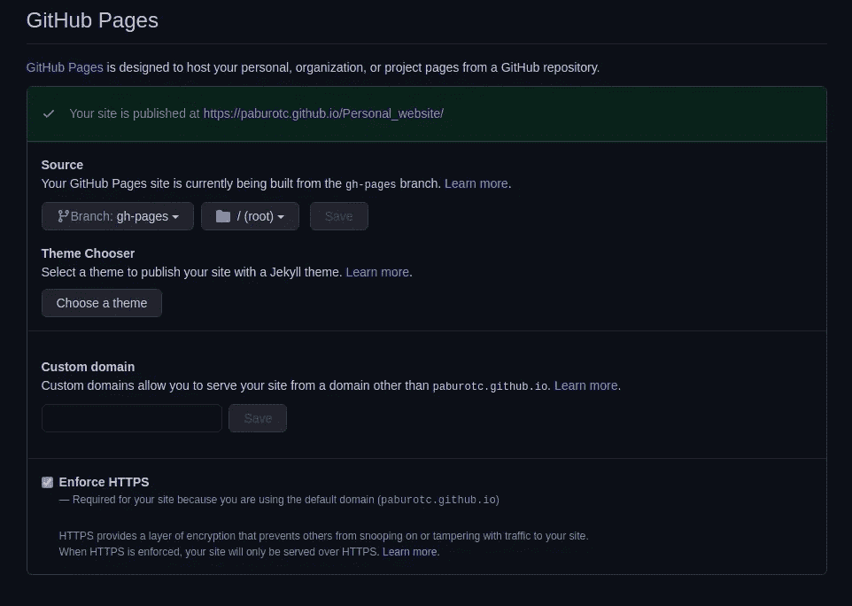

# 免费部署 React 应用程序

> 原文：<https://levelup.gitconnected.com/deploy-your-react-app-for-free-8eb8cb687e1>

在 GitHub 页面上免费托管 React 应用


劳拉·卡弗在 [Unsplash](https://unsplash.com?utm_source=medium&utm_medium=referral) 上拍摄的照片

作为一名学生，要想凑够钱租一台服务器或者支付一台托管服务器的费用当然不容易。另一方面，作为一名计算机科学本科生，我渴望着手新的项目来丰富我的投资组合。但是如果不部署它们，我剩下的是一堆几乎没有用处的 GitHub 库。

幸运的是，由于 GitHubs 的免费服务，我们有了一种免费部署应用程序的方法: [**GitHub Pages**](https://pages.github.com/) 。

在本教程中，我将带您完成在 GitHub 页面上部署 React 应用程序的过程，但是第**节设置 GitHub 页面**的原则可以应用于任何其他静态应用程序。没有进一步的到期，让我们开始吧！

# 设置 React 应用程序

我假设您已经在 GitHub 存储库中安装了 React 应用程序。如果不是这样，别担心，我哪儿也不去！

一旦解决了这个问题，我们必须做的第一件事就是安装`gh-pages`包，因为这个包将负责将应用程序部署到 GitHub 页面。

```
**$ npm install gh-pages** **--save-dev** + gh-pages@3.1.0
```

将`gh-pages`作为开发依赖项安装是很重要的，因为这样它不会在最终的产品构建中占用任何空间。一旦安装完成，继续打开 React 应用主目录中的`package.json`。

我们现在需要定义一个`homepage`值。这个值必须与我们将要托管 React 应用程序的 url 相匹配。因为我们将把它放在 GitHub 页面中，所以我们的 URL 看起来会像这样:

```
http://{username}.github.io/{repository}
```

因为我的用户名是“PaburoTC ”,我的 React 应用程序在我的“个人网站”存储库中，所以我的`homepage`值是这样的:

```
"homepage": "https://PaburoTC.github.io/Personal_website"
```

请随意在您的`package.json`末尾添加您的`homepage`。一旦完成，我们现在需要在`scripts`中添加`predeploy`和`deploy`命令，也可以在`package.json`中找到。您的`scripts`标记应该如下所示:

让我解释一下我们添加的命令。`predeploy`命令总是在`deploy`之前运行，运行的命令是`npm run build`在构建目录中构建你的应用。React 应用程序构建完成后，`gh-pages -d build`将会运行。这个命令将把我们的构建目录上传到我们存储库中的一个名为“gh-pages”的分支中。所以，让我们来看看吧！奔跑

```
**$ npm run deploy** Creating an optimized production build...
Compiled successfully.
The build folder is ready to be deployed.
Published
```

# 设置 GitHub 页面

GitHub Pages 是 GitHub 提供的免费托管服务，可以让我们免费托管静态页面！

现在让我们导航到我们的库来设置 GitHub 页面！在您的存储库中，点击**设置>选项**并向下滚动，直到您到达 **GitHub 页面**，在那里您应该会看到如下内容:



恭喜你！您现在已经成功地将 React 应用程序部署到 GitHub 页面了！现在，每次你对你的应用程序进行更改时，你都必须运行`npm run deploy`来部署更改并使其可见，或者你可以使用 [GitHub Actions](https://github.com/features/actions) 来自动部署。

# 连续交付(CD)

连续交付是每次对代码库进行更改时自动部署应用程序的过程。当然，您可能希望在部署之前运行一些测试，以确保您的应用程序按预期工作。这就是所谓的**持续集成(CI)** 。CI**和 CD**一起构成了一个非常强大的二重奏:我们现在可以在每次对代码库进行更改时自动部署我们的应用程序，并确信它可以工作！****

使用 GitHub 动作可以使 **CI** 和 **CD** 自动化。请随意阅读这篇文章，在这篇文章中我更深入地解释了什么是 **CI** 以及如何用 GitHub Actions 实现它。在本教程的剩余部分，我将向你展示如何启用 **CD** ！

[](/why-you-should-use-ci-df1adc0c5145) [## 为什么您应该使用 CI

### 以及如何用 GitHub 动作做到这一点

levelup.gitconnected.com](/why-you-should-use-ci-df1adc0c5145) 

从您的存储库中，导航到**操作**。进入后，点击**新建工作流程>自行建立工作流程**。在那里，删除文件的内容并编写以下代码:

这个文件主要做的是，每当我们推或拉主分支时，它将 React 应用程序部署到 GitHub 页面。这样我们就不必费心运行`npm run deploy`，我们只需要将代码推送到我们的库，让 GitHub 页面完成剩下的工作！

# 最后的想法

在 GitHub Pages 上托管静态页面对于预算有限的人来说是一个极好的解决方案。通过将 **GitHub Actions** 整合到我们的项目中，我们也能够更快地部署**连续交付**。

一如既往，如果需要，请随时联系我。本教程中的所有代码都可以在 GitHub 上免费获得。

[](https://github.com/PaburoTC/Personal_website) [## PaburoTC/个人 _ 网站

### 这个项目是用 Create React App 引导的。在项目目录中，您可以运行:在…中运行应用程序

github.com](https://github.com/PaburoTC/Personal_website) 

部署愉快！