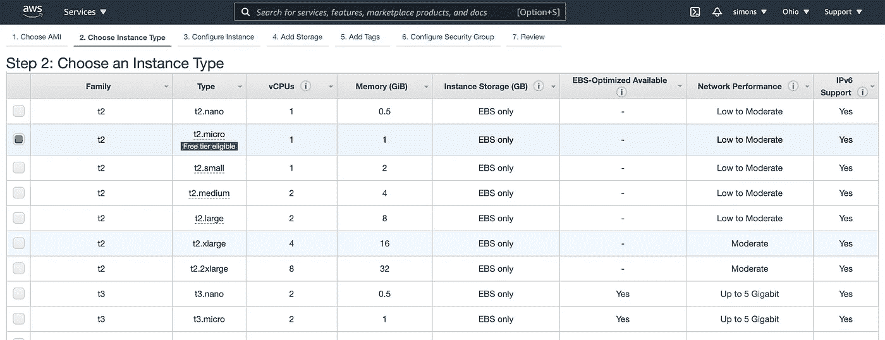

# 使用一个命令将 React 应用程序部署到 AWS

> 原文：<https://levelup.gitconnected.com/deploy-your-react-application-to-aws-in-a-single-command-9b8d960f83df>

在本文中，我们将使用一条命令将 React 应用程序部署到 Amazon Web Services Ubuntu 机器上。为此，我们将编写一个 shell 脚本，通过 SSH 连接到远程主机，并将 React 应用程序的构建版本复制到远程主机上运行的服务器的 www 目录中。


在 AWS 上部署可能是一项非常艰巨的任务，尤其是在初级开发人员职业生涯的开始阶段。AWS web 界面起初并不是很直观，包含了太多的配置选项，这可能会让任何初学者在它的复杂性面前变得笨拙。本文的目的是向您展示在 AWS 上配置和启动 EC2 机器是多么简单，并向您介绍如何通过 SSH 将文件传输到远程主机。最后，我们将构建一个简单的 shell 脚本，允许您通过一个命令部署到 AWS。这将使你缩短开发和生产之间的时间。在更复杂的应用程序中，您将需要研究更先进的 DevOps 技术来通过 CI/CD 管道进行部署，但这将在您的职业生涯中自然而然地实现。

为了能够从本文中获得最大收益，您需要满足几个要求:

*   AWS 帐户
*   简单(或复杂)的 React 项目
*   私有-公共 SSH 密钥对:当您创建 AWS 帐户时，他们会要求您提供 SSH 密钥。如果你没有，亚马逊会在你注册的时候帮你在线创建。如果你不熟悉 SSH，那么值得阅读一下[这篇文档](https://www.ssh.com/ssh/keygen/)。

**注册 AWS**

首先，为了能够使用亚马逊云，你需要登录亚马逊网络服务平台。可以在这里报名[。您将被要求提供您的信用卡号码。但是不用担心，你不会在没有被通知的情况下被计费。我们在这篇文章中要做的是非常基本的，所以你可以免费建立并运行你的网站！](https://aws.amazon.com/)

**推出亚马逊虚拟机**

为了能够启动虚拟机，您需要在注册并验证您的帐户后访问 [AWS 管理控制台](https://us-east-2.console.aws.amazon.com/console/home?region=us-east-2#)。

选择启动一个亚马逊虚拟机(EC2)，选择你想要的口味。对于本教程，我们将使用 Ubuntu 服务器，但是这个选择是完全随意的。你可以选择亚马逊 Linux，MacOs 甚至 Windows Server。



在之后的窗口中，您必须选择机器的类型，这将影响机器的性能。对于像本文中这样的简单应用程序，我们不需要太多的计算能力，所以我们将使用 t2.micro 机器。然而，如果您想要执行非常苛刻的操作，如图像和视频处理、机器学习模型训练甚至简单的游戏服务器，您将需要选择更高性能的基础架构。

当您选择一台机器时，AWS 为您提供了向虚拟机添加特殊配置甚至添加额外存储的可能性。这在某些应用中可能很有趣。我们不会在此深入探讨更多细节，但如果您想探索这些选项，可以单击“下一步”按钮。因此，在选择机器类型后，我们将选择“查看并启动”选项，这是让我们的虚拟机运行的最快方式。

最后一部分是配置安全组。这对于能够以安全的方式访问机器至关重要。


安全组充当 EC2 实例的虚拟防火墙，控制传入和传出流量。入站规则控制您的实例的传入流量，出站规则控制您的实例的传出流量。启动实例时，可以指定一个或多个安全组。如果没有指定安全组，Amazon EC2 会使用默认的安全组。您可以向每个安全组添加规则，以允许流量进出其关联的实例。您可以随时修改安全组的规则。新的和修改后的规则会自动应用到与该安全组关联的所有实例。当 Amazon EC2 决定是否允许流量到达某个实例时，它会评估与该实例相关联的所有安全组的所有规则。

在“Security Groups”菜单下，您可以看到目前我们正在创建的虚拟机只能使用 SSH 进行访问，SSH 构建在 TCP 协议之上，运行在虚拟机的端口 22 上。来源表示应该从哪里访问机器的 IP。因此，从逻辑上讲，这应该只包括您的外部 IP，以避免虚拟机被其他人访问。当前值为 0.0.0.0/0，表示无处不在。默认情况下，AWS VM 被配置为任何人都可以访问。为了本教程的缘故，我们将保留这个选项，但我们必须记住，这对安全性至关重要。

我们希望在虚拟机上运行一个 HTTP 服务器，以便能够访问我们的网站。该服务器将在端口 80 上运行，因此我们需要添加一个新的安全组。因此，单击“编辑安全组”并添加在端口 80 上运行的 HTTP，使它可以从任何地方访问。

完成此配置后，您就可以启动虚拟机了。

**在 EC2 实例上安装 Nginx**

既然我们已经启动并运行了我们的 VM，我们将需要在它上面安装一个 web 服务器，允许我们远程访问我们的 React 应用程序。

为此，您有两个选择:

*   要么使用 SSH 直接访问您的虚拟机，然后手动安装 Nginx 服务器
*   或者进入自动配置，尝试使用 Ansible 自动安装 Nginx

出于教育目的，我个人强烈建议你尝试第二种选择。在这种情况下，手动安装 Nginx 可能更容易，但是当您处理需要在不同虚拟机而不是一个虚拟机上进一步配置的大型应用程序时，您会发现自动配置过程至关重要。

有关使用 Ansible 进行供应的简单教程，您可以查看这篇文章:

[](https://salibas.medium.com/an-introduction-to-web-server-provisioning-configure-and-set-up-your-aws-vm-automatically-using-b0fe8e334424) [## Web 服务器配置简介:使用…自动配置和设置 AWS VM

### 在本文中，我们将探讨如何自动配置我们的云虚拟机。在云中设置我们的机器…

salibas.medium.com](https://salibas.medium.com/an-introduction-to-web-server-provisioning-configure-and-set-up-your-aws-vm-automatically-using-b0fe8e334424) 

如果您想使用第一个选项，您可以使用 SSH 手动连接到您的 AWS，方法是转到实例详细信息并单击“连接到实例”。选择 SSH 选项并按照步骤操作。

当您连接到虚拟机时，执行以下命令来安装 nginx:

```
sudo apt update
sudo apt install nginx
```

**将您的本地 React 构建转移到您的 EC2 实例**

在 React 项目目录中，创建一个名为`deploy.sh`的文件。在此文件中，我们将编写 shell 脚本来自动构建文件并将其传输到虚拟机:

```
#!/bin/sh cd /Users/[path/to/your/react/project/root/directory] echo “Building React Project …” 
npm run build echo “Copying html file …” 
cp -r build html echo “Connecting to AWS VM and copying file to /var/www/html/ …” sudo scp -i [/path/to/your/registered/private/key] -r html [[ubuntu@ec2–xx–xxx–xxx–xx.us-east-2.compute.amazonaws.com](mailto:ubuntu@ec2-18-216-216-23.us-east-2.compute.amazonaws.com)]:/var/www echo “Removing html file from local directory …” 
rm -r html
```

`scp`命令将使用 SSH 将文件传输到您的 EC2。您需要拥有 AWS 注册的私有/公共密钥对。这些钥匙通常存放在`/Users/yourusername/.ssh/`内。

您需要将 scp 命令中的 URL 替换为虚拟机的公共 IPv4 DNS。当您单击您的实例时，您可以在“实例详细信息”页面中找到它。


实例详细信息页面

通过在 React 项目主目录中执行`./deploy.sh`来运行下面的脚本。

从浏览器访问您机器的公共 IPv4 DNS，并查看您的 React 页面！