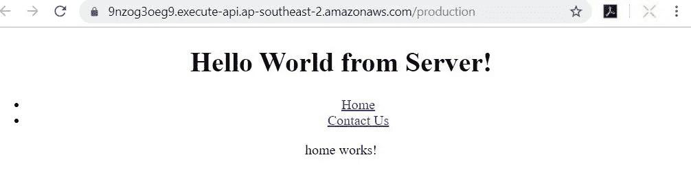

# 在 AWS Lambda 上部署您的无服务器服务器端渲染(SSR) Angular 应用程序

> 原文：<https://levelup.gitconnected.com/deploy-your-serverless-server-side-rendering-ssr-angular-app-on-aws-lambda-a01a3aab6ef6>


用 AWS Lambda 实现无服务器的服务器端渲染 Angular App

受当前网络中大量使用 JavaScript 的驱动，谷歌声称其搜索机器人开始执行 JavaScript 以更好地理解页面。

> 然而，正如在[博客](https://webmasters.googleblog.com/2014/05/understanding-web-pages-better.html)中提到的，有时候渲染过程中事情并不完美，这可能会对你网站的搜索结果产生负面影响。

考虑到搜索引擎爬虫在呈现 JavaScript 生成的内容方面的局限性，保持站点 SEO 高性能的一个更好的解决方案是实现服务器端呈现(SSR)。

在本帖中，我们将介绍:

1.  客户端渲染(CSR)与服务器端渲染(SSR)
2.  在 AWS Lambda 上创建和部署无服务器 SSR Angular 应用程序
3.  部署定价

你可以在 Github[angular-server less-server-side-rendering](https://github.com/theideasaler/angular-serverless-server-side-rendering)上看到代码。

# 1.客户端渲染与服务器端渲染

在实现我们的服务器端渲染解决方案之前，我们首先需要理解它是什么，以及它的对等物，客户端渲染。


SSR 简化概念图

传统上，服务器端渲染网站是这样工作的:

1.  您的用户代理(浏览器)向服务器发送一个 HTTP 请求
2.  通过读取路由参数(例如[www.example.com/contact](http://www.example.com/contact))，服务器将为该特定页面生成完整的 HTML，并将其发送回您的用户代理。

因为搜索引擎/爬虫阅读 HTML 标签没有问题，当爬虫索引你的站点时，你的网络内容将被直接阅读。


CSR 简化概念图

相比之下，客户端渲染的工作方式略有不同:

1.  您的用户代理(浏览器)向服务器发送一个 HTTP 请求
2.  然后，服务器会向您的浏览器发送部分 HTML 页面和启动 JavaScript。
3.  您的浏览器加载启动 JavaScript 并直接在浏览器中呈现 HTML 页面。

现在打开你的浏览器并检查源代码(Chrome 中的`crtl + u`)，如果你看不到当前显示在你页面上的任何内容，除了一个简单的根元素，那么你正在浏览的页面是客户端渲染的。


客户端呈现的页面示例

关于不同渲染类型的更多细节，可以阅读本文:[*Web 上的渲染*](https://developers.google.com/web/updates/2019/02/rendering-on-the-web) 。

# 2.在 AWS Lambda 上创建和部署无服务器 SSR Angular 应用程序

在这一部分，我们将有一个动手练习。我将按照下面的顺序深入探讨 Angular SSR 的开发和部署。

*   创建一个空白 CSR Angular 应用程序
*   使用 Angular Universal 将 CSR Angular 更新为 SSR Angular 应用程序
*   在 AWS Lambda 上部署 SSR Angular 应用程序

## **2.1 创建一个空白的 CSR Angular app**

在这篇博客中，我们将使用 Angular CLI 创建新项目，并生成组件和模块。如果还没有安装，可以运行`npm install -g @angular/cli`来获取。

1.  初始化我们的项目:`npm init`
2.  创建一个新项目:`ng new ssr-serverless && cd ssr-serverless`
3.  生成主页、联系我们、导航组件:

```
ng g c home
ng g c contact-us
ng g c nav
```

4.生成路由模块:`ng g module app-routing --flat --module=app`

5.更新`app-routing.module.ts`:

```
import { NgModule } from '@angular/core';
import { RouterModule, Routes } from '@angular/router';
import { HomeComponent } from './home/home.component';
import { ContactUsComponent } from './contact-us/contact-us.component'; const routes: Routes = [  
 { path: '', component: HomeComponent },
 { path: 'home', component: HomeComponent },
 { path: 'contact', component: ContactUsComponent },  
 { path: '**', redirectTo: 'home' }
];@NgModule({
 imports: [RouterModule.forRoot(routes)],
 exports: [RouterModule]
})export class AppRoutingModule {}
```

6.更新`nav.component.html`:

```
<ul>
  <li><a routerLink="/">Home</a></li>
  <li><a routerLink="/contact">Contact Us</a></li>
</ul>
```

7.更新`app.component.ts`。这里我们添加`isPlatformBrowser` 来检查当前平台。

```
import { isPlatformBrowser } from '@angular/common';
import { Component, OnInit, Inject, PLATFORM_ID } from '@angular/core';@Component({
  selector: 'app-root',
  templateUrl: './app.component.html',
  styleUrls: ['./app.component.css']
})
export class AppComponent {
  title = 'ssr-serverless';
  platform: string;constructor(@Inject(PLATFORM_ID) private platformId: any) {}public ngOnInit(): void {
    this.platform = isPlatformBrowser(this.platformId) ? 'Browser' : 'Server';
  }
}
```

8.更新`app.component.html`:

```
<div style="text-align:center">
  <h1>
    Hello World from {{platform}}!
  </h1>
  <app-nav></app-nav>
  <router-outlet></router-outlet>
</div>
```

9.现在，我们可以运行我们的客户端渲染角度应用:`ng serve`并在您的浏览器中打开`localhost:4200`，我们可以看到下面的屏幕:


我们的纯客户端渲染角度应用

## 2.2 将 CSR Angular 更新为 SSR Angular app

为了在服务器端呈现我们的 CSR Angular 应用程序，我们首先需要一个能够理解我们的客户端 Angular 代码并生成 HTML 的服务器。在这篇文章中，我们将使用`Express`作为我们的服务器。Express.js 是一个基于 Node.js 的轻量级服务器。

将我们当前的 CSR Angular 应用程序更新为 SSR 从未如此简单。我们需要做的就是运行 CLI 命令:

`ng add @nguniversal/express-engine --clientProject ssr-serverless`

运行上面的命令后，您可以看到已经创建/修改了以下文件:

```
CREATE src/main.server.ts (220 bytes)
CREATE src/app/app.server.module.ts (318 bytes)
CREATE src/tsconfig.server.json (219 bytes)
CREATE webpack.server.config.js (1360 bytes)
CREATE server.ts (1500 bytes)
UPDATE package.json (1857 bytes)
UPDATE angular.json (4176 bytes)
UPDATE src/main.ts (433 bytes)
UPDATE src/app/app.module.ts (678 bytes)
```

让我们看看核心文件。

(1) `app.server.module.ts`将我们的客户端 Angular 应用程序与`ServerModue`一起包装到一个单独的 AppServerModule 中

(2) `main.server.ts`作为 Angular CLI 的切入点，将 TypeScript 和导入的依赖项编译成 JavaScript 代码。

(3) `server.ts`是我们的 Express.js 服务器。在这个文件中，它调用了`ngExpressEngine`，这是`renderModuleFactory()`的一个包装。`renderModuleFactory()` 获取我们的模板(index.html)并根据我们发送给服务器的路线生成相应的 html 页面。关于`renderModuleFactory()`的更多细节，你可以在 [Angular Universal](https://angular.io/guide/universal#universal-web-servers) 上找到。

(4) `webpack.server.config.js`:该文件是服务器端的 webpack 配置，将`server.ts`和所有导入的文件编译成纯 JavaScript 代码。

(5) `package.json`:更新服务器端脚本。


现在，您可以运行`npm run build:ssr && npm run serve:ssr`并打开`localhost:4000`来查看支持 SSR 的应用程序。如果你用 Chrome DevTools 降低网络速度，你会看到主页上的文字从“服务器上的 Hello World”变成了“浏览器上的 Hello World”。


Express server 返回完全呈现的 HTML 页面

现在，如果你再次检查你的主页源代码，你会看到 HTML 内容也在其中。第一次加载后，客户端的路由将由启动 JavaScript 处理，这意味着它现在作为客户端渲染 Angular app 工作。


SSR Angular 应用程序在客户端的路由

## 2.3 在 AWS Lambda 上部署 SSR Angular 应用程序

要在 AWS Lambda 上部署您的 SSR Angular 应用程序，您需要一个 AWS 帐户，并创建一个具有相关权限的“IAM”用户。你可以注册一个 12 个月的[免费使用](https://aws.amazon.com/free/?all-free-tier.sort-by=item.additionalFields.SortRank&all-free-tier.sort-order=asc)。你可以按照本教程在 Lambda 上部署你的 Express 应用，但是我们在本文中不使用它。

我们将使用第三方框架[无服务器框架](https://serverless.com/)来帮助我们部署应用程序。它将在引擎盖下进行一些配置，让我们远离繁琐复杂的 AWS 配置。

我们需要做出这些改变:

(1)安装无服务器框架:`npm install -g serverless`

(2)修改`server.ts`:移除`app.listen()`使“服务器”成为正常功能，因为它不再需要 24/7 运行。

(3)安装 aws-serverless-express: `npm install aws-serverless-express`

> `aws-serverless-express library`将来自客户端的请求(通过 API 网关)转换成标准的 Node.js HTTP 请求对象；将这个请求发送给一个特殊的侦听器(一个 Unix 域套接字)；

(4)创建`lambda.js`，将我们在 server.js 中编译的服务器函数包装到`aws-serverless-express`中。

(5)为无服务器框架创建一个`serverless.yml`,让它知道自己需要哪些 AWS 配置/资源。

让我们看看代码。

Server.ts

Lambda.js

无服务器. yml

**注意:请记住将区域替换为您的 AWS 帐户的区域。*

网络包.服务器.配置. js

现在我们已经准备好将我们的无服务器 SSR Angular 部署到 Lambda。

(1)运行`npm run build:ssr`来构建我们的无服务器包

(2)运行`aws configure`并在 AWS IAM 中输入您的凭证。

(3)通过运行:`serverless deploy`部署我们的 lambda 函数。这个命令将为我们创建这些东西——一个包含所有服务器端逻辑的 lambda 函数和一个指向该 Lambda 函数的 API 网关。

部署过程需要一段时间，你可能想喝杯咖啡: )

部署后，终端将返回 lambda 函数的 API 网关端点，如下所示:

```
...
endpoints:
  ANY - https://9nzog3oeg9.execute-api.ap-southeast-2.amazonaws.com/production/{proxy+}
  ANY - https://9nzog3oeg9.execute-api.ap-southeast-2.amazonaws.com/production
functions:
...
```

打开第二个端点，您将看到您的无服务器 SSR Angular 现在正在云上工作:



# 部署定价

在 Lambda 上托管轻量级网站将向您收取以下费用:

*   λ函数
*   API 网关

(1) AWS Lambda 是 AWS 永远免费的产品之一。对于 128MB 内存的 Lambda 函数，您将拥有:

*   每月 100 万次免费请求
*   *每月 320 万秒的免费计算时间*

**(2) API Gateway 是 AWS 12 个月免费层产品之一，它为您提供:**

*   **每月 100 万次 API 调用**
*   ***每月 750，000 分钟连接到您的 API***
*   ***一百万条消息***

# ***包扎***

***在 AWS Lambda 上部署 Angular 应用程序有利于网站的 SEO 性能，而且 Lambda 和 API Gateway 的价格与全天候运行的 EC2 实例相比相对较低。然而，服务器端呈现有一个最大的问题，即第一字节时间(TTFB)的糟糕性能，即从向服务器实例发送请求到客户端收到第一位内容之间的时间。***

***下一篇文章将讨论[如何通过在构建时实现预渲染来减少 TTFB，并在 AWS S3 上部署静态文件](https://medium.com/@neowei/prerender-angular-and-deploy-it-as-a-static-website-on-aws-s3-to-make-it-42-times-faster-115fadcf8614)。***

***其他职位:***

*   ***[优化角度性能的 9 个终极技巧](https://neowei.medium.com/9-ultimate-tips-to-improve-angular-performance-dbedb0ec4e2d)***
*   ***[以最简单的方式创建一个可调整大小和可拖动的角度组件](https://medium.com/@neowei/create-a-resizable-and-draggable-angular-component-in-the-easiest-way-bb67031866cb)***
*   ***[小心将异步函数作为参数传递](https://medium.com/@neowei/be-careful-of-passing-an-async-function-as-a-parameter-4f421f8e7e9d)***
*   ***[预装 Angular 作为静态网站，并将其托管在 AWS S3 与您的自定义域](/prerender-angular-and-deploy-it-as-a-static-website-on-aws-s3-to-make-it-42-times-faster-115fadcf8614)***
*   ***[将 Angular 从 CSS 升级到 SCSS 的分步指南](https://medium.com/@neowei/step-by-step-guide-to-upgrade-your-angular-app-from-css-to-scss-fb347330fe28)***