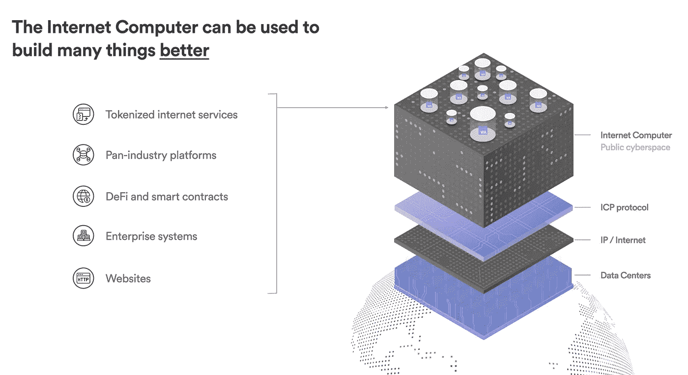
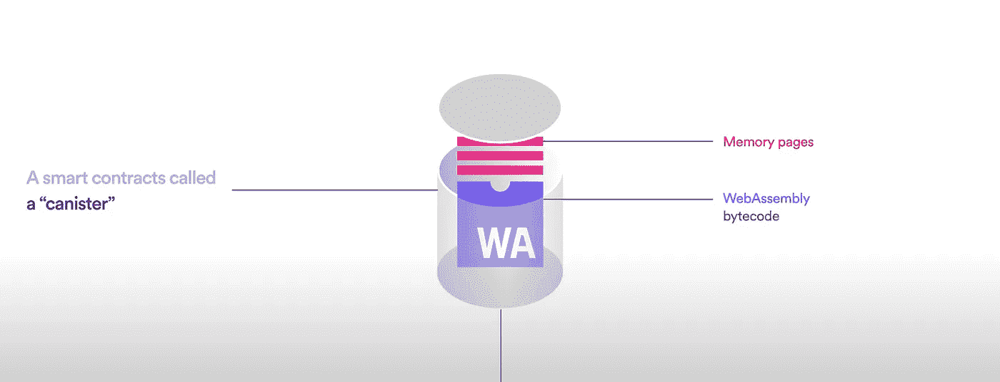
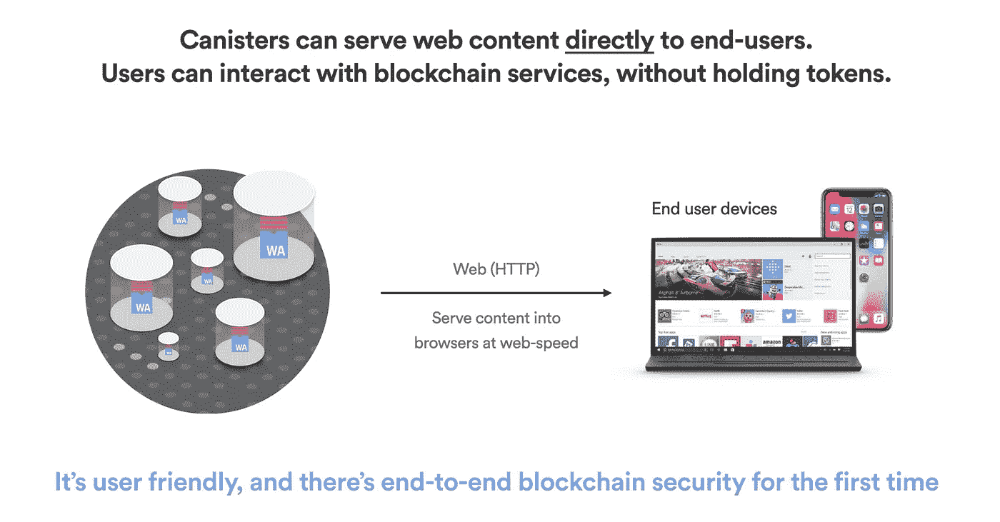
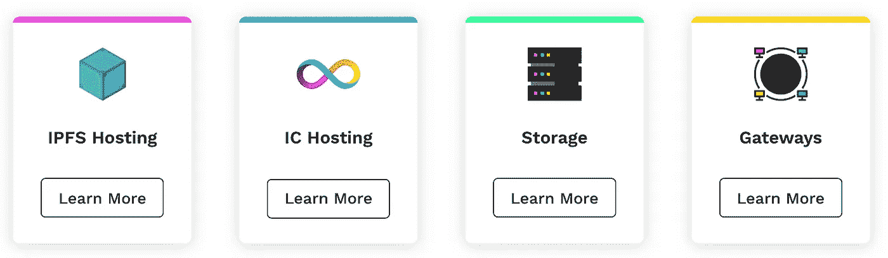
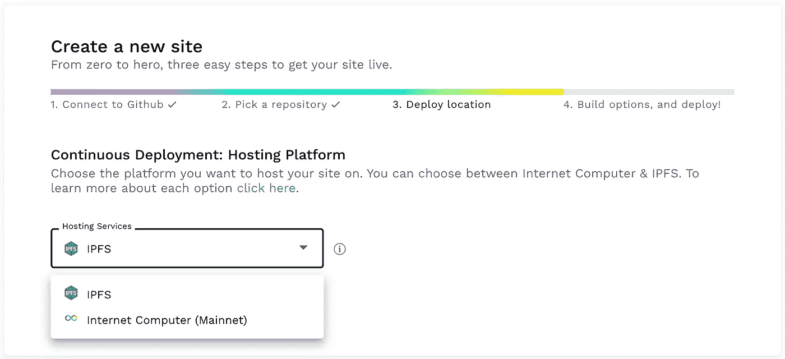
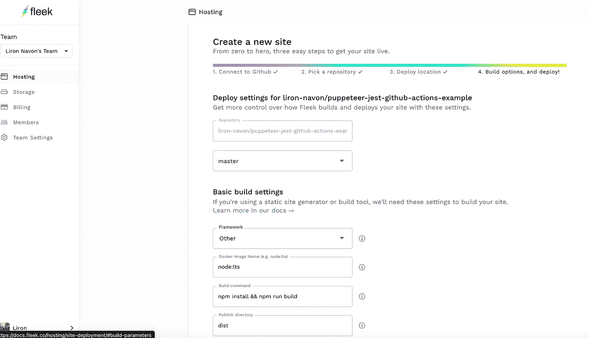
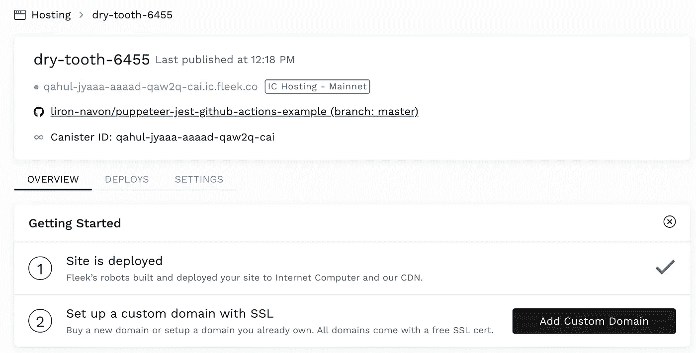
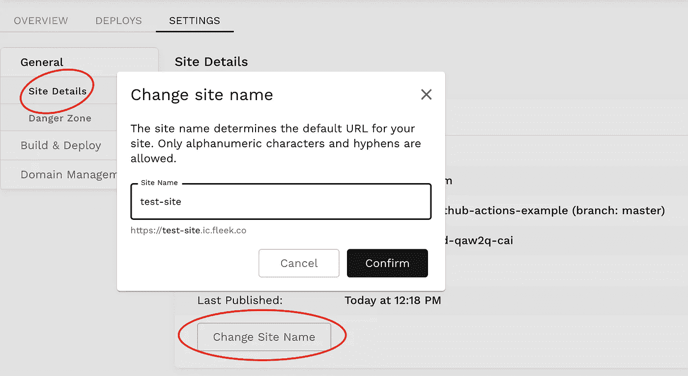

# 将您的静态 web 应用程序部署到区块链，并在 5 分钟内使其成为 Web3.0 应用程序

> 原文：<https://levelup.gitconnected.com/deploy-your-static-web-app-to-a-blockchain-and-make-it-a-web3-0-app-in-5-minutes-79ca35c0044b>

目前在区块链和 web 3.0 世界中最有趣的项目之一是分发互联网计算机协议令牌(ICP)的 [Dfinity](https://dfinity.org/) 。[硬币市值形容得好](https://coinmarketcap.com/currencies/internet-computer/)。

> 互联网计算机是世界上第一台以网络速度运行的具有无限容量的区块链。它也是区块链的第三大创新，与比特币和以太坊齐名——一台区块链计算机，可以扩展智能合约计算和数据，以网络速度运行，高效处理和存储数据，并为开发者提供强大的软件框架。

有限项目

取自 dfinity.org

那么，静态应用程序如何在区块链上运行呢？该协议将世界各地的多个物理数据中心连接到区块链，并在其上运行称为“罐”的处理单元，您可以将这些处理单元视为运行 web assembly (WASM)字节码的容器。

取自 dfinity.org

罐子可以运行我们的网站，并通过互联网计算机提供服务，自动端到端加密。

取自 dfinity.org

所有这些都很好，但是 ICP 的官方语言是 [Motoko](https://sdk.dfinity.org/docs/language-guide/motoko.html) 另一种官方语言是 [Rust](https://sdk.dfinity.org/docs/rust-guide/rust-intro.html) 尽管从技术上讲你可以使用任何可以编译成 web 汇编的语言。

那么如何才能部署一个简单的 HTML5 app 呢？一个基于 ICP 的名为 [Fleek](https://fleek.co/) 的项目就是为了解决这个问题，它基本上是一个只在 Web3.0 上运行的 [Netlfy](https://www.netlify.com/) 版本，它还提供了比静态站点托管更多的功能，但是我们在这里只关注托管部分。

来自[https://fleek.co](https://fleek.co/)

第一步是拥有一个包含一些静态 web 应用程序的项目，fleek 可以集成到 GitHub 中，并为您自动构建项目，例如，您可能有一个 React 或 Vue 应用程序，或者只是几个需要提供服务的 HTML 文件。

## 部署到 fleek

非常简单，只需去 https://fleek.co 的[，然后签到。
登录后，您将被重定向到](https://fleek.co/)[https://app.fleek.co/](https://app.fleek.co/)，在那里您可以点击`add new site`，在那里您可以链接您的 GitHub 并选择要部署的库。

定位步骤将要求您选择在哪里主持项目，我们将进行 ICP，[您可以在这里了解更多关于 IPFS 的信息](https://ipfs.io/)，但这超出了本文的范围。

最后一步是部署和构建设置，选择要部署的分支，框架是可选的，运行时可以是`node:lts`(长期支持)除非你寻找特定的东西，如果你有一个构建命令你可以添加它和你的静态文件的目录，对于一个 [React CRA 项目](https://reactjs.org/docs/create-a-new-react-app.html)它将是`dist`。

部署完成后，您将看到这个页面，在这里您可以获得一个指向已部署网站的链接。

我不喜欢我的网站被称为干牙，这只是一个由 fleek 随机给出的名字，我们可以分配一个自定义域，但我现在没有这个网站的任何域，所以让我们通过设置给它一个更好的名字。

## 结论

我们现在可以轻松地将静态应用程序部署到互联网计算机上，fleek 还有其他功能可供您探索，如 IPFS 文件存储和与 ICP 的集成。

请鼓掌并关注，因为我将每隔几周发布一次内容，我真心感谢每一位关注者、拍板者和评论者🙂。