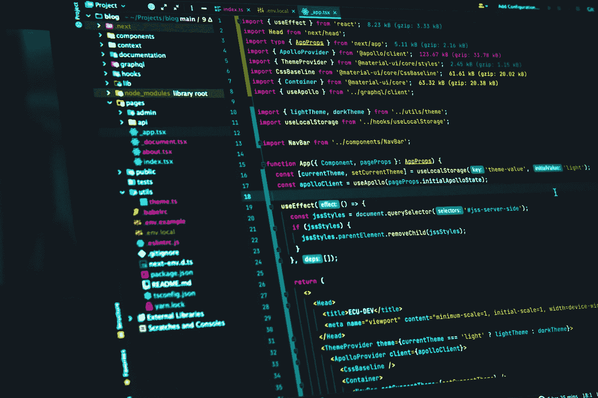
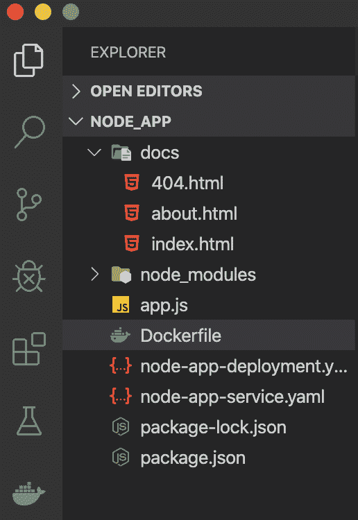
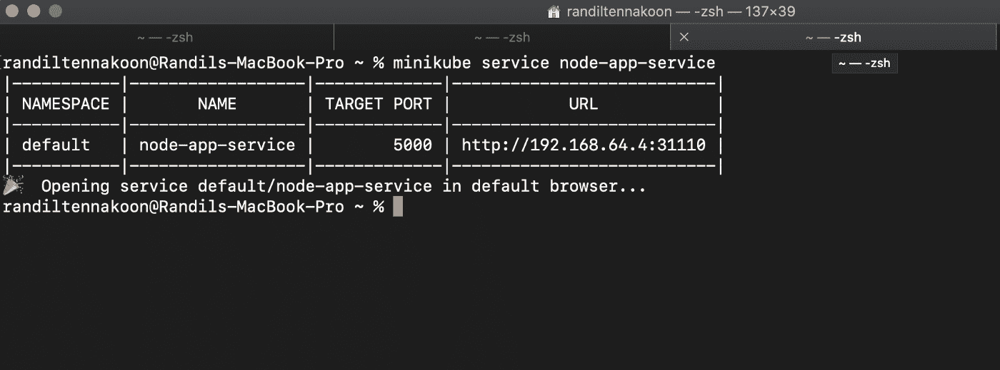
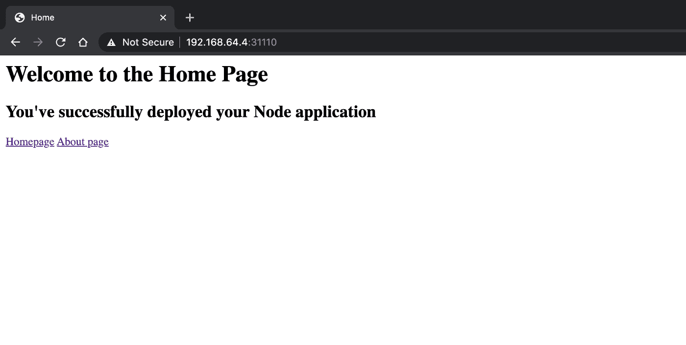

# 在 Kubernetes 中部署完整的 Node.js 应用程序

> 原文：<https://levelup.gitconnected.com/deploying-a-complete-node-js-application-in-kubernetes-d747986e1e61>

## 使用 Kubernetes 组件完成 Node.js 应用程序部署。



由[胡安乔·哈拉米略](https://unsplash.com/@juanjodev02?utm_source=unsplash&utm_medium=referral&utm_content=creditCopyText)在 [Unsplash](https://unsplash.com/s/photos/nodejs?utm_source=unsplash&utm_medium=referral&utm_content=creditCopyText) 拍摄的照片

# 介绍

首先，你需要在你的电脑上安装 **Docker** ，这样你就可以轻松完成这个过程。Docker 和 Kubernetes 是两个不同的东西，但是您需要 Docker 作为 Kubernetes pods 中容器的容器运行时。

使用以下链接将 **Docker Desktop** 下载到您的电脑上。然后安装它，并确保通过在终端上运行`docker version`获得输出。

[](https://www.docker.com/products/docker-desktop) [## 用于 Mac 和 Windows 的 Docker 桌面

### Docker 订阅服务协议已更新。我们的 Docker 订阅服务协议包括一项更改…

www.docker.com](https://www.docker.com/products/docker-desktop) 

# 创建 Node.js 应用程序

您可以根据自己的喜好创建 Node.js 应用程序，如果您已经创建了 Node 应用程序，则可以在本教程中使用它。我将把我的 node 应用程序放在下面，这样你就可以对 node 应用程序有一个概念了。

```
const express = require('express');
const app = express();
const port = 8080;app.listen(port, () => {
console.log('listening for request on port 8080');
});app.get('/', (req, res) => {
console.log('request made');
res.sendFile("./docs/index.html", { root: __dirname })
});app.get('/about', (req, res) => {
res.sendFile('./docs/about.html', { root: __dirname });
});app.get('/about-us', (req, res) => {
res.redirect('/about');
});app.use((req, res) => {
res.status(404).sendFile('./docs/404.html', { root: __dirname });
});
```

在这里，您可以看到一个使用 express 创建的简单节点应用程序，我已经为该应用程序设置了端口 **8080** 。此外，我在项目中创建了一个 **docs 文件夹**,并将我所有的 HTML 文件放在里面。我设置了基本路由来访问我的节点应用程序的不同页面，并在代码底部添加了 404 路由来捕获其他请求。



作者截图

# 创建 Dockerfile 文件

```
FROM node:10
WORKDIR /usr/src/app
COPY package*.json ./
RUN npm install
COPY . .
EXPOSE 8080
CMD ["node", "app.js"]
```

我已经使用了 docker hub 中的官方**节点 Docker 映像**，并暴露了端口 8080，就像我在我的节点应用程序中所做的那样。完成 docker 文件后，继续为节点应用程序创建 docker 映像。

如果你不知道如何创建 docker 图像，你可以参考下面的文章来看看如何为你的应用程序创建 Docker 图像。

[](https://randiltennakoon.medium.com/how-to-containerize-a-node-js-application-using-docker-e195616de938) [## 如何使用 Docker 容器化 Node.js 应用程序？

### 容器化应用程序在当今世界更受欢迎，因为它们能够解决一些主要问题…

randiltennakoon.medium.com](https://randiltennakoon.medium.com/how-to-containerize-a-node-js-application-using-docker-e195616de938) 

不要忘记创建一个 docker 容器，然后在浏览器中运行并查看响应，以确保到目前为止您已经正确完成了。

# 安装 Minikube

我正在使用 Minikube，这是一个单节点集群，它对我们在 Kubernetes 中部署应用程序非常有帮助。如果您的计算机上没有安装 Minikube，请花几分钟时间参考这篇文章，看看如何在您的计算机上安装 Minikube。

[](https://randiltennakoon.medium.com/getting-started-with-minikube-as-your-local-kubernetes-cluster-cfebf87abc39) [## 开始使用 Minikube 作为您的本地 Kubernetes 集群

### 免费创建您的单节点本地 Kubernetes 集群。

randiltennakoon.medium.com](https://randiltennakoon.medium.com/getting-started-with-minikube-as-your-local-kubernetes-cluster-cfebf87abc39) 

# 创建 Kubernetes 组件

至此，您可以继续使用 YAML 文件配置 Kubernetes 组件。让我们首先创建我们的 Kubernetes 部署。

```
apiVersion: apps/v1
kind: Deployment
metadata:
  name: node-app-deployment
  labels:
    app: node-app
spec:
  replicas: 1
  selector:
    matchLabels:
      app: node-app
  template:
    metadata:
      labels:
        app: node-app 
    spec:
      containers:
      - name: node-app
        image: #path to your docker image
        ports:
        - containerPort: 8080
```

您不需要记住 YAML 配置的每一行，大多数情况下，该文件会根据需求而变化。创建这些文件时，您可以随时参考官方的 [**Kubernetes 文档**](https://kubernetes.io/docs/home/) 。

创建 Kubernetes 部署时，需要将 docker 映像的路径添加到这个配置文件中。在上面的代码中，你可以看到，我已经用`#path to your docker image`表示了那个地方。

你可以使用任何**容器注册表**来存储你的 docker 镜像，你应该设置它的路径到这个配置文件。此外，如果你是 Kubernetes 的初学者，你可以使用 **Docker Hub** 作为你的免费容器注册表，并把你的 Docker 图片推送到那里。

如果您正在使用 Docker Hub，首先通过此 [**链接**](https://hub.docker.com/signup) 在 Docker Hub 中创建一个帐户。然后，在 Docker Hub 中创建一个存储库，打开您的终端，键入 docker login，并提供您的**用户名**和**密码。**登录成功后，您可以标记 Docker 映像，并使用 docker tag & docker 推送命令将其推送到 Docker Hub。您可以按照屏幕上的说明来完成这个过程。*【如果你发现有什么地方不好，请不要犹豫，在下面留下你的评论，我会尽快回复你】*

好了，现在您可以使用下面的命令将 Kubernetes 部署应用到集群。*【确保你已经在电脑上启动了 Minikube】*

```
$ kubectl apply -f node-app-deployment.yaml // outputrandiltennakoon@Randils-MacBook-Pro node_app % kubectl apply -f node-app-deployment.yamldeployment.apps/node-app-deployment created
```

运行`kubectl get pods`来查看 pod，这个过程可能需要一些时间，因为从 Docker Hub 提取图像通常需要一些时间。*【可以使用* `*kubectl describe pod <pod_name>*` *命令描述 pod，使用* `*kubectl get pod --watch*` *命令查看容器创建活动事件】*

创建 pod 后，您可以开始创建 Kubernetes 服务。

```
apiVersion: v1
kind: Service
metadata:
  name: node-app-service
spec:
  selector:
    app: node-app 
  type: LoadBalancer
  ports:
  - protocol: TCP
    port: 5000
    targetPort: 8080
    nodePort: 31110
```

您可以使用下面的命令创建服务。在 Kubernetes 服务中，您可以在 30000–32767 之间分配您喜欢的任何节点端口。因此，我选择了`31110`作为节点端口，一旦您的节点应用程序开始在您的浏览器上运行，您就会看到这个端口。此外，我将服务类型设置为`LoadBalancer` ，因为使用 Minikube，我们可以获得一个外部 IP，并在浏览器中轻松打开我们的应用程序。

```
$ kubectl apply -f node-app-service.yaml // outputrandiltennakoon@Randils-MacBook-Pro node_app % kubectl apply -f node-app-service.yamlservice/node-app-service created
```

您可以通过运行以下命令来检查集群内部的服务。

```
$ kubectl get service
```


作者截图|群集中的服务

在这里，`EXTERNAL-IP`仍在等待服务。但是使用 Minikube，你可以得到一个外部 IP。运行以下命令为您的应用程序启用 External-IP。

```
$ minikube service <service_name>
```



作者截图

# 在浏览器中打开 Node.js 应用程序

上面的命令将自动在浏览器中打开 Node.js 应用程序，您将看到上面截图中的 URL。如果没有，你可以在你的浏览器上访问上面的网址，然后你会看到你的应用在那里运行。另外，请注意，节点端口已经附加到了 URL 上。



作者截图

# 结论

***祝贺你！****🎉*

您已经在 Kubernetes 中部署了一个完整的 Node.js 应用程序。

感谢阅读。我希望本文中的信息对您有用。如果你有任何问题，欢迎在下面回复。

*快乐编码！*👨🏻‍💻