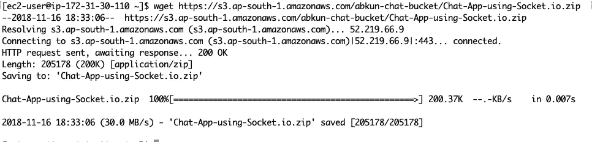

# 在 Amazon EC2 上部署节点应用程序

> 原文：<https://levelup.gitconnected.com/deploying-a-node-app-on-amazon-ec2-d2fb9a6757eb>

在 EC2 实例上部署节点应用程序似乎是一项艰巨的任务，但是如果您知道如何配置您的实例，这并不困难。

我们将在以下步骤中部署用 Nodejs 编写的聊天应用程序

1.  启动一个 EC2 实例并对其进行 SSH。
2.  在 EC2 实例上安装节点。
3.  复制 EC2 实例上的代码并安装依赖项。
4.  启动服务器永远运行。

所以让我们开始吧。

# 1.启动一个 EC2 实例并对其进行 SSH

你可以参考我的文章[启动一个 Amazon EC2 实例](https://hackernoon.com/launching-an-ec2-instance-fbfd50894aac)来启动一个 EC2 实例并 SSH 到其中。

配置安全组时，请确保打开运行节点应用程序的端口。在我的情况下，端口是 5000。

# 2.在 EC2 实例上安装节点

在对您的实例执行 SSH 之后，我们将在实例上安装 Node。

要安装 node，请在您的终端或 git bash 中运行以下命令

```
curl -o- https://raw.githubusercontent.com/creationix/nvm/v0.33.11/install.sh | bash. ~/.nvm/nvm.shnvm install 8.10
```

第一个命令安装节点版本管理器(nvm ),我们使用它在 Amazon Linux AMI 上安装节点。

第二个命令激活 nvm。

第三个命令指定我们希望安装哪个版本的节点。在这里，我正在安装 8.10 版本的节点。


安装和激活 nvm

您可以通过在终端中键入以下命令来检查您的节点版本。

`node -v`


安装节点 8.10

# 3.复制 EC2 实例上的代码并安装依赖项

通常有两种方法可以做到这一点

## **1。使用 Github、BitBucket 或 Gitlab**

这是在 EC2 实例上获取代码的最简单的方法之一。但是首先，您必须在实例上安装 git。键入以下命令在 Amazon Linux AMI 上安装 git。

`sudo yum install -y git`

现在，你可以运行`git clone`命令来克隆这个项目。

在这里，我克隆了一个节点聊天应用程序。

`git clone https://github.com/abkunal/Chat-App-using-Socket.io.git`

## 2.使用亚马逊 S3

我们可以为我们的节点项目制作一个 zip 文件(不包括 node_modules 文件夹),并将该 zip 文件上传到我们的 S3 存储桶。然后，我们可以公开我们的 zip 文件，在我们的实例上下载并解压缩它。

**对于 MacOS 和 Linux 用户** 右击你的节点文件夹，选择“压缩”选项。它将创建一个 zip 文件


在 MacOS 中压缩文件夹

**对于 Windows 用户** 右击你的节点文件夹，选择“发送到”中的“压缩(zipped)文件夹”选项。

现在让我们上传我们的压缩文件到一个 S3 桶。


创建 s3 存储桶

1.登录到您的 AWS 控制台并选择 S3。点击**创建存储桶**按钮，为您的存储桶输入一个唯一的名称，然后点击**下一步**按钮。

2.再次点击**下一步**按钮，**取消选中**设置权限**选项卡中的**所有复选框。


修改 s3 权限设置

3.点击**下一个**按钮，然后点击**创建桶**按钮。


将 zip 文件上传到 s3 存储桶

4.选择您新创建的 bucket 并将项目的 zip 文件上传到 bucket。


使 zip 文件可公开访问

5.点击 zip 文件然后点击**公开**按钮。

6.复制底部给出的链接，并将下面的命令粘贴到您的终端或 git bash 中，您可以通过 ssh 访问您的实例。

`wget LINK`

例- `wget [https://s3.ap-south-1.amazonaws.com/abkun-chat-bucket/Chat-App-using-Socket.io.zip](https://s3.ap-south-1.amazonaws.com/abkun-chat-bucket/Chat-App-using-Socket.io.zip)`



7.运行以下命令来解压缩 zip 文件。

`unzip filename.zip`

例- `unzip Chat-App-using-Socket.io.zip`

## **安装依赖关系**

现在，您可以通过导航到您的文件夹并运行以下命令来安装节点依赖项

`cd Chat-App-using-Socket.io
npm install`


安装节点依赖项

# 4.启动服务器永远运行

现在，为了让我们的服务器永远运行(即使我们没有 SSH 登录到实例)，我们将使用一个名为 pm2 的 npm 包。

1.通过运行以下命令安装 pm2

`npm install -g pm2`

2.将 pm2 设置为在服务器重新启动时自动启动服务器。

`pm2 start app.js
pm2 save
pm2 startup`


配置 pm2

注意，在运行`pm2 startup`命令后，我们得到一个以“sudo”开头的命令。

从`sudo`开始复制命令，直到下一行结束，并将其粘贴到终端中，然后按回车键。

现在，您的节点服务器正在运行，并被设置为在您重新启动 EC2 实例时自动启动。


在 EC2 实例上运行的聊天应用程序

现在，您可以使用实例的 IP 地址和运行服务器的端口来查看 web 应用程序的运行情况。

如有疑问，请在下方评论。

感谢阅读这篇文章。如果你喜欢它，请给它一些掌声，让更多的人喜欢它！