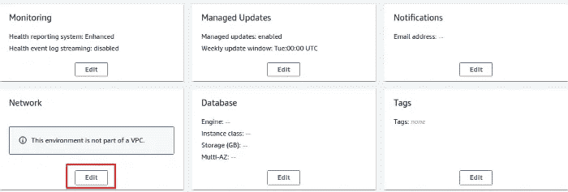

# 使用 GitHub 操作将节点应用程序部署到 AWS Elastic Beanstalk

> 原文：<https://levelup.gitconnected.com/deploying-a-node-app-to-aws-elastic-beanstalk-using-github-actions-d64c7e486701>


随着时间的推移，新闻技术和工具的出现为我们的日常问题带来了更好更快的解决方案。在持续集成和持续部署(CI/CD)的世界中，大多数解决方案都试图尽可能地自动化一个或多个过程。这就是本文的重点 **GitHub 动作**的情况。

> GitHub Actions 是 GitHub 提供的工具，用于自动化 CI/CD 软件工作流，支持在 GitHub 上构建、测试和部署您的托管代码。这些工作流由 GitHub 事件触发，如推送、问题创建或新发布，这允许基于项目特征的不同工作流的个性化。

虽然 Actions 自动化了整个部署管道，但它易于维护且灵活，因为它与我们在 linux 终端中看到的命令一起工作，非常像 Gitlab。此外，它为任何操作系统上的许多语言提供了大量的模板选择，并与许多云服务集成，以帮助构建您的工作流，这意味着 GitHub 上托管的任何项目都可以有自己的工作流！

基于这种想法，本文将展示一个 GitHub 动作的示例，该示例针对一个要在 AWS 弹性 Beanstalk 环境上部署的带有 Express 应用程序的节点。

# 弹性豆茎环境

在理解和展示工作流本身之前，我们必须准备好一个操作环境，并创建一个 bucket 来接收来自 GitHub Actions 的节点应用程序。bucket 创建步骤只是一个在将来帮助组织应用程序版本的过程。我们将使用 Express 在 Node 中运行一个简单的“Hello World ”,因为我们的重点是解释部署过程。

因此，要让一个应用在 Elastic Beanstalk 上运行，我们需要创建一个**源码包**，在我们的例子中，它是一个 **zip** 文件，包含一个 **Dockerfile** 和 Dockerfile 要运行的**源码**。在本地创建我们的应用程序后，这些文件将包含在源代码包中:


用于构建源代码包的文件

文件的内容有:

app.js

```
const express = require('express')
const app = express()
const APP_PORT = process.env.APP_PORT || 3000;app.get('/', (req, res) => {
  res.send('Hello World!')
})app.listen(APP_PORT, () => {
  console.log(`Running app at port:${APP_PORT}`)
})
```

Dockerfile 文件

```
FROM node:10
WORKDIR /usr/src/app
COPY package*.json ./
RUN npm install
COPY . .
ENV APP_PORT 8080
EXPOSE 8080
CMD [ "node", "app.js" ]
```

dockerignore

```
node_modules
npm-debug.log
```

package.json

```
{
  "name": "my-awesome-app",
  "version": "1.0.0",
  "description": "Hello World in Node with Express",
  "main": "app.js",
  "scripts": {
    "start": "node app.js"
  },
  "author": "",
  "license": "ISC",
  "dependencies": {
    "express": "^4.17.1"
  }
}
```

将这些文件放在一个 zip 文件下(出于演示目的，命名为" **my-awesome-app-v0.zip** )，我们可以转到 AWS Elastic Beanstalk 控制台开始创建我们的环境。

首先，我们点击“**创建新环境**”按钮，选择“ **Web 服务器环境**”，然后，设置“**应用程序名称**”。


在帐户的 EB 应用程序名称中，应用程序名称必须是唯一的

接下来，我们为它定义了“**环境名**和“**域**”。


设置环境名称和域。单击“检查可用性”以检查是否可以使用所需的域

之后，我们定义将使用什么平台。我们选择了“**托管平台**，因为我们想要将 **Docker** 与 **Amazon Linux 2** 一起使用，试图使实例的基础设施尽可能地轻量级和最新。


用 Amazon Linux 2 平台设置 Docker

下一步是设置要部署到环境中的应用程序代码。给出了三个选项:“示例应用程序”、“版本标签”或“上传您的代码”。我们将选择“上传您的代码”，并选择我们的“ **my-awesome-app-v0.zip** ”文件。


“我的-牛逼-app-v0.zip”上传

考虑到我们将使用自定义 VPC 和子网配置，我们必须在完成创建过程之前，通过转至“**配置更多选项**”来定义要使用的配置。

为此，请转到“**网络**卡并进行编辑。



编辑网卡

选择所需的 **VPC** 和**子网**。


选择 VPC


选择子网

然后，我们需要为我们的 **EC2** 实例设置一个**安全组**。转到编辑“**实例**”卡并选择一个 EC2 安全组。


选择安全组

点击**创建环境**，环境创建开始。在等待 AWS 构建过程之后，您应该会看到这样的环境:


环境预览

现在去 **S3** 创建一个桶来存储我们未来的应用程序版本。其名称必须与我们的工作流文件中定义的名称相匹配。在这种情况下，我们命名为“**我的-牛逼-app-bucket** ”。


设置存储桶的名称


定义存储桶的访问权限

默认情况下，可以保留剩余铲斗的配置。有了创建的弹性 Beanstalk 环境和 bucket，下一步是使用 GitHub Actions 更新我们的应用程序。

# 了解工作流程

在 Actions 中，工作流是在 YAML 文件中定义的，该文件描述了包含一组命令的步骤，这些命令创建了整个 CI/CD 管道流程。该文件必须放在**下。github/workflows** "文件夹放在你的资源库的根目录下，它的名字可以是任何东西(真的)。在这个例子中，我给的名字是“node-deploy-aws-eb.yml”。

出于比较的好奇，在 Gitlab 中，您也可以在 YAML 文件中描述一个管道，但是每个存储库中只能有一个必须命名为“**的文件。gitlab-ci.yml** "在存储库的根目录下，而在 GitHub 中你可以有多个文件，每个文件都是根据你选择的 GitHub 事件触发执行的(这将在接下来的段落中强调)。

因此，由于我们将在 AWS Elastic Beanstalk 环境中部署一个节点应用程序，我们将按照以下顺序将我们的工作流分为两部分:

1.  **创建 Elastic Beanstalk 版本**:为我们的 Elastic Beanstalk 应用程序创建一个新版本，并将其存储在一个定制的 S3 桶中。
2.  **部署到弹性 Beanstalk 环境**:将我们的新版本部署到我们创建的环境中。

为了加快速度，工作流文件如下:

解释文件的各个部分:

“**名称**只是文件的描述。

" **env** "的工作方式类似于一个名称空间，您可以在其中定义要在"**步骤**中使用的自定义环境变量。

“ **on** ”作为一个命名空间，您可以在其中定义哪些 GitHub 事件将触发此工作流的执行。“**推送**”、“**分支**”、“**【main】**”定义了分支“main”上的每一次推送都会触发该工作流。

**作业**，顾名思义，定义了工作流程中要执行的“作业”。定义了两个作业:“ **create_eb_version** ”和“ **deploy_aws** ”。

**运行-开启**定义运行作业的图像(机器类型)。

**需要**定义作业之间的依赖关系。在这种情况下，只有在“ **create_eb_version** ”之前运行过的情况下，“ **deploy_aws** ”才会运行。

"**uses:actions/check out @ v2**"允许工作流通过签出来访问您的存储库。

"**使用:actions/setup-python@v1** "在机器中安装 python，这样我们就可以安装" Elastic Beanstalk Cli "来部署我们的应用程序。

"**用途:aws-actions/configure-AWS-credentials @ v1**"处理 AWS 帐户验证。

" **secrets** "包含包含敏感信息的加密环境变量。

要在“秘密”下定义我们的变量，我们需要转到“**设置**”选项卡，“**秘密**”菜单，并点击“**新储存库秘密**”。对于我们的工作流，我们定义了以下变量:


“秘密”下定义的变量

定义好这些配置后，我们可以将文件推送到我们的存储库中，以查看 GitHub 操作的运行情况(抱歉)。


推送的文件


运行中的工作流

当两个作业都成功运行时，它们将在可视化整个管道时获得绿色复选标记。


成功执行

我们可以通过检查我们的定制 bucket 并查看存储在那里的已创建的应用程序版本来验证一切工作正常。


带应用程序版本的桶

和我们的具有相同应用程序版本的弹性 Beanstalk 环境。


应用程序版本的环境

时候到了！要查看应用程序的运行情况，只需点击应用程序的 URL，您应该会看到著名的“Hello World”消息。


你好世界信息

# 结论

Actions 是对 GitHub 的一个很好的补充，因为它提供了一个健壮且易于维护的 CI/CD 自动化工具。通过使用它，我们可以在 GitHub 本身内部查看从代码提交到 app 更新的整个部署过程，减少了使用多个工具时耦合产生的困难。

尽管 Actions 是最近(2019 年 11 月)推出的，但它背后有一个庞大的社区，帮助其发展，并支持现有用户和新用户。这意味着从现在开始只会越来越好。

# 参考

[](https://github.com/features/actions) [## 功能* GitHub 操作

### 此时您不能执行该操作。您已使用另一个标签页或窗口登录。您已在另一个选项卡中注销，或者…

github.com](https://github.com/features/actions)  [## GitHub 操作的工作流语法

### 工作流文件使用 YAML 语法，并且必须具有. yml 或。yaml 文件扩展名。如果你刚到 YAML，想…

docs.github.com](https://docs.github.com/en/actions/reference/workflow-syntax-for-github-actions)