# 几分钟内在 Heroku 上部署 Node.js 应用程序

> 原文：<https://levelup.gitconnected.com/deploying-a-node-js-app-on-heroku-within-minutes-9f50a3eff2fb>


约翰·施诺布里奇在 [Unsplash](https://unsplash.com/s/photos/hosting?utm_source=unsplash&utm_medium=referral&utm_content=creditCopyText) 上的照片

Heroku 是一个云平台即服务(PaaS)，支持在云中部署和运行应用程序。支持 Java、Python、Node.js、Go、PHP 等多种语言。

这里，我们的目标是在 Heroku 中构建和部署一个简单的 Node.js 应用程序。为此，您需要具备以下条件。

*   Node.js 已安装
*   [GitHub](https://github.com/) 账号
*   [Heroku](https://www.heroku.com/) 账号

## 创建 Node.js 应用程序

*   创建一个新文件夹，并在其中打开一个命令行。
*   执行以下命令。

```
***npm init -y
npm install express***
```

*   创建 app.js 文件。

现在项目结构如下图。

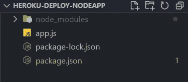

项目结构

*   在 package.json 中的脚本下添加 start 命令作为 ***节点 app.js***

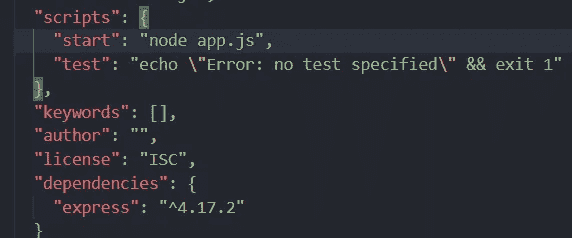

package.json

让我们为 app.js 文件添加一个简单的 Node.js 代码。我们不需要将编码部分复杂化，因为我们的目的是查看部署部分。

确保我们的应用正在运行。

使用命令 ***node app.js*** 运行项目。并尝试在浏览器上输入[***http://localhost:3000/***](http://localhost:3000/)。

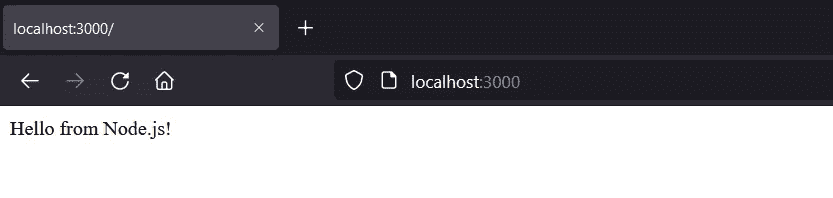

如果它工作，你会看到上面。

我们需要先将项目添加到 GitHub 中。所以，我们再加上**。gitignore** 文件也一样。

提到我们不需要在那里提交 node_modules，如下所示。只需在. gitignore 中添加以下内容。

```
***/node_modules***
```

与 Heroku 一起工作时，最好使用 Procfile。一般用于指定 app 启动时要执行的命令。

并将以下内容添加到 Procfile 中。

```
***web: node app.js***
```

现在项目看起来如下。

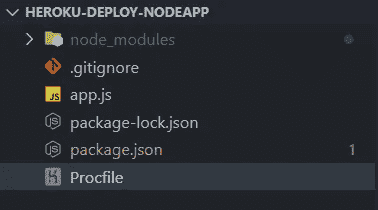

app.js

请注意，Procfile 没有任何扩展名。

## 将项目添加到 GitHub

*   转到您的 GitHub 帐户并创建一个新的存储库。
*   在项目中打开一个命令行，执行以下命令。

```
***git init
git add .
git commit -m "initial commit"
git branch -M main
git remote add origin <Repo_URL>
git push -u origin main***
```

创建存储库后，您将能够看到 Repo URL。

现在我们可以看到我们的项目被添加到 GitHub 存储库中。

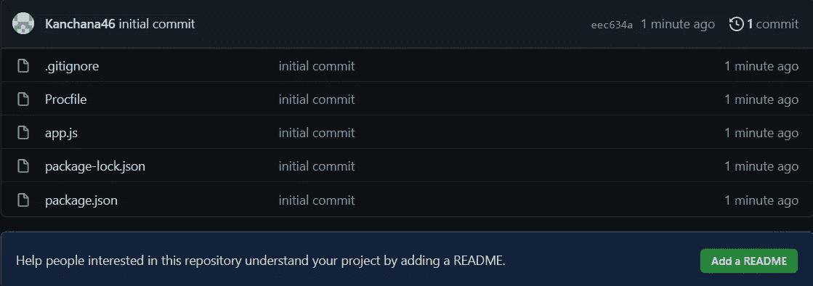

Git 储存库

我们可以开始最后的工作了。

## 在 Heroku 上部署项目

*   去你的 Heroku 账号，给 ***新建 app*** 。

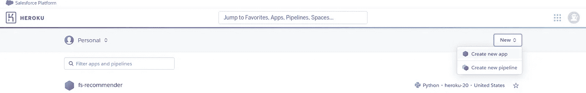

*   给一个名字，然后创造。

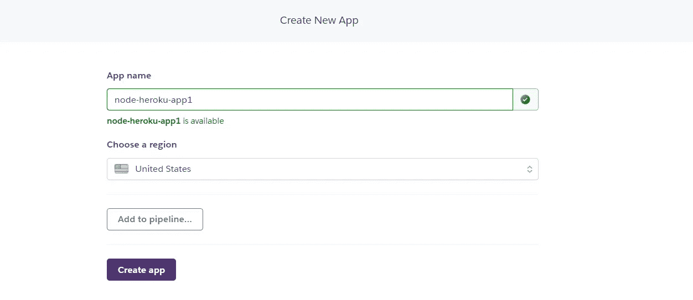

*   给 ***连接 GitHub*** 。

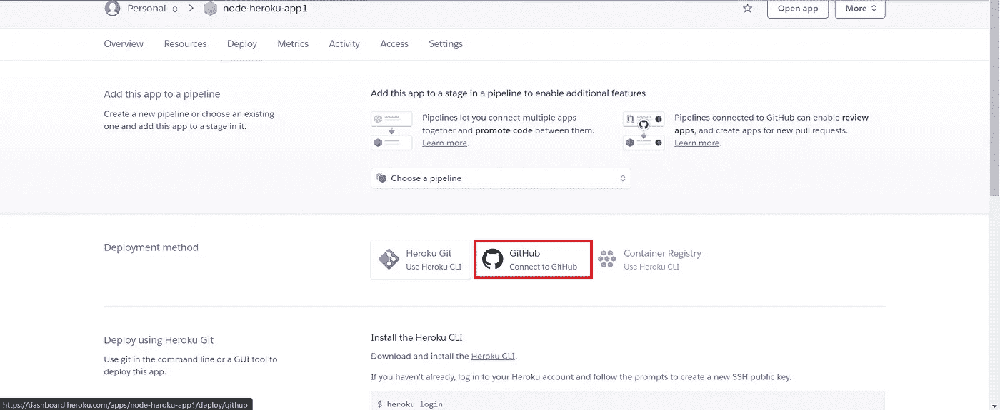

*   点击 ***部署分支*** 。

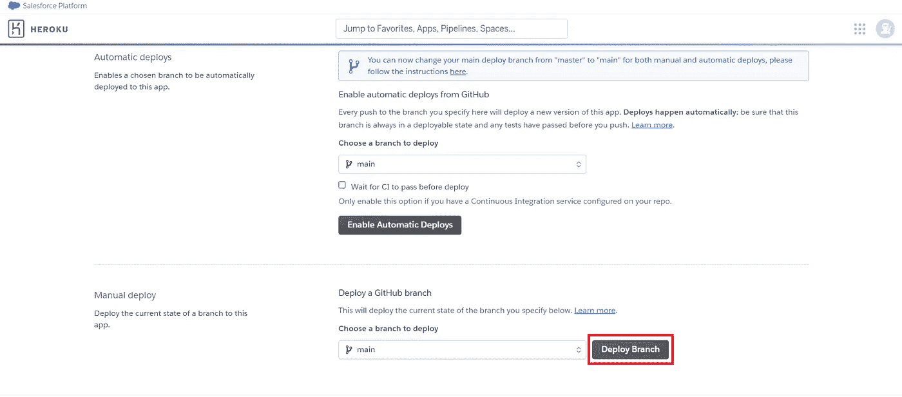

*   现在它将在几分钟内展开。完成后只需做 ***打开 app*** 。

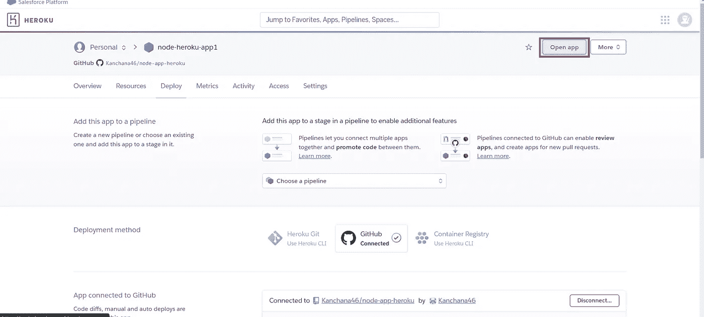

您可以在多个地方打开部署的应用程序，不仅仅是在这里。

*   就是这样。现在你可以看到我们的应用程序已经启动并运行了！

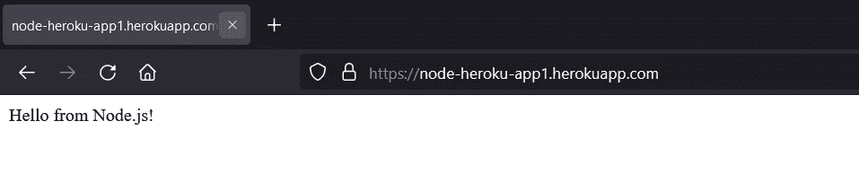

如您所见，Node.js 应用程序的部署就是这么简单！:D

希望这对您有所帮助。

谢谢大家！。