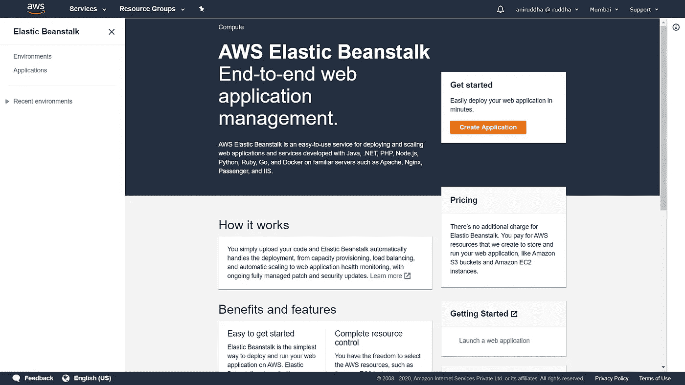
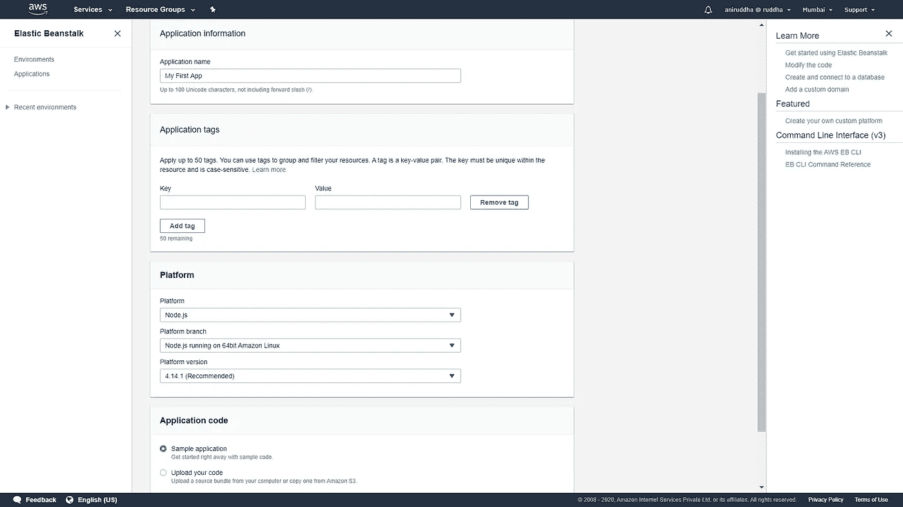
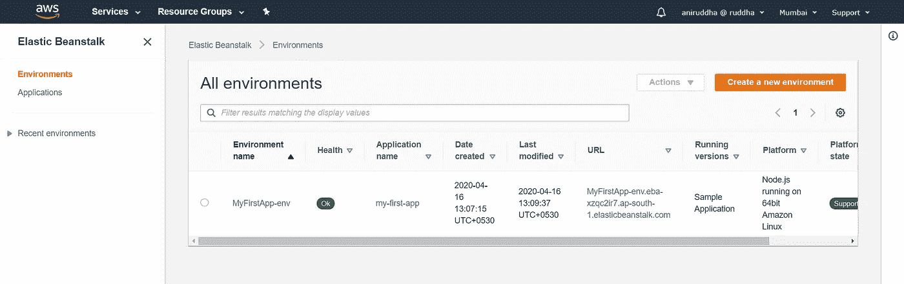
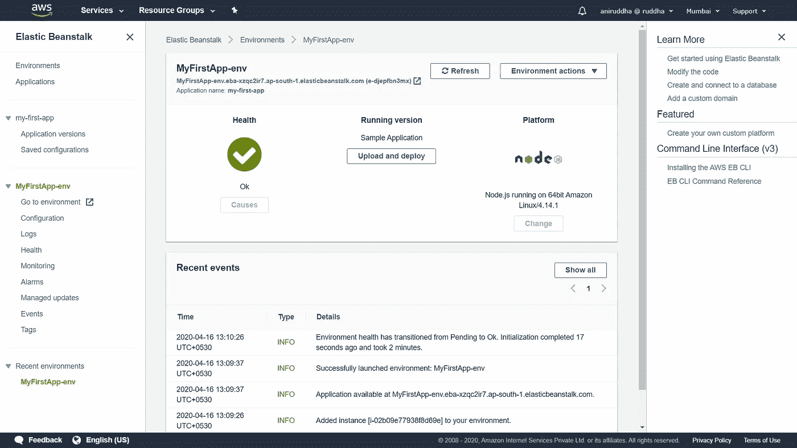

# 在 AWS Elastic Beanstalk 上部署构建在 Node.js 上的静态站点

> 原文：<https://levelup.gitconnected.com/deploying-a-static-site-using-node-js-on-aws-elastic-beanstalk-15d15c2bf843>

AWS 徽标

你用你的 Node.js 技能创建了一个新网站？太好了！你现在发现简单的虚拟主机解决方案不能为你的 Node.js 应用程序提供支持吗？好吧，别灰心。在这个简短的演练中，我们将看到如何在 AWS Elastic Beanstalk 上部署基于 Node.js 构建的静态网站。

这是我关于 AWS 工作的第一次演练。我自己也是一名初学者，目前正在准备 AWS CCP 认证。这将是我的 AWS 基础知识之旅的文档。我希望它对愿意加入 AWS 的人有用！

## 先决条件

我假设您已经准备好使用 Node.js 部署您的网站。如果没有，请随意从 GitHub 克隆我的示例库。

您确实需要一个可部署的 Node.js 应用程序来继续，因为此时我们还没有讨论如何创建 Node.js 应用程序。

此外，我们需要一个 AWS 帐户。AWS 有一个免费层，允许您在一定时间内使用一组特定的服务(尽管有限制)。您可以从[这里](https://aws.amazon.com/free)了解有关 AWS 免费层的更多信息并创建帐户。

## 创造环境

借用 [AWS 文档](https://docs.aws.amazon.com/elasticbeanstalk/latest/dg/Welcome.html)中的几句话，环境是，

> 环境是应用程序的核心。当您创建一个环境时，Elastic Beanstalk 会提供运行应用程序所需的资源。为环境创建的 AWS 资源包括一个弹性负载平衡器、一个自动扩展组和一个或多个 Amazon 弹性计算云(Amazon EC2)实例。

因此，环境是我们运行应用程序所需的云服务的集合。Elastic Beanstalk 支持许多平台/语言，包括但不限于 PHP、Node.js、Java、Python 等。

我们希望在本指南中使用 Node.js。因此，我们将从创建一个新的 Node.js 环境开始。

**第一步:**到你的 AWS 控制台，打开 AWS 弹性豆茎服务。

AWS 弹性豆茎页面。我们可以从这里创建和更改环境和应用程序。

**第二步:**点击 ***创建应用*** 按钮继续。它会询问一些细节。我们需要填写一个应用程序名称。我们可以为环境添加可选的标签。我们还需要为环境选择一个平台，在本例中就是 Node.js。我们不会改变任何平台分支或版本选项。我们将保持选中“示例代码”复选框。最后，点击 ***创建应用*** 。

我在创建应用程序时使用了以下细节。请随意更改它们，只要您不更改任何平台细节。

AWS Elastic Beanstalk 现在将创建一个 Node.js 环境，其中已经有一个示例应用程序代码。在幕后，EBS(Elastic Beanstalk 的缩写)将提供一个弹性云计算(EC2)实例，一个弹性 IP，配置安全规则和在云上运行 Node.js 应用程序通常需要的东西。

**步骤 3:** 我们现在可以看到新的 Node.js 环境和示例应用程序。在 EBS 的 AWS 管理控制台的左侧栏中，我们有两个选项:“T2 T3 环境 T4 T5”和应用 T7 T8 T9。我们将从 Environments 选项卡中看到我们的新环境。它将显示为 *<应用程序名称>-环境*。我们可以从这里控制环境的各个方面。您将看到一个 URL，该 URL 将指向您部署的应用程序。

你可以看到我为这次演示创建的“我的第一个应用”环境。URL 将指向我当前部署的应用程序，这是 AWS EBS 提供的示例应用程序。

## 部署 Node.js 应用程序

如果您可以在打开 URL 后看到成功页面，那么您已经成功地部署了示例应用程序。现在，我们将把这个示例应用程序更改为 Node.js 应用程序，为我们的网站提供服务。

为此，我们需要为代码准备一个压缩包。如果您没有自己的代码，您可以前往这个 GitHub 存储库，创建您的压缩文件(请注意，文件*不能存在于任何二级文件夹中)。*

如果您有自己的代码，将它们压缩在一起(您不需要在包中包含 *node_modules* 文件夹)。

现在我们将上传这个压缩包。转到*环境*选项卡，单击您的环境名称。

这是我的环境仪表板。“上传和部署”按钮位于中间。

点击 ***上传并部署*** 。我们现在必须选择我们的 zip 文件并点击“*”。*

*EBS 现在将更新我们的环境并部署我们的应用程序。*

*如果一切顺利，在再次访问环境 URL 时，我们会看到“这是一个简单的静态页面”，或者您的应用程序提供的任何内容。*

## *结论*

*我们学习了如何在 AWS Elastic Beanstalk 上部署 Node.js 应用程序。我们可以用这种方式部署任何有效的 Node.js 应用程序，包括更加复杂和实用的应用程序。*

*AWS 弹性豆茎本身是免费的。如果您不在 AWS 免费层，您只需要为您使用的底层资源(如 EC2 实例)付费。免费层用户每月可享受长达 12 个月的 750 小时免费 EC2。*

*下周，我们将了解如何使用 PostgreSQL 引擎创建一个 AWS RDS 实例，并将其连接到 Node.js 应用程序。到那时，再见，学习愉快！*