# 使用 Terraform Cloud CI/CD 部署双层结构

> 原文：<https://levelup.gitconnected.com/deploying-a-two-tier-structure-with-terraform-cloud-ci-cd-b2dca3accfb>

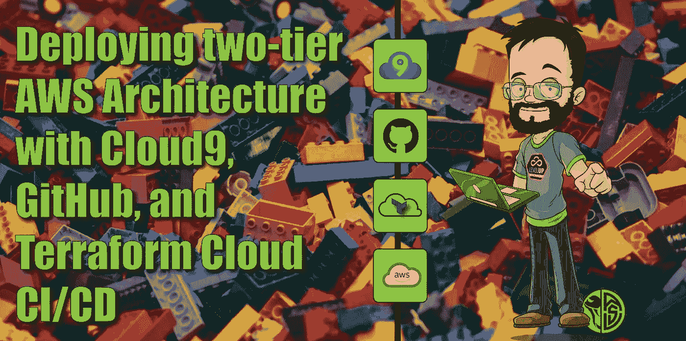

该项目将展示一些有趣的 Terraform 概念和工具，如模块、通过 Terraform Cloud 的自动化 CI/CD 以及连接到 GitHub！

# 让我们升级吧！

## 目标。

创建包含以下内容的高度可用的双层 AWS 体系结构:

*   3 个公共子网
*   3 个私有子网
*   堡垒主机的自动扩展组
*   Web 服务器的自动扩展组(在专用子网中)
*   面向 Internet 的应用程序负载平衡器，目标是 Web 服务器自动扩展组

使用 Terraform Cloud 作为 CI/CD 工具部署所有这些，所有主要代码都应该在模块块中。

## 先决条件。

*   您的首选 IDE(我使用 Cloud9)
*   GitHub 帐户
*   AWS 帐户
*   Terraform 云帐户
*   已安装地形
*   亚马逊 EC2 密钥对

# 让我们建立 CI/CD 渠道吧！

## GitHub 回购

我做的第一件事，是为这个项目创建一个新的 GitHub 库。

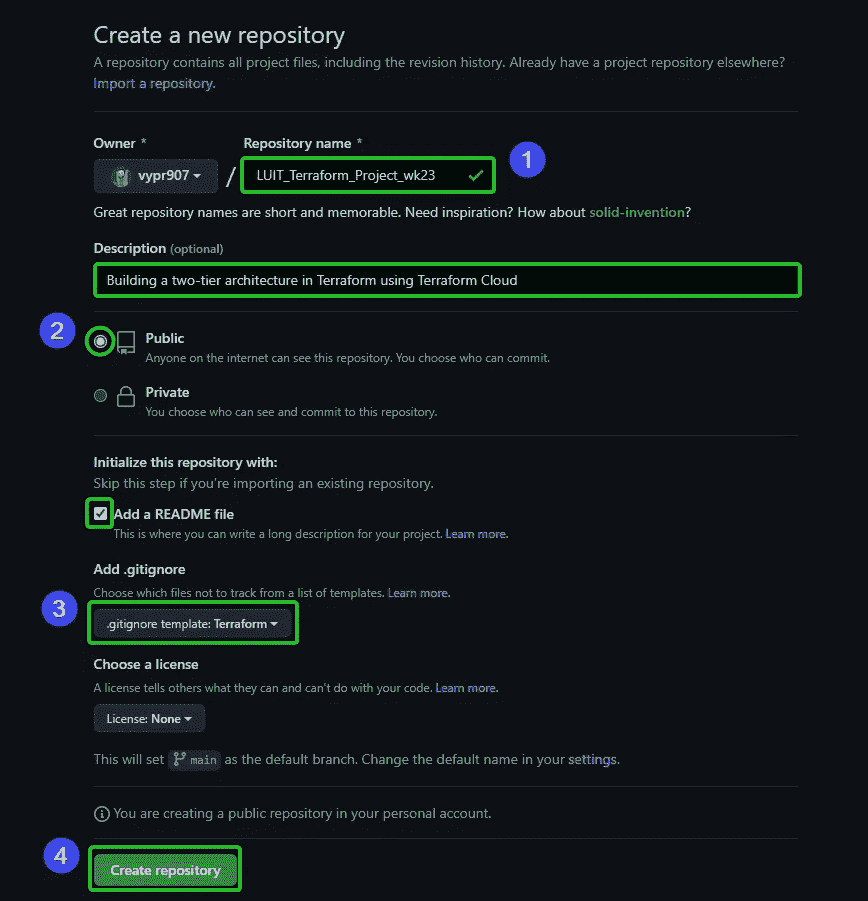

自述文件和。gitignore 文件在这里创建，为我们节省了一步。

这真的很简单，但这将是我们开发项目时的一个重要难题！

## 或者:自己去叉…

如果你不是从零开始建立这个，请随意为你自己叉一份我的回购[这里](https://github.com/vypr907/LUIT_Terraform_Project_wk23.git)！如果您需要复习 GitHub，请查看我以前的一篇文章！

 [## 为 GitHub 库做贡献

### 也叫叉吧！克隆它！推它！拉它！

blog.devgenius.io](https://blog.devgenius.io/contributing-to-a-github-repository-748ad7874101) 

继续，我们进入:

## Terraform 云工作空间

对于这篇文章，假设你不仅有一个 TfC 账户，而且你已经建立了一个组织。在 Hashicorp 的大量教程和演练中可以找到一个很好的演练:[地形云介绍](https://learn.hashicorp.com/tutorials/terraform/cloud-sign-up)。

话虽如此，让我们创建一个工作区！

默认情况下，创建您的帐户(和组织)后，您的主页是工作区页面:

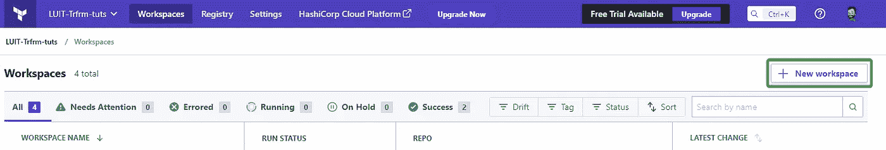

点击按钮！

接下来，我们将选择“版本控制工作流”,因为我们将把 GitHub repo 连接到此工作区。

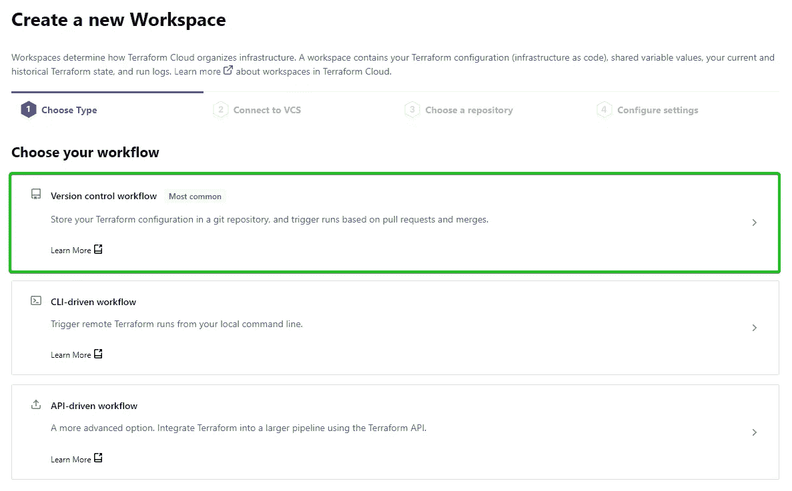

…如此处所示。

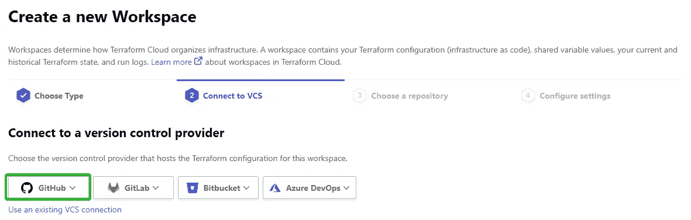

我忘记截图了，但在点击“GitHub”后的下拉菜单中，你会想要选择“Github.com (custom)”选项。

之后，系统会提示您输入 GitHub 凭据，并授权 GitHub 和 Terraform 之间的连接。

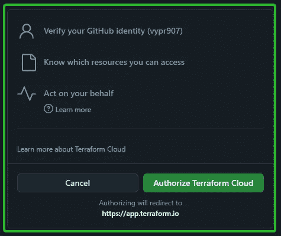

下一个提示将是另一个授权类型窗口，但这里我们将选择我们的回购。只保留这个项目，我选择只选择我的项目 repo，而不是 GitHub 中的所有存储库。

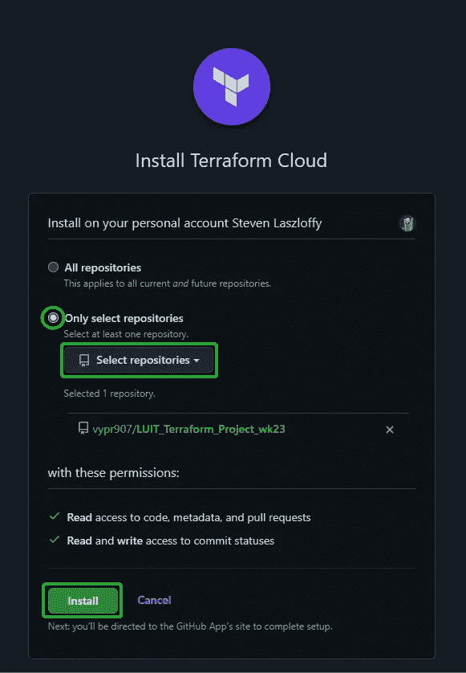

GitHub 这边可能还有一个授权窗口，但除此之外，我们应该继续前进。

接下来，它将要求您为工作区选择 repo，但是因为我们只“安装”了一个，所以它应该只显示我们选择的 repo。

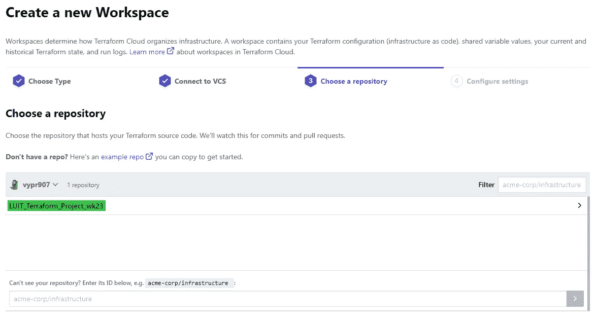

如果我们之前选择了“所有存储库”，这将是我们选择项目回购的地方。

接下来，我们命名工作区，并创建！
*不用担心这个项目的高级选项。*

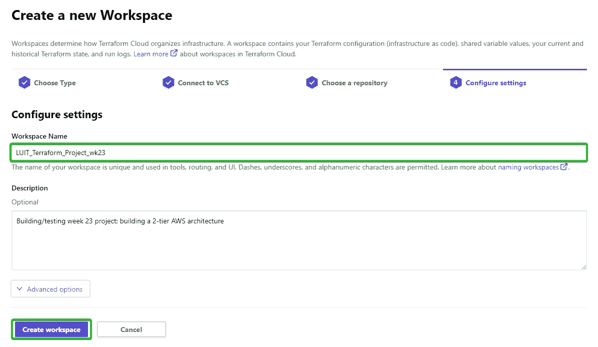

因为我是用(除了。gitignore/README 文件)一个空白的 repo，Terraform Cloud 不会找到任何变量来配置。因此，我们需要首先转到概述，然后我们可以单击建议的操作按钮，或者选择我们的变量选项卡。

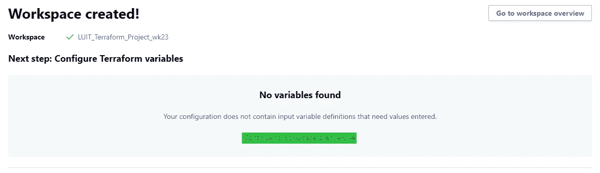

现在来看看环境变量的配置，这在使用 AWS 资源时非常重要。

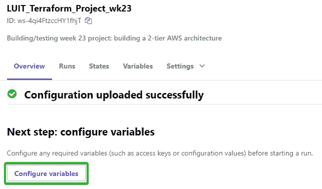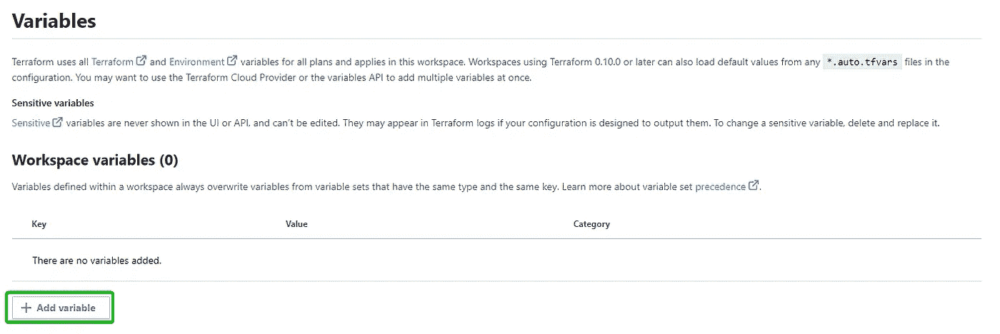

这一页没有火箭科学。单击按钮。

这里，我们需要创建以下变量:

*   AWS_ACCESS_KEY_ID
*   AWS_SECRET_ACCESS_KEY
*   访问 _ip
*   AWS_REGION

对于访问变量，我们希望使它们成为环境变量，并将它们标记为“敏感的”

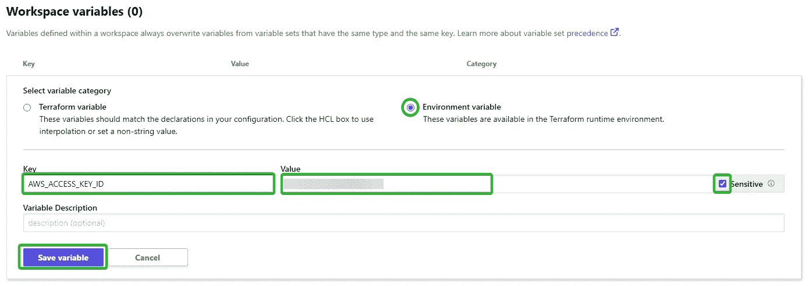

“access_ip”变量应该是“Terraform”变量，而不是“Environment”。

现在你知道了！Terraform Cloud 已经设置好了，可以开始摇滚了！

## IDE

我们的最后一步很简单，那就是将我们的 GitHub repo 克隆到我们的 IDE 中。无论您选择创建自己的新回购，还是放弃现有项目，我们只需投入一点点`git clone <github url>`，就可以开始比赛了！

如果您正在构建自己的模块，我们需要创建一些文件和文件夹来正确地设置我们的根模块和子模块。下面是我的目录结构的快照，每个模块都有自己的`main`、`variables`和`outputs`。“tf”文件。实际上，您可以随意命名这些文件，但是这些是便于阅读的最佳实践。

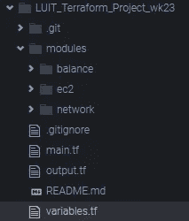

# 让我们点燃这个火箭！

虽然我最初的计划是遍历模块和所有配置文件的实际开发，但我将把它作为设置 CI/CD 过程的遍历。上面是我的 GitHub repo 的链接，我鼓励你去看看，但是我们创建的 CI/CD 管道的美妙之处在于，你可以在任何 Terraform/AWS 项目中使用这个管道！

说到这个，我们如何“点燃火箭”？

在我们的 IDE 中，我们只是将我们的更改推送到我们的 repo 中。这将在我们的 TfC 工作区中触发一次运行。

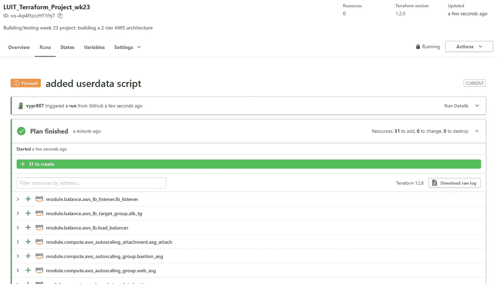

这个管道的美妙之处在于，当我在排除故障/开发功能/组件时，我可以进行小的、增量的更改，只需“推”到我的 GitHub，我就可以立即看到结果。上面的截图可能是第 20 次运行，因为我处理了一些错误的配置和“凌晨 3 点编码”的错误。😂GitHub repo 也将有提交的精彩历史，允许我跟踪我去过哪里，做了什么。

不过，让我们继续吧！“计划”成功完成后，我们将看到以下内容:

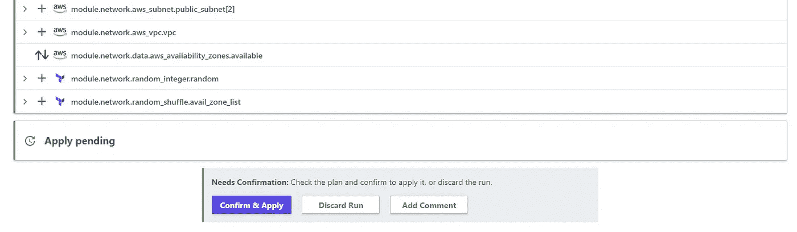

这是我们期待已久的时刻！我们睡眠不足，半疯了，但我们成功了！我们按下按钮，然后…

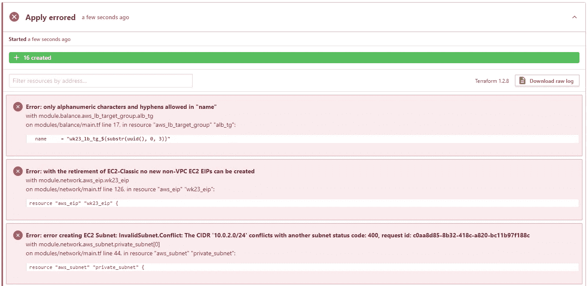

耶，更多故障排除！！请不要认为这些项目第一次就成功了，:D，我没那么好！但只是为了搞笑，上面的错误用下面的方法解决了:

*   将下划线改为破折号/连字符(我永远记不住哪些部分不喜欢下划线)
*   阅读[文档](https://registry.terraform.io/providers/hashicorp/aws/latest/docs/resources/eip)。在我的资源声明中发现了缺失的部分。
*   我的自动 cidr 代码行不工作，所以我最后只能手动为不同的子网编写 CIDR。不优雅，但在凌晨 3 点，它的工作。

# 让我们离开这里！

## 验证

这个项目有点疯狂，但是我们可以通过验证 AWS 控制台中的资源以及我们输入的这个漂亮的输出来判断我们的项目是否成功:

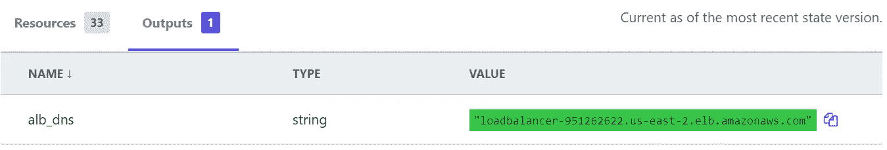

把这个坏男孩放入浏览器窗口，我们将看到我们可信的测试页面，让我们知道一切都已正确配置！！

## 清理工作

现在，与所有优秀的云项目一样，资源管理和清理对于月底降低账单至关重要，所以让我们现在就行动起来吧！

以前，对于通过 CLI 的 Terraform 项目，我们可以运行一个`terraform destroy`,然后就大功告成了。然而，由于我们使用的是 Terraform Cloud，因此过程会有所不同。

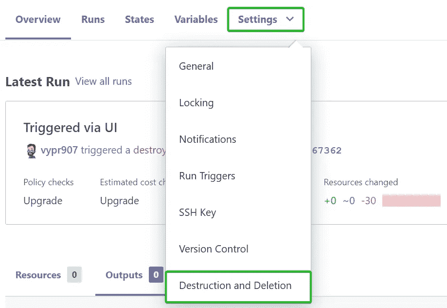

如果你注意到菜单后面的运行，你可以看到我已经这样做了。:)

选择销毁和删除后，您会看到这个屏幕。请务必注意这两个选项之间的差异:

*   **破坏基础设施**
    这相当于 CLI 中的`terraform destroy`。应该先运行**再运行**来关闭一切。
*   **删除工作区** 这将删除整个工作区和配置。当你完成了整个项目，并想清理房子时，使用这个。删除所有连接、状态文件等。

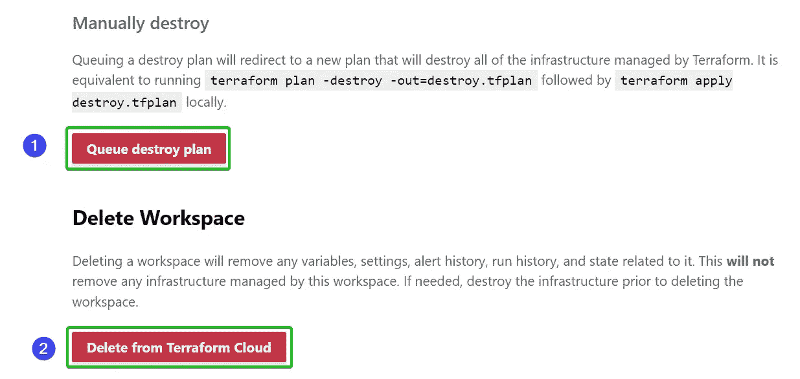

最后，您将看到一个确认屏幕。输入工作区名称并选择“队列销毁计划”后，Terraform Cloud 将运行一个计划来销毁所有托管基础架构。

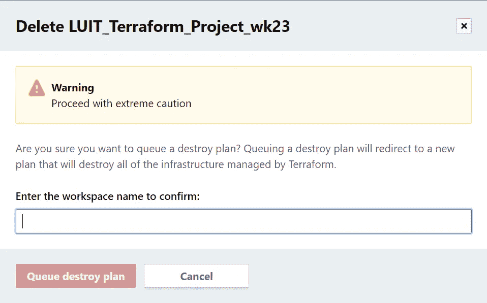

## 再见

就是这样，伙计们！感谢阅读，希望你学到了一些东西，或者找到了答案，或者只是喜欢阅读我在科技升级中的恶作剧！

直到下一次，

vypr 完毕！

# 分级编码

感谢您成为我们社区的一员！在你离开之前:

*   👏为故事鼓掌，跟着作者走👉
*   📰查看[升级编码出版物](https://levelup.gitconnected.com/?utm_source=pub&utm_medium=post)中的更多内容
*   🔔关注我们:[Twitter](https://twitter.com/gitconnected)|[LinkedIn](https://www.linkedin.com/company/gitconnected)|[时事通讯](https://newsletter.levelup.dev)

🚀👉 [**加入升级达人集体，找到一份惊艳的工作**](https://jobs.levelup.dev/talent/welcome?referral=true)