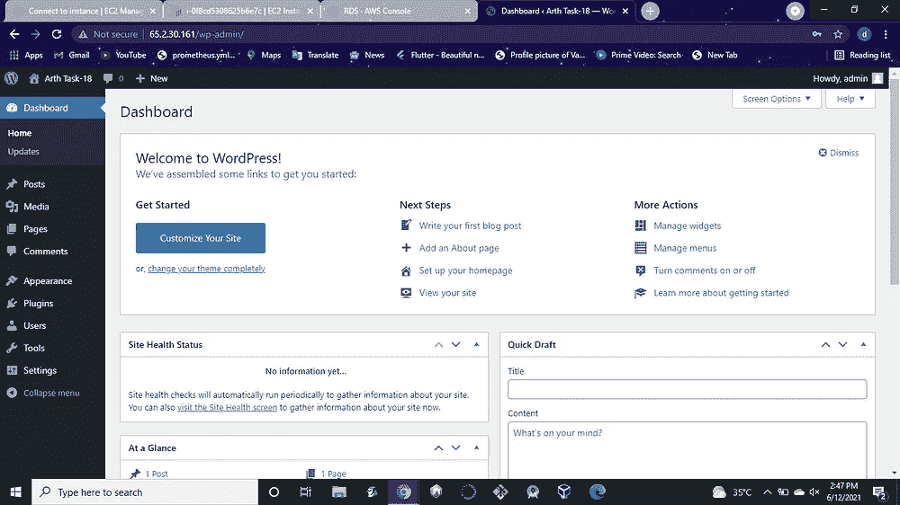

# 使用 RDS 在 AWS 上部署 WordPress 站点

> 原文：<https://levelup.gitconnected.com/deploying-a-wordpress-site-over-aws-using-rds-b2e5e62902c9>


WordPress 是一个非常受欢迎的内容管理系统(CMS ),互联网上超过 30%的网站都在使用它。它最常用于博客，但也可以用于运行电子商务网站、留言板和许多其他流行的用例。

**MySQL** 是一个开源的关系数据库管理系统(RDBMS ),可以在本地或通过托管提供商的云轻松实现和管理。

有了 Amazon RDS for MySQL，我们可以实现自动备份和恢复，这样您就不会在发生事故时丢失数据；定期更新和补丁，保持您的数据库安全和高性能，易于安装智能默认参数。

在这篇博客中，我们将看到如何使用 Amazon RDS for MySQL 来配置 WordPress 安装。要配置这个 WordPress 站点，您将在 AWS 中创建以下资源:

*   安装和托管 WordPress 应用程序的 Amazon EC2 实例；
*   一个 Amazon RDS for MySQL 数据库来存储你的 WordPress 数据。

首先，我们需要启动 AWS EC2 实例，如下所示:


ec2 发布

我在这里使用所有默认配置启动实例，在“配置安全性”部分允许所有流量(这在实际用例场景中确实不是一个好的做法)，选择一个密钥对，然后启动我的 ec2 实例。

WordPress(软件)是一个网络应用程序。要在任何机器上运行 WordPress，我们需要安装 Apache、PHP 和 MySQL。因此，一旦实例启动，我们就可以连接到实例并在那里进行一些配置。使用 sudo 切换到 root 帐户(这也不是一个好的做法),并在那里运行以下命令:

```
$ yum install httpd -y
$ yum install mysql -y
```

WordPress 是用 PHP 编写的，我们需要在实例上安装 PHP，使用:

```
$ amazon-linux-extras enable php7.4
$ yum install php-cli php-pdo php-fpm php-json php-mysqlnd
```

然后进入文档根目录，/var/www/html，下载 WordPress 文件并解压。

```
$ wget http://wordpress.org/latest.tar.gz
$ tar -xzf latest.tar.gz
```

最后，启动 httpd 服务并使其永久化:

```
$ systemctl start httpd
$ systemctl enable httpd
```


WordPress 使用 MySQL 来存储这些内容，所以这里我们使用 Amazon RDS for MySQL。您可以创建多个 WordPress 安装，连接到 RDS 上的一个 MySQL 实例，允许您水平扩展您的站点。

这里，我使用一个标准的创建和免费层来启动 MySQL。我已经提供了主用户名和密码以及初始数据库名(在附加配置中)。


现在，我们可以使用以下命令通过 EC2 实例登录到我们的数据库:

```
$ mysql -h <endpoint> -u <username> -p
```


在浏览器中输入 ec2 实例的 IP 地址，通过输入初始数据库名称、用户名、密码和数据库的 DNS 端点来打开 WordPress 配置菜单。


现在在提交之后，你可以编辑/var/www/html 文件夹中的*wp-config-sample.php*的内容，并通过提供用户名、密码、数据库名称等来更新它，或者通过复制 WordPress 页面中显示的内容来直接覆盖它的内容。完成后，将文件重命名为 wp-config.php*，然后点击“运行安装程序”并使用以下命令重启 httpd 服务:*

```
*systemctl restart httpd*
```

*现在到了有趣的部分——去玩你的新网站吧。配置设计，添加页面和帖子，并开始让用户访问您的网站。*

********

> *这就是所有的人…谢谢你的阅读:)*
> 
> *这项任务是与 Prithviraj Singh 合作完成的，因此我要感谢他一直以来的帮助和指导。-*