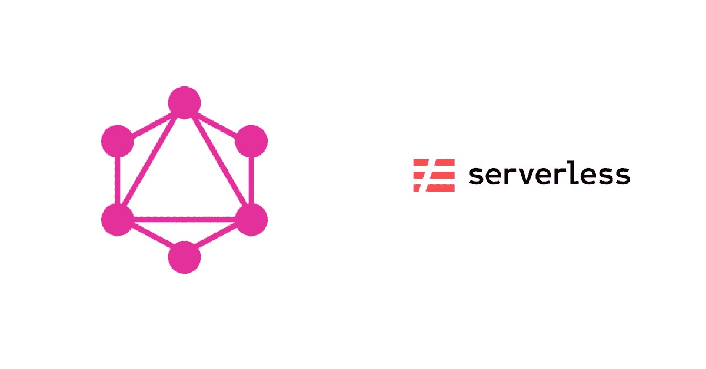
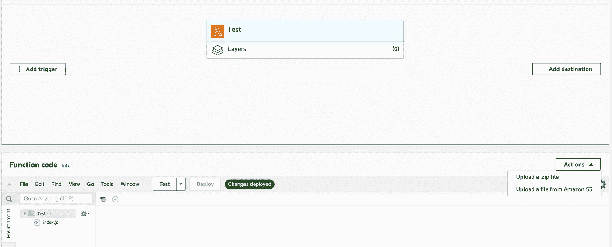
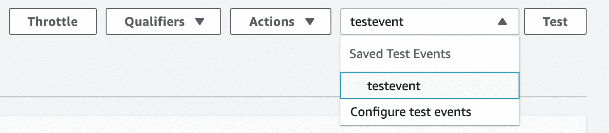
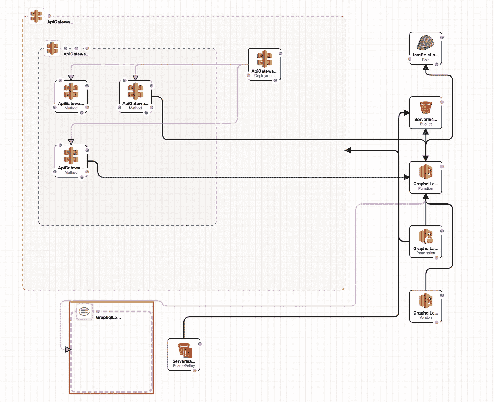

# 通过无服务器部署 Apollo GraphQL 应用程序作为 AWS lambda 函数

> 原文：<https://levelup.gitconnected.com/deploying-an-apollo-graphql-application-as-an-aws-lambda-function-through-serverless-77fa33612bae>



这篇文章是我上一篇[文章](/accessing-aws-dynamodb-through-apollo-graphql-server-deployed-in-aws-lambda-through-serverless-e2752c84281c)的延续，在那篇文章中，我们构建了一个极简应用程序来从本地托管的 Graphql 服务器中提取 AWS DynamoDB 数据。

现在，我们将进一步修改代码，以运行与通过无服务器部署的 AWS Lambda 函数相同的代码。

**第四步:制作一个 lambda 函数**

Apollo 服务器通过`apollo-server-lambda`模块为 lambda 函数提供绑定。

更改`server.js`，不运行 Apollo Server，而是导出一个 apollo GraphQL lambda 函数，AWS lambda 将基于 HTTP 事件调用该函数。

`const { ApolloServer, gql } = require(‘apollo-server-lambda’);`

```
const handler = server.createHandler({
  cors: {
    origin: true,
    credentials: true,
  },
});
exports.graphqlHandler = handler;
```

server.js 的完整代码

**步骤 5:部署到 AWS**

现在您需要将它发布到 AWS。为此，我们将利用[无服务器](https://www.serverless.com/framework/docs/)(一个简化开发和部署无服务器应用程序的框架)。

```
npm install -g serverless
```

无服务器需要一个 AWS 概要文件来代表您发布和部署代码。在上一篇[文章](/accessing-aws-dynamodb-through-apollo-graphql-server-deployed-in-aws-lambda-through-serverless-e2752c84281c)中，我们创建了一个名为`serverlessuser`的概要文件。

`aws configure --**profile serverlessuser**`

在 CLI 中运行以下命令以提供对无服务器的访问(替换`**aws_secret_access_key**`和`**aws_access_key_id)**`

`serverless config credentials --provider aws -- key **aws_access_key_id** -- secret **aws_secret_access_key** — profile custom-profile`

创建一个`serverless` YAML 文件

让我们检查一下这个文件。

这个 YAML 文件指示创建一个 AWS Lambda 服务`apollo-lambda`并使用运行时作为`node12`。

现在在 CLI 中运行以下命令

`serverless deploy --aws-profile serverlessuser`

CLI 将显示端点的位置(例如[https://xxxx-east1.amazonaws.com/dev/graphql](https://38s4u8qm3f.execute-api.us-east-1.amazonaws.com/dev/graphql))以访问部署的 GraphiQL 接口。

**注意**:确保新创建的 [Lambda](https://console.aws.amazon.com/lambda/home?region=us-east-1#/functions) 函数可以访问 DynamoDB，方法是转到 permissions 选项卡，并将访问 DynamoDB(或用于开发目的的所有资源)的适当策略附加到角色。

现在可以访问 GraphiQL 接口并运行查询了

```
query {
  quotes {
    id
    value
    source
  }
}
```

就是这样！

其他几个链接将帮助您理解无服务器为您做了什么，并调试应用程序

[云形成](https://console.aws.amazon.com/cloudformation/home?region=us-east-1#/stacks?filteringStatus=active&filteringText=&viewNested=true&hideStacks=false)、 [API 网关](https://console.aws.amazon.com/apigateway/main/apis?region=us-east-1)和[云观察日志](https://console.aws.amazon.com/cloudwatch/home?region=us-east-1#logsV2:logs-insights)，

**奖金** : **幕后**

以下部分简要介绍了无服务器为您做了什么。

首先，它创建了一个 Lambda 函数。让我们试着自己做。

转到λ[控制台](https://console.aws.amazon.com/lambda/home?region=us-east-1#/discover)。

从头开始创建函数-作者>为将运行时设置为节点填写一个名称。



另外，确保 lambda 函数的运行时设置。导出函数名应该是`graphql.graphqlHandler`

通过提供您的 zip 链接 URL，从亚马逊 S3 上传文件。利用无服务器在 S3 水桶中为你推的同一拉链。

让我们试着运行一个测试，并对这个函数执行一个查询。

配置测试事件。



将此作为请求输入:

```
{
  "operationName": null,
  "variables": {},
  "query": "{\n  quotes {\n    id\n    value\n    source\n  }\n}\n"
}
```

保存并点击“测试”，您将看到一个**错误**！为什么？因为该函数被公开来响应 HTTP 请求。下面是无服务器为您做的第二部分。

Serverless 使用 [AWS Cloudformation](https://console.aws.amazon.com/cloudformation/home?region=us-east-1#/stacks?filteringStatus=active&filteringText=&viewNested=true&hideStacks=false) 创建一个`stack`，它通过 AWS [API 网关](https://console.aws.amazon.com/apigateway/main/apis?region=us-east-1)公开 HTTP 端点。

检查为应用`apollo-lambda-dev.`创建的无服务器堆栈，转到“模板”选项卡，并在*设计器*中查看。这将显示为运行 lambda 函数而创建的所有资源。



云形成设计者

你在你的**模板**中定义你的资源、属性和关系，然后从它创建你的**栈**。正如您所看到的，有多个**资源**，如果您仔细观察，您会看到**API gateway****RestAPI**和**方法**(用于处理 GET、POST 等)，它们与 **Lambda** **函数**资源集成在一起，以执行任何 RestAPI 调用。

这里有很多内容超出了本文的范围，但希望它能让我们了解无服务器如何帮助开发和部署无服务器应用程序。

如果你喜欢这个，请点击👏按钮并关注我以获取更多更新。