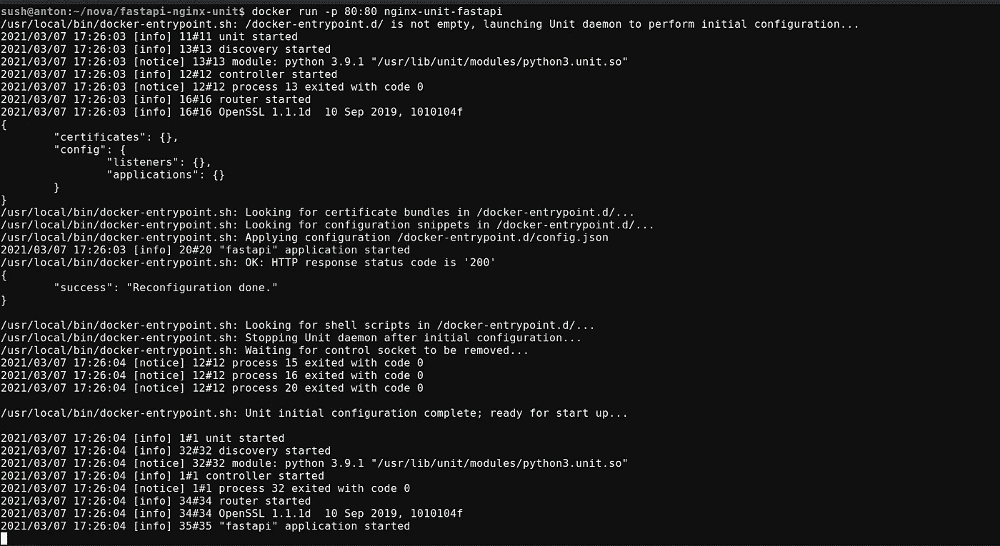

# 在 NGINX 单元上部署异步 FastAPI

> 原文：<https://levelup.gitconnected.com/deploying-an-asynchronous-fastapi-on-nginx-unit-b038288bec5>


NGINX 单元上的 FastAPI

FastAPI 是一个现代、快速(高性能)的 web 框架，用于在 python 中构建 API，这是一个快速编码、异步、可用于生产的框架。一般来说，FastAPI 是使用 uvicorn 部署的，uvicorn 是一种速度极快的 ASGI 服务器实现。

另一种部署方式是使用 NGINX Unit，这是一种轻量级的开源应用服务器，专为当今的动态和分布式应用而设计。

**什么是 NGINX 单元？**

[NGINX 单元](https://www.nginx.com/products/nginx-unit/)

**为什么我们应该选择 NGINX 单元？**

传统的部署方法使用反向代理服务器后面的 web 服务器，因此增加了路由过程。Nginx 单元是一个应用服务器，可以直接将 HTTP 请求翻译成应用程序使用的协议，就像 ASGI for FastAPI (python)一样。此外，配置服务器也很容易，只需使用 config.json 就可以在服务器上进行更改，而无需重新加载服务器。

在本教程中，我们将在 python 上部署一个简单的 **Hello World API** 。在此之前，我们需要安装 Nginx 单元。官方网站有很好的关于安装的文档。下面是 [**安装**](https://unit.nginx.org/installation/) 的链接。或者，您也可以安装 [docker](https://hub.docker.com/r/nginx/unit) 。

用下面的代码在项目目录中创建`**asgi.py**`文件。

FastAPI 上的 hello world 应用程序

由于 NGINX 单元需要一个 JSON 配置文件，让我们为我们的应用程序创建一个。

> 下面的配置文件是为运行在 docker 中的 nginx 单元创建的，如果直接从终端运行服务器，路径可能会有所不同。

易于配置

**Listeners** :用于设置接受传入请求的主机/端口。在这里，我们设置了侦听器来接受端口 80 (HTTP 端口)上的传入请求，并将其直接传递给应用程序。

**应用程序**:包含关于应用程序的信息。

1.  **类型**——应用类型 ex python、php 等。
2.  **路径** -项目目录的路径。
3.  **home**-python 解释器的位置，包含 python 解释器的`bin`文件夹的绝对路径。
4.  **模块**——在我们的例子中要调用的文件的名称`asgi.py`。
5.  **可调用** -初始化 FastAPI 对象的变量名。

> **确保您设置了正确的路径，否则服务器不会启动。**

最后，运行服务器。

**对于终端**:用`**unitd**`命令启动服务器，然后用下面的命令推送 config.json。

```
sudo curl -X PUT --data-binary @config.json --unix-socket \        /path/to/control.unit.sock http://localhost/config/
```

> 套接字路径可能会有所不同，请使用 virtualenv 来避免冲突和依赖性问题。

**对于 Docker** :我的首选方式。

Dockerfile 文件

之后，只需构建容器并运行，就这样。

**打造**

```
docker build -t nginx-unit-fastapi .
```

**运行**

```
docker run -p 80:80 nginx-unit-fastapi
```

如果服务器已经成功启动，您应该能够看到以下输出。



使用 ASGI 在 Nginx 单元上运行 FastAPI

您可以通过调用 API 来检查输出。

```
curl http://localhost/
```

# 代码库

[](https://github.com/novasush/fastapi-nginx-unit) [## novasush/fastapi-nginx-unit

### 在 NGINX 单元上部署异步 FastAPI。

github.com](https://github.com/novasush/fastapi-nginx-unit) 

## 参考

[1][https://fastapi.tiangolo.com/tutorial/first-steps/](https://fastapi.tiangolo.com/tutorial/first-steps/)

[2][https://unit.nginx.org/howto/fastapi/](https://unit.nginx.org/howto/fastapi/)

就是这样，我们只是通过 ASGI 在 Nginx 单元上部署了一个异步 FastAPI，并且它非常容易配置。