# 使用 Terraform 云部署 EKS 集群

> 原文：<https://levelup.gitconnected.com/deploying-an-eks-cluster-with-terraform-cloud-63a2bcdccdf5>

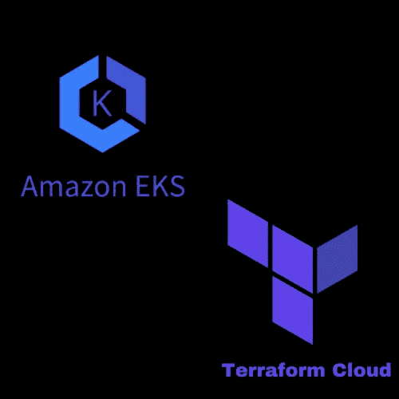

# **场景**

1.  创建一个容量为 2 的 EKS 集群
2.  创建一个允许 5 个字符的随机字符串来构建集群名称
3.  输出集群名称和集群中容器的 ip 地址。

# 定义

***弹性 Kubernetes 服务(EKS):*** *亚马逊 EKS 是一项托管服务，有助于在 AWS 上更轻松地运行 Kubernetes。通过 EKS，组织可以运行 Kubernetes，而无需安装和操作 Kubernetes 控制平面或工作节点。简而言之，EKS 是一个托管的容器即服务(CaaS ),它极大地简化了 Kubernetes 在 AWS 上的部署。* [***文档***](https://www.sumologic.com/blog/eks/)

***集群:*** 集群由控制平面和工作节点组成。

***EKS 控制平面:*** *控制平面在亚马逊管理的 AWS 帐户中的一组专用 EC2 实例上运行，并提供一个 API 端点，您的应用程序可以访问该端点。它以单租户模式运行，负责控制 Kubernetes 主节点，比如 API 服务器和 etcd。*

***工作节点:*** *Kubernetes 工作节点在贵组织的 AWS 帐户中的 EC2 实例上运行。它们使用 API 端点通过证书文件连接到控制平面。每个集群使用一个唯一的证书* [***文档***](https://bluexp.netapp.com/blog/aws-cvo-blg-aws-eks-architecture-clusters-nodes-and-networks)

配置文件存储在我的 **GitHub repo** 中。参见 [**链接**](https://github.com/Maze2022/Terraform-EKS-Cluster)

**第一步:在配置文件中设置代码**

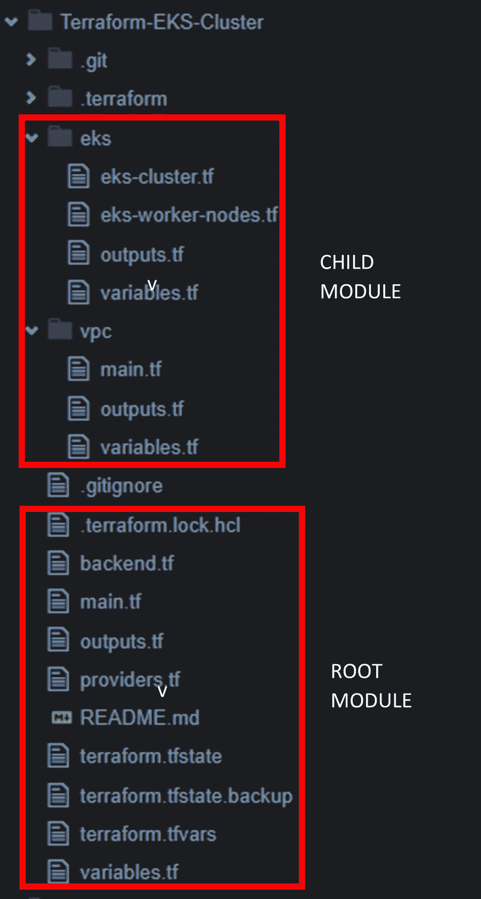

***根模块***

这里包含的配置文件是 providers.tf、main.tf、variables.tf、outputs.tf、状态文件以及子模块

***子模块***

**VPC 模块:**该模块包含明确用于启动 VPC、公共子网、路由表、互联网网关等的配置文件。 **outputs.tf** 文件输出一些在根模块 main.tf 中使用的参数

**EKS 模块:**该模块包含用于部署 EKS 集群和 EKS 工作节点的配置文件。

**步骤 2:启动命令工作流程**

我们将导航到 Terraform cloud，以构建基础架构。在我之前的[项目](https://medium.com/gitconnected/creation-of-a-highly-available-2-tier-architecture-using-terraform-cloud-ci-cd-4ae7d8f9f783)中，我展示了如何通过 VCS 提供商将你的 GitHub 账户连接到 Terraform cloud，但是只选择了我项目需要的存储库。下面我将展示如何获取 GitHub 账户中的所有存储库

我们开始吧。登录 Terraform Cloud 并创建一个组织。我将利用以前创建的**组织— *项目—地形***

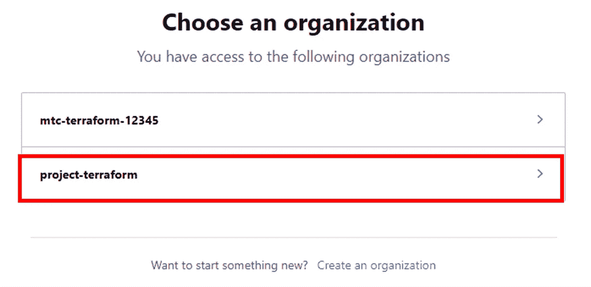

**第三步:选择 VCS 提供商**

当与版本控制系统(VCS)提供商集成时，Terraform Cloud 成为一个更强大的工具。通过将工作区链接到存储库，Terraform cloud 可以在代码更改被提交并推送到指定分支时自动启动运行。

转到 S ***设置>提供商>添加 VCS 提供商。***

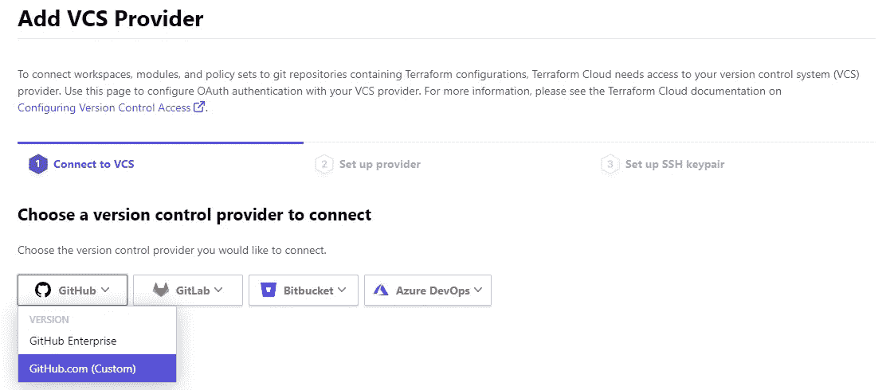

我们将选择***Github.com***，这将带我们设置提供商

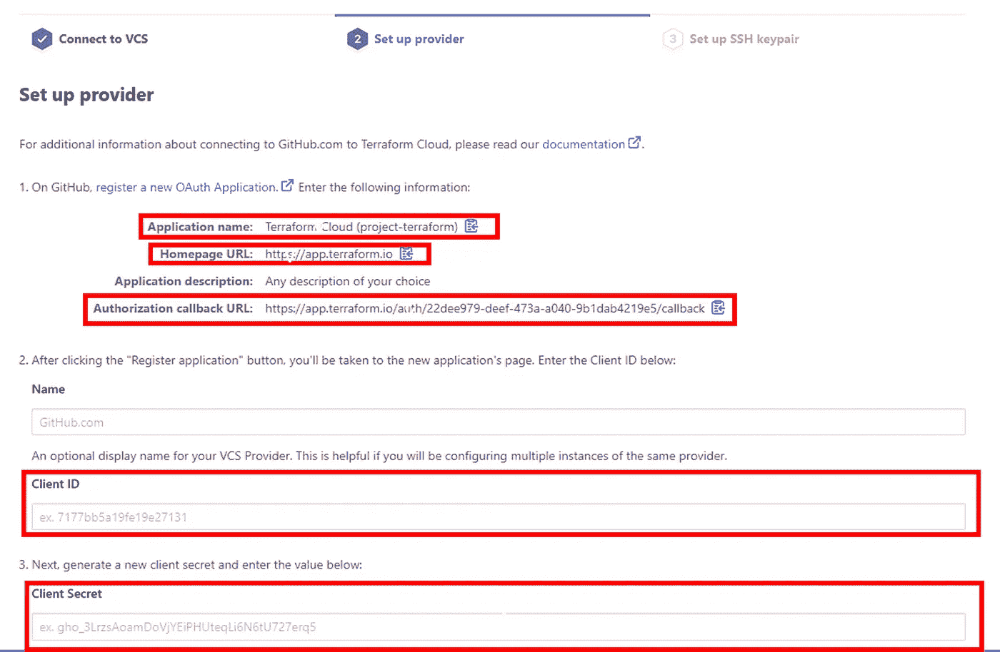

点击链接 ***注册一个新的 OAuth 应用*** ，它会在你的 GitHub 账户上打开。

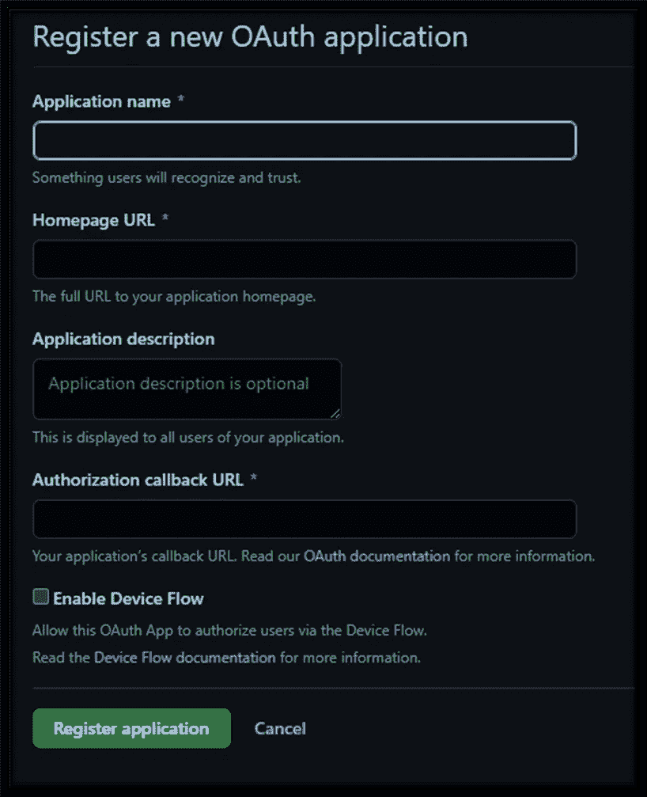

将 Terraform Cloud 中的信息复制粘贴到您的 GitHub 帐户中，然后点击 ***注册应用***

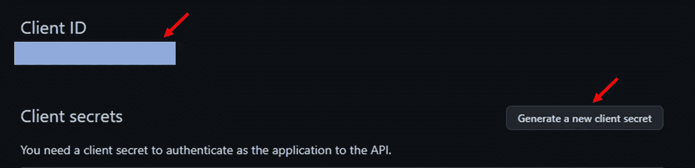

现在复制 ***客户端 ID*** 并且还生成一个 ***新的客户端秘密。*** 导航回 ***设置提供商*** 并将信息粘贴到必填字段。点击 ***连接并继续*** ，授权 Terraform Cloud 连接您的存储库

现在我们已经解决了这个问题，我们将 ***创建一个工作区*** 并选择 ***版本控制工作流。*** 选择版本控制提供者，这是您的存储库名称

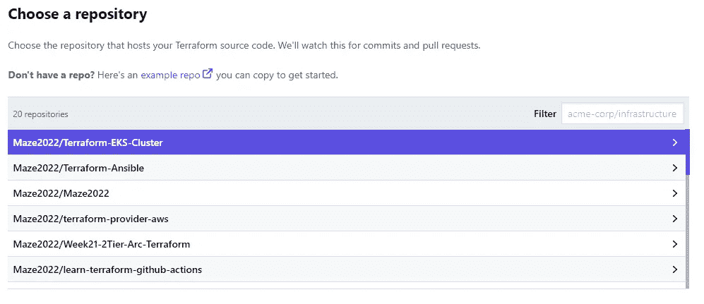

选择您的存储库并创建工作区

现在我们已经设置好了，我们将继续对我们的代码进行修改，并将其推送到 GitHub repo

**步骤 3:触发 CI/CD 管道**

第一步是触发一个计划。当您将配置文件中的更改提交并推送到 GitHub 存储库中的分支时，就会触发一个计划*。当*分支与主分支合并时，计划会自动在 Terraform cloud 中排队

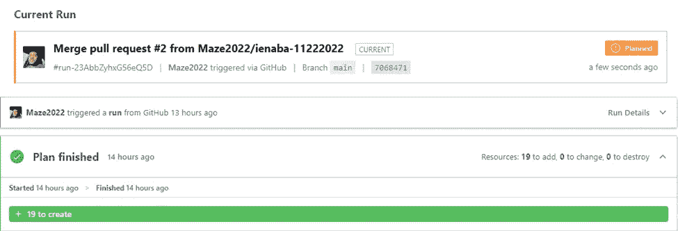

一旦完成，我们就可以继续进行 ***确认*** 计划和 ***应用*** 它来部署代码。

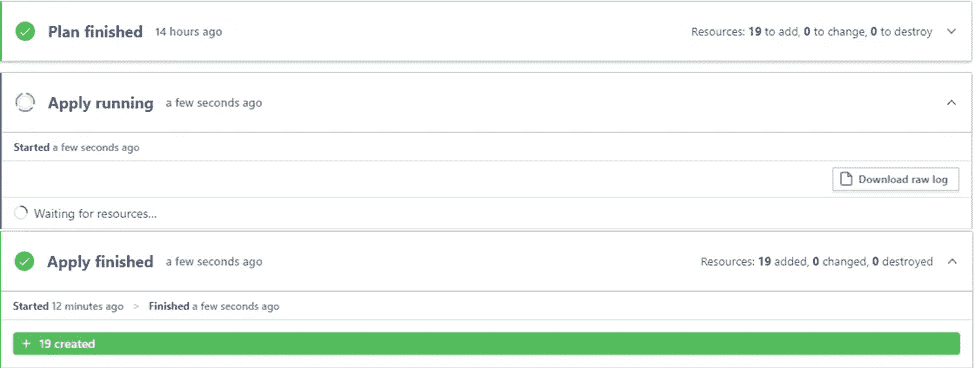

现在部署已经完成，让我们检查输出

**注意:** ***根据手头的任务输出集群名称和容器的 IP 地址，必须在根模块 outputs.tf 文件中指定输出块，以便看到它打印出来***

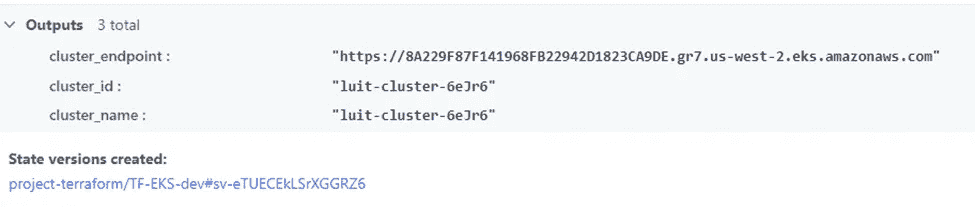

太好了。它工作得很好。

现在让我们看一下我们的 AWS 控制台，看看部署了什么

***集群***

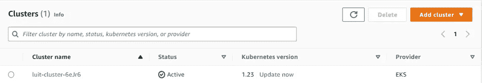

***节点组***

***【工作者节点(实例)***

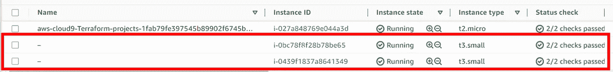

图片由 [Xan Griffin](https://unsplash.com/@xangriffin?utm_source=medium&utm_medium=referral) 在 [Unsplash](https://unsplash.com?utm_source=medium&utm_medium=referral) 上拍摄

感谢您的阅读。

# 分级编码

感谢您成为我们社区的一员！在你离开之前:

*   👏为故事鼓掌，跟着作者走👉
*   📰查看[升级编码出版物](https://levelup.gitconnected.com/?utm_source=pub&utm_medium=post)中的更多内容
*   🔔关注我们:[Twitter](https://twitter.com/gitconnected)|[LinkedIn](https://www.linkedin.com/company/gitconnected)|[时事通讯](https://newsletter.levelup.dev)

🚀👉 [**加入升级人才集体，找到一份惊艳的工作**](https://jobs.levelup.dev/talent/welcome?referral=true)