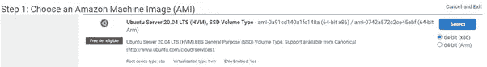
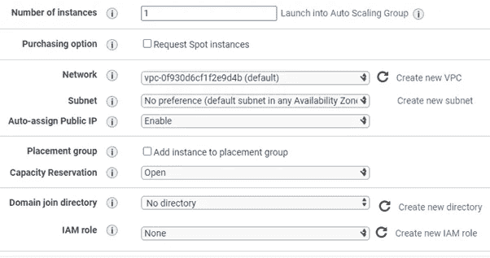
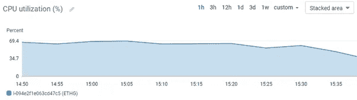
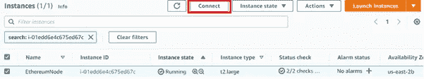
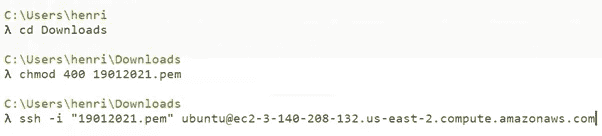
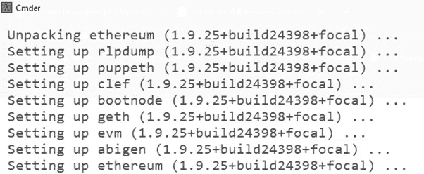
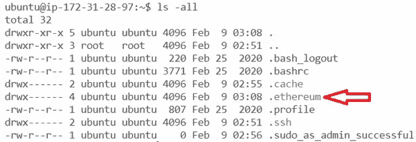
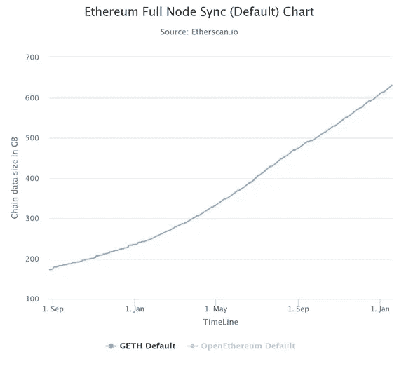
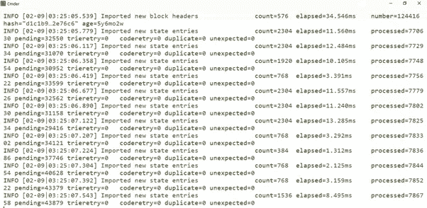
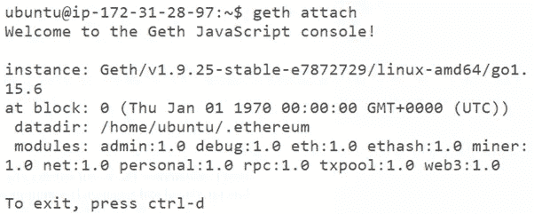

# 在 AWS 云上部署以太坊节点

> 原文：<https://levelup.gitconnected.com/deploying-an-ethereum-node-on-aws-cloud-512a861026e2>

## **以太坊节点系列 I** —使用 Ubuntu 虚拟机在 AWS 云上部署以太坊的分步操作

## 首先，简单介绍以太坊(提醒我们一下)

以太坊由 Vitalik Buterin 于 2013 年创建，拥有自己的货币 Ether，股票代码为 ETH，截至 2021 年 6 月，其市值约为 2000 亿美元。以太既用于交易，也用作货币，通过用户支付的交易费和智能合同来奖励矿工的工作。以太坊每天处理超过一百万笔交易，大约是比特币的四倍。

以太坊就像比特币一样是区块链工作的 T2 证明。然而，它正在转向以太坊 2.0，将采用[利益证明作为共识机制](https://medium.com/nerd-for-tech/proof-of-stake-what-is-and-how-does-it-work-1c8bd7f00303)。

重要的是，以太坊是完全免费阅读的，也就是说，区块链是完全公开的，但它不能自由写作。为了在区块链上书写，必须进行任何代码、智能合同、数据或交易、费用支付，也称为汽油。这有点像这样:你可以看到谁在聚会上，你可以听到他们在听什么音乐，但要参加聚会，你必须付费！

由于智能合约的功能，整个行业都建立在以太坊之上。数百家 ico 筹集了数十亿美元。许多市场买卖不可替代的艺术品、收藏品和可爱的纪念品。几十个 [DeFi 平台](https://medium.com/nerd-for-tech/defining-defi-what-is-decentralized-finance-technically-speaking-40bca2d405df)在以太坊上运行，在平台上建造整个银行。


## 废话少说，让我们动手部署以太坊节点吧

让我们和以太坊先生一起玩吧！在本节中，我们将需要使用一个虚拟机来部署您的以太坊节点。你可以跟着读(这是一种很棒的学习方式)或者直接读。如果你因为某种原因被卡住了，请不要犹豫，联系我，寻求帮助！

**更新:我已经制作了一个视频，介绍了在 AWS 上创建以太坊节点的步骤！看看吧！**

这一节将有许多来自命令行的截图，以便更容易理解和检查实际正在做什么。

主要有两种选择:使用 Oracle VM VirtualBox(可以免费使用)部署 Ubuntu 虚拟机，或者可以使用主要的云提供商之一——AWS、Google Cloud、Azure、阿里云或 IBM——部署 Ubuntu 虚拟机。第二种选择可能更容易、更灵活、更快。Ubuntu 只是一个 Linux 操作系统，就像 Windows 或 macOS 一样，但在这种情况下使用起来很简单。

回到部署你的 Ubuntu VM，如果你在笔记本电脑上部署一个虚拟机，它可能会消耗你电脑上的很多资源，使它非常慢。因此，部署在云上可能是最好的选择。这篇文章的目的不是教如何部署虚拟机，但网上有很多内容，或者，你可以在 LinkedIn 上给我发消息，我会尽快回复。

第三种选择是最终直接在你的电脑上完成。尽管如此，如果您从一个基本上可以用作游乐场的隔离虚拟机连接，还是会更安全。另外，假设你用你的个人电脑连接。在这种情况下，你将把你的 IP 暴露给以太网，成为一台处理加密的计算机，你将成为黑客的蜜罐。

好了，让我们在 AWS 上准备好我们的 Ubuntu 机器吧！

我将留给你一个在 AWS 上部署 Ubuntu VM 的快速步骤。不费吹灰之力。只需按照下面的步骤。

1.  如果您没有 AWS 帐户，请创建一个。需要 3 分钟。
2.  一旦您的 AWS 帐户准备就绪，导航到服务并选择 EC2
3.  单击实例→启动实例
4.  选择 AMI:向下滚动，直到找到第一个“Ubuntu Server”选项。单击选择



5.选择实例类型。自由层可能可以玩一会儿，但是注意“自由层”上的实例在运行以太坊节点时可能会变慢。如果是这种情况，替代方法可能是选择 t2.large 或 t2.xlarge，并在不使用实例时停止它，以避免产生额外的成本。单击下一步

6.配置实例详细信息。你可以让它保持原样。在“自动分配公共 IP”中，选择“启用”。为了节省一些钱，你也可以点击“请求现货实例”。现货实例可以让你节省大约 50%的成本，但请注意，如果现货价格上涨，AWS 可能会终止实例。如果运行的是生产区块链，则不应使用 spot 实例。

7.添加存储。我们的节点需要一些存储空间。随便玩玩，200GB 到 300GB 的通用 SDD 应该够了。单击下一步。



8.标签。你可以在这里命名你的以太坊节点。在键字段中键入“名称”,在值字段中键入“以太坊节点”。

9.配置安全组:确保 SSH 端口 22 对 IP 范围 0.0.0.0/0 开放。这意味着它对世界开放。确保操场完工后你把这个拿走。单击查看并启动

10.选择您已经使用的密钥对，或者创建并下载新的密钥对。不要忘记从哪里下载密钥对。我们稍后将需要它来 SSH 到我们的节点。

注意:如果您只是测试和使用您的新以太坊节点，**不要忘记终止 EC2 实例，即使它们是自由层**。免费等级有一个限制，例如，750 小时，之后你将开始付费。这些 EC2 实例可能每小时花费几美分，但是如果您让它们运行整整一个月，它们可能会增加一笔相当昂贵的账单。

最好的设置是让 t2.xlarge 以大约 60%的 CPU 利用率运行来更新以太坊光节点:



因此，如果可以的话，您可以请求 t2.xlarge 或等效文件，以避免节点一直崩溃，从而获得更好的体验。t2.xlarge 将为您提供 4 个 vCPU、16GB 内存和更好的网络性能。在 AWS 上，您可以请求 spot 实例，这将有一个更好的价格。

好吧！现在已经创建了 Ubuntu EC2 实例，您需要通过 SSH 与 VM 交互并安装以太坊软件。

在 EC2 面板中，选择您的新实例并单击 connect:



遵循其中一个选项。您可以使用 EC2 实例连接选项，这是 AWS 提供的一个基于 web 的命令行界面，或者使用任何 CLI 命令行界面的 SSH。我更喜欢 SSH 选项。要使用 SSH，请按照 SSH 选项中显示的步骤操作。您可以使用计算机上的命令提示符，对于 Windows，请单击 Windows 菜单并键入 cmd。对于 Mac，打开“应用程序”文件夹，然后打开“实用工具”并双击“终端”，或者按 Command 空格键启动 Spotlight 并键入“终端”。或者，你可以下载一个很酷的控制台模拟器，比如 [Cmder](https://cmder.net/) ，我就是用的这个。



要继续操作，您需要找到存储 AWS 密钥对的文件夹，然后按照您的实例的 AWS connect 页面中显示的命令进行操作。

一旦你把/SSH 连接到你的 Ubuntu 机器上，一个接一个地运行下面的命令，安装一些我们需要的包和库。嘿，不要复制()之间的内容

```
sudo apt-get install (to install APT — Advanced Package Tools)sudo apt-get update (for updating a package)sudo add-apt-repository ppa:ethereum/ethereum (to install the ethereym repository repository)sudo apt-get update (to update the package)sudo apt-get install ethereum (to install the latest version of Ethereum Go/Geth)
```



我们现在准备好出发了！现在我们已经安装了以太坊 Geth，您可以通过键入来查看帮助选项。

```
geth –help.
```

您还可以快速浏览一下节点中的文件夹，看看以太坊文件夹中有什么。为此，请键入命令。

```
ls -all 
```

(这将列出实例中存储的对象和文件夹。你应该能看到。以太坊如下图)然后，

```
cd .ethereum/ 
```

(要进入。以太坊文件夹，注意更新可能需要几分钟)



。以太坊/是我们调用以太坊节点中任何函数的默认路径，稍后我们将使用 geth.ipc 连接到区块链。

如果你找不到你的。以太坊文件夹由于某种原因，它可能与路径有关。以太坊文件夹。您或许可以尝试键入以下路径来输入。以太坊文件夹。这是您的默认路径。

```
cd /home/ubuntu/.ethereum/
```

要启动我们的节点，第一步是将其与区块链同步。作为区块链节点，我们需要与区块链上的其他节点同步。但是，将完整的区块链下载到节点可能需要几天时间和大量空间。

根据以太扫描，以太坊区块链目前超过 600GB，并且每分钟都在增长。因此，要成为以太坊的完整节点需要很大的空间。



来源:https://etherscan.io/chartsync/chaindefault

考虑到区块链的大小，我们可以为节点分配最大的缓存(我们使用的 EC2 实例只有几千兆字节可用)。我们希望选择一种同步模式，它将允许进行更多的轻量级同步。以太坊节点同步有 3 种模式:快速、轻量和完全。

*syncmode=fast* —下载最后 64 个块的块头和快照。它不重放事务，并减少了您的机器需要做的工作量

*syncmode=light* —它只下载块标头，并根据标头的哈希验证数据。在连接到其他对等完整节点的过程中完成更新。同步模式灯与采矿不兼容

sy *ncmode=full* —它运行一个完整的节点，下载自 genesis 块以来的所有区块链。它一个接一个地检查区块链中的所有交易，重放所有交易，并提供对区块链的完全验证。它在计算能力、宽带和存储方面需要大量资源

在这种情况下，因为我们只是想玩玩网络，我们将使用 *syncmode=fast* ，其中我们的节点将只下载块头并只验证最后 1000 个块。

还有另一种类型的节点:存档节点。这种节点就像是完整节点的扩展。归档节点需要更多的空间—在 2tb 到 3tb 之间，它们存储所有的历史数据，使我们能够更快地检索信息。存档节点允许检索所有历史数据，从而快速加快处理过程。大多数人不会需要存档节点，但这种节点可能会给交易所、块探索者、钱包供应商和其他需要快速检索信息的公司带来优势。

让我们回到我们的节点。连接启动以太坊节点的下一步是开始同步它。让我们从键入以下内容开始:

```
geth — syncmode=fast
```

一旦您运行这个命令，节点将开始同步，您应该开始看到类似下面的截图。使用— syncmode=fast 或— syncmode=light，您的节点可能需要大约 30 分钟才能与网络同步。

注意:要使用 geth 控制台或 Python3 控制台与以太坊网络交互，您需要运行以太坊节点。否则，它将不起作用。



如果您不想连接到以太坊主网络，而是想连接到一个测试网络，如 Goerli、Rinkeby 或 Ropsten，您可以使用以下命令之一:

```
Geth — goerliGeth — rinkebyGeth — ropsten
```

连接到测试网络可以让你玩游戏，而不需要用真正的乙醚充满你的帐户。测试网有水龙头，可以让你得到一些免费的测试乙醚。请注意，戈利和林克比是区块链的权威证明，不得复制以太坊主网络。顺便说一句，如果你还没猜到测试网的名字有什么共同点，这些测试网是以瑞典的村庄命名的。

好了，现在节点正在运行，我们可以连接到 Geth Javascript 控制台并开始与区块链交互。

在新窗口中打开第二个命令行，并 SSH 到您的实例中

在命令行中，键入

```
geth attach
```

来启动 Geth Javascript 控制台，就像下面的截图一样



**😊欢迎来到黑客帝国！您已连接到以太坊网络！🤠🚀**

现在我们可以开始玩了。在 Geth 控制台中首先要学习的命令之一是

*eth。*快速按下 tab 键两次。

您将看到 API 命令列表。这些 API 命令兼容不同的编程语言，如 JavaScript 和 Python。

我将在这里停止这篇文章，并在下一篇文章中继续以太坊 geth 命令，敬请关注！

**🚀请关注我，也请查看我的🧱区块链课程:**

**🐶** [**有史以来第一次 Dogecoin 课程**](https://www.udemy.com/course/-dogecoin-course-the-first-complete-dogecoin-course/?referralCode=9416B1408224CE309DD8)

**👨‍🎓** [**金融科技、云和网络安全课程**](https://www.udemy.com/course/fintech-technologies-cloud-and-cybersecurity/?referralCode=F1D4EA005A2881735A36)

**📖**[](https://www.amazon.com/dp/B091CYTX37/ref=sr_1_1?dchild=1&keywords=unblockchain&qid=1617186443&s=digital-text&sr=1-1)**[**完整 NFTs 教程**](https://www.udemy.com/course/the-complete-nft-course-learn-everything-about-nfts/?referralCode=AAEE908D13D0E2276B19)**

****👨‍🎓** [**Unblockchain 课程**](https://www.udemy.com/course/blockchain-deep-dive-from-bitcoin-to-ethereum-to-crypto/?referralCode=B8463EE382E6D313304B) **—脑洞大开的区块链课程****