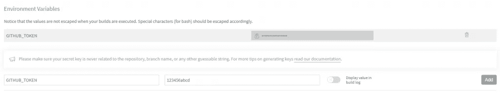
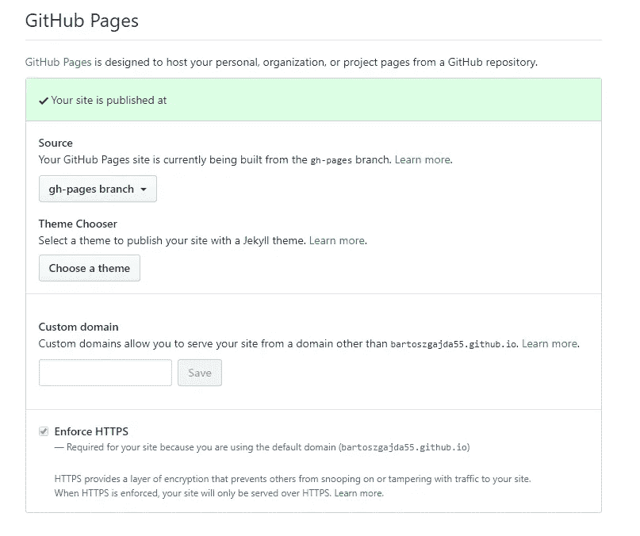

# 使用 Travis CI 将 Angular 应用程序部署到 GitHub 页面。

> 原文：<https://levelup.gitconnected.com/deploying-angular-app-to-github-pages-using-travis-ci-59c0456b94ea>


[Travis CI](https://travis-ci.org/) 可以让你的生活轻松得多，尤其是当你试图持续部署 [Angular](https://angular.io/) app 到 [GitHub Pages](https://pages.github.com/) 的时候。在本教程中，您将学习如何使用 Travis CI 和 GitHub 页面为 Angular 设置这样的持续集成和持续部署管道。

本教程的目标是设置所提到的工具，以便每个 pull 请求将导致自动测试，这将揭示代码中的任何错误。在这种情况下，Travis CI 将被配置为任何对*主*或*开发*分支的 pull 请求都将导致触发此类测试，尽管这可以根据需要配置到任何分支。第二项自动化工作是部署到 GitHub Pages 服务器。这一部分将包括在生产模式下构建我们的 Angular 应用程序，并在服务器上设置以确保一切顺利运行。

# 先决条件

*   GitHub 帐户——我们将使用它作为代码库和部署服务器(GitHub 页面)
*   Angular 应用——任何应用都可以，如果你不自信，你可以生成一个新的。这个教程我用过 Angular 7 app。
*   大约 10 分钟

# 1.创建 travis.yml 文件

让我们首先为我们的自动化软件创建一个配置文件。在 Angular 项目目录下创建一个名为`.travis.yml`的文件。接下来，向其中添加以下配置:

```
dist: trusty
sudo: falselanguage: node_js
node_js:
  - "10"branches:
  only:
    - develop
    - masternotifications:
  email: falseaddons:
  apt:
    sources:
      - google-chrome
    packages:
      - google-chrome-stablecache:
  directories:
    - ./node_modulesinstall:
  - npm installscript:
  - npm run test -- --watch=false --no-progress --browsers=ChromeHeadlessNoSandboxbefore_deploy:
  - npm run build -- --prod --base-href /IP3/
  - cp dist/IP3/index.html dist/IP3/404.htmldeploy:
  provider: pages
  skip_cleanup: true
  github_token: $GITHUB_TOKEN
  local_dir: dist/IP3
  on:
    branch: master
```

现在我们来分析一下那边到底发生了什么。**重要** —你在配置文件中看到的 *IP3* 名称只是我的 Angular 项目的名称。您应该将其更改为您的项目名称(除非您的项目也称为 IP3:)。

*   `branches` -在这里我们指定应该测试哪个分支的代码。在这种情况下，我已经指定只使用主分支和开发分支，尽管还有更多可用的选项。
*   `notifications` -这只是一个小插件，可以防止 Travis 向你的电子邮件帐户发送关于构建完成的消息。
*   `addons` -运行测试所需的额外应用程序。在我们看来，这将是谷歌 Chrome 的最新稳定版本。
*   `cache` -一个应该被缓存的目录，这将显著提高性能。
*   `install` -设置依赖关系时使用的安装命令。如果你喜欢，你也可以使用*纱线*。
*   将为我们启动测试的命令。添加 *- watch=false* 标志是很重要的，这样命令在运行测试后会退出，而不会停留在循环中。
*   `before_deploy` -部署流程之前运行的脚本。在我们的例子中，它在生产模式下构建 Angular 应用程序(并设置可选的 *base-href* )。第二件事是复制*index.html*文件，并将其重命名为*404.html*，这将拦截 GitHub Pages 服务器抛出的任何 404。
*   `deploy` -这里我们指定关于我们的部署服务器的信息。在我们的例子中，它是 GitHub 页面，所以我们将其配置为 *provider: pages* 。 *github_token* 是我们将在 Travis 网站上设置的唯一令牌，这将允许它代表我们访问我们的部署服务器。最后这是第行的*,我们在这里说哪个分支应该被用作构建源。推送到这个分支的任何代码也会触发 Travis 中的部署过程。*

# 2.配置 Travis CI

我们已经在代码中设置好了一切，现在是时候跳到 Travis CI 的配置面板了。首先登录 [Travis 网站](https://travis-ci.com/)。你可以使用你的 GitHub 帐户，它可能会更容易和更快地使用。然后选择合适的项目，在我的例子中是`IP3`，然后转到`settings`选项卡。

在那边，让我们感兴趣的是`Environment Variables`部分。在那里，我们需要提供 GitHub 访问令牌，允许 Travis 访问我们的存储库。为此，最好使用官方的 [GitHub 指南](https://help.github.com/en/articles/creating-a-personal-access-token-for-the-command-line)。生成一个后，将其粘贴到`value`输入中，并键入令牌的`name`，在我们的例子中是 *GITHUB_TOKEN* 。



这就是在设置面板中配置 Travis 的全部内容。还有几个选项你可以改变，但为了本教程的简单，我们不会深入探讨。

# 3.设置 GitHub

本教程的最后一部分将设置我们的 GitHub 存储库来实际使用 Pages 服务。为此，请转到您的项目存储库，然后转到`Settings`选项卡。在那里，您会发现 Pages 服务的配置如下所示:



最关键的部分是选择正确的分支。我推荐使用默认的 *gh 页面*。**免责声明:** Travis CI 将始终*强制推送*在部署阶段完成的更改，因此如果您不想丢失所有 Git 历史，请不要使用任何主分支，如 *master* 或 *develop* 。

# 4.测试

现在让我们创建一个新的分支，对它进行一些修改，并打开一个拉请求，这样 Travis 将运行*测试*。合并 pull 请求后，构建将运行，并将我们的应用程序部署到 GitHub 页面中。这些步骤是:

*   在命令行创建一个新的分支:`git checkout -b new-branch master`
*   对任何文件进行一些更改。如果你不确定该做什么，你可以在 app.component.html 的*改变一些事情。*
*   用`git add .`提交更改，然后用`git commit -m "Update the app template"`
*   推送到资源库:`git push origin new-branch`
*   使用 GitHub，创建一个新的`Pull Request`到`master`分支。

最后一件事是等待 Travis 成功执行我们的*测试*，然后将*新分支*合并到 master 来触发*部署*构建。之后，我们部署的应用程序应该可以在 GitHub 的*设置*标签中显示的地址上使用。

# 摘要

我希望这篇文章对你有用。如果有，不要犹豫，喜欢或分享这个帖子。此外，如果你愿意，你可以在我的社交媒体上关注我:)