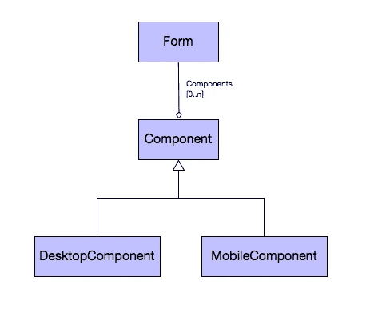
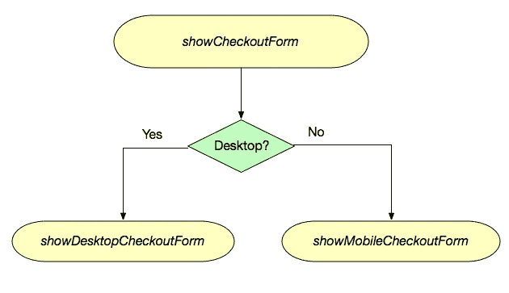
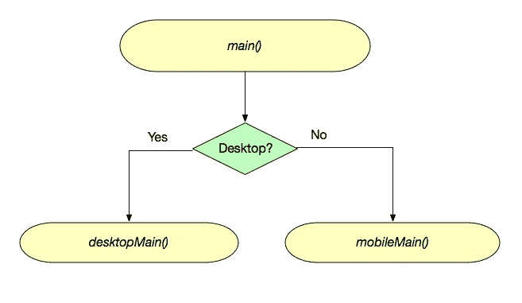
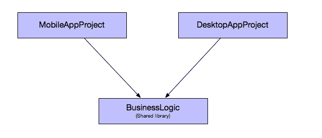

# 在多种外形规格上部署应用

> 原文：<https://levelup.gitconnected.com/deploying-apps-on-multiple-form-factors-8d2f075c99d6>

多梅尼科·洛亚在 [Unsplash](https://unsplash.com/s/photos/responsive-design?utm_source=unsplash&utm_medium=referral&utm_content=creditCopyText) 上拍摄的照片

前几天我偶然发现[这篇文章](https://itnext.io/flutter-is-no-longer-a-cross-platform-framework-b53c87b14c39)，它的标题似乎暗示 Flutter 不是一个跨平台的框架。

他的文章的主旨是，尽管 [Flutter](https://flutter.dev/) 允许你为 6 个平台构建应用，但这并不意味着你应该:

> 是的，你可以在 6 个平台上部署你的应用，但老实说，我不打算这么做。基本上，因为你应该根据平台使用不同的设计模式。我无法想象在不同的平台上部署我的应用程序。

乍一看，他似乎主张为每个平台(如 Android、iOS、Mac、Windows 等)编写单独的应用程序。您需要使用平台的原生 UI 工具包为每个平台编写单独的应用程序，这种想法在开发人员社区中非常普遍。我称之为“本机窗口小部件最大化主义者”，他们认为使用跨平台 UI 库会导致次等的、“非本机”体验，因此会被用户拒绝。一般来说，这种哲学的追随者可以共享“业务逻辑”，但是用户界面必须使用本机 UI 小部件。这个教条大部分是基于对 90 年代中后期笨重的跨平台桌面应用程序的过时观察——其中许多是由新手使用 Swing 的早期版本开发的。

从那时起，跨平台工具包已经成熟，并且平台已经收敛于一些常见的 UI 设计模式。在手机上尤其如此，许多流行的原生应用在 Android 和 iOS 上看起来几乎一模一样。移动开发人员已经意识到，创造一个好的、一致的设计比试图“看起来本土”更重要。是的，iOS 和 Android 之间存在差异，但这些差异是例外，而不是规律。在我看来，为 2%的用户界面维护两个不同的代码库是多余的。最好提供抽象，允许以特定于平台的方式满足这 2%的增量。

如果你进一步阅读文章中的[，你会发现作者*实际上并不是*一个“原生微件最大化者”。也就是说，他并没有主张你应该使用 iOS 和 Android 的原生 SDK 为它们开发不同的应用。他甚至不认为你需要为 iOS 和 Android 分别编写应用程序。](https://itnext.io/flutter-is-no-longer-a-cross-platform-framework-b53c87b14c39)

> *通常在手机上有效的东西在桌面上无效，反之亦然。*

他的意思是，你不应该在桌面上部署和在移动设备上一样的应用程序，因为外形太不一样了。如果这是他的论点，那么我同意他的观点……但有一些警告。

# 针对多种外形规格的策略

完全披露:我为代号一工作。

移动开发最好的两个跨平台开发工具是 [Codename One](https://www.codenameone.com) 和 [Flutter](https://flutter.dev/) 。他们以非常相似的方式处理跨平台开发的问题。两者都提供了跨平台的 100%代码重用。两者都为底层设备功能提供了丰富的 UI 组件和 API 抽象，并且都可以作为原生应用部署到 iOS 和 Android(以及其他平台)。Codename One 应用程序是用 Java 和/或 Kotlin 开发的。在飞镖中飘动。

Codename One 和 Flutter *也*允许你将你的应用部署为桌面应用。然而，如果你不为更大的屏幕尺寸和桌面使用模式调整你的 UI，结果可能不会很好。如果你没有为更大的屏幕尺寸定制用户界面，即使在平板电脑上使用移动应用程序也会感觉很勉强。在构建多外形应用程序(即运行在移动和桌面上的应用程序)时，我使用了四种策略:

# 1.响应用户界面

这是两种外形规格的应用程序逻辑基本相同的地方，但布局管理器和样式是“外形规格”感知的。例如，在平板电脑/台式机上，它们使用不同的样式，布局管理器对元素的定位也不同。(例如，不是显示侧菜单滑出表单顶部的汉堡包按钮，而是侧菜单总是可见的)。

# 2.组件级抽象

这是应用程序的大部分控制流是相同的，但每个表单的某些部分被抽象出来，以允许在桌面、平板电脑和移动设备上的不同实现。这可能包括使用不同的小部件来编辑一些字段，或者在桌面上显示一些在移动设备上看不到的额外部分。这和响应式 UI 很像，肯定有重叠。区别在于，使用响应式 UI，您保留了所有相同的 UI 元素——您只是以不同的方式呈现它们。通过组件级抽象，UI 表单实际上可能包含不同的 UI 组件，这些组件在桌面上的逻辑与在移动设备上的不同。

# 3.替代视图

在这一点上，应用程序的控制流程是相同的，但你在移动设备上创建的视图与在平板电脑上完全不同。如果您非常小心地设计您的视图，您也许能够重用您的控制器类，只要这些视图共享公共的 API，并且触发兼容的事件。让它们保持同步是很有挑战性的，所以通常你也要编写单独的控制器。

# 4.独立控制流

这是你实现两个独立应用的地方。可以重用业务逻辑，但是 UI 层是针对平板/桌面和移动分别编写的。

# 5.单独的应用程序

如果你已经用单独的控制流实现了你的应用，那么创建单独的应用只是一个小小的附加步骤。一般来说，您仍然可以在应用程序之间共享所有的业务逻辑。你只需要为不同的应用程序提供不同的入口点。对于 Codename One，这可以通过将所有代码移动到共享库(cn1lib)中来实现，或者通过简单地提供指定不同主类的替代配置文件(Codename One _ settings . properties)来实现。大多数构建目标使用 Proguard 或等效工具来去除未使用的代码，因此应用程序的大小不会受到代码共享的影响。

# 最佳选择？

文章的作者似乎是在为选项#5 — *独立应用*辩护。他说，他的偏好是由他在大型企业系统上的工作经验决定的，在大型企业系统中，会有不同的团队为不同的平台开发应用程序，将所有这些都放在同一个应用程序中会导致被踩到脚趾。选项#4(单独的流程控制)也应该充分解决他的问题，因为每个外形都可能有自己的包，开发人员不需要踩别人的花园。

我的偏好是使用我能承受的最低数字，并根据需要向上爬。IntelliJ 使得从一种策略到另一种策略的重构几乎没有痛苦，代码中的碎片越少，维护起来就越容易——一般来说。显然，增加团队成员，或者将项目分成多个团队会改变维护计算。

# 仍然喜欢跨平台开发工具

假设您的团队决定为每种外形(手机、平板电脑和台式机)实施单独的应用。让我们更进一步，假设您决定为每个平台(Android Mobile、Android Tablet、iPhone、iPad、Mac、Windows、Linux)实现单独的应用程序。那么使用 Codename One 或 Flutter 这样的跨平台工具包还有什么好处吗？既然你在做独立的应用程序，那么使用原生 API 不是更好吗？

除非你有无限的时间、开发人员和资金，否则答案是否定的。如果选择为每个平台使用单独的原生 SDK，情况会更糟。即使您设法编写了一些能够在项目之间共享的共享模块，维护独立代码库所涉及的复杂性也是惊人的。一切都是 7 倍的困难。每个 bug 被修复 7 次，测试变得异常复杂。此外，跟上所有这些平台和 API 的最新发展需要奉献精神。您可能需要为每个平台引入单独的团队——团队之间可以共享的工作非常少。

使用像 Flutter 这样的技术——即使你正在构建 7 个独立的应用程序，也会容易得多。在项目之间共享代码要容易得多，每个开发人员都可以在每个项目上工作，而不会面临每个本地 API 的特性所带来的进入障碍。

# 摘要

仅仅因为你可以将你的应用程序部署到 8 个不同的平台，并不意味着你应该这样做。在同一外形(如手机)内部署到多个平台是一种可靠的方法，有着良好的记录——目前 iOS 和 Android 应用商店上有无数流行的应用程序是用跨平台工具开发的，如 Codename One 和 Flutter。然而，部署到多种外形规格(例如手机和台式机)更加困难，因为在一种外形规格上工作的产品可能在另一种外形规格上工作得不好。为每种外形创建单独的项目，并在它们之间共享业务逻辑，可能会更好。这并不意味着您应该放弃跨平台开发工具。使用这样的工具仍然是一个好处，因为它降低了组合项目的复杂性，并且使得在项目之间共享代码和开发人员变得更加容易。

*原载于 2021 年 4 月 6 日*[*【https://sjhannah.com】*](https://sjhannah.com/blog/2021/04/06/deploying-apps-on-multiple-form-factors/)*。*