# 用 Docker 容器部署 AWS Lambda:我尝试了一下，以下是我的评论

> 原文：<https://levelup.gitconnected.com/deploying-aws-lambda-with-docker-containers-i-gave-it-a-try-and-heres-my-review-147327519ce9>

现在，您可以使用 FaaS 在 Docker 容器中构建无服务器工作负载。我试了一下，这是我的评论。

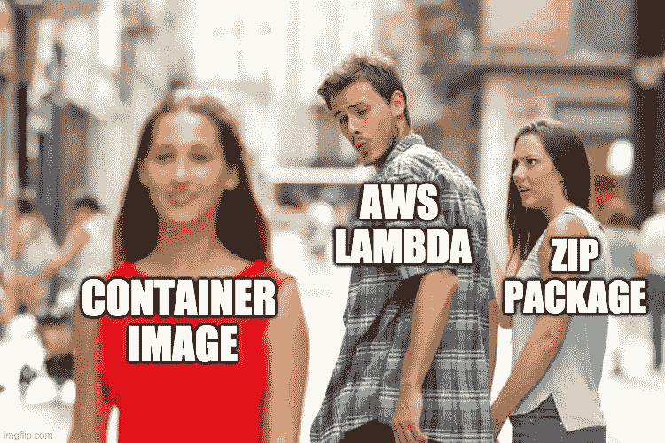

来源:https://imgflip.com/i/4q3cq8

在 AWS 在 re:Invent 2020 期间宣布的所有新功能和服务中，我最喜欢的肯定是 AWS Lambda 更新。而且有很多！例如，你的代码执行不再被四舍五入到最接近的 100 毫秒的持续时间来计费——你现在是[按毫秒计费](https://aws.amazon.com/blogs/aws/new-for-aws-lambda-1ms-billing-granularity-adds-cost-savings/) [1]。最重要的是，AWS [将 Lambda 的内存容量](https://aws.amazon.com/blogs/aws/new-for-aws-lambda-functions-with-up-to-10-gb-of-memory-and-6-vcpus/)增加到 10gb【2】，相应地 CPU 容量[增加到 6 个 vcpu](https://aws.amazon.com/blogs/aws/new-for-aws-lambda-functions-with-up-to-10-gb-of-memory-and-6-vcpus/)【3】。但是今天，我想更深入地挖掘一些更令人兴奋的东西——从现在开始，AWS Lambda 不需要将您的代码和依赖项打包到一个 zip 文件中。相反，[您现在可以使用大小高达 10 GB 的 Docker 容器映像](https://aws.amazon.com/blogs/aws/new-for-aws-lambda-container-image-support/)来实现。

就个人而言，我认为这是许多无服务器用例的游戏规则改变者。原因如下。

# 为部署打包代码的最简单方法是使用(Docker)容器

直到最近，在 AWS 上创建无服务器功能的唯一方法是选择特定的语言和运行时。Python 3.8 )，然后确保您在项目目录中安装了所有的定制依赖项(*或者将来自 Python 虚拟环境的站点包添加到您的 zip 包*)，最后，将所有这些压缩到一个 zip 包中。如果您的 zip 文件大于 50MB，您还必须将代码上传到 S3，并在您的函数定义中引用它。所有可行的。许多开发人员(包括我在内)过去常常创建他们自己的方法来使它变得更容易，例如使用 Lambda 层、来自虚拟环境的站点包，以及构建用于部署的 shell 脚本。

从表面上看，似乎没有太大的变化——现在，您不用压缩代码，而是在 docker 文件中定义依赖关系。但是还有更多的东西，因为与预定义的运行时和压缩依赖项相比，在容器映像中定义运行时环境可以让您更好地控制环境。

**一个带有预定义运行时环境的 zip 文件有其局限性**:如果你想使用一个已经被你公司的安全团队审查过的特定 Python 环境呢？或者，如果您需要一些额外的操作系统级软件包，该怎么办？有了容器映像支持，你可以做到这一点，因为一个 **Docker 容器在你选择安装的基础映像和包中没有限制**。**这使得“无服务器”可以被更广泛的受众使用**，FaaS 的开发(*功能即服务*)变得更加容易。

理论上，甚至有可能为其他编程语言创建自定义映像，尽管这需要实现一个[自定义运行时](https://docs.aws.amazon.com/lambda/latest/dg/runtimes-custom.html)并且更加复杂。

AWS Lambda 的界面现在如下所示:

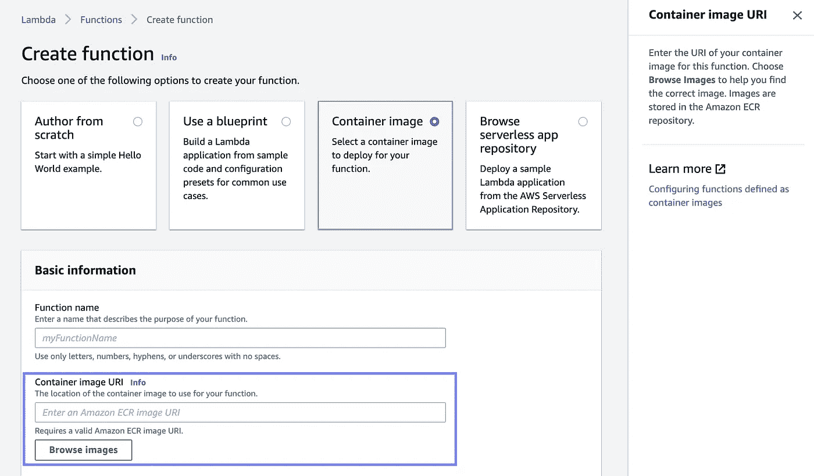

您现在可以使用您自己的定制环境，打包成一个容器图像——作者的图像

> ***注意:*** *在编写的时候，只支持 Linux 容器。*

# 带有简单示例的容器映像部署

让我们构建一个简单的 ETL 示例。下面是我们将使用的项目结构:

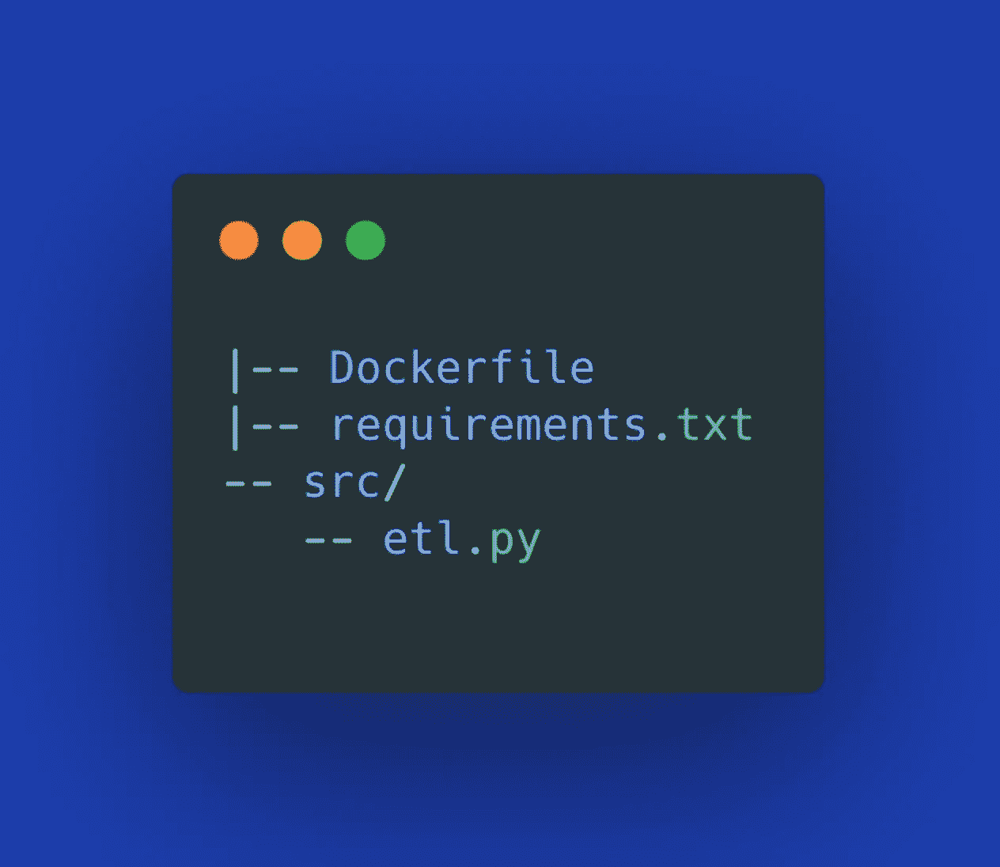

我的`requirements.txt`仅包含:

```
pandas==1.1.0
```

下面演示的实际代码只是一个简单的计算哈利波特角色考试分数的 ETL 示例，但是您可以将它用作您的用例的脚手架:

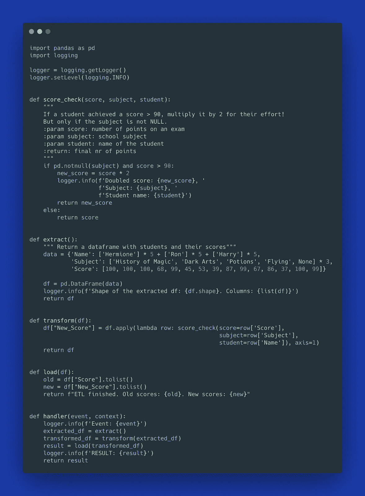

现在到了有趣的部分:定义所有代码依赖关系的`Dockerfile`,这样我们就不需要压缩代码了！💪🏻

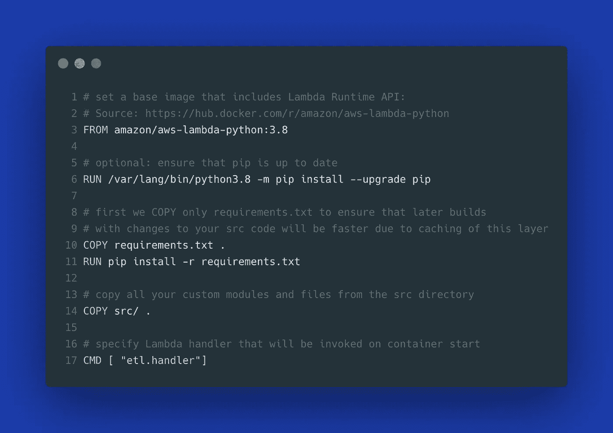

通常，为了使用 Dockerhub 中的官方 Python 映像，Python 3.8 的基础映像会以`FROM python:3.8`开始。然而，为了使它可以与 AWS Lambda 一起使用，您的基本映像必须包含 [Lambda 运行时 API](https://docs.aws.amazon.com/lambda/latest/dg/runtimes-api.html) 。为了方便起见，AWS 准备了许多我们可以使用的基本图像，比如上面介绍的 docker 文件的第 3 行中定义的图像。您可以在[公共 ECR 库](https://gallery.ecr.aws/lambda/python)以及 Dockerhub 注册表中找到所有 AWS Lambda 图像:

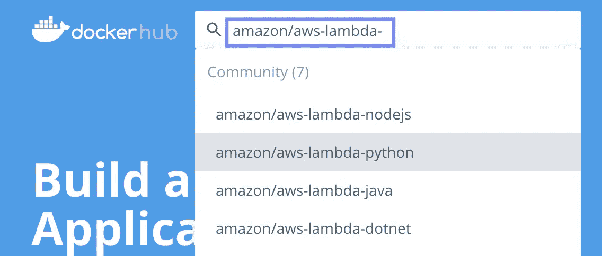

# 让我们测试一下我们的 dockerized Lambda 函数

用容器映像开发 Lambda 函数最好的部分是 dev/prod 环境奇偶校验。在将代码部署到 AWS 之前，您可以使用 Docker 在本地轻松测试您的代码。您的本地容器化环境与您稍后将在生产中使用的环境是相同的。这是可能的，因为有一个名为 [Lambda 运行时接口仿真器](https://aws.amazon.com/about-aws/whats-new/2020/12/aws-lambda-now-supports-container-images-as-a-packaging-format/) (RIE)的网络服务器环境(你可以在这里找到更多关于它的信息)，它已经被 AWS 开源。这个模拟器已经被嵌入到所有你可以在 Dockerhub 或者 ECR 公共图像库中找到的 Lambda 图像(`amazon/aws-lambda-*`)中。

从包含`Dockerfile`的项目目录中运行以下命令:

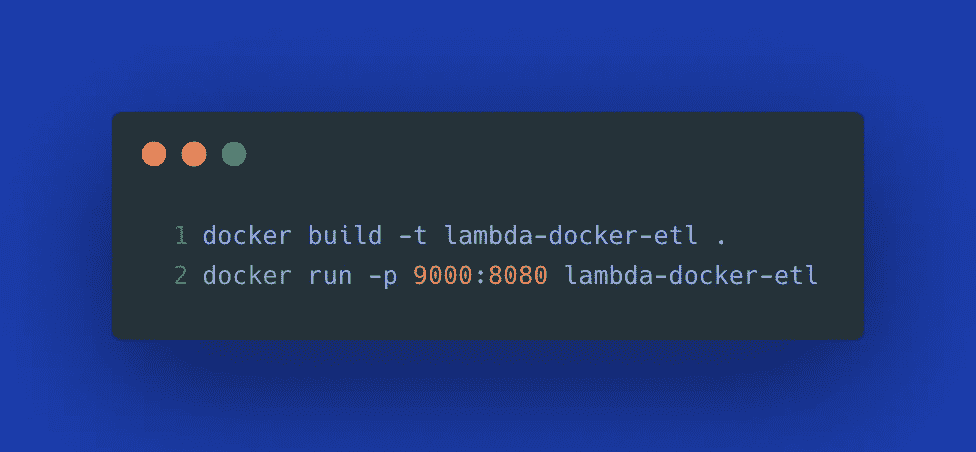

然后，在新的终端窗口中，运行:

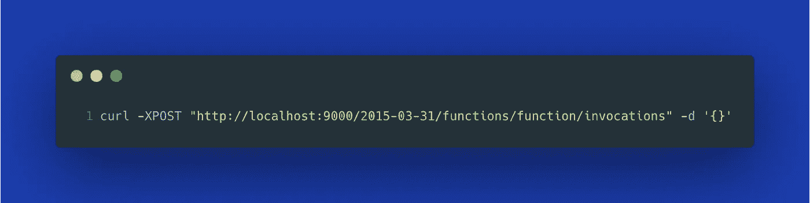

以下是我得到的输出:

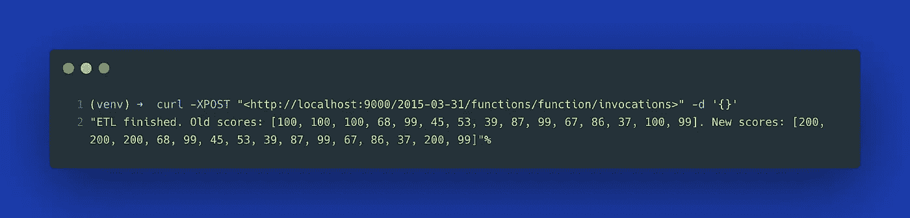

本地执行看起来不错。让我们将它部署到 AWS。

# 将容器映像推送到 ECR &创建一个 Lambda 函数

我们现在可以运行以下命令来创建 ECR 存储库，并将我们的容器映像推送到 ECR:

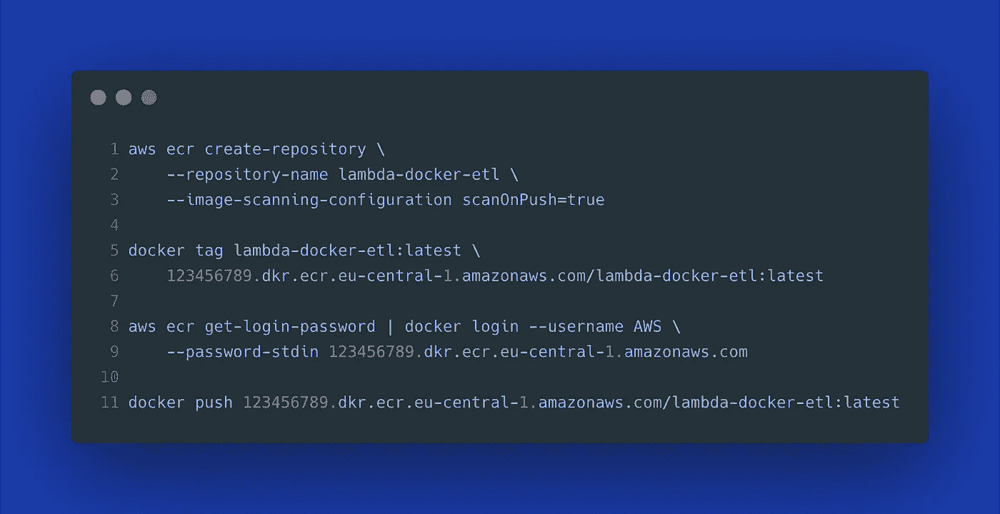

现在我们的映像已经部署好了，我们可以在 Lambda 函数中使用它:

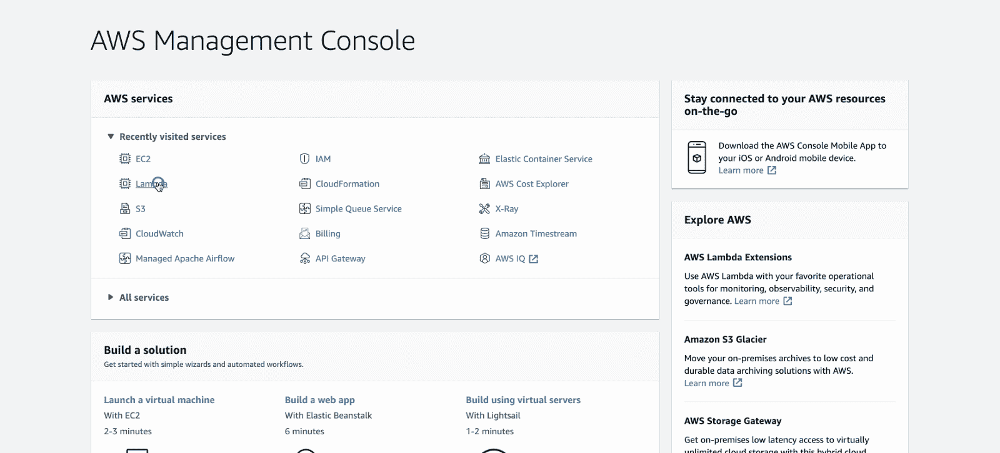

使用作者制作的 ECR — GIF 中的容器图像部署 Lambda 函数

注意，我们不必选择运行时环境，因为它已经在我们的容器映像中定义好了。我们从 AWS 管理控制台测试了该功能，发现我们得到了与本地测试相同的结果。

# 使用 Lambda 监控您的分级工作负载

到目前为止，您可能已经确信**使用 AWS Lambda 运行容器化的工作负载具有无数的优势**，并且您现在可能想要更广泛地使用它。但是，我鼓励您提前考虑可观察性，并以架构师的眼光处理无服务器工作负载。

假设您将几个数据管道从一个容器编排解决方案迁移到 AWS Lambda。**您如何知道这些管道中的哪一个发生了故障以及原因？**当然，AWS 通过 Amazon CloudWatch 提供了对日志和警报的原生支持。尽管如此，**用于监控和观察的 AWS 服务需要一些额外的工作**来设置适当的警报、配置日志组，并设置一切以确保使用 X 射线进行跟踪。然后，我们还需要决定跟踪的指标，并构建 CloudWatch 仪表板来可视化这些数据。

您可以通过使用诸如 [Dashbird](https://dashbird.io/features) 之类的工具来极大地改善开发人员的体验，这些工具允许您**轻松地将可观察性**添加到您现有的无服务器工作负载**中，而无需对您的代码或基础设施**进行任何更改。您只需创建一个 IAM 角色，该角色将授予 Dashbird 跨帐户权限，以便与您的 AWS 资源进行通信。配置完成后，您可以**立即开始享受平台**的所有优势，例如自动化警报通知、指标可视化以及基于 [AWS 良好架构框架](https://sls.dashbird.io/aws-well-architected-framework-serverless)的可操作洞察，从而提高性能、节省成本并增强云资源的安全性。

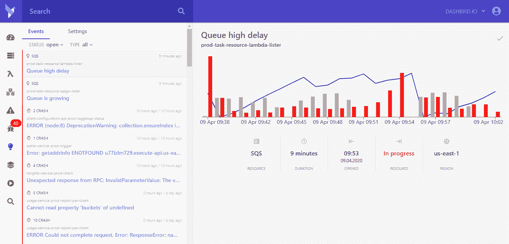

利用 Dashbird 收集的可行见解:[来源](https://dashbird.io/wp-content/uploads/2020/10/insights-.png)

# 回顾:与 zip 部署相比，容器映像的优势

当使用容器映像而不是 zip 包进行无服务器功能部署时，您将获得以下好处:

*   支持**你想要的任何编程语言**(*只要你使用实现 Lambda 运行时 API* 的基础映像)，
*   能够轻松处理**附加的依赖关系**，这些依赖关系可以放入容器映像中，例如附加的 Python 模块或配置文件，
*   **灵活性&独立于任何平台** —您可以轻松地将相同的作业转移到 K8s 集群或任何支持容器化应用程序的平台。在我们的例子中，我们只需将基础图像改回`python:3.8`，并将入口点命令改为`Dockerfile`中的`CMD ["python", "etl.py"]`。
*   **您对自己的打包环境有了更多的控制—** 使用传统的 Lambda 运行时环境，您可以使用从 AWS 获得的东西。相比之下，对于容器映像，您有许多选项来根据自己的需要定制环境。假设您想要使用一个更小、更轻量级的 Python 映像来优化性能和成本，或者使用一个已经过安全团队批准的映像来满足您公司特定的合规性要求。
*   **你的代码可以在任何地方运行**——一个容器化的应用程序可以将你的代码从本地机器转移到开发、测试或生产环境时的任何意外降到最低。你的代码可以在任何地方运行而没有副作用。
*   **运行事件驱动的容器** —虽然像 Kubernetes 这样的容器编排平台很棒，但一些用例可能更适合简单的 FaaS，例如，当您希望您的代码在每次新文件到达 S3 时运行，或者当有人向我们的 API 发出请求时运行。AWS Lambda 非常适合这样的用例。

# 结论

我对 AWS Lambda 的所有新功能都很满意。作为容器化应用的大力支持者，**我更喜欢这个选项，而不是压缩无服务器部署的代码**。如今，由于存在如此多的平台和服务来大规模运行容器，开发自包含的微服务变得比以往任何时候都更容易。

**感谢您的阅读！如果这篇文章有用，** [**关注我**](https://medium.com/@anna.anisienia) **看我下一篇帖子。**

*为了透明:本文由*[*Anna Anisienia*](https://medium.com/@anna.anisienia)*为 Dashbird 撰写。*

**参考资料&附加资源:**

[1] [AWS 新闻博客](https://aws.amazon.com/blogs/aws/new-for-aws-lambda-1ms-billing-granularity-adds-cost-savings/)关于 Lambda 计费

[2] [AWS 新闻博客](https://aws.amazon.com/blogs/aws/new-for-aws-lambda-container-image-support/)关于 Lambda 容器支持

[3] [AWS 新闻博客](https://aws.amazon.com/blogs/aws/new-for-aws-lambda-functions-with-up-to-10-gb-of-memory-and-6-vcpus/)关于最大 AWS Lambda 容量的增加

[4] [AWS 新功能](https://aws.amazon.com/about-aws/whats-new/2020/12/aws-lambda-now-supports-container-images-as-a-packaging-format/)

[5] [卢卡·比安奇博士，同一主题的](https://towardsdatascience.com/serverless-comes-to-machine-learning-with-container-image-support-in-aws-lambda-ee9d729d48d7)