# 使用 Kubernetes 部署容器！

> 原文：<https://levelup.gitconnected.com/deploying-containers-with-kubernetes-ff439ed7180>


[Kubernetes](https://kubernetes.io/) ，也称为 K8s，是一个用于自动化部署、扩展和管理容器化应用的开源系统。Kubernetes 帮助您跨计算资源池(如服务器)部署容器。K8s 允许您在服务器池中轻松管理应用程序的多个副本。您可以将容器发送到 K8s，并让 K8s 一次将副本发送到多个服务器。K8s 还可以让你轻松地放大或缩小你的应用程序，允许你添加更多的应用程序或减少你选择的数量。K8s 为管理和控制容器的网络通信提供了一个框架。它提供了多种特性，使您能够构建更安全的应用程序。K8s 还可以帮助您管理应用程序配置，并将配置数据传递给容器。

在这个项目中，我们将使用命令行创建一个运行 nginx 映像的部署，显示部署的详细信息，检查所述部署的事件日志，然后删除部署。

先决条件:
[Docker 桌面](https://docs.docker.com/desktop/install/windows-install/)
命令行(我用的是 Windows 终端)

**第一步:在 Docker 桌面上启用 Kubernetes**

从一开始，我将使用 Docker Desktop 在部署期间跟踪我的映像和容器。由于 Windows 终端会自动与 Docker 桌面同步，它也可以很好地与您的本地机器配合使用。一旦你安装了它，进入 Docker 桌面设置并启用 Kubernetes。启用后，您必须点击*应用并重启*:

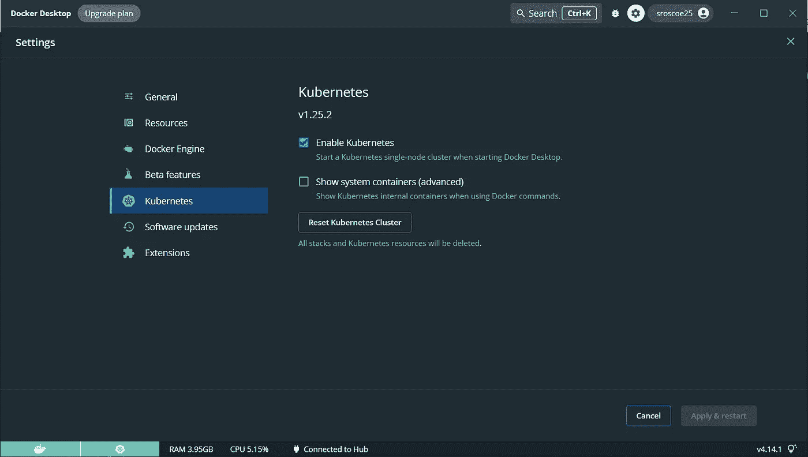

**步骤 2:创建您的部署**

Kubernetes 提供了一个命令行工具，用于使用 Kubernetes API 与 Kubernetes 集群的[控制平面](https://kubernetes.io/docs/reference/glossary/?all=true#term-control-plane)进行通信。这个工具被称为`kubectl`命令。我们将使用此命令来创建和检查我们的部署:

`kubectl create deployment <name your deployment> --image=nginx`

该命令创建一个预打包了 nginx 映像的容器:

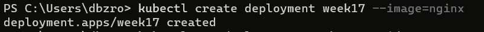

现在，让我们了解一些关于我们部署的信息。我们可以使用`kubectl get deployments <deployment name> -o wide`命令查看更广泛的信息:

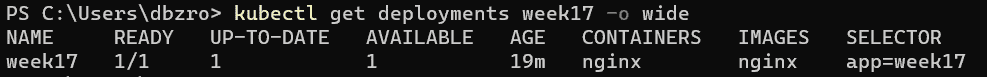

`kubectl describe deployment <deployment name>`可以显示您部署的规格。我对此感到恐慌，因为我不知道为什么我的容器一开始没有运行。大约五分钟后，我的容器终于跑了。当状态值为 *True* 时，您可以判断它正在运行:

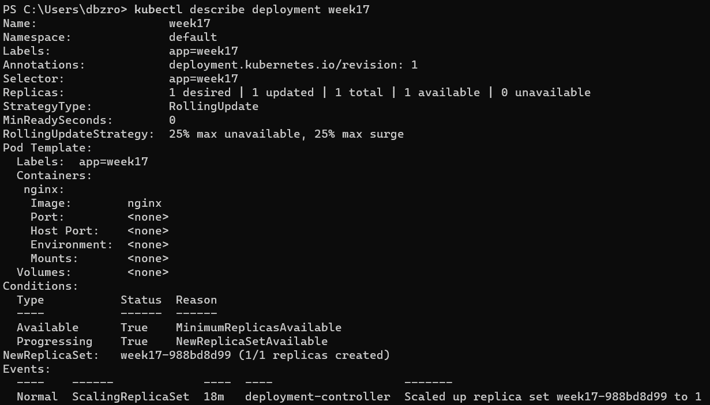

现在我们要检查您的部署的事件日志。使用命令`kubectl logs deployment/<deployment name>`检查进程和日志:

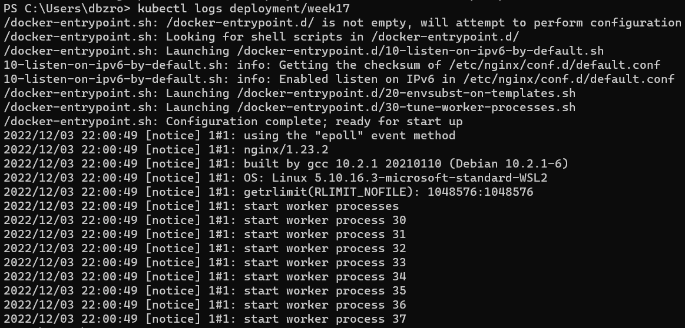

现在我们已经到了项目的末尾，我们想要删除部署。使用`kubectl delete deployment <deployment name>`命令:

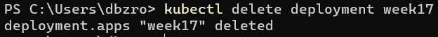

**高级**

**步骤 1:使用 YAML 文件创建部署**

对于该项目的高级部分，我们将使用 YAML 清单文件来完成相同的任务，方法是创建我们的部署、获取日志，然后删除我们的部署。唯一的区别是，现在我们使用的是所谓的复制品。副本允许您制作应用程序的多个拷贝。现在，我们将使用清单文件来创建一个容器。为此，让我们使用 VIM 编辑器:

`vim <name the file>.yml`

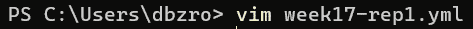

将以下 YAML 部署复制并粘贴到编辑器中。您可以在这里找到这个 YAML 文件[，并且您将必须根据您想要如何部署它来更改文件中的一些数据:](https://kubernetes.io/docs/concepts/workloads/controllers/deployment/)

```
apiVersion: apps/v1
kind: Deployment
metadata:
  name: week17
  labels:
    app: nginx
spec:
  replicas: 1
  selector:
    matchLabels:
      app: nginx
  template:
    metadata:
      labels:
        app: nginx
    spec:
      containers:
      - name: week17
        image: nginx:stable
        ports:
        - containerPort: 80
```

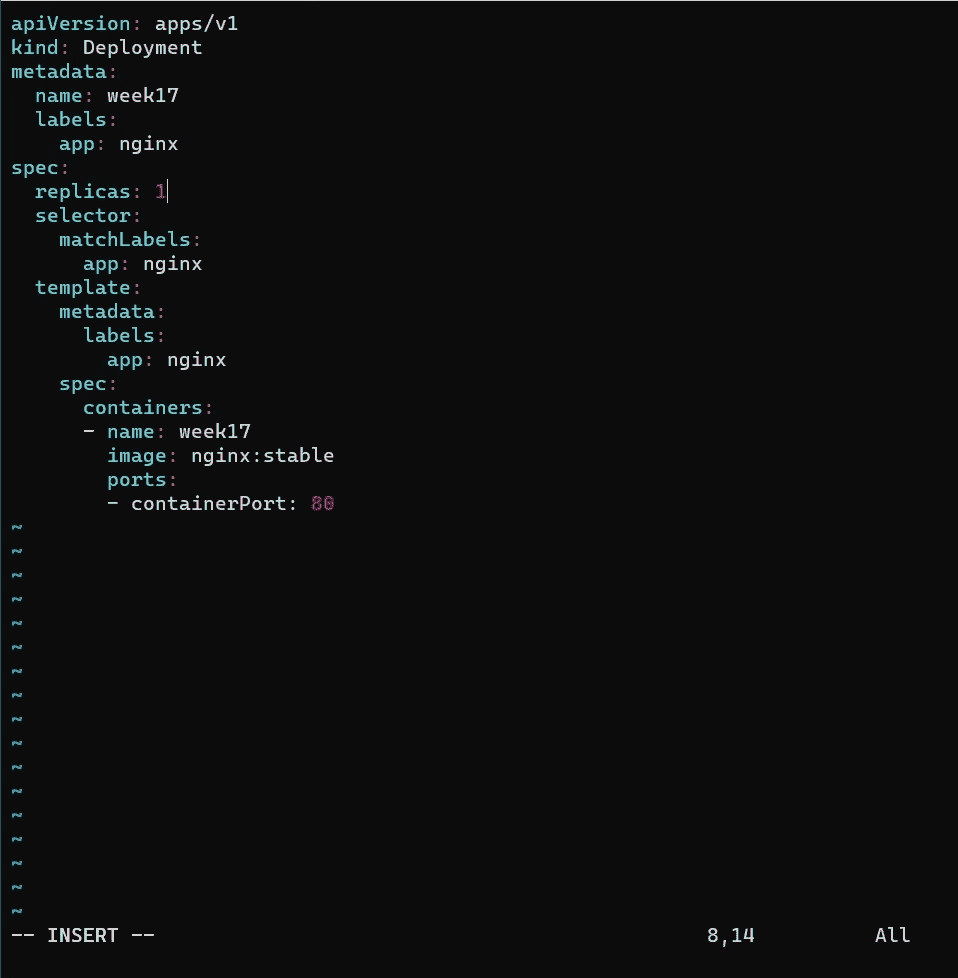

之后，保存并退出文件，然后应用清单文件并创建您的部署:

`kubectl apply -f <file name>.yml`

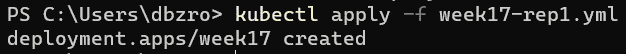

现在，像往常一样，运行获取新部署信息所需的命令:

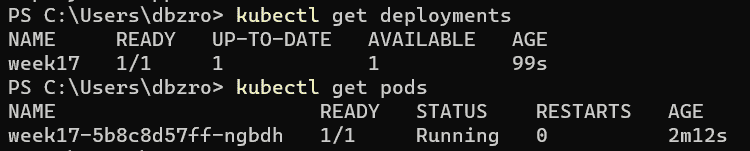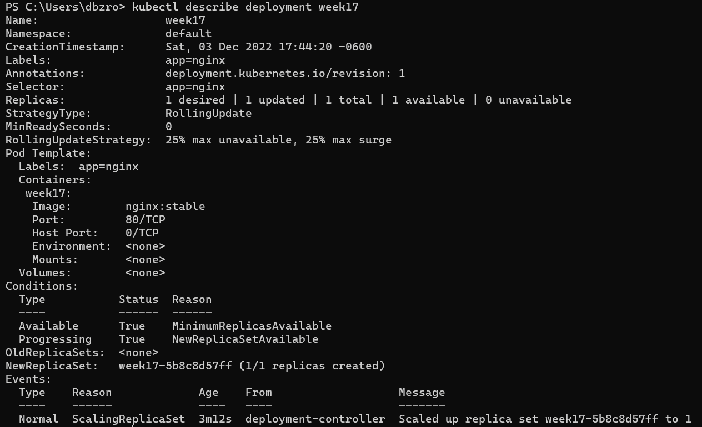

**步骤 2:更新 YAML 文件，将副本数量扩展到 4 个**

下一步，我们要做的就是将复制副本扩展到四个部署。使用与前面相同的 vim 命令，进入该文件并将其更新为副本数量为 4:

```
apiVersion: apps/v1
kind: Deployment
metadata:
  name: week17
  labels:
    app: nginx
spec:
  replicas: 4
  selector:
    matchLabels:
      app: nginx
  template:
    metadata:
      labels:
        app: nginx
    spec:
      containers:
      - name: week17
        image: nginx:stable
        ports:
        - containerPort: 80
```


保存并退出文件，然后再次运行相同的命令:

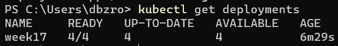

`kubectl get pods`命令允许我们查看部署期间创建的每个 pod。我们目前有四个正在运行，这意味着清单文件已正确更新:

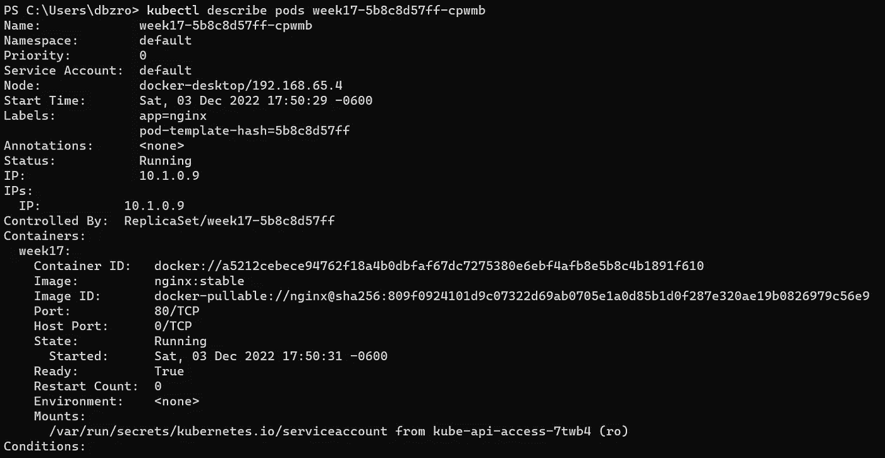

正如您在下面看到的，由于我们的 Docker 桌面应用程序与我们的本地机器同步，我们可以看到我们所有的容器在正确部署后都在运行:

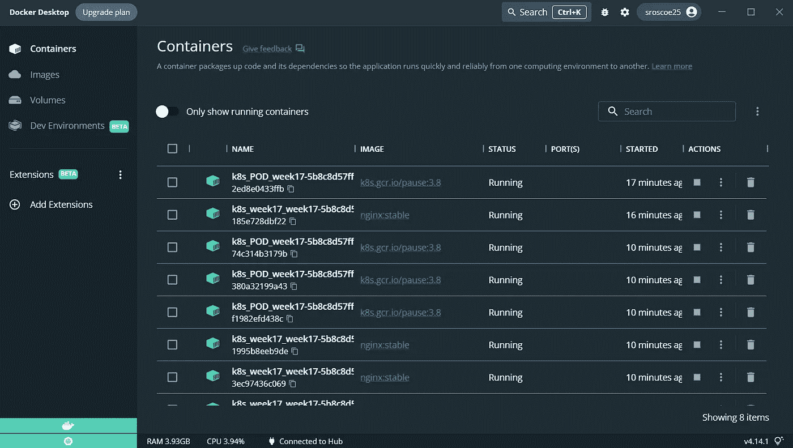

现在我们已经正确地部署了容器，让我们做一些清理工作。我们不想让任何东西保持运行，所以让我们删除我们的部署:

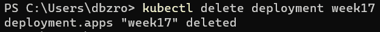

而这标志着项目的完成！谢谢你的来访！

# 分级编码

感谢您成为我们社区的一员！在你离开之前:

*   👏为故事鼓掌，跟着作者走👉
*   📰查看[级编码出版物](https://levelup.gitconnected.com/?utm_source=pub&utm_medium=post)中的更多内容
*   🔔关注我们:[推特](https://twitter.com/gitconnected) | [LinkedIn](https://www.linkedin.com/company/gitconnected) | [时事通讯](https://newsletter.levelup.dev)

🚀👉 [**加入升级人才集体，找到一份惊艳的工作**](https://jobs.levelup.dev/talent/welcome?referral=true)