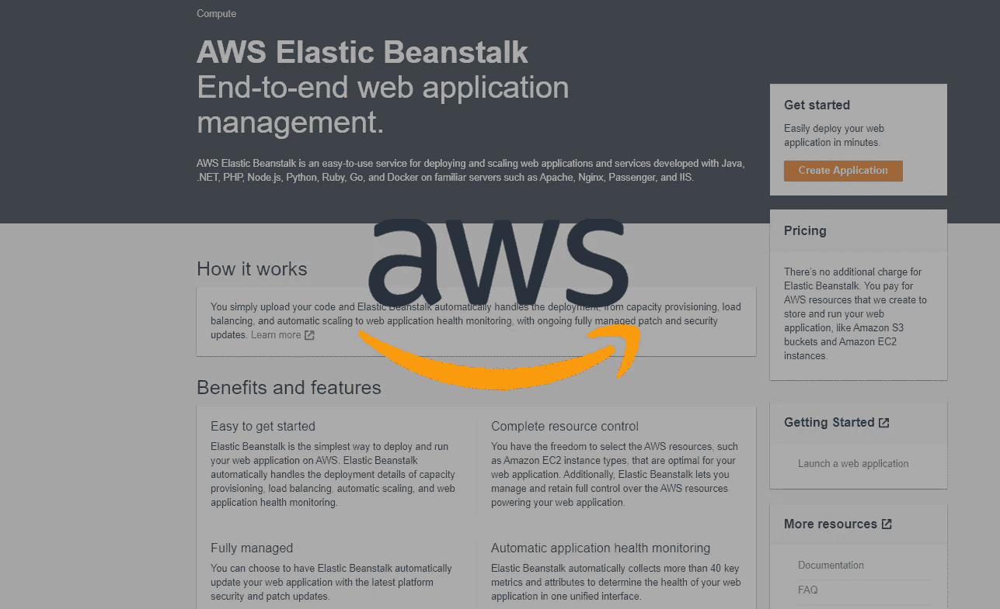
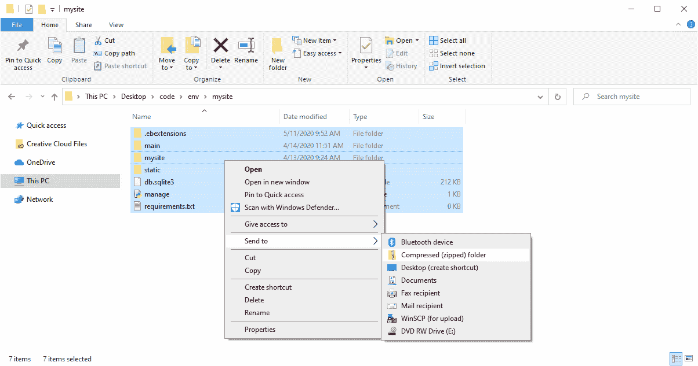
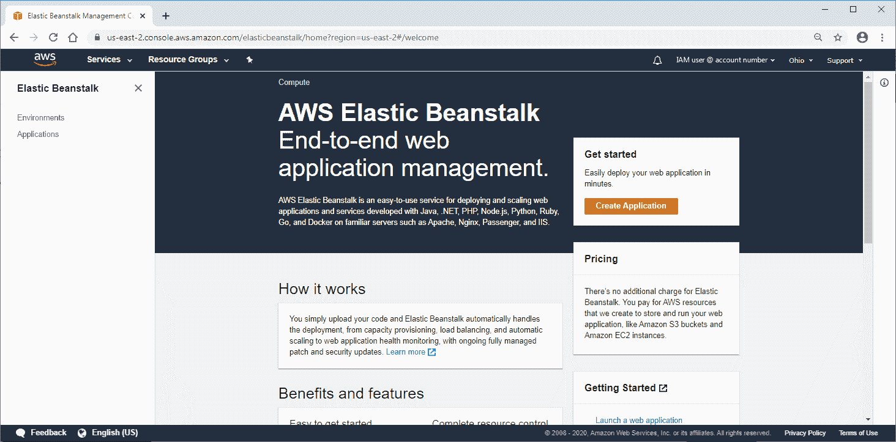
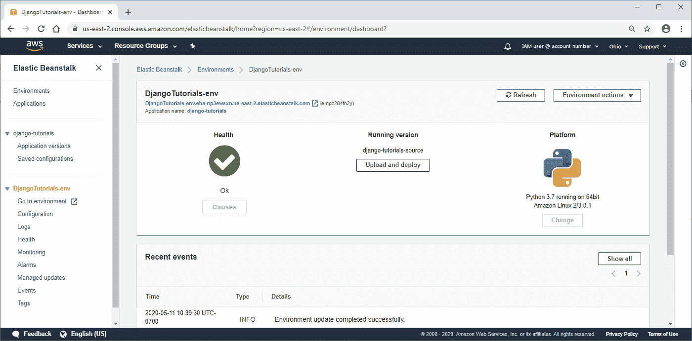

# 想部署你的 Django 应用吗？

> 原文：<https://levelup.gitconnected.com/deploying-django-from-the-aws-elastic-beanstalk-console-e9e726e662bf>



Amazon Web Services 为用户提供了两种部署弹性 Beanstalk (EB)的选择:

(1)[AWS 弹性豆茎命令行界面(EB CLI)](https://www.ordinarycoders.com/deploying-django)

(AWS 弹性豆茎控制台

这个 Django + AWS Elastic Beanstalk 教程将演示如何在 AWS 站点上提供的 AWS EB 控制台中部署 Django web 应用程序。

[按照下面列出的说明创建一个免费层 AWS 帐户](https://aws.amazon.com/free/?all-free-tier.sort-by=item.additionalFields.SortRank&all-free-tier.sort-order=asc)。

***注意:*** *AWS EB 目前只兼容 Django 版本* `*2.1.15*` *或以下版本。使用较新版本的 web framework 会导致部署时出现兼容性问题。*

# **Django AWS 弹性豆茎**

使用 AWS Elastic Beanstalk 控制台部署 Django 项目需要在上传之前将某些配置设置和文件添加到项目中。这包括一个 *requirements.txt* 文件、一个 *ebextensions* 文件和一个 *django.config* 文件。

**弹性豆茎要求. txt**

*macOS 终端*

```
(env)User-Macbook:mysite user$
(env)User-Macbook:mysite user$ pip freeze > requirements.txt
```

*Windows 命令提示符*

```
(env) C:\Users\Owner\desktop\code\env\mysite>
(env) C:\Users\Owner\desktop\code\env\mysite> pip freeze > requirements.txt
```

从运行完整应用程序的本地服务器开始。Ctrl + C 并停止运行服务器。激活虚拟环境后，您应该还在 *mysite* 文件夹中。

然后将所有安装的应用程序保存在由命令`pip freeze > requirements.txt`创建的 *requirements.txt* 文件中。这将允许 Elastic Beanstalk 使用本地安装的所有包。

**查看 requirements.txt 文件**

```
#*env > mysite > requirements.txt*Django==2.1.15
...
```

在代码编辑器中打开 *requirements.txt* 文件。**如果有列出版本`0.0.0`的包，则仅**编辑文件。**删除**此版本 0.0.0 包，如果列出，以防止部署时出错。保存对文件所做的更改。

**创造一个。ebextensions 文件夹**

*macOS 终端*

```
(env)User-Macbook:mysite user$ mkdir .ebextensions
```

***Windows 命令提示符***

```
(env) C:\Users\Owner\desktop\code\env\mysite> mkdir .ebextensions
```

在 CLI 中，运行命令`mkdir .ebextensions`创建一个*。ebextensions* 文件夹。这个文件夹将保存 Django + AWS 弹性豆茎设置。

**创建一个 django.config 文件**

```
#*env > mysite > .ebextensions > (New File) django.config*option_settings:
  aws:elasticbeanstalk:container:python:
    WSGIPath: mysite.wsgi:application
```

打开新文件夹*。ebextensions* 并创建一个名为 *django.config* 的新文件。

将上述 ebextensions `option_settings`配置放入文件中，以允许 AWS EB 找到 *wsgi.py* 文件，并在生产中正确转发请求。

如果你的项目不叫 *mysite* ，把它改成正确的名字。

# **将 Django 部署到 AWS 弹性豆茎控制台**

添加了适当的配置后，我们可以继续压缩根目录并将其部署到 AWS Elastic Beanstalk 控制台。

**压缩 Django 项目**

接下来，在 Windows 文件资源管理器或 Mac Finder 中找到您的 Django 项目，并将位于项目目录中**的所有文件压缩。**

*做* ***而不是*** *压缩项目文件夹本身。*

被压缩的物品应包括*。ebextensions* 、 *main、*和 *mysite* 文件夹以及数据库、 *manage.py、*和 *requirements.txt* 文件。



**AWS 弹性豆茎上传 Zip**

登录您的 AWS 帐户并打开 Elastic Beanstalk 控制台。单击屏幕右侧的“创建应用程序”按钮。

然后在*应用程序信息*部分命名您的应用程序。您可以将*应用标签*部分保留为空白。

为您的平台选择“Python ”,其余的*平台*部分将自动填充。

最后，在*应用代码*下选择“上传您的代码”。将出现一个名为*源代码来源*的新部分，您需要选择“本地文件”并上传上一步压缩的文件夹。

文件夹上传完成后，单击页面底部的“创建应用程序”继续。AWS EB 将开始启动您的项目。



可交换的图像格式

# **在浏览器中打开您的项目**

当您的项目完成部署时，您将被带到环境仪表板。要查看已部署的项目，请单击页面顶部列出的 Elastic Beanstalk 域。

如果您的环境正在产生`WARN`事件，请确保您已经遵循了前面的所有步骤并正确配置了文件。



# **处理更具体的错误**

**错误:您的 WSGIpath 引用了一个不存在的文件**

如果你得到的是`*"ERROR Your WSGIPath refers to a file that does not exist."*` *:*

检查 *django.config* 文件，确保它具有正确的代码和格式。保存对文件的更改，重新压缩项目，然后再次部署。

如果你还在得到`*"ERROR Your WSGIPath refers to a file that does not exist."*` *:*

如果重新部署后仍出现此错误，请转到环境页面并选择侧菜单上的*配置*。

在*软件*类别下，点击“编辑”并找到 *WSGIPath* 。

将路径更改为 *mysite/wsgi.py* ，然后保存更改并等待环境更新。

如果您的项目根目录不是名为 *mysite* 的，则添加您的项目名称来代替 *mysite* 。

**错误:。ebextensions 不工作**

如果你的*。ebextensions* 文件夹不能正常工作，请检查它是否被添加到项目的根目录中。

这是由命令`django-admin startproject`创建的文件夹。它也是包含数据库、 *manage.py* 和 *requirements.txt* 的文件夹。

**误差:500**

如果你得到一个 500 错误，并且一切似乎都配置正确，检查 *requirements.txt* 文件是否**而不是**有一个列出了版本`0.0.0`的包。

这个版本号为 0.0.0 的包导致 *requirements.txt* 文件无法正确读取。删除包并重新部署应该可以解决这个问题

*原载于*[*https://www.ordinarycoders.com*](https://www.ordinarycoders.com/blog/article/deploying-from-aws-eb-console)*。*