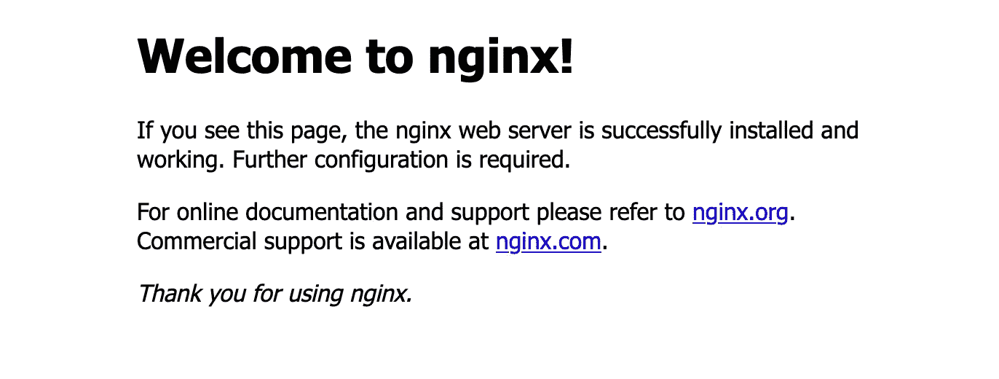

# 使用 Ansible 部署 Docker 容器

> 原文：<https://levelup.gitconnected.com/deploying-docker-containers-with-ansible-2a74a420e2b1>


照片由[威廉·威廉](https://unsplash.com/@william07?utm_source=unsplash&utm_medium=referral&utm_content=creditCopyText)在 [Unsplash](https://unsplash.com/s/photos/container?utm_source=unsplash&utm_medium=referral&utm_content=creditCopyText) 上拍摄

Ansible 无疑是最有影响力和最普遍的配置管理工具之一。Docker 是集装箱化的行业标准。当你把它们结合在一起时会发生什么？魔法，那是什么。

有很多不同的方法来实现微服务和部署容器。你可以使用 Kubernetes，Docker Swarm，Python，甚至 shell 脚本。这样的例子不胜枚举。但是如果你只需要将一些基本的容器部署到已经在 Ansible 库存中的主机上，那么最简单的方法就是使用 Ansible。

在本文中，我们将探索如何使用 Ansible 在主机上运行 Docker 容器。它非常简单明了，可以让您现有的剧本和角色保持整洁。让我们开始吧。

## 先决条件

在接下来的几个步骤中，我们将在本地部署 Nginx Docker 容器。如果你不熟悉 Nginx，它是一种轻量级的快速网络服务器，被许多公司用于托管网站和其他服务。一旦 Nginx 容器启动并运行，我们将能够通过访问 Nginx 测试页面来确认它的工作。

在继续之前，确保您已经在主机上安装了 Docker 是很重要的。您可以使用`docker ps`检查运行中的容器。如果您还没有安装 Docker，请访问:

[https://docs.docker.com/engine/install/](https://docs.docker.com/engine/install/)

为了让 Ansible 能够部署容器，您还需要使用 Ansible 指向的同一 Python 版本安装以下 Python 模块:

```
pip3 install docker
```

如果你安装了模块，Ansible 不能识别它的存在，你可能需要检查你使用的 Python 版本是否正确。您的主机可能有多个不同的版本，或者 Ansible 可能使用了错误的版本。通过将`ansible_python_interpreter`变量设置为当前 Python 安装的路径，可以将 Ansible 指向正确的方向。

## 构建行动手册

现在我们已经安装了依赖项，我们可以继续构建我们的剧本了。在这个例子中，我们将使用一个只有一个任务的剧本来部署容器:

```
# playbook.yml
---
- hosts: localhost
  connection: local
  tasks:
    - name: deploy nginx docker container
      docker_container:
        image: nginx:stable
        name: nginx
        state: started
        auto_remove: true
        ports:
          - "8080:80"
```

该行动手册中的所有内容都是独立的，因此您可以在本地使用`ansible-playbook`进行部署。主机和连接都是本地的。在`docker_container`任务中，我们传递图像、名称、状态等标准参数。这与`docker-compose`的语法非常相似，所以如果你曾经在 compose 中写过任何东西，你会有宾至如归的感觉。

最后，为了测试我们的新 web 服务器，我们将端口 8080 向下转发到容器内的端口 80。

## 把所有的放在一起

我们的剧本准备好了，我们准备运行我们的新容器。为了部署容器，发出以下 Ansible 命令:

```
ansible-playbook playbook.yml
```

假设一切都成功了，现在您应该能够使用`docker ps`检查正在运行的容器了。现在你可以打开浏览器，前往`localhost:8080`查看 Nginx 测试页面:



Nginx 欢迎页面。

如果您能够看到测试页面，那么这个闪亮的新 Nginx 容器已经启动并运行在正确的端口上。为了停止正在运行的容器，你可以简单地发出`docker stop nginx`命令，容器将关闭并自动移除(由前面的`auto_remove: true`变量设置)。

## 后续步骤

既然您已经尝试了在本地部署一个容器，那么您可以轻松地扩展这个剧本，使其适用于多个容器、不同的动态版本，甚至可以使用 Ansible `docker_compose`模块和现有的 compose 文件。有关这两个模块的详细使用信息，请查阅以下官方文档:

*   [可能的文档— docker_container](https://docs.ansible.com/ansible/latest/collections/community/docker/docker_container_module.html)
*   [可提交的文档— docker_compose](https://docs.ansible.com/ansible/latest/collections/community/docker/docker_compose_module.html)

尽管使用像 Kubernetes 这样的服务来构建和部署容器可能有更好的方法，但是这些方法增加了不必要的复杂性。如果您的唯一目标是获得运行在一小组机器上的基本服务，如 Nginx 或其他实用程序，Ansible 可能是一种更简单、更快速的方法。尤其是如果您已经在环境中利用它进行配置管理。

*感谢阅读！有了这些工具，您可以快速、轻松地构建适度复杂的部署，与您现有的配置管理系统紧密集成。查看* [*5 个简单可行的调整以获得更好的剧本*](https://medium.com/swlh/5-simple-ansible-tweaks-for-better-playbooks-fd9b789d5bca) *以获得更多可行的技巧！*