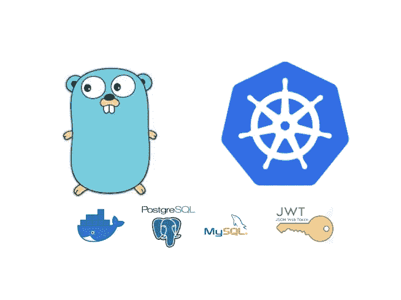
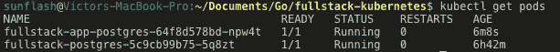
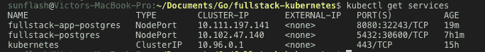
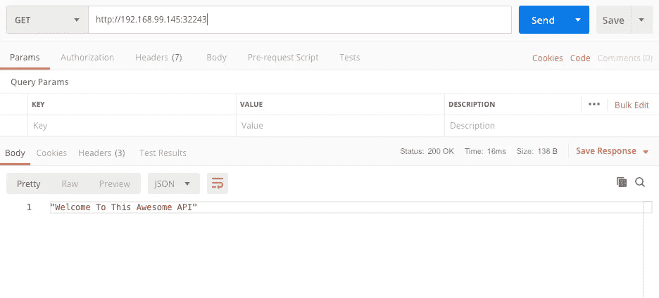
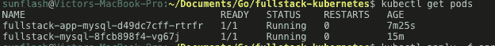
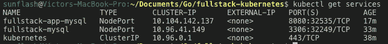

# 使用 PostgreSQL、MySQL 在 Kubernetes 上部署 Dockerized Golang API

> 原文：<https://levelup.gitconnected.com/deploying-dockerized-golang-api-on-kubernetes-with-postgresql-mysql-d190e27ac09f>



欢迎光临！在本文中，我们将把我们的 **API** 部署到 **Kubernetes。**

这是文章系列的第三部分。

在这里获取第 1 条[app-postgres-deployment . YAML](/crud-restful-api-with-go-gorm-jwt-postgres-mysql-and-testing-460a85ab7121#file-app-postgres-deployment-yaml)

***二世。服务:***

在根目录中触摸:

```
touch app-postgres-service.yaml
```

内容和解释

[app-postgres-service . YAML](https://gist.github.com/victorsteven/9609be1698586313c145e36f4347d88d#file-app-postgres-service-yaml)

应用:

```
kubectl apply -f app-postgres-deployment.yamlkubectl apply -f app-postgres-service.yaml
```

让我们得到我们的豆荚:

```
kubectl get pods
```

过一段时间你应该有两个跑步舱。您最初看到的状态可能是“ContainerCreating ”,如果成功，您应该会看到下图:



酷！

**可能出现的问题**

如果您遇到任何问题，您可以使用以下命令进行调试:

```
kubectl describe pod <pod-name>kubectl logs <pod-name>
```

***三世。测试应用程序:***

我们需要**服务的真正原因。**创建一个服务来展示 pod。

获取服务列表:

```
kubectl get services
```



服务

我们将获得向我们展示的 fullstack-app-postgres 的 URL:

```
minikube service fullstack-app-postgres --url
```

这是我的输出:[**http://192 . 168 . 99 . 145:32243**](http://192.168.99.145:32243)

有了上面的 URL，我现在可以访问部署在 kubernetes 上的 API 了。多酷啊。非常酷。



可以访问:"[**http://192 . 168 . 99 . 145:32243**](http://192.168.99.145:32243)**/users "**到获取所有用户。

访问:"[**http://192 . 168 . 99 . 145:32243**](http://192.168.99.145:32243)**/posts "**到获取所有帖子。

参考[第 1 篇](https://medium.com/@victorsteven/crud-restful-api-with-go-gorm-jwt-postgres-mysql-and-testing-460a85ab7121)获取我们定义的所有端点。

**b .使用 MySQL 数据库**

如果你没有使用 mysql 数据库，请跳过这一步。

***一、部署:***

在根目录中触摸:

```
touch app-mysql-deployment.yaml
```

内容和解释:

app-mysql-deployment.yaml

***ii。服务:***

在根目录中，触摸:

```
touch app-mysql-service.yaml
```

内容及解释:

app-mysql-service.yaml

运行以下命令:

```
kubectl create -f mysql-secret.yamlkubectl apply -f mysql-db-pv.yamlkubectl apply -f mysql-db-pvc.yamlkubectl apply -f mysql-db-deployment.yamlkubectl apply -f mysql-db-service.yaml
```

检查 pod 状态:

```
kubectl get pods
```

注意，pod 创建可能需要一些时间，监视状态，以了解您的 pod 的状态。当 pod 成功创建时，您将获得如下输出:



获取群集中的服务:

```
kubectl get services
```



使用以下方式公开 url:

```
minikube service <service-name> --url
```

从上面的截图来看，我们要使用的服务名是“fullstack-app-mysql”

所以，

```
minikube service fullstack-app-mysql --url
```

给我:[**http://192 . 168 . 99 . 146:32535**](http://192.168.99.146:32535)

这就对了，在**邮递员**中打开那个 URL，并与 API 进行交互。

# 步骤 6:关闭 Minikube

完成测试后，您可以使用以下方式停止 minikube:

```
minikube stop
```

您也可以使用以下方式删除 minikube:

```
minikube delete
```

# 结论

哇哦。您可以看到在 Kubernetes 上部署我们的 API 并不难。

在这里获取代码

在以后的文章中:

*   我们将使用谷歌云、亚马逊 EKS 或数字海洋部署我们的 Kubernetes 集群。
*   我们会整合特拉维斯
*   用 React/VueJS 消费我们的 API。

敬请期待！

谢了。