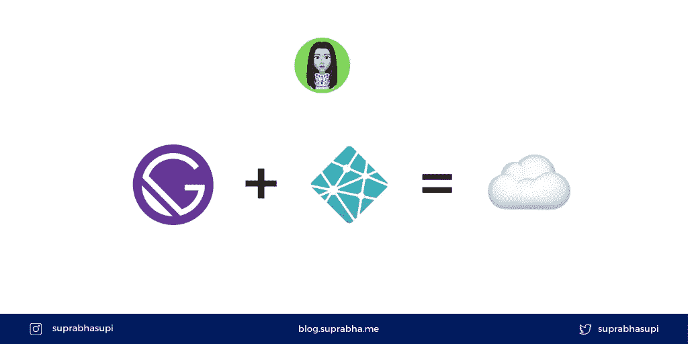
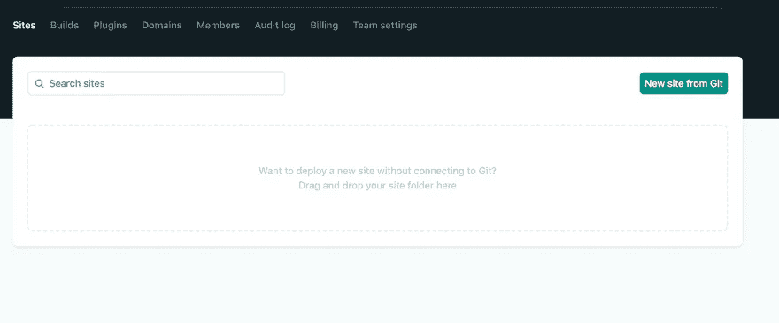
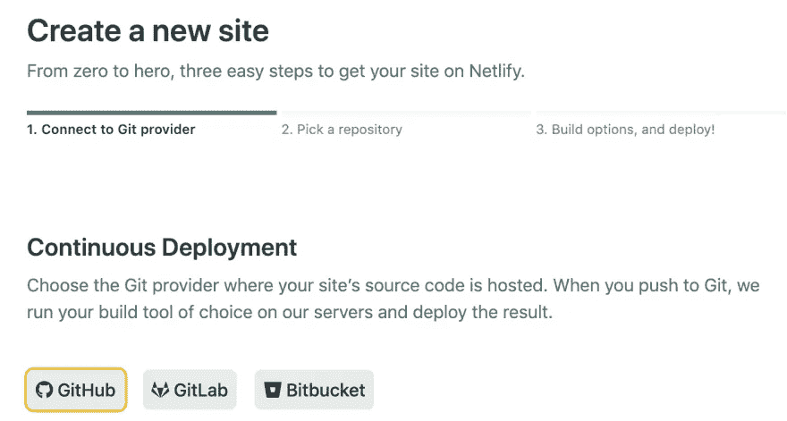
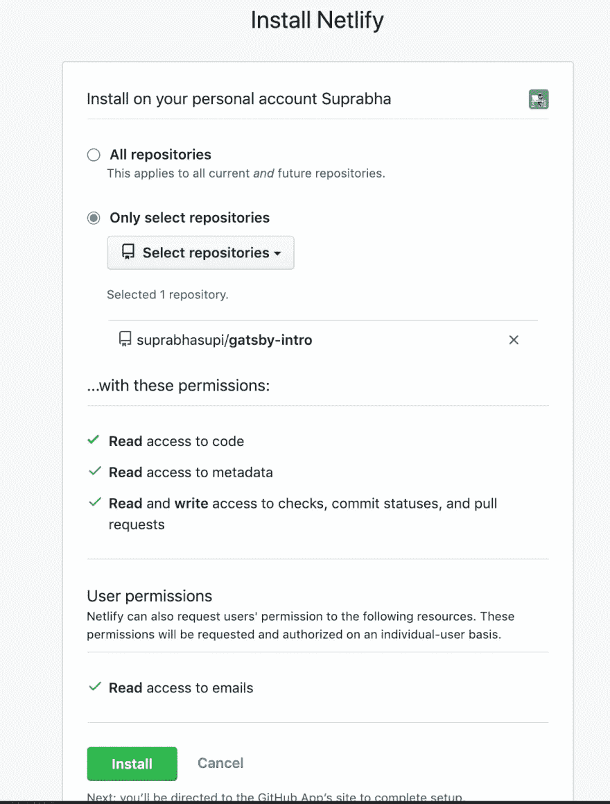
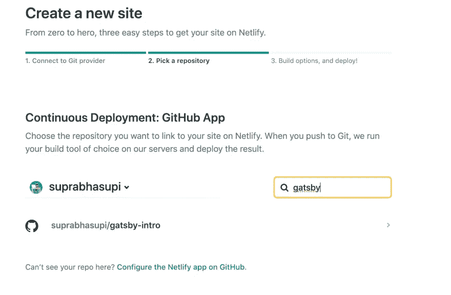
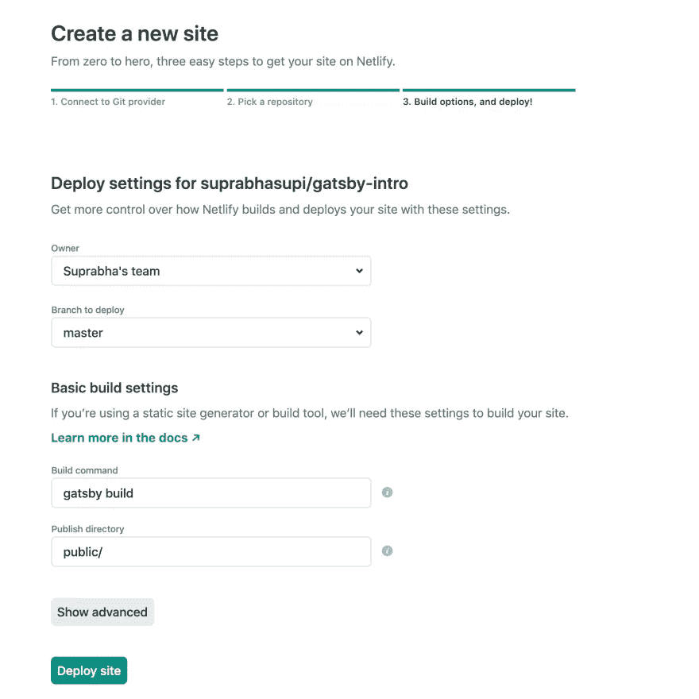
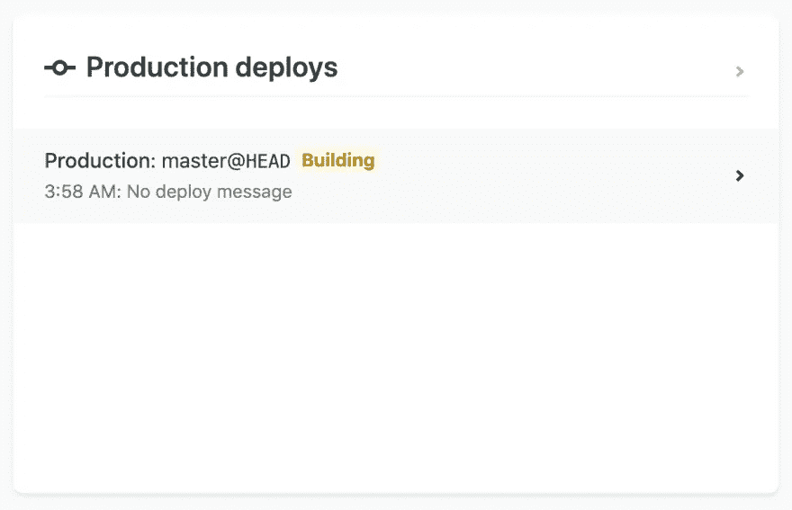

# 在网络上部署盖茨比💻

> 原文：<https://levelup.gitconnected.com/deploying-gatsby-on-netlify-fc9cffa9a99c>

盖茨比谈网络生活

# 你怎么能在 Netlify 上部署 Gatsby？🤔

1.  前往[网络生活](https://www.netlify.com/)
2.  通过 github/gitlab 或您的选择进行注册或登录😅。我将通过 github 登录。
3.  从 Git 点击`New Site`

4.选择 Github 或任何选项

5.授予对所选回购的 netlify 的访问权限

6.选择一个存储库(例如:`gatsby-intro`)

7.用右键点击回购名称

8.单击部署站点

9.你可以在这里查看建筑状况

10.一旦部署完成，您将看到✅或❌的发布状态

您也可以在`Netlify`部署特定的分支机构。一旦您创建了拉式请求，它将自动创建构建部件。