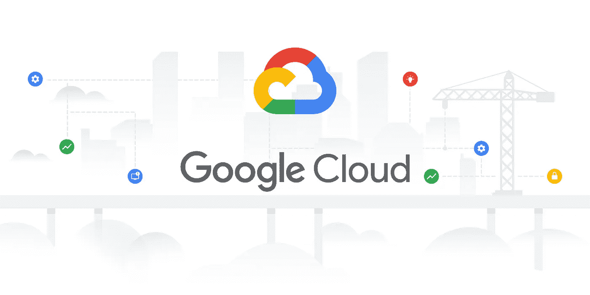

# 在 Google 云平台上部署 Go 应用(应用引擎)

> 原文：<https://levelup.gitconnected.com/deploying-go-application-on-google-cloud-platform-app-engine-ea25a849cb66>

现在，您已经开发了 Golang 应用程序，是时候将它部署到云中，让其他人开始使用它了。市场上已经出现了各种各样的云计算服务，从亚马逊网络服务(AWS)，微软 Azure，谷歌云平台(GCP)到阿里云(以及更多)。今天，我们来看看 GCP。

谷歌云平台

GCP 还根据我们的要求提供不同类型的计算服务，例如:

1.  **应用引擎** —完全托管的无服务器平台(平台即服务)，这意味着您只需部署代码，平台将为您完成其余工作，例如根据流量自动扩展和缩减应用。
2.  **计算引擎** —一种基础架构即服务，您可以在其中创建和配置虚拟机实例，为您提供对虚拟机、存储等基础资源的灵活性和访问。
3.  **Kubernetes Engine**——运行和管理容器的集群管理和编排开发。它自动化了容器化应用的部署、扩展和管理。
4.  **云函数** —可以通过 HTTP 请求调用或设置为基于后台事件触发的无服务器函数。这允许开发人员将小代码部署到云中。
5.  **云运行** —允许您将代码打包到无状态容器中，简化 Kubernetes 支持的复杂配置。

请注意，所有这些服务都有不同的定价。

今天，我们将了解如何将 Go 应用程序部署到 App Engine 上。

你需要在谷歌云平台上创建一个账户，并安装谷歌云 SDK([https://cloud.google.com/sdk](https://cloud.google.com/sdk))。

我们开始吧！

1.  在谷歌云平台上创建一个新项目

创建新项目

2.选择 App Engine，在您刚刚创建的项目中创建一个应用程序，并选择一个靠近您的目标市场的地区

在应用程序引擎下创建新实例

3.启用计费以便将应用程序部署到应用程序引擎

4.在根文件夹中创建 app.yaml 以及环境变量。你可以参考[https://cloud . Google . com/app engine/docs/standard/go/config/appref](https://cloud.google.com/appengine/docs/standard/go/config/appref)来编写你的 app.yaml

5.由于应用程序需要数据库，我们需要先设置数据库。在“SQL”选项卡中，创建一个实例并选择所需的数据库引擎。还要在 SQL 实例中创建一个数据库

正在创建 SQL 实例

6.按照以下格式设置连接到数据库的连接凭证:
*<用户名> : <密码>*[*@ UNIX*](http://twitter.com/unix)*(/cloud SQL/<实例连接名>/<DB 名>？charset = utf8&parse time = True&loc = UTC*

7.在你的电脑上打开命令提示符，输入命令“gcloud auth login”登录你的谷歌账户

8.使用命令“g cloud config set PROJECT PROJECT _ ID”将当前项目配置为新创建的项目

9.通过“gcloud app deploy”部署应用

10.您的 Go 应用程序现在已经部署好了！