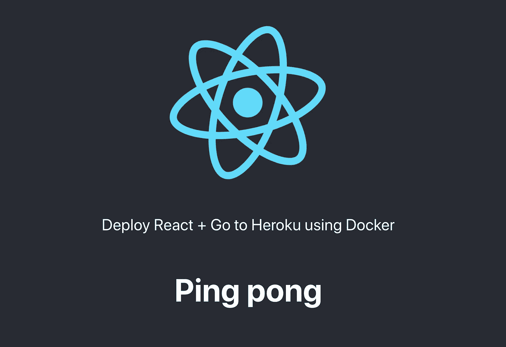

# 使用 Docker 将 Go + React 部署到 Heroku，第 1 部分

> 原文：<https://levelup.gitconnected.com/deploying-go-react-to-heroku-using-docker-9844bf075228>


Guillaume Bolduc 在 [Unsplash](https://unsplash.com?utm_source=medium&utm_medium=referral) 上拍摄的照片

有一堆如何做我将要写的大部分内容的指南和教程，但是没有一个能真正把我所有的东西整合在一起。我想要一些可以帮助我学习围棋的东西，但也有能力在某个地方推广它——Heroku 是这样一个宠物项目的绝佳选择。这是 3 部分系列的第 1 部分:

*   第 1 部分—部署简单的服务器和客户机(本指南)
*   [第二部分](https://medium.com/@deano.baker/deploying-go-react-to-heroku-using-docker-part-2-the-database-afaaaae66f81) —添加数据库
*   第 3 部分—添加用户身份验证

> 你可以在这里看到完整的代码: [github](https://github.com/deandemo/react-go-heroku)

# 你将建造什么

我们将在 React.js 中构建一个客户端，在 Go 中构建一个服务器，我们可以使用 Docker 将其部署到 Heroku。我们还将有一个良好的当地发展环境。

# 你需要什么

您需要以下工具来开始:

*   客户端节点([安装](https://nodejs.org/en/download/package-manager/#macos))
*   转到服务器([安装](https://golang.org/doc/install))
*   码头工人部署东西([安装](https://docs.docker.com/get-started/))
*   Heroku 主持的东西([免费账号](https://signup.heroku.com/)， [CLI 工具](https://devcenter.heroku.com/articles/heroku-cli))
*   IDE(我使用了 [VSCode](https://code.visualstudio.com/) )

# 入门指南

我们将创建一个根目录，它将保存单独的**客户端**和**服务器**目录，该根目录还将保存用于构建最终产品的 **Dockerfile** (这是一个文件，不是目录)。

```
project
  |
  |-client/
  |-server/
  |-Dockerfile
```

# Go 服务器

首先，让我们创建一个 API 供前端使用。在您的服务器目录中创建一个新的 Go 模块，并创建一个初始的 **main.go** 文件。

```
$ **go mod init github.com/deandemo/react-go-heroku**
```

创建 main.go 文件

这里我们使用的是 [gin](https://github.com/gin-gonic/gin) ，一个流行的网络框架来帮助路由，这个稍后会派上用场。

如果您想了解应用程序的运行情况:

```
$ **go run main.go**# You will have to run this in a new terminal
$ **curl localhost:8080/api/ping**
```

# React 入门

> 声明:这里生成的代码可能会随着 React 和`create-react-app`的发展而改变。

我们将利用 facebook 的 [**create-react-app**](https://github.com/facebook/create-react-app) 工具来快速搭建一个前端，所以跳到项目的 **root** 目录并运行:

```
$ **npx create-react-app client**
```

> 因为我们正在创建一个 mono-repo，所以请删除 git 存储库(**)。git)** 在新创建的 **/client** 目录下。

## PingComponent

让我们创建一个可以访问服务器的组件，在这种情况下，我们将使用 [axios](https://github.com/axios/axios) ，一个流行的框架来帮助进行 API 调用。只需将以下文件放入 react app 的 **src** 目录中，将该文件命名为 **PingComponent.js**

在此代码生效之前，我们必须导入 axios 包:

```
# From the /client/ directory run
$ **npm install axios --save**
```

PingComponent.js

注意，在第 13 行，我们在`api/ping`调用一个端点，如果我们使用 **npm start** 启动 react 应用程序，这将等同于点击[**http://localhost:3000/API/ping**](http://localhost:3000/api/ping)**——稍后当我们连接我们的本地环境时，会有更多关于这方面的内容。**

## **App.js**

**现在，我们可以用最简单的方式连接 ping 组件。在使用 create-react-app 工具创建的 App.js 文件中，添加以下内容:**

**App.js**

**注意第 4 行和第 23 行，这里我们导入并使用了我们的 PingComponent。**

## **地方发展代理人**

**如果我们要启动我们的两个代码库，我们将在端口 **3000** 上运行一个客户端，在端口 **8080** 上运行一个服务器。这对于开发来说并不理想，所以我们可以通过添加一个`proxy`字段来修改我们的 **package.json** 来配置客户端代理所有对 API 服务器的未知请求:**

```
"proxy": "[http://localhost:8080](http://localhost:8080)"
```

# **本地运行**

**很好，现在我们有了一个服务器和一个能够代理请求的客户端。让我们试一试！**

**打开一个终端，首先启动服务器(如果它还没有运行)，然后使用`npm start`启动客户端。这应该会自动打开浏览器中的应用程序，你应该会看到成功！**

```
# From the /server directory
$ **go run main.go**# From the /client directory
$ **npm start**
```

****

# **码头工人**

**现在我们有了一个开发环境，让我们把这个东西“戳”出来。**

## **Dockerfile 文件**

**首先，我们将创建一个 Docker 容器来存放我们的生产代码。这将是可执行的 Go 程序，也是 React 应用程序的生产版本。为此，我们可以使用一个[多阶段](https://docs.docker.com/develop/develop-images/multistage-build/) docker 构建，将该文本粘贴到位于我们项目根目录下的一个名为`Dockerfile`的文件中。**

```
# Build the Go API
FROM golang:latest AS builder
ADD . /app
WORKDIR /app/server
RUN go mod download
RUN CGO_ENABLED=0 GOOS=linux GOARCH=amd64 go build -ldflags "-w" -a -o /main .# Build the React application
FROM node:alpine AS node_builder
COPY --from=builder /app/client ./
RUN npm install
RUN npm run build# Final stage build, this will be the container
# that we will deploy to production
FROM alpine:latest
RUN apk --no-cache add ca-certificates
COPY --from=builder /main ./
COPY --from=node_builder /build ./web
RUN chmod +x ./main
EXPOSE 8080
CMD ./main
```

**正如您在这里看到的，我们实际上正在创建 3 个 docker 容器，第一个用于构建 Go API，第二个用于 React 应用程序，第三个用于创建一个仅包含生产代码的轻量级容器——不需要提供依赖项和工具，只在构建时需要。**

> **在我们开始之前，这里有一个小提示，创建一个`.dockerignore`文件，以确保我们不会将不必要的文件推到 docker 上下文中。在我们的例子中，这里的`client/node_modules`文件相当大。所以让我们把这个添加到`.dockerignore`文件中。**

```
$ **echo '**/node_modules' > .dockerignore**
```

## **运行 docker 容器**

```
$ **docker build -t golang-heroku .**
$ **docker run -p 3000:8080 -d golang-heroku**
```

**`docker build`将创建一个带有标签`golang-heroku`的图像，您现在可以使用 run 命令运行这个图像的一个实例。请注意，`docker run`命令正在转发我们的本地端口`3000`并将其转发到容器中的端口`8080`，这意味着我们现在可以在本地查看我们的工作。导航到 [http://localhost:3000](http://localhost:3000) 查看您的网站。**

# **赫罗库**

**我们现在有了一个我们希望 Heroku 服务的本地构建，这是一个简单的过程，每次我们将代码推送到 Heroku 远程，一个新的构建就会开始。Heroku 将为我们负责 docker 的构建和部署！**

**我不会讲太多细节，但是让我们假设您已经创建了一个 Heroku 帐户，并且安装了 CLI 工具。请确保您已经登录:**

```
$ **heroku login**
```

**在项目的根目录下，添加一个名为`heroku.yml`的新文件——这将告诉 Heroku 如何部署我们的应用程序。**

```
build:
  docker:
    web: Dockerfile
    worker:
       dockerfile: Dockerfile
```

## **饭桶**

**如果您还没有，我们想在项目的根目录下创建一个 git 存储库。请确保您已经删除了`client/.git`目录，以避免 git 混乱。**

```
$ **git init**
$ **git add .**
$ **git commit -m 'Initial Commit'**
```

**这些命令应该通过一次提交创建一个初始存储库，其中包含我们所有的好工作。**

**现在让我们创建一个新的 Heroku 应用程序:)**

```
$ **heroku create**
Creating app... done, ⬢ hidden-chamber-90878
[https://hidden-chamber-90878.herokuapp.com/](https://hidden-chamber-90878.herokuapp.com/) | [https://git.heroku.com/hidden-chamber-90878.git](https://git.heroku.com/hidden-chamber-90878.git)$ **heroku stack:set container**
Stack set. Next release on ⬢ hidden-chamber-90878 will use container.
Run git push heroku master to create a new release on ⬢ hidden-chamber-90878.
```

**首先，我们创建了一个新的应用程序，您可以看到建议的 URL 和 git remote(CLI 工具已经为您的`.git/config`添加了一个 Heroku remote)。然后，我们需要告诉 Heroku，我们打算在这个堆栈中部署一个容器。完成后，我们可以继续部署。**

```
$ **git add .
$ git commit -m 'Initial commit'
$ git push heroku master**# If you need to retrieve your prod url etc
$ **heroku apps:info**
```

**这就是 PAA 真正神奇的地方！我修改了一点代码，也许是一些 HTML，当我把它推到`heroku`遥控器上时，它就收起那个球，做了一大堆工作来创建一个新的不可变的容器来为我部署。**

> **通过网络推动小 git 提交(就像我在火车上的移动连接)并让 Heroku 为我构建和部署的想法非常令人兴奋！**

# **摘要**

**我认为这是一个很好的第一步，能够轻松地在本地工作，并随意将变更推向生产(让平台负责调配计算和部署)。**

**但是一个愚蠢的应用编程接口和客户就是不能切断它。在[第 2 部分](https://medium.com/@deano.baker/deploying-go-react-to-heroku-using-docker-part-2-the-database-afaaaae66f81)中，我们将研究如何提供一个 Heroku Postgres 插件，让我们的本地开发从头开始，并确保我们可以在发布时使用 Heroku 在部署过程中的发布阶段推送和迁移数据库。**