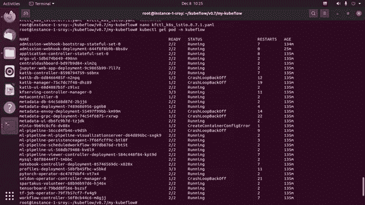

# 在本地 Kubernetes 集群(minikube)上部署 Kubeflow

> 原文：<https://levelup.gitconnected.com/deploying-kubeflow-on-a-local-kubernetes-cluster-minikube-a08605d69729>

实习生，[【can spirit . AI】](https://www.canspirit.ai/)(导师——阿伦库马尔·奈尔先生[现有 Kubernetes 集群上的部署概述| Kubeflow](https://medium.com/u/5843ab42d8c9#:~:text=Minimum%20system%20requirements%20%20%20%20Kubernetes%20Versions,%20%20compatible%20%204%20more%20rows%20)

安装 minikube 版本 1.15，因为这与 Kubeflow 兼容。

```
curl -LO [https://storage.googleapis.com/minikube/releases/latest/minikube-linux-amd64](https://storage.googleapis.com/minikube/releases/latest/minikube-linux-amd64)sudo install minikube-linux-amd64 /usr/local/bin/minikube
```

检查安装:


检查 minikube 安装

## 4.启动 minikube-

```
minikube start --cpus **6** --memory **12288** --disk-size**=**120g --extra-config**=**apiserver.service-account-issuer**=**api --extra-config**=**apiserver.service-account-signing-key-file**=**/var/lib/minikube/certs/apiserver.key --extra-config**=**apiserver.service-account-api-audiences**=**api
```

我们希望指定 6 个 CPU、12288 内存、120G 磁盘大小。

## 5.安装 Kubeflow-

我们希望安装 Kubeflow 版本 0.7，因为这是与 Kubernetes 兼容的稳定版本。首先，我们在终端输入 *sudo su* 进入 root。

```
mkdir -p /root/kubeflow/v0.7cd /root/kubeflow/v0.7wget [https://github.com/kubeflow/kfctl/releases/download/v0.7.1/kfctl_v0.7.1-2-g55f9b2a_linux.tar.gz](https://github.com/kubeflow/kfctl/releases/download/v0.7.1/kfctl_v0.7.1-2-g55f9b2a_linux.tar.gz)tar -xvf kfctl_v0.7.1-2-g55f9b2a_linux.tar.gzexport PATH=$PATH:/root/kubeflow/v0.7export KF_NAME=my-kubeflowexport BASE_DIR=/root/kubeflow/v0.7export KF_DIR=${BASE_DIR}/${KF_NAME}mkdir -p ${KF_DIR}cd ${KF_DIR}kfctl apply -V -f [https://raw.githubusercontent.com/kubeflow/manifests/v0.7-branch/kfdef/kfctl_k8s_istio.0.7.1.yaml](https://raw.githubusercontent.com/kubeflow/manifests/v0.7-branch/kfdef/kfctl_k8s_istio.0.7.1.yaml)
```

如果您收到如下错误消息:


然后必须在 nano 中打开`kfctl_k8s_istio.0.7.1.yaml`文件，不要做任何修改，只需保存(Ctrl+S)并退出(Ctrl+X)即可。然后执行以下 statememt:

```
kfctl apply -V -f kfctl_k8s_istio.0.7.1.yaml
```

你应该得到一个运行中的东西的长列表，它将需要几分钟来执行。一旦完成，你就可以安全地进入下一步。

如果此方法不起作用，请手动创建。yaml 文件应该可以。以下方法的灵感来自这篇博客[在 Kubernetes 集群上设置 Kubeflow 部署|作者 Andre Benea | Medium](https://medium.com/@andre.benea/setting-up-a-kubeflow-deployment-on-a-kubernetes-cluster-f1f5dc35d46a) 。请通读这篇教程，希望它能给你一个好的见解。

输入以下内容并打开 nano 编辑器:

```
nano kfctl_k8s_istio.yaml
```

在文件中输入以下内容:

```
apiVersion: kfdef.apps.kubeflow.org/v1beta1
kind: KfDef
metadata:
  creationTimestamp: null
  namespace: kubeflow
spec:
  applications:
  - kustomizeConfig:
      parameters:
      - name: namespace
        value: istio-system
      repoRef:
        name: manifests
        path: istio/istio-crds
    name: istio-crds
  - kustomizeConfig:
      parameters:
      - name: namespace
        value: istio-system
      repoRef:
        name: manifests
        path: istio/istio-install
    name: istio-install
  - kustomizeConfig:
      parameters:
      - name: clusterRbacConfig
        value: "OFF"
      repoRef:
        name: manifests
        path: istio/istio
    name: istio
  - kustomizeConfig:
      repoRef:
        name: manifests
        path: application/application-crds
    name: application-crds
  - kustomizeConfig:
      overlays:
      - application
      repoRef:
        name: manifests
        path: application/application
    name: application
  - kustomizeConfig:
      repoRef:
        name: manifests
        path: metacontroller
    name: metacontroller
  - kustomizeConfig:
      overlays:
      - istio
      - application
      repoRef:
        name: manifests
        path: argo
    name: argo
  - kustomizeConfig:
      repoRef:
        name: manifests
        path: kubeflow-roles
    name: kubeflow-roles
  - kustomizeConfig:
      overlays:
      - istio
      - application
      repoRef:
        name: manifests
        path: common/centraldashboard
    name: centraldashboard
  - kustomizeConfig:
      overlays:
      - application
      repoRef:
        name: manifests
        path: admission-webhook/bootstrap
    name: bootstrap
  - kustomizeConfig:
      overlays:
      - application
      repoRef:
        name: manifests
        path: admission-webhook/webhook
    name: webhook
  - kustomizeConfig:
      overlays:
      - istio
      - application
      repoRef:
        name: manifests
        path: jupyter/jupyter-web-app
    name: jupyter-web-app
  - kustomizeConfig:
      overlays:
      - istio
      repoRef:
        name: manifests
        path: metadata
    name: metadata
  - kustomizeConfig:
      overlays:
      - istio
      - application
      repoRef:
        name: manifests
        path: jupyter/notebook-controller
    name: notebook-controller
  - kustomizeConfig:
      overlays:
      - application
      repoRef:
        name: manifests
        path: pytorch-job/pytorch-job-crds
    name: pytorch-job-crds
  - kustomizeConfig:
      overlays:
      - application
      repoRef:
        name: manifests
        path: pytorch-job/pytorch-operator
    name: pytorch-operator
  - kustomizeConfig:
      overlays:
      - application
      parameters:
      - name: namespace
        value: knative-serving
      repoRef:
        name: manifests
        path: knative/knative-serving-crds
    name: knative-crds
  - kustomizeConfig:
      overlays:
      - application
      parameters:
      - name: namespace
        value: knative-serving
      repoRef:
        name: manifests
        path: knative/knative-serving-install
    name: knative-install
  - kustomizeConfig:
      overlays:
      - application
      repoRef:
        name: manifests
        path: kfserving/kfserving-crds
    name: kfserving-crds
  - kustomizeConfig:
      overlays:
      - application
      repoRef:
        name: manifests
        path: kfserving/kfserving-install
    name: kfserving-install
  - kustomizeConfig:
      overlays:
      - application
      parameters:
      - name: usageId
        value: <randomly-generated-id>
      - name: reportUsage
        value: "true"
      repoRef:
        name: manifests
        path: common/spartakus
    name: spartakus
  - kustomizeConfig:
      overlays:
      - istio
      repoRef:
        name: manifests
        path: tensorboard
    name: tensorboard
  - kustomizeConfig:
      overlays:
      - application
      repoRef:
        name: manifests
        path: tf-training/tf-job-crds
    name: tf-job-crds
  - kustomizeConfig:
      overlays:
      - application
      repoRef:
        name: manifests
        path: tf-training/tf-job-operator
    name: tf-job-operator
  - kustomizeConfig:
      overlays:
      - application
      repoRef:
        name: manifests
        path: katib/katib-crds
    name: katib-crds
  - kustomizeConfig:
      overlays:
      - application
      - istio
      repoRef:
        name: manifests
        path: katib/katib-controller
    name: katib-controller
  - kustomizeConfig:
      overlays:
      - application
      repoRef:
        name: manifests
        path: pipeline/api-service
    name: api-service
  - kustomizeConfig:
      overlays:
      - application
      parameters:
      - name: minioPvcName
        value: minio-pv-claim
      repoRef:
        name: manifests
        path: pipeline/minio
    name: minio
  - kustomizeConfig:
      overlays:
      - application
      parameters:
      - name: mysqlPvcName
        value: mysql-pv-claim
      repoRef:
        name: manifests
        path: pipeline/mysql
    name: mysql
  - kustomizeConfig:
      overlays:
      - application
      repoRef:
        name: manifests
        path: pipeline/persistent-agent
    name: persistent-agent
  - kustomizeConfig:
      overlays:
      - application
      repoRef:
        name: manifests
        path: pipeline/pipelines-runner
    name: pipelines-runner
  - kustomizeConfig:
      overlays:
      - istio
      - application
      repoRef:
        name: manifests
        path: pipeline/pipelines-ui
    name: pipelines-ui
  - kustomizeConfig:
      overlays:
      - application
      repoRef:
        name: manifests
        path: pipeline/pipelines-viewer
    name: pipelines-viewer
  - kustomizeConfig:
      overlays:
      - application
      repoRef:
        name: manifests
        path: pipeline/scheduledworkflow
    name: scheduledworkflow
  - kustomizeConfig:
      overlays:
      - application
      repoRef:
        name: manifests
        path: pipeline/pipeline-visualization-service
    name: pipeline-visualization-service
  - kustomizeConfig:
      overlays:
      - application
      - istio
      parameters:
      - name: admin
        value: [johnDoe@acme.com](mailto:johnDoe@acme.com)
      repoRef:
        name: manifests
        path: profiles
    name: profiles
  - kustomizeConfig:
      overlays:
      - application
      repoRef:
        name: manifests
        path: seldon/seldon-core-operator
    name: seldon-core-operator
  repos:
  - name: manifests
    uri: [https://github.com/kubeflow/manifests/archive/v0.7-branch.tar.gz](https://github.com/kubeflow/manifests/archive/v0.7-branch.tar.gz)
  version: master
status: {}
```

Ctrl + S 保存，Ctrl +X 退出。
输入:

```
kfctl apply -V -f kfctl_k8s_istio.yaml
```

即使在这之后它显示 failed，执行下一步来查看 pods 是否正在运行。如果没有，请重新安装 kfctl。我们可以尝试的另一件事是在 nano 上打开`kfctl_k8s_istio.0.7.1.yaml file`文件，保存并退出，不做任何更改，然后执行下面的语句来检查 pods 是否正在运行。

## 6.检查豆荚的状态-

安装完成后，运行以下命令检查所有 pod 是否都处于运行状态:

```
kubectl get pod -n kubeflow
```

输出应该如下所示:



检查 pod 的状态

我错误地创建了 2 个 Kubeflow 实例，所以我们可以看到 2/2 处于 pod 状态。你的应该在大多数的豆荚上显示 1/1。

## 7.启动 Kubeflow 仪表板-

```
export INGRESS_HOST**=$(**minikube ip**)**export INGRESS_PORT**=$(**kubectl -n istio-system get service istio-ingressgateway -o jsonpath**=**'{.spec.ports[?(@.name=="http2")].nodePort}'**)**
```

获取变量值:

```
echo $INGRESS_HOSTecho $INGRESS_PORT
```

— — — — — — — — — — — — — — — — — — — — — — — — — — — — — — — -

*或者，您可以将所有导出命令保存在 bashrc 文件中，这样这些变量是全局的，不会在以后丢失。*

```
*sudo nano ~/.bashrc*
```

*在文件中，输入并保存:*

```
*export INGRESS_HOST****=$(****minikube ip****)****export INGRESS_PORT****=$(****kubectl -n istio-system get service istio-ingressgateway -o jsonpath****=****'{.spec.ports[?(@.name=="http2")].nodePort}'****)***
```

*要执行命令，请执行:*

```
*source ~/.bashrc*
```

— — — — — — — — — — — — — — — — — — — — — — — — — — — — — — — -

## 8.Kubeflow 仪表板:

在 web 浏览器上输入如下网址，然后访问 Kubeflow。

```
http://<INGRESS_HOST>:<INGRESS_PORT>
```


Kubeflow 仪表板

# 安装后的故障排除

有时我发现在执行`minikube start`命令后，我无法访问我的 Kubeflow 仪表盘。

到目前为止我所做的是使用 *rm* 命令删除 *my-kubeflow 目录*中的目录，并重新执行中的所有语句。yaml 文件语句。Kubeflow 仪表板的 IP 地址没有改变，我可以访问它。

— — — — — — — — — — — — — — *** — — — — — — — — — — — — — — —

但是我仍然需要找出解决这个问题的方法。我会继续更新我的博客，因为我正在寻找最好的解决方案。非常欢迎评论和建议。

我现在是一名实习生，目前是我在 ECE 的第三年。所以我对这些技术还是陌生的。我希望我能帮助你完成这个安装。欢迎在下面评论，寻求帮助。我将设法尽早回来。

# 一些有用的网站:

[**Kubeflow 安装错误问题# 4642 kube flow/kube flow GitHub**](https://github.com/kubeflow/kubeflow/issues/4642)